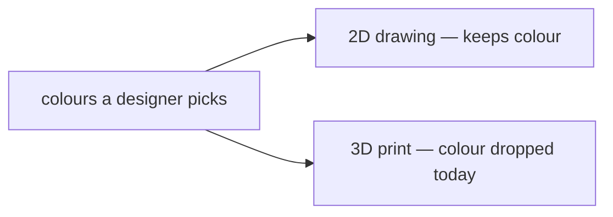

# Design craft — write it for the engineer who joins next quarter

**This file is the shared standard for how a design doc reads.** Two skills feed
from it: [`write-design`](write-design/SKILL.md) authors *to* this bar, and
[`review-design`](review-design/SKILL.md) audits *against* the rubric at the end.
When a review turns up a new way a doc fails a newcomer, the fix lands **here** —
a new rule and an example — not scattered into one skill's prose. Both skills read
this file at run time, so sharpening the standard sharpens both.

It is deliberately **not** in `docs/`. It is a rubric, not a design doc, and it
carries *bad* examples on purpose — the grounding gates that guard `docs/` would
fight both facts. It lives beside the skills that read it.

---

## Who the reader is

The first reader of a design doc is **not the author, and not a teammate who sat
in the meeting.** It is an engineer who joins the team next quarter, opens the doc
cold, and needs to understand *what this is, what problem it solves, and why it
matters* — before they know a single one of our product names, acronyms, or file
paths.

If that reader has to follow a link, already know what `bikar` is, or decode a
grammar production to reach the premise, the doc has failed them — no matter how
correct or well-grounded it is. Correctness is [`ground-design-doc`](ground-design-doc/SKILL.md)'s
job. **Readability is this one's.** A doc can be perfectly grounded and still be
unreadable; both bars have to be cleared.

A design doc is not a diff, a changelog, or a PR description. Those explain *what
changed* to someone who already has the context. A design doc *builds* the context.

---

## The arc every design doc follows

A reader should be able to stop at any point and have gotten the most important
thing they'd have gotten by stopping later. So the doc runs general → specific,
why → how, plain → technical:

1. **Title + one-line premise.** One plain sentence: what this is and what it's
   for. No proper noun a newcomer can't be expected to know without a gloss.
2. **The problem.** What is broken or missing, *who feels it*, and a concrete
   scenario. This comes **before** any mention of the solution.
3. **Why it matters / why now.** The stakes. What goes wrong if we don't, or what
   becomes possible if we do.
4. **The idea.** The proposed approach in plain language — the *mental model*,
   an analogy if one helps — before any mechanism.
5. **How it works.** The mechanism. Still readable; introduce each domain term
   with a footnote the first time it appears.
6. **Alternatives and the decision.** The options that were on the table, the one
   chosen, and *why the rejected ones lost* (a doc with one option is an
   announcement, not a design).
7. **Glossary.** Footnote definitions of every domain term, collected.
8. **Appendix.** The deep detail: `file:line` anchors, grammar productions, kernel
   internals, precedence edge-cases, exhaustive tables. Jargon lives **here**.

**The dividing line:** sections 1–4 carry *no unexplained jargon*. A reader should
not need to be a specialist until section 5, and even there every term is footnoted.
Everything a specialist needs and a newcomer doesn't goes to the appendix (8).

---

## Rules of clarity — the checkable ones

These are what [`review-design`](review-design/SKILL.md) scores. Each has a PASS and
a FAIL so the check is not a matter of taste.

- **C1 — Premise first.** The first paragraph states, in one plain sentence, what
  the thing is and what it is for, using no proper noun or acronym a newcomer can't
  be assumed to know without a gloss.
- **C2 — Problem before solution.** The problem, *who feels it*, and why it matters
  appear before any mechanism, region name, grammar, or file path.
- **C3 — Glossary with footnotes.** Every domain term, product name, and acronym is
  defined at first use with a markdown footnote (`term[^term]`), and the definitions
  are collected in a Glossary section.
- **C4 — Jargon deferred.** `file:line` anchors, grammar productions, kernel
  internals, and precedence edge-cases live in an Appendix, not the body.
- **C5 — Mental model before mechanism.** The idea is explained conceptually — one
  plain sentence or an analogy — before the how.
- **C6 — Plain-language lead.** Any section a non-specialist would stall on opens
  with a sentence that carries the point in plain words; the machinery follows.
- **C7 — A concrete example early.** At least one worked, specific scenario appears
  in the first half of the doc, not only in an appendix.
- **C8 — A diagram for each concept a reader would picture.** Any pipeline, data
  flow, before/after, or decision the doc explains in more than a paragraph of prose
  gets a Mermaid[^mermaid] diagram, not just a wall of text. A doc that describes "A
  becomes B, which the splitter turns into C" and draws nothing has failed C8. Node
  labels use the glossary terms, and a one-line legend under the diagram links those
  terms back to their footnotes (see the diagram section below).

A doc **passes** when every rule passes. A single unglossed product name in the
first paragraph is a C1/C3 fail on its own — the newcomer is lost at sentence one.

[^mermaid]: **Mermaid** — a way to write a diagram as plain text in a fenced code
    block (```` ```mermaid ````); GitHub and most markdown viewers render it as an
    actual picture, so the diagram lives in the doc and version-controls like prose.

---

## The glossary pattern — markdown footnotes

Define a term the first time it appears, inline, with a footnote marker. Collect the
definitions under a `## Glossary` heading. Markdown renders them at the bottom as a
numbered, back-linked list, so the body stays clean and the definition is one click
away.

```markdown
The renderer[^renderer] turns a construction[^construction] into an SVG.

## Glossary

[^renderer]: **renderer** — the part of our engine that draws a shape to a 2D
    image (SVG). It does not know about 3D printing.
[^construction]: **construction** — one geometric drawing: a set of circles,
    lines, and the polygons they enclose. The unit a design file describes.
```

A good footnote defines the term in **plain words a newcomer knows**, not in more
jargon. `[^ams]: the AMS` is useless; `[^ams]: **AMS** — the printer's automatic
material system, the carousel that feeds up to four filament spools so one print
can use several colours` is a definition.

---

## Diagrams — show it, don't only tell it

Prose is the wrong tool for a shape. A pipeline, a data flow, a before/after, or a
"which branch wins" decision is understood in seconds from a picture and slowly (or
never) from a paragraph. Draw them with Mermaid, which lives in the doc as text:

````markdown


**In the diagram:** design → the editor[^editor]; 2D drawing[^twod]; 3D print[^print].
````

Two rules make a diagram pull its weight:

- **Label nodes with the glossary terms.** A node called `2D drawing` ties straight to
  the `[^twod]` footnote; a node called `the flat SVG path` makes the reader do the
  mapping themselves. Reuse the exact words the glossary defines.
- **Add a one-line legend that links the terms to their footnotes.** GitHub does not
  make Mermaid nodes clickable, so put the footnote references in a plain markdown line
  right under the diagram — `**In the diagram:** editor[^editor], AMS[^ams]`. A footnote
  may be referenced as many times as you like, so this costs nothing and works in every
  renderer. That is the "refs in the diagram link to the footnotes" move, done portably.

One good diagram per hard concept beats three paragraphs describing it. Keep each
diagram to the one idea it carries; a diagram that needs its own paragraph to decode
has the same disease as the prose it replaced.

---

## Good vs bad — the same content, two openings

The clearest way to see the rules is one real doc opener, before and after.

### Bad — reads like a diff

> # Radial-band colour — the ring a polygon sits in is a print region, reusing one binning
>
> Omar asked to colour different polygons differently within one construction. The
> finding that shapes this doc: bikar **already** groups a construction's faces into
> concentric rings by centroid distance and **already** lets an author colour a ring —
> as 2D SVG ink. This doc carries the ring a polygon already sits in into the 3D
> per-region export... It builds directly on `coaster-colour-design.md` (D-073, D-074),
> whose region→body→slot route it reuses wholesale.

Why it fails the newcomer:

- **C1** — the premise is buried behind "reusing one binning" and "the ring a polygon
  sits in is a print region." A newcomer cannot say what this feature *is*.
- **C2** — there is no problem statement. It jumps to "the finding that shapes this
  doc" — an insider's framing that assumes you already care.
- **C3** — `bikar`, `construction`, `faces`, `centroid`, `ring`, `2D SVG ink`,
  `per-region export`, `region→body→slot`, `D-073` are all unglossed in the first
  paragraph. Nine terms, zero definitions.
- **C5** — it opens with mechanism ("groups faces into concentric rings by centroid
  distance") before ever saying, plainly, *what the user gets*.

### Good — reads like an explanation

> # Radial-band colour — print each ring of a pattern in its own colour
>
> Our patterns are made of many small tiles arranged in rings around a centre — like
> the rings of a dartboard. Today a designer can colour those rings on screen, but when
> the pattern is 3D-printed the colour is lost and the whole thing comes out one colour.
>
> **This design lets a ring's colour survive into the print**, so a printed coaster can
> have a gold inner ring and a copper outer one, each in its own filament — with no new
> way to *say* "this ring is that colour," because our design language already has one.
>
> ## The problem
>
> A designer picks colours for a pattern[^pattern] in our editor and sees them on
> screen. They send it to the printer expecting those colours. Instead every ring comes
> out the same colour, because the colour a designer chose never travels from the 2D
> drawing to the 3D print...

Why it passes: the premise is in the title and first sentence (C1); the dartboard
analogy gives the mental model before any mechanism (C5); the problem and who feels it
lead, with a concrete scenario (C2, C7); `pattern` is footnoted at first use (C3); and
`centroid`, `region→body→slot`, and the `file:line` anchors have moved to where they
belong — the appendix (C4).

Notice the *content is the same*. Nothing technical was dropped. It was **reordered**
(why before how), **translated** (plain sentence added ahead of each mechanism), and
**deferred** (jargon pushed to glossary and appendix). That is the whole move.

---

## The review rubric

| # | Criterion | PASS | FAIL |
|---|---|---|---|
| C1 | Premise first | First paragraph says what it is + what it's for in one plain sentence, no unglossed proper noun | Premise is missing, buried below mechanism, or stated only in insider terms |
| C2 | Problem before solution | Problem + who feels it + stakes appear before any mechanism | Doc opens on "the finding", the approach, or a region/grammar name |
| C3 | Glossary via footnotes | Every domain term footnoted at first use; a `## Glossary` collects them | A domain term appears unglossed, or there is no glossary |
| C4 | Jargon deferred | `file:line`, grammar, kernel internals, edge-cases are in an Appendix | Body prose is thick with anchors and internals |
| C5 | Mental model before mechanism | A plain sentence or analogy precedes the how | First explanation of the idea is a mechanism |
| C6 | Plain-language lead | Each hard section opens with a plain sentence carrying the point | A section starts mid-machinery |
| C7 | Concrete example early | A worked scenario in the first half | Examples only in an appendix, or none |
| C8 | A diagram per concept | Each pipeline/flow/decision has a Mermaid diagram with a footnote-linked legend | A multi-paragraph concept is drawn nowhere; walls of text |

A review reports one finding per failing criterion, each with the line it fails at and
a concrete rewrite — never "make it clearer." The bar to **pass** is all eight green.

---

## Keeping this file alive

Both skills feed here. When [`review-design`](review-design/SKILL.md) turns up a
failure the rubric didn't name, add the rule and an example to this file rather than
patching one skill — that is what "shared" buys. Prefer sharpening an existing rule
over adding a new one; a rubric nobody can hold in their head is as useless to a
newcomer as the doc it was meant to fix.
