# Users and use cases

The diagram names every actor and shipped use case; the table below pins each
use case to the code that delivers it. A **`bikar` or `qiyas`** pointer is valid
at that repo's `as_of` commit (frontmatter above), not necessarily at its HEAD:
those checkouts move with no commit here to blame, so their pointers are pinned
and the pre-commit hook keeps the pins fresh. A **`3d-models`** pointer is not
pinned — it is checked against what this commit will contain, because the map
and the code it names ship together and the pin is always the parent. Planned-
but-unshipped experiences do not belong here; they live in design docs and the
task list until they ship.

A pointer that names a specific line carries an **anchor** — the quoted
literal after the range, as in `` `3d-models:Makefile:L174 "orbs:"` `` — and
`validate.py` requires that literal to be inside the lines named. A bare `:L1`
means "this file" and needs none. The anchors are not decoration: on
2026-08-02 all 44 line claims here were audited against their pinned commits,
and **23 had drifted onto an unrelated line** — `L252 (deploy target)` onto a
`clean` rule, `L242 (the page-catalog check)` onto a blank one — with 3 more
landing a line or two short of their target. Every run had reported "all
valid". Move a line now and the anchor says where it went.

```mermaid
flowchart LR
  designer([Designer — authors patterns])
  visitor([Gallery visitor])
  labuser([Lab visitor])
  studiouser([Studio author])
  printop([Print operator])
  baker([Baker])
  validator([qiyas validator — automated])

  designer --> UC1[UC1: Author .bkr patterns, orbs, and pieces]
  designer --> UC2[UC2: Render STL / views with the mesh gate]
  designer --> UC10[UC10: Compose functional pieces — girih nail tile]
  designer --> UC11[UC11: Publish the gallery site]
  designer --> UC12[UC12: Lay out tile walls — grid, crops, layout report]
  designer --> UC14[UC14: Author a design doc the grounding gate checks]
  designer --> UC16[UC16: Read a design note whose figures are compiled parts]
  designer --> UC17[UC17: Export a multi-brick model as separate printable parts]
  printop --> UC17
  designer --> UC18[UC18: Take a brick model into an LDraw CAD tool]
  labuser --> UC18
  labuser --> UC19[UC19: See the exported LDraw read back by a parser that is not ours]
  designer --> UC19
  designer --> UC20[UC20: Cut one pattern into a printable mural set]
  printop --> UC20
  designer --> UC21[UC21: Print a piece whose silhouette is the pattern, not a rectangle]
  printop --> UC21
  designer --> UC22[UC22: Build the maclado wheel field — an orb with no inscribed pattern]
  printop --> UC22
  visitor --> UC3[UC3: Browse the catalog]
  visitor --> UC4[UC4: Download a print-ready STL]
  labuser --> UC5[UC5: Configure an orb in the Lab]
  labuser --> UC15[UC15: Tune a LEGO-compatible brick in the Lego Lab]
  printop --> UC15
  studiouser --> UC6[UC6: Author in the studio with Dials]
  printop --> UC4
  printop --> UC8[UC8: Plan and log physical prototypes]
  printop --> UC10
  printop --> UC12
  printop --> UC13[UC13: Characterize a printer and earn its constants]
  designer --> UC13
  baker --> UC9[UC9: Cut cookies with printed cutters]
  validator --> UC7[UC7: Validate renders against ground truth]
```

## Code pointers

| ID | Use case | Actors | Code pointers |
|----|----------|--------|---------------|
| UC1 | Author `.bkr` patterns, orbs, and pieces in the bikar DSL | Designer | `bikar:packages/core/src/dsl/evaluator.ts:L1221 "function evaluateOrbDecl("` (orb eval) · `bikar:packages/core/src/dsl/evaluator.ts:L1696 "function evaluatePieceDecl("` (piece eval) · `bikar:docs/language-reference.md:L538 "## Orb Declarations (3D)"` (orb grammar) · `bikar:docs/language-reference.md:L657 "## Piece Declarations (3D)"` (piece grammar) |
| UC2 | Render STL / SVG / symmetry views with the watertight mesh gate | Designer | `bikar:packages/cli/src/index.ts:L823 "case 'render': {"` (render command) |
| UC3 | Browse the published catalog of cutters and orbs | Gallery visitor | `3d-models:index.html:L292-L294 "The Orbs"` (orbs section) · `3d-models:index.html:L393 "const ORBS = ["` (ORBS data array) |
| UC4 | Download a print-ready, gate-checked STL | Gallery visitor, Print operator | `3d-models:Makefile:L174 "orbs:"` (orbs pipeline target) |
| UC5 | Configure an orb with knobs, gate readout, and share links in the Lab | Lab visitor | `3d-models:Makefile:L312 "lab-vendor:"` (lab vendoring target) · `bikar:packages/lab/src/main.ts:L1` (Lab app) |
| UC6 | Author orbs in the bikar studio with Dials ↔ Code sync | Studio author | `bikar:packages/web/src/main.ts:L1` (studio app) |
| UC7 | Validate bikar renders against ground truth per symmetry axis | qiyas validator | `qiyas:src/qiyas/orb_validate.py:L95 "def discover_views("` (view discovery + scoring) |
| UC8 | Plan and log physical print prototypes | Print operator | `3d-models:.claude/skills/prototype/catalog.md:L1` (prototype catalog) |
| UC9 | Cut cookies with printed cutters | Baker | `3d-models:Makefile:L168 "cookie-cutters:"` (cookie-cutters target) |
| UC10 | Compose functional printable pieces (C1: girih tile with countersunk nail bore) | Designer, Print operator | `bikar:packages/core/src/kernel3d/solidify-piece.ts:L703 "export function solidifyExtrudedPiece("` (extrude solidifier) · `bikar:patterns/Pieces/Nail-Tile.bkr:L1` (deliverable) · `3d-models:docs/piece-composition-design.md:L1` (design doc) |
| UC11 | Publish the gallery + Lab to gh-pages | Designer | `3d-models:Makefile:L432 "deploy: validate-site-graph"` (deploy target) |
| UC12 | Lay out tile walls (W1: grid + quartering layout, crop clip/drop, composed wall render, layout report; W3: a shared `border` spec two tile types adopt, a per-adjacency joint validator for the pairs that decline it, and a `frame` perimeter band taken out of the declared boundary) | Designer, Print operator | `bikar:packages/core/src/kernel/wall-layout.ts:L124 "export function layoutWallGrid("` (grid layout kernel) · `bikar:packages/core/src/dsl/evaluator.ts:L3584 "function evaluateWallDecl("` (wall eval) · `bikar:packages/core/src/kernel/wall-borders.ts:L284 "export function validateWallBorders("` (W3 — the per-adjacency walk, `pairsChecked`/`pairsSkippedCropped` reported apart) · `bikar:packages/core/tests/kernel3d/tile-border.test.ts:L246 "FAIL (the hard one): byte-identical clipseat records that agree at no vertex"` (the hard FAIL: identical records, no shared vertex) · `bikar:packages/core/src/kernel/wall-frame.ts:L110 "export function resolveWallFrame("` (W3 — the band solver; `absorb` refuses rather than solving each axis alone) · `bikar:patterns/Coupons/Frame-Band-Coupon.bkr:L1` (W-P1, the `CAL-FRM-01` band ladder) · `bikar:patterns/Walls/Nail-Wall.bkr:L1` (deliverable) · `bikar:docs/language-reference.md:L731 "## Tile & Wall Declarations (3D)"` (tile/wall grammar) · `bikar:docs/language-reference.md:L908 "Shared border specs and the per-pair joint validator (W3)"` (W3 validator, PASS/FAIL) · `bikar:docs/language-reference.md:L941 "**Perimeter frame (W3).**"` (frame grammar, default + PASS/FAIL) · `3d-models:docs/tile-wall-design.md:L1` (design doc) · `3d-models:docs/decisions-log.md:L1069 "## D-016"` (D-016 + the corner-subset amendment) · `3d-models:docs/decisions-log.md:L1161 "## D-017"` (D-017 + what it got wrong) |
| UC13 | Characterize a printer and earn the constants that depend on it (machine card, provenance-carrying values, shrink-only gate) | Print operator, Designer | `bikar:packages/core/src/kernel3d/calibration.ts:L220 "export interface Calibrated"` (`Calibrated<T>` provenance wrapper) · `bikar:scripts/check-calibration.ts:L1` (append-blocked gate) · `bikar:patterns/Coupons/Machine-Card.bkr:L1` (the six coupons) · `3d-models:.claude/skills/calibrate/SKILL.md:L1` (harvest → measure → propagate) · `3d-models:docs/calibration-design.md:L1` (design doc) · `3d-models:Makefile:L248 "coupons: bikar-stamp"` (render all 23 rungs and check them against the doc) · `3d-models:build/verify_machine_card.py:L1` (§7's table is the spec; the four sub-floor rungs are asserted to *fail*) · `3d-models:docs/decisions-log.md:L936 "## D-014"` (why a verifier, not a thin target) |
| UC14 | Author a design doc whose grounding is checked: dead relative links, validators without a PASS/FAIL example, defaults without provenance, and numbers a grounding audit already withdrew are blocked at commit — and a count written in the prose is held to the tool that prints it, so a tally cannot go stale while a self-check bullet says it reconciles | Designer | `3d-models:.claude/gates/docs_gate.py:L1` (the four rules + self-test) · `3d-models:.githooks/pre-commit.d/30-docs-gate:L1` (hook wiring) · `3d-models:Makefile:L95 "validate-docs:"` (`validate-docs` target) · `3d-models:.claude/gates/counts_gate.py:L1` (the count gate: `<!--count:NAME-->` against the tool that prints the number) · `3d-models:.claude/gates/counts_gate.py:L638 "FIXTURE_ONE_OF_TWO_STALE = "` (the load-bearing fixture — a correct table and a stale restatement of it) · `3d-models:.claude/gates/counts_gate.py:L667 "FIXTURE_SKIPPED_AUTHORITY = "` (the skip pair — the same document passes when bikar is unreadable and fails when it is not) · `3d-models:.claude/gates/counts_gate.py:L680 "FIXTURE_UNMARKED_WRAPPED = "` (C3: a claim nobody tagged, split mid-phrase across a line break — 0 findings for any line-at-a-time rule) · `3d-models:.claude/gates/counts_gate.py:L718 "FIXTURE_WRAPPED_MARKER = "` (the hole C3 opened: a tag split from its number was read by neither C1 nor C3) · `3d-models:.claude/gates/counts_gate.py:L732 "FIXTURE_SHORT_ENUMERATION = "` (C4's by-design failure: every count correct, so C1–C3 pass, and only the list beside the number is short — with `FIXTURE_FULL_ENUMERATION` as its negative control) · `3d-models:.claude/gates/counts_gate.py:L759 "FIXTURE_ENUMERATION_NEIGHBOURS = "` (the two real shapes that would have made C4 unshippable — a neighbouring id that is not a member, and a total whose subtotals follow it — must yield 0 findings) · `3d-models:.claude/gates/counts_gate.py:L772 "FIXTURE_PARTIAL_WAIVER = "` (`<!--count:partial-->` waives C4 and not C1: a deliberately short list whose digit is also wrong is still a finding) · `3d-models:.githooks/pre-commit.d/37-counts:L1` (hook wiring) · `3d-models:Makefile:L124 "validate-counts:"` (`validate-counts` target) · `3d-models:docs/grounding-defect-taxonomy.md:L63 "## 2. The taxonomy"` (the K1–K12 kinds each rule derives from) · `3d-models:CLAUDE.md:L1` (the four session-loaded rules) · `3d-models:.githooks/tests/hook-env-git-dir.sh:L1` (a gate must reach the same verdict when git launches it as when a person does — `GIT_DIR` outranks `-C`, and under it the map’s own validator checked a subset of its pointers and exited 0) · `3d-models:Makefile:L139 "validate-hooks:"` (both hook-environment tests) |
| UC15 | Tune a LEGO-compatible brick in the Lego Lab: clutch-fit knobs each tagged with its provenance, both gates, the lattice overlay, the grid-fit sweep strip, a downloadable STL — and, past the presets, the code drawer that makes it your own brick, shareable as a link that carries the script but never the clutch fit | Lab visitor, Print operator, Designer | `bikar:packages/lab/lego.html:L1` (the page) · `bikar:packages/lab/src/lego-main.ts:L1` (knobs, gates, overlay, custom mode) · `bikar:packages/lab/src/editor.ts:L1` (the code drawer, shared by both Labs) · `bikar:packages/lab/src/custom-state.ts:L102-L104 "ORB_DRAFT_SLOT"` (one draft slot per Lab, not per origin) · `bikar:packages/lab/src/url-state.ts:L12 "URL_BUDGET_CHARS"` (the share budget — `code=` omitted, never truncated) · `bikar:packages/lab/tests/lego-custom-mode.test.ts:L1` (the identity rule and the page's required ids) · `bikar:packages/e2e/tests/lego-lab.spec.ts:L223 "an edited brick leaves preset mode and rides in the link"` (the fit stays out of the link, and a typed brick meets the same gates) · `bikar:packages/lab/src/sweep-strip.ts:L1` (grid fit across a knob's range, sweet spots clickable) · `bikar:packages/core/src/kernel3d/grid-gate.ts:L1` (the scored measure both surfaces read) · `bikar:scripts/sweep-lattice-matrix.ts:L1` (the measured lattice matrix behind §5.3) · `3d-models:docs/research/lego-lattice-matrix-sweep.md:L1` (the run, preserved) · `bikar:packages/lab/src/lego-scripts.ts:L49 "export const BRICK_SCRIPTS"` (the seven-preset registry) · `bikar:patterns/Lego/Hex-Field-Tile.bkr:L1` (a low score that no knob fixes) · `bikar:patterns/Lego/Rational-Repeat-Tile.bkr:L1` (a perfect score on a lattice that is not square) · `3d-models:Makefile:L216 "bricks:"` (brick STL + preview pipeline) · `3d-models:Makefile:L310 "lab lego-lab: lab-vendor"` (both Lab pages, one recipe) · `3d-models:index.html:L310-L312 "The Bricks"` (gallery §03) · `3d-models:index.html:L464 "const BRICKS = ["` (`BRICKS` data array) · `3d-models:docs/lego-lab-design.md:L1` (design doc) |
| UC16 | Read the argument behind a design decision beside sections cut from the parts the repo builds today, so a note and its geometry cannot quietly disagree | Designer | `bikar:packages/lab/design.html:L1` (the page) · `bikar:packages/lab/src/catalog.ts:L119 "readonly uc: string;"` (the `uc:` field this map is checked against) · `bikar:packages/lab/src/design/notes/multi-piece-export.ts:L1` (the first note) · `bikar:packages/lab/src/design/draw-lattice.ts:L1` (plan views measured by `gridFit` itself) · `bikar:packages/lab/src/design/notes/lattice-basis.ts:L1` (the second note) · `3d-models:docs/lego-lab-design.md:L1562 "## 12. Design notes"` (§12 design notes) · `3d-models:docs/lego-lab-design.md:L1615 "### 12.1 Published so far"` (§12.1 the notes published) · `3d-models:docs/lego-lab-design.md:L1681 "## 13. The studio index"` (§13 studio index) · `3d-models:.claude/skills/maintain-use-cases/validate.py:L362 "def check_catalogs"` (the page-catalog check) · `3d-models:Makefile:L304 "LAB_PAGES = studio.html"` (the vendored page list) · `3d-models:index.html:L270 "<b>Studio</b>"` (gallery → studio) |
| UC17 | Export a model built from several bricks as one printable STL per brick: a `brick` mints stud/anti-stud ports from its own lattice, an `assembly` connects them by lattice coordinate, and `export parts` plates each piece on its own bottom face — with the entry contract warning when a printed pair has no clutch left | Designer, Print operator | `bikar:packages/core/src/kernel3d/brick-ports.ts:L131 "export function brickPorts("` (port minting from the built lattice) · `bikar:packages/cli/src/index.ts:L519 "The `--format parts` path (C2)"` (`--format parts`, per-part feature floor) · `bikar:patterns/Assemblies/Brick-Stack.bkr:L1` (deliverable) · `bikar:docs/language-reference.md:L1061 "The stud window is not on the fit ladder"` (why the stud window is not on the fit ladder) · `3d-models:docs/decisions-log.md:L352 "## D-006"` (D-006, decided and built) · `3d-models:.claude/skills/prototype/catalog.md:L911 "## LG-S1"` (LG-S1, the coupon that settles the ceiling) |
| UC18 | Take a brick model into an LDraw CAD tool: `--format ldraw` writes one MPD holding an inline `0 FILE …dat` block per *distinct* brick and a type-1 line per placement, so a brick this repo invented travels as its own geometry instead of borrowing a stock part number it does not match — and the emitter refuses outright rather than emit a model on a pitch LDU cannot express; each `place` may carry a colour, a grounded LDConfig name or a bare 0–511 code, so a multi-part model reads as distinct parts rather than one grey blob — and, independently, a `studs` colour the emitter fixes onto the pins *inside* the block (the body stays colour 16 and inherits the placement, the studs take an explicit code) so a brick reads two-tone rather than solid | Designer, Lab visitor | `bikar:packages/core/src/render/ldraw-emitter.ts:L597 "export function emitLDraw("` (`emitLDraw` — the MPD writer) · `bikar:packages/core/src/render/ldraw-emitter.ts:L305 "export function isLDrawPartNumber("` (`isLDrawPartNumber` — the three namespaces an inline block must stay out of) · `bikar:packages/core/src/render/ldraw-emitter.ts:L324 "export function assertLDrawStudPitch("` (`assertLDrawStudPitch` — refuse a non-8 mm pitch) · `bikar:packages/cli/src/index.ts:L706 "function renderLDraw("` (`--format ldraw`) · `bikar:packages/core/src/render/ldraw-emitter.ts:L112 "export function resolveLdrawColour("` (`resolveLdrawColour` — a name or code → LDraw code, refusing the unknown) · `bikar:packages/core/src/render/ldraw-emitter.ts:L84 "export const LDRAW_COLOUR_NAMES"` (the ten grounded names, from LDConfig.ldr) · `bikar:packages/core/src/dsl/parser.ts:L3601 "private parseOptionalPlaceColours("` (the `place … color … studs` clause — both colours off one place) · `bikar:packages/core/src/render/ldraw-emitter.ts:L440 "export function isStudTriangle("` (a triangle is a stud iff a vertex stands above the top face — exact, the K10 transfer condition, not a heuristic) · `bikar:packages/core/src/render/ldraw-emitter.ts:L457 "function blockGeometry("` (the mixed-colour inline part: body faces at 16, stud faces at the fixed code, so de-dup splits exactly on a stud-colour difference) · `bikar:packages/core/tests/render/ldraw-emitter.test.ts:L1` (22 cases, none of them a viewer) · `bikar:docs/decisions/2026-08-01-ldraw-export-inline-mpd.md:L1` (why inline geometry, not a part number) · `3d-models:docs/lego-lab-design.md:L1844 "### 14.3 The LDraw export"` (§14.3, the spec and what it leaves owed) · `3d-models:docs/lego-lab-design.md:L2117 "### 14.6 Per-brick stud colour"` (§14.6, the pins painted apart from the body, with its PASS/FAIL) · `3d-models:docs/decisions-log.md:L1970 "## D-027"` (D-027 — why the stud colour is baked into the geometry, not the reference line) · `3d-models:docs/research/lego-ldraw-export.md:L1` (seven specs and three viewers, read first-hand) · `3d-models:docs/research/lego-ldraw-export.md:L819 "### 7.4 The colour palette — grounded"` (the LDConfig.ldr fetch and the ten `0 !COLOUR` rows) · `3d-models:docs/decisions-log.md:L1918 "## D-026"` (name-or-code, and why name is grounded and code is not) · `3d-models:docs/research/ldraw-cli-viewers.md:L1` (twelve tools surveyed for a shell-drivable viewer; LeoCAD predicted to render our triangles as nothing) · `3d-models:docs/research/ldraw-cli-viewers.md:L675 "## 8. First execution"` (§8-§9 — the first run: an independent parser resolves the inline block, and the BFC differential that separates CCW from CW by the sign of what gets built) · `3d-models:docs/research/ldraw-cli-viewers.md:L935 "## 10. The recommended route was removed"` (§10 — the recommended viewer was removed by the OS before it rendered anything; the three.js route run to pixels in its place, and why a render of an edge-line-free file is evidence of shape but not of structure) |
| UC19 | See the LDraw file the Download button writes read back, in the page, by a parser that is not ours — every type-1 line resolved against an inline block with no parts library to fall back on, and two independent readings of the built geometry printed beside the picture: the *sign* of its volume, because a file wound inside-out draws as a convincing brick in the one viewer measured here, which culls nothing; and whether every directed edge is walked once in each direction, because `0 BFC CERTIFY CCW` is a claim about every triangle in the block and one sum cannot see a defect that cancels inside it | Lab visitor, Designer | `bikar:packages/lab/src/ldraw.ts:L60 "export function labLDraw("` (the export path the button and the panel share, so they cannot read different bytes) · `bikar:packages/lab/src/ldraw-readback.ts:L369 "loader.setPartsLibraryPath('')"` (what makes it a read-back: an unsatisfied reference fails instead of being filled in from disk) · `bikar:packages/lab/src/ldraw-readback.ts:L368 "preloadMaterials"` (the `data:` URI colour table — code 7 would otherwise draw magenta, and the model bytes stay untouched) · `bikar:packages/lab/src/ldraw-scene.ts:L49 "group.rotation.x = LDRAW_UP_FLIP"` (righting LDraw's −Y-up with a rotation, not a mirror, which would flip the winding the panel exists to show — moved to the shared scene the thumbnail CLI renders, PR #82) · `bikar:packages/lab/tests/ldraw-readback.test.ts:L158 "reports CW certification as inward"` (the counterexample a triangle count cannot see) · `bikar:packages/lab/tests/ldraw-readback.test.ts:L244 "catches one flipped triangle"` (the counterexample the *sign* cannot see either — one reversed triangle in 3,764 leaves the volume positive and moves it 6.7%) · `bikar:packages/lab/src/ldraw-readback.ts:L221 "function vertexKey("` (the per-triangle measurement: a quantised vertex key, so the directed-edge tally is over the same floats the loader built) · `bikar:packages/lab/src/lego-main.ts:L1008 "function renderLDrawReadout("` (the readout) · `bikar:packages/lab/src/lego-main.ts:L1001 "function coherenceReadout("` (the coherence row, which reads `fail` on a file the volume row calls outward) · `bikar:packages/lab/lego.html:L126 "data-view=\"ldraw\""` (the fourth tab) · `3d-models:docs/lego-lab-design.md:L2008 "### 14.4 The read-back panel"` (§14.4, with the PASS/FAIL the panel is validated by) · `3d-models:docs/decisions-log.md:L614 "## D-009"` (D-009 — why a studio panel and not a CI gate) |
| UC20 | Cut one pattern into a printable mural set: a `mural` declaration compiles one planar graph into c×r LEGO-baseplate-compatible bricks, the art cut at the nominal 8 mm grid lines so both sides of every seam share exact vertices and the pattern reconstitutes across pieces to within the 0.2 mm physical gap — gated per piece, because the fused panel would be held to the wrong mesh floor | Designer, Print operator | `bikar:packages/core/src/dsl/evaluator.ts:L3435 "function evaluateMuralDecl("` (mural eval) · `bikar:docs/grammar.md:L1374 "### 10.2"` (the `mural` grammar) · `bikar:patterns/Lego/Star-Mural.bkr:L1` (deliverable — the 2×2 set) · `bikar:packages/core/tests/kernel3d/mural-split.test.ts:L1` (seam identity asserted as shared coordinates, not tolerance) · `bikar:docs/decisions/2026-08-02-mural-panelization.md:L1` (why nominal-line cut, gridFit as warning) · `3d-models:docs/lego-pattern-set-design.md:L1` (design doc) · `3d-models:docs/decisions-log.md:L868 "## D-013"` (the cut rule and the L78 ruling) · `3d-models:Makefile:L267 "pattern-sets:"` (per-piece gate + composed preview pipeline) · `3d-models:index.html:L499 "StarMural"` (gallery Set entry) · `3d-models:.claude/skills/prototype/catalog.md:L1114 "## LG-P1"` (the seam-registration coupon, CAL-REG-01) · `3d-models:index.html:L507 "SeamCoupon"` (the coupon that measures the claim, listed beside it) |
| UC21 | Print a piece whose silhouette *is* the pattern rather than the rectangle around it: `footprint outline` takes the body from the inscribed art's face union, so the outline follows a lattice it does not obey while only the anti-stud interface stays on the 8 mm grid — and the two ways that can go wrong are proved rather than assumed, a body that falls into disconnected islands being refused outright and the inset cavity wall being *measured* where a concave lobe would otherwise eat it | Designer, Print operator | `bikar:docs/grammar.md:L1264 "BrickFootprint"` (the third `footprint` mode in the grammar) · `bikar:packages/core/src/dsl/evaluator.ts:L2703 "function brickBodyOutline("` (the body ring from the art's face union; V19 refuses a multi-component body) · `bikar:packages/core/src/kernel3d/brick.ts:L782 "inset the body ring for the cavity"` (V18 — the inset wall is proved, not trusted) · `bikar:packages/core/tests/kernel3d/brick.test.ts:L473 "V18: the inset cavity wall is measured, not trusted"` (the counterexample: a lobe sharp enough to self-cross the inset ring) · `bikar:packages/core/tests/dsl/brick-outline-eval.test.ts:L1` (the evaluation surface) · `bikar:patterns/Lego/Rosette-Brick.bkr:L1` (deliverable — the ten-fold rosette) · `bikar:packages/lab/src/lego-scripts.ts:L93 "rosette-brick"` (the Lab preset) · `bikar:docs/decisions/2026-08-02-pattern-outline-footprint.md:L1` (why a `footprint` mode and not a new declaration) · `3d-models:docs/pattern-outline-brick-design.md:L1` (design doc) · `3d-models:docs/pattern-outline-brick-design.md:L248 "### V18 — the inset ring keeps the wall it claims"` (§5 — degeneracy as a hard error) · `3d-models:index.html:L493 "RosetteBrick"` (gallery Outline entry) · `3d-models:.claude/skills/prototype/catalog.md:L1075 "## LG-B2"` (the coupon that settles it — CAL-ANC-01, CAL-INW-01, both unprinted) |
| UC22 | Build and print the maclado orb — Martín López's nine-fold wheel field as Family 3: `base wheelfield` constructs the whole sphere in the kernel with no inscribed pattern (20 nine-wheels on the dodecahedron's 3-fold sites via the divisor trick, 30 exact tip-to-tip joins, 12 congruent 30-gon fillers), emitted as a watertight genus-379 pierced shell, as 46 woven ribbon loops over 390 alternating crossings, or — with `overlap` — as the field grown past tangency so adjacent rims cross and 60 loops weave through 420 crossings (M4e, the maker's interpenetrating regime) — and `inscribe` on it is refused with an error that says why, because honesty about what is *not* inscribed is part of the grammar | Designer, Print operator | `bikar:packages/core/src/dsl/evaluator.ts:L1335 "function evaluateWheelfieldOrbDecl("` (DSL seam) · `bikar:packages/core/src/kernel3d/maclado-field.ts:L284 "export function buildMacladoField("` (the field construction) · `bikar:packages/core/src/kernel3d/maclado-field.ts:L447 "export function solidifyMacladoField("` (shell family) · `bikar:packages/core/src/kernel3d/maclado-field.ts:L340 "export function macladoSeamGraph("` (weave family — the 510-node seam graph) · `bikar:packages/core/src/kernel3d/maclado-woven.ts:L95 "export function buildWovenOverlapGraph("` (overlap family — the grown field's 600-node crossing graph, judged by the D-032 instrument) · `bikar:patterns/Orbs/Maclado-9.bkr:L1` (deliverable — pierced shell) · `bikar:patterns/Orbs/Maclado-9-Weave.bkr:L1` (deliverable — woven ribbons) · `bikar:patterns/Orbs/Maclado-9-Overlap.bkr:L1` (deliverable — woven overlap) · `bikar:docs/language-reference.md:L616 "the maclado field (Family 3)"` (grammar + refusals) · `bikar:packages/core/tests/kernel3d/wheelfield-orb.test.ts:L159 "describe('Maclado-9.bkr end to end"` (the M4-pinned numbers reached through the DSL, with the by-design points-8 FAIL) · `bikar:packages/core/tests/kernel3d/wheelfield-orb.test.ts:L212 "describe('Maclado-9-Overlap.bkr end to end"` (M4e through the DSL, with the by-design fuse FAIL) · `3d-models:docs/maclado-orb-design.md:L1` (design doc) · `3d-models:docs/decisions-log.md:L2333 "## D-033"` (the build decision and the parity result) · `3d-models:index.html:L438 "Maclado9"` (gallery entries) · `3d-models:.claude/skills/prototype/catalog.md:L198 "## P8"` (print sheet — the §7 nozzle condition) |

UC15 and UC16 carried no `bikar` pointer until `2026-07-31`, and the omission
was deliberate: their pages had merged to bikar's `main` but the `as_of` pin here
still predated them, and pinning a line the pinned commit does not contain is the
one thing this map exists to prevent. They are pinned now because the pin moved,
which is the sequence the note was describing rather than a rule about those two
use cases. `page_catalogs` checks rather than warns for the same reason —
`bikar:packages/lab/src/catalog.ts` resolves at the pin, so the catalogue's `uc:`
ids are now verified against the table above instead of skipped.

Sibling pins (`bikar`, `qiyas`) are the **published** tip and not that
checkout's own HEAD, deliberately. Both are other sessions' working trees whose
HEAD is routinely a feature branch, unpushed and still rebasable; pinning it
ties this map to work that can vanish and takes a pointer down with it. This
used to be a hand-edit that the next `--refresh` silently undid — it is now
`refresh_target` in `validate.py`, which resolves siblings through
`origin/HEAD` and keeps HEAD only for this repo, where HEAD *is* the commit
being built upon. A sibling with no `origin` ref still falls back to HEAD, and
says so. The pin therefore reflects the last `git fetch` in that checkout: a
stale pin fails loudly on a pointer that does not resolve, which is the
direction to fail in.

**The parenthesised label is not checked, and cannot be.** `validate.py` bounds-checks
the line number against the file at the pin; nothing relates the line to the words beside
it. UC16's three `lego-lab-design.md` pointers were authored on `§12`/`§12.1`/`§13` and
landed on a blank line, a sentence about sliver area, and a paragraph about `design.html`
— passing every run until they were read by hand on `2026-08-01`. An audit of all 69
pointers found these three and no others, which is why this is a note and not a rule: a
label-to-heading check needs heading-format heuristics that already false-alarmed on
`index.html`'s `gallery §03` during that very audit, and a gate that cries wolf gets
switched off. Pointers into a doc that the *same commit* edits are the ones to re-read:
the pin is the parent commit, so the map is refreshed against content the commit is about
to move. Prefer a line that stays inside its section under both. When the shift is too
large for that — UC16's three pointers moved **+38** on `2026-08-01` when the P3 entry was
inserted above them — anchor to where the line will be *after* the commit and accept that
the pin is one commit behind until the next refresh. The alternative is a pointer that is
right at the pin and wrong at HEAD, which is the direction that gets read by a human.
