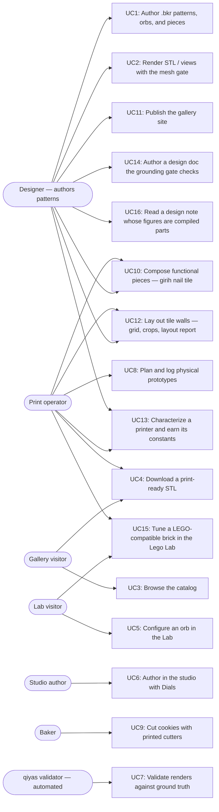

# Users and use cases

The diagram names every actor and shipped use case; the table below pins each
use case to the code that delivers it. Pointer lines are valid **at the
`as_of` commit** of their repo (frontmatter above), not necessarily at HEAD —
`validate.py` checks them against those pinned commits, and the pre-commit
hook keeps the pins fresh. Planned-but-unshipped experiences do not belong
here; they live in design docs and the task list until they ship.

## Code pointers

| ID | Use case | Actors | Code pointers |
|----|----------|--------|---------------|
| UC1 | Author `.bkr` patterns, orbs, and pieces in the bikar DSL | Designer | `bikar:packages/core/src/dsl/evaluator.ts:L488` (orb eval) · `bikar:packages/core/src/dsl/evaluator.ts:L831` (piece eval) · `bikar:docs/language-reference.md:L368` (orb grammar) · `bikar:docs/language-reference.md:L442` (piece grammar) |
| UC2 | Render STL / SVG / symmetry views with the watertight mesh gate | Designer | `bikar:packages/cli/src/index.ts:L192` (render command) |
| UC3 | Browse the published catalog of cutters and orbs | Gallery visitor | `3d-models:index.html:L285-L286` (orbs section) · `3d-models:index.html:L360` (ORBS data array) |
| UC4 | Download a print-ready, gate-checked STL | Gallery visitor, Print operator | `3d-models:Makefile:L62` (orbs pipeline target) |
| UC5 | Configure an orb with knobs, gate readout, and share links in the Lab | Lab visitor | `3d-models:Makefile:L83` (lab vendoring target) · `bikar:packages/lab/src/main.ts:L1` (Lab app) |
| UC6 | Author orbs in the bikar studio with Dials ↔ Code sync | Studio author | `bikar:packages/web/src/main.ts:L1` (studio app) |
| UC7 | Validate bikar renders against ground truth per symmetry axis | qiyas validator | `qiyas:src/qiyas/orb_validate.py:L95` (view discovery + scoring) |
| UC8 | Plan and log physical print prototypes | Print operator | `3d-models:.claude/skills/prototype/catalog.md:L1` (prototype catalog) |
| UC9 | Cut cookies with printed cutters | Baker | `3d-models:Makefile:L56` (cookie-cutters target) |
| UC10 | Compose functional printable pieces (C1: girih tile with countersunk nail bore) | Designer, Print operator | `bikar:packages/core/src/kernel3d/solidify-piece.ts:L320` (extrude solidifier) · `bikar:patterns/Pieces/Nail-Tile.bkr:L1` (deliverable) · `3d-models:docs/piece-composition-design.md:L1` (design doc) |
| UC11 | Publish the gallery + Lab to gh-pages | Designer | `3d-models:Makefile:L161` (deploy target) |
| UC12 | Lay out tile walls (W1: grid + quartering layout, crop clip/drop, composed wall render, layout report) | Designer, Print operator | `bikar:packages/core/src/kernel/wall-layout.ts:L124` (grid layout kernel) · `bikar:packages/core/src/dsl/evaluator.ts:L1069` (wall eval) · `bikar:patterns/Walls/Nail-Wall.bkr:L1` (deliverable) · `bikar:docs/language-reference.md:L501` (tile/wall grammar) · `3d-models:docs/tile-wall-design.md:L1` (design doc) |
| UC13 | Characterize a printer and earn the constants that depend on it (machine card, provenance-carrying values, shrink-only gate) | Print operator, Designer | `bikar:packages/core/src/kernel3d/calibration.ts:L82` (`Calibrated<T>` provenance wrapper) · `bikar:scripts/check-calibration.ts:L1` (append-blocked gate) · `bikar:patterns/Coupons/Machine-Card.bkr:L1` (the six coupons) · `3d-models:.claude/skills/calibrate/SKILL.md:L1` (harvest → measure → propagate) · `3d-models:docs/calibration-design.md:L1` (design doc) |
| UC14 | Author a design doc whose grounding is checked: dead relative links, validators without a PASS/FAIL example, and defaults without provenance are blocked at commit | Designer | `3d-models:.claude/gates/docs_gate.py:L1` (the three rules + self-test) · `3d-models:.githooks/pre-commit.d/30-docs-gate:L1` (hook wiring) · `3d-models:Makefile:L53` (`validate-docs` target) · `3d-models:docs/grounding-defect-taxonomy.md:L63` (the K1–K12 kinds each rule derives from) · `3d-models:CLAUDE.md:L1` (the four session-loaded rules) |
| UC15 | Tune a LEGO-compatible brick in the Lego Lab: clutch-fit knobs each tagged with its provenance, both gates, the lattice overlay, and a downloadable STL | Lab visitor, Print operator | `3d-models:Makefile:L102` (brick STL + preview pipeline) · `3d-models:Makefile:L130` (both Lab pages, one recipe) · `3d-models:index.html:L302` (gallery §03) · `3d-models:index.html:L439` (`BRICKS` data array) · `3d-models:docs/lego-lab-design.md:L1` (design doc) |
| UC16 | Read the argument behind a design decision beside sections cut from the parts the repo builds today, so a note and its geometry cannot quietly disagree | Designer | `3d-models:docs/lego-lab-design.md:L1090` (§12 design notes) · `3d-models:docs/lego-lab-design.md:L1143` (§13 studio index) · `3d-models:.claude/skills/maintain-use-cases/validate.py:L242` (the page-catalog check) · `3d-models:Makefile:L138` (the vendored page list) · `3d-models:index.html:L270` (gallery → studio) |

UC15 and UC16 carry no `bikar` pointer, and the omission is deliberate rather
than an oversight. UC15's page is `packages/lab/lego.html` and `lego-main.ts`,
which merged to bikar's `main` as `61c371f`; UC16's is `packages/lab/design.html`
with `src/design/` behind it, which is still on the `lego-lab-p1` branch. But a
pointer is only valid at its repo's `as_of` — and this checkout's `../bikar`
predates both, so pinning one would fail the moment `--refresh` ran. The pins
belong here the next time that checkout catches up. Pinning a line the pinned
commit does not contain is the one thing this map exists to prevent, so they are
left unpinned and said out loud instead.

The same pin is why `page_catalogs` currently *warns* rather than checks: the
page catalogue it names, `bikar:packages/lab/src/catalog.ts`, does not exist at
the pinned `bikar` commit yet. Point it at the branch by hand and it reports
exactly what it is for — before UC16 joined the table above, it failed with
*"claims UC16, which this map does not carry"*.
