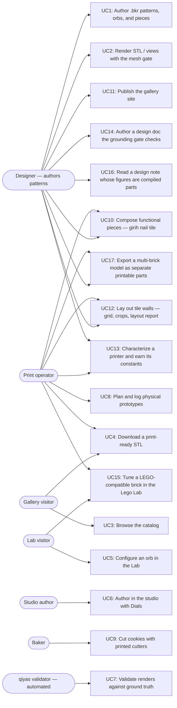

# Users and use cases

The diagram names every actor and shipped use case; the table below pins each
use case to the code that delivers it. Pointer lines are valid **at the
`as_of` commit** of their repo (frontmatter above), not necessarily at HEAD —
`validate.py` checks them against those pinned commits, and the pre-commit
hook keeps the pins fresh. Planned-but-unshipped experiences do not belong
here; they live in design docs and the task list until they ship.

## Code pointers

| ID | Use case | Actors | Code pointers |
|----|----------|--------|---------------|
| UC1 | Author `.bkr` patterns, orbs, and pieces in the bikar DSL | Designer | `bikar:packages/core/src/dsl/evaluator.ts:L488` (orb eval) · `bikar:packages/core/src/dsl/evaluator.ts:L831` (piece eval) · `bikar:docs/language-reference.md:L368` (orb grammar) · `bikar:docs/language-reference.md:L442` (piece grammar) |
| UC2 | Render STL / SVG / symmetry views with the watertight mesh gate | Designer | `bikar:packages/cli/src/index.ts:L192` (render command) |
| UC3 | Browse the published catalog of cutters and orbs | Gallery visitor | `3d-models:index.html:L285-L286` (orbs section) · `3d-models:index.html:L361` (ORBS data array) |
| UC4 | Download a print-ready, gate-checked STL | Gallery visitor, Print operator | `3d-models:Makefile:L80` (orbs pipeline target) |
| UC5 | Configure an orb with knobs, gate readout, and share links in the Lab | Lab visitor | `3d-models:Makefile:L146` (lab vendoring target) · `bikar:packages/lab/src/main.ts:L1` (Lab app) |
| UC6 | Author orbs in the bikar studio with Dials ↔ Code sync | Studio author | `bikar:packages/web/src/main.ts:L1` (studio app) |
| UC7 | Validate bikar renders against ground truth per symmetry axis | qiyas validator | `qiyas:src/qiyas/orb_validate.py:L95` (view discovery + scoring) |
| UC8 | Plan and log physical print prototypes | Print operator | `3d-models:.claude/skills/prototype/catalog.md:L1` (prototype catalog) |
| UC9 | Cut cookies with printed cutters | Baker | `3d-models:Makefile:L74` (cookie-cutters target) |
| UC10 | Compose functional printable pieces (C1: girih tile with countersunk nail bore) | Designer, Print operator | `bikar:packages/core/src/kernel3d/solidify-piece.ts:L320` (extrude solidifier) · `bikar:patterns/Pieces/Nail-Tile.bkr:L1` (deliverable) · `3d-models:docs/piece-composition-design.md:L1` (design doc) |
| UC11 | Publish the gallery + Lab to gh-pages | Designer | `3d-models:Makefile:L252` (deploy target) |
| UC12 | Lay out tile walls (W1: grid + quartering layout, crop clip/drop, composed wall render, layout report) | Designer, Print operator | `bikar:packages/core/src/kernel/wall-layout.ts:L124` (grid layout kernel) · `bikar:packages/core/src/dsl/evaluator.ts:L1069` (wall eval) · `bikar:patterns/Walls/Nail-Wall.bkr:L1` (deliverable) · `bikar:docs/language-reference.md:L501` (tile/wall grammar) · `3d-models:docs/tile-wall-design.md:L1` (design doc) |
| UC13 | Characterize a printer and earn the constants that depend on it (machine card, provenance-carrying values, shrink-only gate) | Print operator, Designer | `bikar:packages/core/src/kernel3d/calibration.ts:L82` (`Calibrated<T>` provenance wrapper) · `bikar:scripts/check-calibration.ts:L1` (append-blocked gate) · `bikar:patterns/Coupons/Machine-Card.bkr:L1` (the six coupons) · `3d-models:.claude/skills/calibrate/SKILL.md:L1` (harvest → measure → propagate) · `3d-models:docs/calibration-design.md:L1` (design doc) |
| UC14 | Author a design doc whose grounding is checked: dead relative links, validators without a PASS/FAIL example, and defaults without provenance are blocked at commit | Designer | `3d-models:.claude/gates/docs_gate.py:L1` (the three rules + self-test) · `3d-models:.githooks/pre-commit.d/30-docs-gate:L1` (hook wiring) · `3d-models:Makefile:L62` (`validate-docs` target) · `3d-models:docs/grounding-defect-taxonomy.md:L63` (the K1–K12 kinds each rule derives from) · `3d-models:CLAUDE.md:L1` (the four session-loaded rules) |
| UC15 | Tune a LEGO-compatible brick in the Lego Lab: clutch-fit knobs each tagged with its provenance, both gates, the lattice overlay, the grid-fit sweep strip, a downloadable STL — and, past the presets, the code drawer that makes it your own brick, shareable as a link that carries the script but never the clutch fit | Lab visitor, Print operator, Designer | `bikar:packages/lab/lego.html:L1` (the page) · `bikar:packages/lab/src/lego-main.ts:L1` (knobs, gates, overlay, custom mode) · `bikar:packages/lab/src/editor.ts:L1` (the code drawer, shared by both Labs) · `bikar:packages/lab/src/custom-state.ts:L92` (one draft slot per Lab, not per origin) · `bikar:packages/lab/src/url-state.ts:L12` (the share budget — `code=` omitted, never truncated) · `bikar:packages/lab/tests/lego-custom-mode.test.ts:L1` (the identity rule and the page's required ids) · `bikar:packages/e2e/tests/lego-lab.spec.ts:L222` (the fit stays out of the link, and a typed brick meets the same gates) · `bikar:packages/lab/src/sweep-strip.ts:L1` (grid fit across a knob's range, sweet spots clickable) · `bikar:packages/core/src/kernel3d/grid-gate.ts:L1` (the scored measure both surfaces read) · `bikar:scripts/sweep-lattice-matrix.ts:L1` (the measured lattice matrix behind §5.3) · `3d-models:docs/research/lego-lattice-matrix-sweep.md:L1` (the run, preserved) · `bikar:packages/lab/src/lego-scripts.ts:L48` (the seven-preset registry) · `bikar:patterns/Lego/Hex-Field-Tile.bkr:L1` (a low score that no knob fixes) · `bikar:patterns/Lego/Rational-Repeat-Tile.bkr:L1` (a perfect score on a lattice that is not square) · `3d-models:Makefile:L105` (brick STL + preview pipeline) · `3d-models:Makefile:L144` (both Lab pages, one recipe) · `3d-models:index.html:L302` (gallery §03) · `3d-models:index.html:L440` (`BRICKS` data array) · `3d-models:docs/lego-lab-design.md:L1` (design doc) |
| UC16 | Read the argument behind a design decision beside sections cut from the parts the repo builds today, so a note and its geometry cannot quietly disagree | Designer | `bikar:packages/lab/design.html:L1` (the page) · `bikar:packages/lab/src/catalog.ts:L119` (the `uc:` field this map is checked against) · `bikar:packages/lab/src/design/notes/multi-piece-export.ts:L1` (the first note) · `bikar:packages/lab/src/design/draw-lattice.ts:L1` (plan views measured by `gridFit` itself) · `bikar:packages/lab/src/design/notes/lattice-basis.ts:L1` (the second note) · `3d-models:docs/lego-lab-design.md:L1494` (§12 design notes) · `3d-models:docs/lego-lab-design.md:L1547` (§12.1 the notes published) · `3d-models:docs/lego-lab-design.md:L1613` (§13 studio index) · `3d-models:.claude/skills/maintain-use-cases/validate.py:L242` (the page-catalog check) · `3d-models:Makefile:L138` (the vendored page list) · `3d-models:index.html:L270` (gallery → studio) |
| UC17 | Export a model built from several bricks as one printable STL per brick: a `brick` mints stud/anti-stud ports from its own lattice, an `assembly` connects them by lattice coordinate, and `export parts` plates each piece on its own bottom face — with the entry contract warning when a printed pair has no clutch left | Designer, Print operator | `bikar:packages/core/src/kernel3d/brick-ports.ts:L131` (port minting from the built lattice) · `bikar:packages/cli/src/index.ts:L400` (`--format parts`, per-part feature floor) · `bikar:patterns/Assemblies/Brick-Stack.bkr:L1` (deliverable) · `bikar:docs/language-reference.md:L831` (why the stud window is not on the fit ladder) · `3d-models:docs/decisions-log.md:L352` (D-006, decided and built) · `3d-models:.claude/skills/prototype/catalog.md:L704` (LG-S1, the coupon that settles the ceiling) |

UC15 and UC16 carried no `bikar` pointer until `2026-07-31`, and the omission
was deliberate: their pages had merged to bikar's `main` but the `as_of` pin here
still predated them, and pinning a line the pinned commit does not contain is the
one thing this map exists to prevent. They are pinned now because the pin moved,
which is the sequence the note was describing rather than a rule about those two
use cases. `page_catalogs` checks rather than warns for the same reason —
`bikar:packages/lab/src/catalog.ts` resolves at the pin, so the catalogue's `uc:`
ids are now verified against the table above instead of skipped.

Sibling pins (`bikar`, `qiyas`) are the **published** tip and not that
checkout's own HEAD, deliberately. Both are other sessions' working trees whose
HEAD is routinely a feature branch, unpushed and still rebasable; pinning it
ties this map to work that can vanish and takes a pointer down with it. This
used to be a hand-edit that the next `--refresh` silently undid — it is now
`refresh_target` in `validate.py`, which resolves siblings through
`origin/HEAD` and keeps HEAD only for this repo, where HEAD *is* the commit
being built upon. A sibling with no `origin` ref still falls back to HEAD, and
says so. The pin therefore reflects the last `git fetch` in that checkout: a
stale pin fails loudly on a pointer that does not resolve, which is the
direction to fail in.

**The parenthesised label is not checked, and cannot be.** `validate.py` bounds-checks
the line number against the file at the pin; nothing relates the line to the words beside
it. UC16's three `lego-lab-design.md` pointers were authored on `§12`/`§12.1`/`§13` and
landed on a blank line, a sentence about sliver area, and a paragraph about `design.html`
— passing every run until they were read by hand on `2026-08-01`. An audit of all 69
pointers found these three and no others, which is why this is a note and not a rule: a
label-to-heading check needs heading-format heuristics that already false-alarmed on
`index.html`'s `gallery §03` during that very audit, and a gate that cries wolf gets
switched off. Pointers into a doc that the *same commit* edits are the ones to re-read:
the pin is the parent commit, so the map is refreshed against content the commit is about
to move. Prefer a line that stays inside its section under both.
