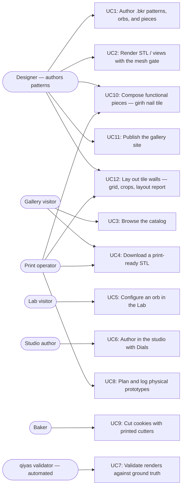

# Users and use cases

The diagram names every actor and shipped use case; the table below pins each
use case to the code that delivers it. Pointer lines are valid **at the
`as_of` commit** of their repo (frontmatter above), not necessarily at HEAD —
`validate.py` checks them against those pinned commits, and the pre-commit
hook keeps the pins fresh. Planned-but-unshipped experiences do not belong
here; they live in design docs and the task list until they ship.

## Code pointers

| ID | Use case | Actors | Code pointers |
|----|----------|--------|---------------|
| UC1 | Author `.bkr` patterns, orbs, and pieces in the bikar DSL | Designer | `bikar:packages/core/src/dsl/evaluator.ts:L488` (orb eval) · `bikar:packages/core/src/dsl/evaluator.ts:L831` (piece eval) · `bikar:docs/language-reference.md:L368` (orb grammar) · `bikar:docs/language-reference.md:L442` (piece grammar) |
| UC2 | Render STL / SVG / symmetry views with the watertight mesh gate | Designer | `bikar:packages/cli/src/index.ts:L192` (render command) |
| UC3 | Browse the published catalog of cutters and orbs | Gallery visitor | `3d-models:index.html:L285-L286` (orbs section) · `3d-models:index.html:L360` (ORBS data array) |
| UC4 | Download a print-ready, gate-checked STL | Gallery visitor, Print operator | `3d-models:Makefile:L62` (orbs pipeline target) |
| UC5 | Configure an orb with knobs, gate readout, and share links in the Lab | Lab visitor | `3d-models:Makefile:L83` (lab vendoring target) · `bikar:packages/lab/src/main.ts:L1` (Lab app) |
| UC6 | Author orbs in the bikar studio with Dials ↔ Code sync | Studio author | `bikar:packages/web/src/main.ts:L1` (studio app) |
| UC7 | Validate bikar renders against ground truth per symmetry axis | qiyas validator | `qiyas:src/qiyas/orb_validate.py:L95` (view discovery + scoring) |
| UC8 | Plan and log physical print prototypes | Print operator | `3d-models:.claude/skills/prototype/catalog.md:L1` (prototype catalog) |
| UC9 | Cut cookies with printed cutters | Baker | `3d-models:Makefile:L56` (cookie-cutters target) |
| UC10 | Compose functional printable pieces (C1: girih tile with countersunk nail bore) | Designer, Print operator | `bikar:packages/core/src/kernel3d/solidify-piece.ts:L320` (extrude solidifier) · `bikar:patterns/Pieces/Nail-Tile.bkr:L1` (deliverable) · `3d-models:docs/piece-composition-design.md:L1` (design doc) |
| UC11 | Publish the gallery + Lab to gh-pages | Designer | `3d-models:Makefile:L161` (deploy target) |
| UC12 | Lay out tile walls (W1: grid + quartering layout, crop clip/drop, composed wall render, layout report) | Designer, Print operator | `bikar:packages/core/src/kernel/wall-layout.ts:L124` (grid layout kernel) · `bikar:packages/core/src/dsl/evaluator.ts:L1069` (wall eval) · `bikar:patterns/Walls/Nail-Wall.bkr:L1` (deliverable) · `bikar:docs/language-reference.md:L501` (tile/wall grammar) · `3d-models:docs/tile-wall-design.md:L1` (design doc) |
