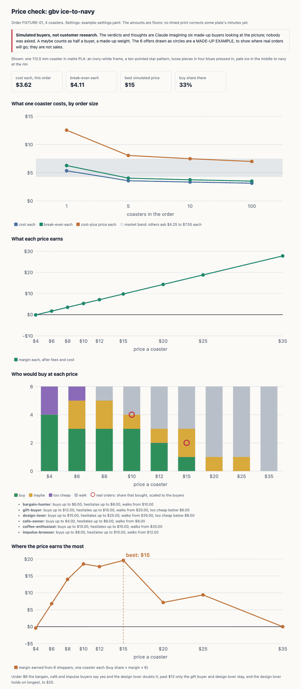

# simulate-buyers — who buys at which price, and in their own words why

Omar asked for this on 2026-10-05 ([D-104](../../../docs/working-model/decisions-log.md)): "i
want to back test pricing on simulated buyers - price concisuosu, etc - who would buy this at this
price - who would turn it of - i want to extract raw thoughts that customers might have ... and how
the thoughts changes as pricing changes", with "a useful ux with charts, etc that shows opmitmal
pricing that takes economics, etc into acconuts" that "should accoutn for later actually having
order data". The page is the pricing view of the
[order-driven Lab](../../../docs/design/coaster/order-driven-lab-design.md) (§9.7).

**These are simulated buyers, not customer research.** Every verdict and thought is Claude
imagining how one kind of person might react to a picture and a price. Nobody was asked. A sweep
shows which kinds of buyer a price loses and the words they might use; it is not evidence of what
anyone pays, and nothing in it may be quoted as customer feedback. The page, the buyers file and
every place a sweep is shown say so.

## Every run

1. **Read [`buyers.md`](buyers.md)**: the six buyers, what each is shown, the verdicts and how to
   write a thought. It is read on every run, so it can sharpen without this file changing.
   `buyers.py check` reads the buyer ids from its table.
2. **Look at the picture.** Render the theme with
   `python3 .claude/skills/color-themes/scripts/themes.py render <id> --png <scratch dir>` and open
   the one you are pricing. Write the sweep's `shown` line from what you see: size, material, the
   pattern, the colors.
3. **Write the sweep.** `buyers.py stub <id> <theme> [--prices 4,6,8,…]` prints the block for
   `buyers.yaml`, with the theme's coloring hash and every buyer at every price left empty. Fill in a
   verdict and one first-person thought per cell, going up the prices one buyer at a time, so each
   buyer's thoughts change as the price moves. Then one overall sentence: where the buyers split and
   who holds on longest.
4. **Check it.** `buyers.py check <id>`: every buyer at every price, a known verdict, a thought of
   one line within 240 characters, the coloring still current, and each buyer's verdicts in one
   window (buyers.md rule 5). A buyer who walks at $10 and buys at $15 is refused.
5. **Draw the page.** Plan the order first (`bambu order plan <order.yaml>` writes
   `build/orders/<order id>/plan.json`), then `price_page.py --plan <plan.json> --buyers <id>/<theme> --settings <settings.yaml>`. It
   runs the pricer for cost by order size and the margin at each price tried, and the page goes to
   the gitignored `.bambu/pricing/<id>-<theme>.html`, because the settings are private (§9.4).
   Open it and look before you show it.
6. **When there are real orders,** add each offer to the gitignored `.bambu/pricing/sales.yaml`
   (the shape is in [`example-sales.yaml`](example-sales.yaml), without its `example: true` line).
   The page then draws, at each price tried, the share of real offers that sold beside the simulated
   share. Where they disagree, the real ones win, and the buyers in `buyers.md` get sharper.

The best price the page marks is the one where the simulated buy share times the margin is
highest: what one shopper is worth there, on average. A maybe counts as half a buyer, a made-up
weight the page states. The page marks no best price when no price makes money.

## What the example files are

[`example-settings.yaml`](example-settings.yaml) and [`example-sales.yaml`](example-sales.yaml)
are made up, labeled EXAMPLE, so the page can be drawn and checked in a public repo. Real labor
rates, markups, prices and orders are never checked in (§9.4, D-101). Filament prices are the one
real input, read from the store's published prices in
`docs/design/coaster/themes/catalog/prices.yaml`.

## Scripts — when to use each

| Script | What it does | When to reach for it | Command |
|---|---|---|---|
| `scripts/buyers.py stub` | Prints a sweep block for `buyers.yaml`: the coloring hash, the prices, every buyer at every price | Starting a sweep, or a new price ladder | `python3 .claude/skills/simulate-buyers/scripts/buyers.py stub gbv ice-to-navy` |
| `scripts/buyers.py check` | Every buyer at every price with a verdict and a one-line thought, the coloring current, one window per buyer | After writing a sweep; `--all` is what the gate runs | `python3 .claude/skills/simulate-buyers/scripts/buyers.py check gbv` |
| `scripts/buyers.py curve` | The buy share at each price and where each buyer turns | Reading a sweep without drawing the page | `python3 .claude/skills/simulate-buyers/scripts/buyers.py curve gbv ice-to-navy` |
| `scripts/buyers.py --self-test` | The check against fixtures with each kind of mistake, including a walk then a buy and too-cheap above a buy | After editing the script; the gate runs it | `python3 .claude/skills/simulate-buyers/scripts/buyers.py --self-test` |
| `scripts/price_page.py` | Runs the pricer, joins its cost and margin with the buyer curve and any real offers, writes the HTML page | Showing a price, or after real orders come in | `python3 .claude/skills/simulate-buyers/scripts/price_page.py --plan <plan.json> --buyers gbv/ice-to-navy --settings <settings.yaml>` |
| `scripts/price_page.py --self-test` | The sums: what one shopper is worth, the tie going to the lower price, no best price when nothing makes money, the real share, the example file marked | After editing the script; the gate runs it | `python3 .claude/skills/simulate-buyers/scripts/price_page.py --self-test` |

The cost and margin come only from the pricer (`bambu order price --json --sweep`), so the page
and the CLI cannot disagree. `buyers.py` reuses `themes.py` from the color-themes skill for the
coloring hash, so a sweep is tied to the colors the buyers saw.

## Why this is a skill

Omar asked for it, and like review-theme it is a repeated creative step, not a defect class (the
reasoning against skills for defect classes is in
[issue-register-evaluation.md](../../../docs/design/process/issue-register-evaluation.md)). The
parts that can be checked (coverage, verdicts, the one window, freshness, the sums) are gated by
`make validate-orders`; the thoughts are not, and cannot be.
