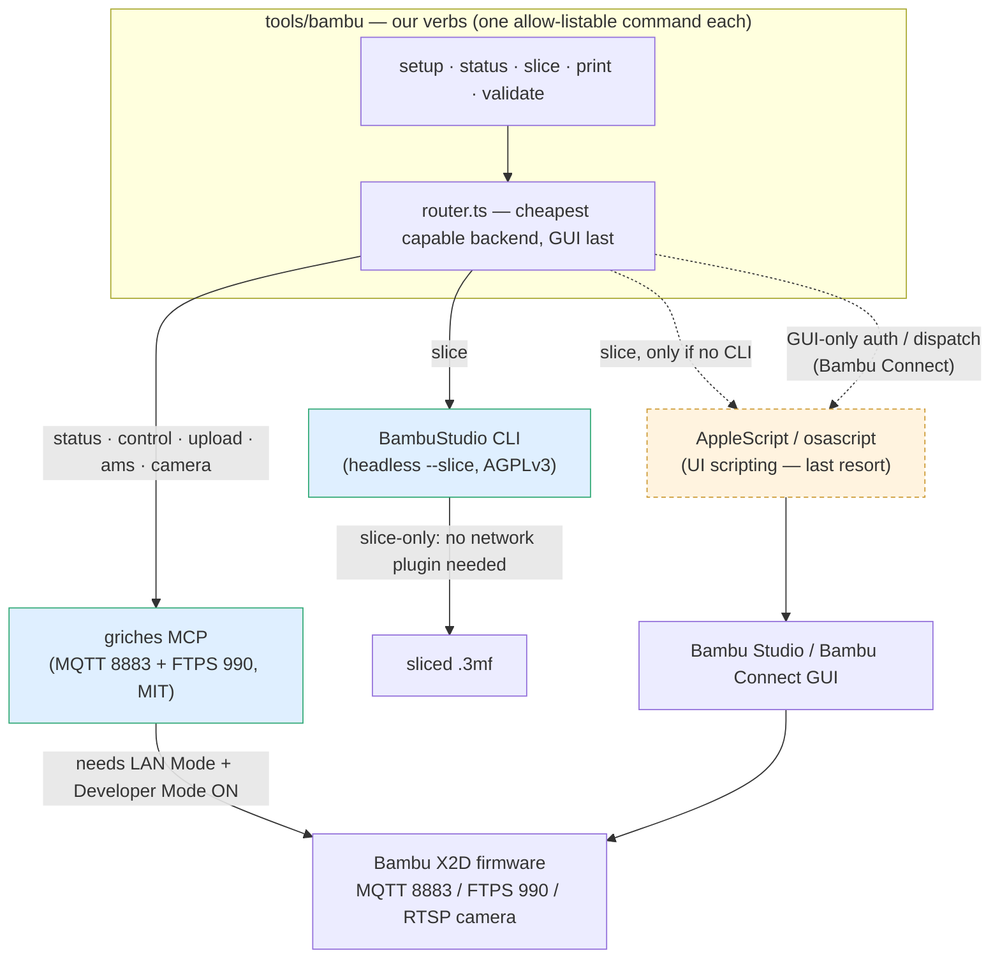

# `tools/bambu` — backend & transport design

**Status:** grounded 2026-09-16 · **Grounded in:**
[`research/bambu-control-transport-survey.md`](research/bambu-control-transport-survey.md)
(16 options + an AppleScript fallback, surveyed by real web search) ·
**Implements:** [`../tools/bambu/README.md`](../tools/bambu/README.md),
[`../tools/bambu/src/backends/router.ts`](../tools/bambu/src/backends/router.ts)

## Why this doc exists

The `tools/bambu` CLI was built in phases 1–3 (#177) and its backend — the griches MCP for
transport, the BambuStudio CLI for slicing, AppleScript as a GUI floor — was chosen **inside that
build, without a checked-in survey of the alternatives**. That is exactly the grounding the rest of
this repo refuses to skip: a load-bearing choice with no `docs/research/` provenance and no recorded
decision is an opinion that has learned to sound permanent. This doc closes that gap. It records
**what else was on the table, the rubric they were judged by, and why the shape we shipped is the
one the rubric picks** — so the choice can be *re-judged*, not re-litigated from memory.

It is not a re-implementation plan. The survey found the shipped architecture already matches the
rubric-optimal shape; this doc's job is to make that defensible and to name the one unproven thing
(X2D dual-nozzle) as a validation task rather than a silent assumption.

## The two jobs, and why no single tool does both well

Driving a Bambu printer splits cleanly into two jobs with different best tools:

1. **Drive** — status, control (start/pause/stop), file upload, camera — over the LAN.
2. **Slice** — turn a model into a machine-ready `.3mf`, headless.

The survey's core finding: **no single open, local option does both jobs well.** The slicers
(BambuStudio / OrcaSlicer / Helio) slice and nothing else; the transports (MCP servers, `bambu-cli`,
`bambulabs_api`) drive and cannot slice. The one tool that spans both (DMontgomery40's MCP) does so
by *shelling out to the BambuStudio CLI internally* — i.e. it composes the same two layers we would,
just inside one GPL-2.0 dependency. So the design question is not "which tool" but "which **layers**,
and how do they fall back."

## Constraints this repo puts on the choice

From the global and project `CLAUDE.md`:

- **One allow-listable command per action** — deterministic argv, no hand-assembled MCP pokes at the
  call site; the difference goes into the tool as a flag.
- **Open-source and locally-runnable preferred** — no routing models through a vendor cloud.
- **Headless** — must run without a foregrounded GUI, so a server/CI/`ssh` session can drive it.
- **Robust over easy** — a stable local surface beats a reverse-engineered cloud one beats
  GUI-scripting; when two paths exist, the fragile one is the fallback, not the default.
- **Owner-gated dispatch** — the transport must let dispatch stay fail-closed (confirm-before-send);
  see [`../tools/bambu/src/commands/print.ts`](../tools/bambu/src/commands/print.ts).

## Architecture — the layered router

Each command asks a **router** for the cheapest capable backend rather than hard-wiring one, so the
fallback chain lives in one place
([`../tools/bambu/src/backends/router.ts`](../tools/bambu/src/backends/router.ts)). Slicing prefers
the CLI then the GUI; every drive capability rides the MCP; the GUI is the floor, never the default.

Solid edges are the primary paths; the dashed AppleScript edges are the last-resort floor — reached
only when a job is genuinely GUI-only (see the decision below).

## Option rubric — the guiding questions

Every option was scored against these questions; the full per-option scoring table is in the survey
([`research/bambu-control-transport-survey.md`](research/bambu-control-transport-survey.md) §"Option
rubric"). Carried here verbatim because *the rubric is the reusable part* — the next time a new MCP
or slicer appears, it is scored against these same questions rather than judged by vibe.

- **R — Robustness:** *Which is least likely to break on a firmware, app, or cloud change?* Ordering
  principle: a **documented/stable local protocol > a reverse-engineered LAN protocol > a
  reverse-engineered cloud API > GUI-scripting.** (Bambu documents *no* protocol, so nothing reaches
  the top tier; Developer-Mode MQTT/FTP is the most stable *available* control surface because Bambu
  sanctions the *mode* even while disclaiming the *protocol*.)
- **AI — AI/agent-friendliness:** *How cleanly can an agent drive it?* Deterministic text I/O, one
  allow-listable command per action, structured output, **no GUI focus-stealing, no interactive
  dialogs, headless and scriptable.**
- **OSS — Open-source & self-hostable** (vs. paid / hosted / closed).
- **Local — Local-only vs. cloud-dependent** (privacy, offline, no vendor lock-in).
- **Headless — CI/server-runnable with no display** (vs. GUI-bound).
- **Maint — Maintenance health & license.**
- **X2D — X2 dual-nozzle support:** confirmed / unconfirmed / unsupported — **the biggest risk.**
- **Slice — Slicing capability** vs. control-only.

### How the field scored (reading of the rubric)

| Job | Winner | Why it tops the rubric | Runner-up (and when it wins) |
|---|---|---|---|
| **Slice** | **BambuStudio CLI** | Bambu's own engine → most-likely home for correct X2D presets; stable local process; Hi on R/AI/OSS/Local/Headless at once | **Helio slicer-cli** (standalone, byte-identical, ships an H2D example) when a self-contained binary beats a full Studio install |
| **Drive** | **griches MCP** (Developer-Mode MQTT+FTPS) | no top-tier-robust option exists (all LAN control is community-RE'd); MIT, H2D-tested, already referenced by the CLI | **synman MCP** (85 tools, most complete) if its license checks out; **`tobiasbischoff/bambu-cli`** if a plain Go binary is wanted over an MCP |
| **Both in one** | — | — | **DMontgomery40 MCP** (drives + wraps BambuStudio; GPL-2.0) if one integrated backend beats composing two |
| **GUI-only** | **AppleScript** (floor) | only path for Bambu-Connect-gated steps with no headless equivalent | — (never chosen where a headless path exists) |

Rejected on the rubric: **printago.io** (commercial + cloud — fails Local/OSS), **bambulab-cloud-py**
(reverse-engineered *cloud* API — lowest R), **schwarztim MCP** (single-nozzle only listed — fails
X2D), and driving the slicer via **AppleScript** (Lo on R and AI when a real `--slice` CLI exists).

## Decision — a two-layer local split, GUI as the floor

**Slice** with the **BambuStudio CLI** (one shelled `--slice` command). **Drive** (status / control /
upload / camera / AMS) over **Developer-Mode MQTT + FTPS via the griches MCP**. Keep **AppleScript
strictly for GUI-only steps** — Bambu Connect's login/auth handshake and any dispatch Bambu funnels
solely through its GUI — and **never** for slicing or status, which have deterministic alternatives.
The router encodes exactly this: `slice → [studio-cli, applescript]`, everything else `→ [mcp]`.

**Why this shape, not a single integrated backend.** Composing two open, single-purpose layers keeps
each call a single allow-listable command against the most robust tool for *that* job, and keeps the
slice engine (Bambu's own, the X2D-preset home) independent of the transport wrapper's release
cadence and license. The one tool that spans both jobs does it by shelling to BambuStudio anyway, so
"one backend" buys integration at the cost of a GPL-2.0 dependency and its opinionated stack without
removing the underlying two-layer reality. This is the `CLAUDE.md` "robust and simple beat cheap and
easy" tenet: the fragile surfaces (cloud API, GUI-scripting) are demoted to fallbacks, not defaults.

**Validator:** the CLI never drives a GUI for a job that has a headless path.
- PASS: `preferenceFor("slice", …)` returns `["studio-cli", "applescript"]` — the CLI first, GUI
  only if no CLI is found; `preferenceFor("status", …)` returns `["mcp"]` and never `applescript`.
- FAIL: any drive capability (status/control/upload/ams/camera) returns `applescript` in its
  preference list, or `slice` returns `applescript` **ahead of** `studio-cli` when Studio is present
  — the by-design failure this decision forbids, because it routes a deterministic job through
  focus-stealing UI scripting.

### What would reverse each half

- **Slice layer** reverses to **Helio slicer-cli** if we want a self-contained slicer binary in the
  repo instead of depending on a full Bambu Studio install, or if BambuStudio's CLI drops/breaks
  headless dual-nozzle for the X2D while Helio's does not.
- **Drive layer** reverses to a **thin direct MQTT+FTPS client** (or `bambulabs_api`, MIT) if the
  griches MCP goes unmaintained or if we want to drop the MCP-client dependency for a plain binary;
  it reverses to **synman's MCP** if that becomes the most complete *and* its license is confirmed
  open. It reverses toward **cloud** (`bambulab-cloud-py`) only if Bambu permanently closes the
  Developer-Mode LAN path — a robustness *downgrade* taken only under duress.
- **AppleScript floor** expands only if Bambu moves more operations behind Connect's GUI; it
  contracts to nothing the day those get a headless path.

## The one unproven thing — X2D dual-nozzle (a validation task, not an assumption)

**No surveyed tool names the X2D explicitly.** The X2D is new (2025–2026); every option's dual-nozzle
support is inferred from its **H2-series** sibling (the X2D shares firmware `01.02.00.00` with the
H2D). The strongest proxies — griches (H2D tested), DMontgomery40 (H2/H2S/H2D/H2C + `ams_mapping2`),
Helio (`example_benchy_h2d.sh`) — are *plausible-by-family, not proven.* The design **isolates this
risk into a bring-up validation step** rather than baking it into an assumption:

1. Toggle **LAN Mode + Developer Mode** on the X2D touchscreen (owner action, blocks #8; memory
   [`../.claude/memory/bambu-x2d-bringup.md`](../.claude/memory/bambu-x2d-bringup.md)).
2. Prove the drive layer read-only: `bambu setup doctor` green, `bambu status show` returns live
   temps/AMS/camera — confirms the griches MCP actually speaks to *this* X2D.
3. Prove the slice layer: `bambu slice plate <machine-card model>` produces a `.3mf` against a real
   X2D dual-nozzle profile; eyeball the result (Phase A5). If BambuStudio ships no X2D preset, fall
   back per the reversal above.

Until those pass, X2D support is written as **unconfirmed** everywhere it appears — the survey's
honesty carried into the design.

## Cross-links

- Survey / provenance: [`research/bambu-control-transport-survey.md`](research/bambu-control-transport-survey.md)
- CLI reference: [`../tools/bambu/README.md`](../tools/bambu/README.md) ·
  router [`../tools/bambu/src/backends/router.ts`](../tools/bambu/src/backends/router.ts) ·
  AppleScript floor [`../tools/bambu/src/backends/applescript.ts`](../tools/bambu/src/backends/applescript.ts)
- Skills: [`../.claude/skills/setup-bambu-x2d/SKILL.md`](../.claude/skills/setup-bambu-x2d/SKILL.md)
  (first-time setup/judgment), [`../.claude/skills/bambu/SKILL.md`](../.claude/skills/bambu/SKILL.md)
  (day-to-day usage)
- Decisions: dual-nozzle representation [D-053](decisions-log.md), transport choice
  [D-054](decisions-log.md)
- Campaign: [`../.claude/plans/binary-tickling-kay.md`](../.claude/plans/binary-tickling-kay.md)
