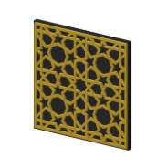
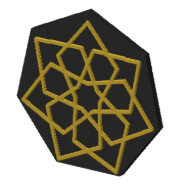
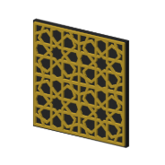
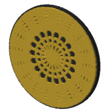
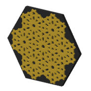
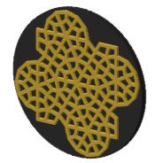
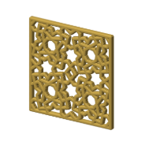
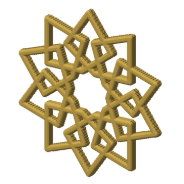
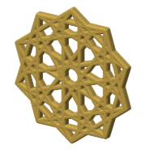
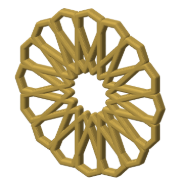

# Pattern catalog

Every pattern we have, one note each. This page is written by the catalog tool
(`python3 .claude/skills/pattern-catalog/scripts/catalog.py sync`); edit the notes, not this
page. How the catalog is laid out and why: [the plan](plan.md).

## Constructions made into coasters (14)

| Picture | Pattern | Catalog id | Status | Styles |
|---|---|---|---|---|
|  | [Simple 20-step Six-Fold Star Rosette](patterns/simple-20-step-six-fold-star-rosette-cs-1.md) | CS-1 | printed | plain, interlock, minimal, border, twist, minimal-frame, minimal-pegs, minimal-key, minimal-tab, lobed, radial |
|  | [Geogebra for Beginners — 8-Fold Rosette Walkthrough](patterns/geogebra-for-beginners-8-fold-rosette-walkthrough-cs-2.md) | CS-2 | printed | plain, interlock, minimal, border, twist, minimal-frame, minimal-pegs, fill |
|  | [5-minute 7-fold Star Rosette](patterns/5-minute-7-fold-star-rosette-cs-6.md) | CS-6 | built | plain |
|  | [Pattern from the Tomb of Itimad ad-Daula](patterns/pattern-from-the-tomb-of-itimad-ad-daula-cs-7.md) | CS-7 | built | plain |
|  | [8-fold Star Rosette with Sequences](patterns/8-fold-star-rosette-with-sequences-cs-8.md) | CS-8 | printed | plain, minimal-frame |
|  | [n-fold Flower in GeoGebra Classic 5](patterns/n-fold-flower-in-geogebra-classic-5-cs-9.md) | CS-9 | built | plain |
|  | [Variable-angled 12-6-4 Star Rosette](patterns/variable-angled-12-6-4-star-rosette-cs-10.md) | CS-10 | built | plain |
|  | [Pattern from the Royal Alcazar](patterns/pattern-from-the-royal-alcazar-cs-11.md) | CS-11 | built | plain |
|  | [Imamzadeh Isma'il Shrine, Isfahan — six-fold kite rosette](patterns/imamzadeh-ismail-shrine-isfahan-six-fold-kite-rosette-cs-12.md) | CS-12 | built | plain |
|  | [The Itimad-ud-Daula ten-fold rosette in a rhombus tile](patterns/the-itimad-ud-daula-ten-fold-rosette-in-a-rhombus-tile-cs-13.md) | CS-13 | printed | minimal, minimal-pieces, split-flange, split-lip |
|  | [Sevenfold stars in a tilted square](patterns/sevenfold-stars-in-a-tilted-square-cs-14.md) | CS-14 | built | minimal |
|  | [The Mustansiriya ten-fold interlaced star](patterns/the-mustansiriya-ten-fold-interlaced-star-cs-15.md) | CS-15 | built | minimal |
|  | [A pentagon after Ptolemy's *Almagest*, doubled to ten](patterns/a-pentagon-after-ptolemys-almagest-doubled-to-ten-cs-16.md) | CS-16 | built | minimal |
|  | [A 16-petal rosette in one unbroken line](patterns/a-16-petal-rosette-in-one-unbroken-line-cs-17.md) | CS-17 | built | minimal |

## Rebuilt from the video, not yet in naqsh (19)

Rebuilt in the youtube repo. No bikar file yet, so no coaster and no picture.

| Pattern | Creator |
|---|---|
| [12-fold pattern in a 6-4-3-4 tiling](patterns/12-fold-pattern-in-a-6-4-3-4-tiling.md) | Sarah Brewer |
| [7-fold star rosette, the 27-minute build](patterns/7-fold-star-rosette-the-27-minute-build.md) | Sarah Brewer |
| [8-fold rosettes turned 45°, with squares](patterns/8-fold-rosettes-turned-45-with-squares.md) | Sarah Brewer |
| [A Mamluk Qur'an page from seven ten-point stars](patterns/a-mamluk-quran-page-from-seven-ten-point-stars.md) | not recorded |
| [A ten-petal blossom from one compass setting](patterns/a-ten-petal-blossom-from-one-compass-setting.md) | not recorded |
| [A tenfold rosette in a pentagon, ink on filmed paper](patterns/a-tenfold-rosette-in-a-pentagon-ink-on-filmed-paper.md) | Samira Mian |
| [Alhambra Hall of the Two Sisters doors, 8-fold in a square](patterns/alhambra-hall-of-the-two-sisters-doors-8-fold-in-a-square.md) | Sarah Brewer |
| [Broug's ten-point star from one circle](patterns/brougs-ten-point-star-from-one-circle.md) | not recorded |
| [Discrete variable star rosette, sliders n and k](patterns/discrete-variable-star-rosette-sliders-n-and-k.md) | Sarah Brewer |
| [Folio 192 heptagonal panel, Anonymous Persian Compendium](patterns/folio-192-heptagonal-panel-anonymous-persian-compendium.md) | Sarah Brewer |
| [Ibn Tulun variable-angle pattern](patterns/ibn-tulun-variable-angle-pattern.md) | Sarah Brewer |
| [Parallel 9-fold Star Rosette, "Avoiding Open Paths"](patterns/parallel-9-fold-star-rosette-avoiding-open-paths.md) | Sarah Brewer |
| [Rings of Tangent Circles](patterns/rings-of-tangent-circles.md) | Sarah Brewer |
| [Star rosettes on a 3-uniform tiling](patterns/star-rosettes-on-a-3-uniform-tiling.md) | Sarah Brewer |
| [Star rosettes on a 4-uniform tiling, in a square](patterns/star-rosettes-on-a-4-uniform-tiling-in-a-square.md) | Sarah Brewer |
| [Sultan Barsbay 16 & 8](patterns/sultan-barsbay-16-8.md) | Sarah Brewer |
| [Sutton's fivefold rectangle and its traced quarter](patterns/suttons-fivefold-rectangle-and-its-traced-quarter.md) | not recorded |
| [The Itimad-ud-Daula ten-fold rosette built by hand in GeoGebra, then tiled](patterns/the-itimad-ud-daula-ten-fold-rosette-built-by-hand-in-geogebra-then-tiled.md) | Geogebra_Road to School |
| [The sixfold √3 rectangle from Baghdad](patterns/the-sixfold-root-3-rectangle-from-baghdad.md) | not recorded |

## Nothing to make, by design

- [Dual Slider m,n-fold Division of the Circle](patterns/dual-slider-m-n-fold-division-of-the-circle.md): the video shows a way of drawing, not a piece.

## Coaster styles

| Style | Patterns made in it |
|---|---|
| [plain](styles/plain.md) | 9 |
| [interlock](styles/interlock.md) | 2 |
| [minimal](styles/minimal.md) | 7 |
| [border](styles/border.md) | 2 |
| [twist](styles/twist.md) | 2 |
| [minimal-frame](styles/minimal-frame.md) | 3 |
| [minimal-pegs](styles/minimal-pegs.md) | 2 |
| [minimal-key](styles/minimal-key.md) | 1 |
| [minimal-tab](styles/minimal-tab.md) | 1 |
| [lobed](styles/lobed.md) | 1 |
| [fill](styles/fill.md) | 1 |
| [radial](styles/radial.md) | 1 |
| [minimal-pieces](styles/minimal-pieces.md) | 1 |
| [split-flange](styles/split-flange.md) | 1 |
| [split-lip](styles/split-lip.md) | 1 |
