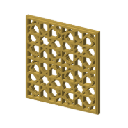

# 8-fold Star Rosette with Sequences (CS-8)

Rebuilt step by step from [Sarah Brewer's video](https://www.youtube.com/watch?v=rDuxHF3xMOc), written in naqsh and made in 2 coaster styles. Its catalog id is CS-8.

## Pictures

One heading per style, so each picture has its own link: the note's link plus the style
name, for example #plain.

### plain

The pattern's straps raised on a full slab.

### minimal-frame

A solid frame round the edge, the straps standing inside it, every empty space cut through.

## Checks against the video

From the [constructions ledger](../../constructions/ledger.md).

2 of the three checks pass and 1 fail; the ledger's notes say why.

- every labelled point and line: 41 compared, none failed (PASS);
- the drawn lines: recall 0.8381, precision 1.0 (FAIL);
- the solid coverage: 1.000 (PASS).

## Coaster styles and plates

| Plate | Styles of this pattern on it |
|---|---|
| [minis-03](../../design/plates/minis-03.md) | minimal frame |
| [minis-04](../../design/plates/minis-04.md) | minimal frame |

## Prints

| Print | Piece | Verdict | What was seen |
|---|---|---|---|
| [2026-09-26-minis-03](../../prints/2026-09-26-minis-03/index.md) | minimal frame, 40 mm | adjust | good start: the pattern reads; much too small at 40 mm |
| [2026-09-26-minis-04](../../prints/2026-09-26-minis-04/index.md) | minimal frame, 80 mm | adjust | tiny holes (said of the print as a whole, not of this piece); the change is the slice, not the params: re-slice once the preset chain is flattened |

<!-- written by hand below this line; the sync tool stops here -->

## Notes

Nothing written by hand yet. This is the place for what makes the pattern work, what went
wrong, and what to try next.
