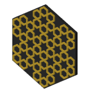
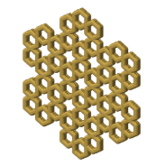
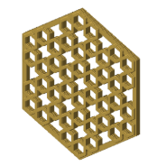
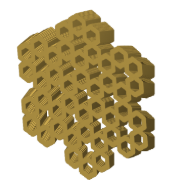

# Simple 20-step Six-Fold Star Rosette (CS-1)

A six-fold star rosette, rebuilt step by step from
[Sarah Brewer's video](https://www.youtube.com/watch?v=GimTvN9hw4U). It is the first
construction in the ledger (CS-1), and most coaster styles were first tried on it.

## Pictures

One heading per style, so each picture has its own link: the note's link plus the style
name, for example #minimal.

### plain

The straps raised on a full slab.

### minimal

The straps alone: no slab and no frame, every empty space a hole.

### minimal-frame

A solid frame round the edge, the straps inside it.

### minimal-pegs

minimal-frame with dovetails cut into the frame, so tiles join.

### twist

minimal, twisted up its height.

## Checks against the video

From the [constructions ledger](../../constructions/ledger.md), all three checks against the
video's GeoGebra construction pass:

- every labelled point and line: 23 compared, none failed;
- the drawn lines: recall 1.000, precision 1.000;
- the solid coverage: 1.000.

## Coaster styles and plates

| Plate | Styles of this pattern on it |
|---|---|
| [minis-01](../../plates/minis-01.yaml) | the plain coaster |
| [minis-02](../../plates/minis-02.yaml) | plain, minimal, interlock, twist |
| [minis-03](../../plates/minis-03.yaml) | minimal frame, minimal pegs |
| [minis-04](../../plates/minis-04.yaml) | minimal frame, minimal pegs, twist |
| [minis-05](../../plates/minis-05.yaml) | frame pair, key pair, key at three clearances, tab pair |
| [minis-06](../../plates/minis-06.yaml) | dovetail and slim dovetail pairs |

## Prints

Only minis-03 and minis-04 have print records so far. The plain, minimal and interlock
pieces (minis-01 and minis-02) have not come back yet.

| Print | Piece | Verdict | What was seen |
|---|---|---|---|
| [minis-03](../../prints/2026-09-26-minis-03/index.md) | minimal frame, 40 mm | adjust | The pattern reads, but it is much too small at 40 mm. |
| [minis-03](../../prints/2026-09-26-minis-03/index.md) | minimal pegs pair | adjust | Too small; the join is about 11 mm of solid border; a bit loose at 0.15 mm. |
| [minis-04](../../prints/2026-09-26-minis-04/index.md) | minimal frame, 80 mm | adjust | Tiny holes in the top; the fix is in the slice, not the model. |
| [minis-04](../../prints/2026-09-26-minis-04/index.md) | minimal pegs pair, 80 mm | adjust | The peg border is too big, and the pegs are too tight at 0.10 mm. |
| [minis-04](../../prints/2026-09-26-minis-04/index.md) | twist | adjust | Tiny holes in the top. |

Photos: [pegs pair and pieces](../../prints/2026-09-26-minis-03/photos/pegs-pair-and-cs1.jpg),
[whole plate](../../prints/2026-09-26-minis-03/photos/plate-overview.jpg).

<!-- written by hand below this line; the sync tool stops here -->

## Notes

**What makes it work.** A 20-step drawing ends in a clean six-fold star, and the star tiles
as a hexagon. That is why every coaster style fits it: the hexagon edge is where the pegs,
keys, tabs and dovetails go.

**What went wrong.** Nothing is wrong with the pattern itself. Everything printed was
"adjust": the minis were too small to judge the pattern, the peg border was too wide, and the
peg clearance was wrong both ways (loose at 0.15 mm, tight at 0.10 mm). The tiny holes on
minis-04 came from the slice settings.

**What to try next.** Pick a peg clearance between 0.10 and 0.15 mm, make the peg border
narrower, and print at a real coaster size once the joins are chosen.
