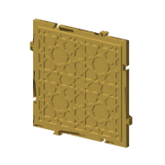
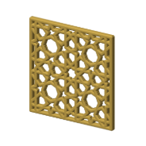
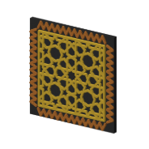
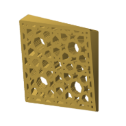
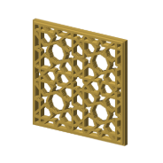
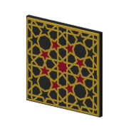

# Geogebra for Beginners — 8-Fold Rosette Walkthrough (CS-2)

Rebuilt step by step from [Sarah Brewer's video](https://www.youtube.com/watch?v=7apC5Q9QS-8), written in naqsh and made in 8 coaster styles. Its catalog id is CS-2.

## Pictures

One heading per style, so each picture has its own link: the note's link plus the style
name, for example #plain.

### plain

The pattern's straps raised on a full slab.

### interlock

Plain, plus a self-mating dovetail tab and slot on every straight edge, so tiles plug together.

### minimal

The straps alone: no slab, every empty space in the pattern is a hole, top edges rounded over.

### border

Plain, with a second pattern in a band round the edge; needs a color plate, not compose.

### twist

Minimal, twisted up its height; the twist is capped so the wall leans no more than 45° (CV12).

### minimal-frame

A solid frame round the edge, the straps standing inside it, every empty space cut through.

### minimal-pegs

Minimal-frame with the dovetails cut into the frame; the frame is at least slot depth + clearance + 1.6 mm, so no slot breaks into a hole.

### fill

Plain in several colors: the spaces between the straps filled level and colored by ring about the centre.

## Checks against the video

From the [constructions ledger](../../constructions/ledger.md).

All three checks against the video's GeoGebra construction pass:

- every labelled point and line: 144 compared, none failed (PASS);
- the drawn lines: recall 1.000, precision 1.000 (PASS);
- the solid coverage: 1.000 (PASS).

## Coaster styles and plates

| Plate | Styles of this pattern on it |
|---|---|
| [minis-01](../../design/plates/minis-01.md) | plain |
| [minis-02](../../design/plates/minis-02.md) | plain, interlock, minimal |
| [minis-03](../../design/plates/minis-03.md) | minimal frame |
| [minis-04](../../design/plates/minis-04.md) | minimal frame |
| [sheets-01](../../design/plates/sheets-01.md) | minimal |
| [sheets-02](../../design/plates/sheets-02.md) | minimal |
| [sheets-03](../../design/plates/sheets-03.md) | minimal |

## Prints

| Print | Piece | Verdict | What was seen |
|---|---|---|---|
| [2026-09-26-minis-03](../../prints/2026-09-26-minis-03/index.md) | minimal frame, 40 mm | adjust | good start: the pattern reads; much too small at 40 mm |
| [2026-09-26-minis-04](../../prints/2026-09-26-minis-04/index.md) | minimal frame, 80 mm | adjust | tiny holes (said of the print as a whole, not of this piece); the change is the slice, not the params: re-slice once the preset chain is flattened |

<!-- written by hand below this line; the sync tool stops here -->

## Notes

Nothing written by hand yet. This is the place for what makes the pattern work, what went
wrong, and what to try next.
