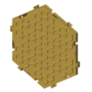
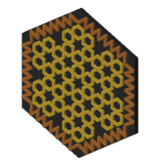
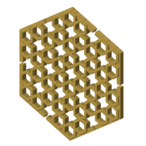
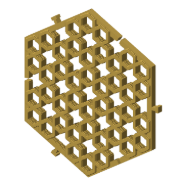
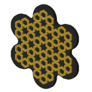
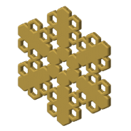

# Simple 20-step Six-Fold Star Rosette (CS-1) ^wtsm68

Rebuilt step by step from [Sarah Brewer's video](https://www.youtube.com/watch?v=GimTvN9hw4U), written in naqsh and made in 11 coaster styles. Its catalog id is CS-1.

## Pictures

One heading per style, so each picture has its own link: the note's link plus the style
name, for example #plain.

### plain

The pattern's straps raised on a full slab.

### interlock

Plain, plus a self-mating dovetail tab and slot on every straight edge, so tiles plug together.

### minimal

The straps alone: no slab, every empty space in the pattern is a hole, top edges rounded over.

### border

Plain, with a second pattern in a band round the edge; needs a color plate, not compose.

### twist

Minimal, twisted up its height; the twist is capped so the wall leans no more than 45° (CV12).

### minimal-frame

A solid frame round the edge, the straps standing inside it, every empty space cut through.

### minimal-pegs

Minimal-frame with the dovetails cut into the frame; the frame is at least slot depth + clearance + 1.6 mm, so no slot breaks into a hole.

### minimal-key

Minimal-frame with a bow-tie pocket through the frame at every edge midpoint; a separate loose key (`--piece Key`) joins two coasters, its wings hooking into the pattern's openings. For frames too thin for a dovetail.

### minimal-tab

Minimal-frame with a tab grown from every other edge and a notch through the frame on the edges between, so neighbours join tab to notch with no third piece. Hexagon only.

### lobed

Plain, on an N-lobe wave outline drawn with compass arcs instead of a polygon.

### radial

Minimal, with whole rings of openings (orbits, numbered outward from the centre; `bikar bands` lists them) closed solid at strap height, so the piece keeps the pattern's symmetry whichever rings are chosen.

## Checks against the video

From the [constructions ledger](../../constructions/ledger.md).

All three checks against the video's GeoGebra construction pass:

- every labelled point and line: 23 compared, none failed (PASS);
- the drawn lines: recall 1.000, precision 1.000 (PASS);
- the solid coverage: 1.000 (PASS).

## Coaster styles and plates

| Plate | Styles of this pattern on it |
|---|---|
| [minis-01](../../design/plates/minis-01.md) | plain |
| [minis-02](../../design/plates/minis-02.md) | plain, interlock, minimal, twist |
| [minis-03](../../design/plates/minis-03.md) | minimal frame, minimal pegs |
| [minis-04](../../design/plates/minis-04.md) | minimal frame, minimal pegs, twist |
| [minis-05](../../design/plates/minis-05.md) | minimal frame, minimal key, minimal tab |
| [minis-06](../../design/plates/minis-06.md) | minimal pegs |
| [sheets-01](../../design/plates/sheets-01.md) | minimal |
| [sheets-02](../../design/plates/sheets-02.md) | minimal |
| [sheets-03](../../design/plates/sheets-03.md) | minimal |

## Prints

| Print | Piece | Verdict | What was seen |
|---|---|---|---|
| [2026-09-26-minis-03](../../prints/2026-09-26-minis-03/index.md) | minimal frame, 40 mm | adjust | good start: the pattern reads; much too small at 40 mm |
| [2026-09-26-minis-03](../../prints/2026-09-26-minis-03/index.md) | minimal pegs, 40 mm, 2 of them | adjust | much too small at 40 mm; mated, big spaces between the patterns: two 5.7 mm frames leave about 11 mm of solid at the join; a bit loose at the file's default clearance 0.15 mm (hand feel, not measured) |
| [2026-09-26-minis-04](../../prints/2026-09-26-minis-04/index.md) | minimal frame, 80 mm | adjust | tiny holes (said of the print as a whole, not of this piece); the change is the slice, not the params: re-slice once the preset chain is flattened |
| [2026-09-26-minis-04](../../prints/2026-09-26-minis-04/index.md) | minimal pegs, 80 mm, 2 of them | adjust | the peg system border is too big; the pegs are too tight at clearance 0.10 (hand feel, not measured); border about 11 mm at these knobs, worked out from the file's frame rule, not measured; tight has three suspects besides clearance: elephant-foot compensation printed as 0, the slot is not a true offset of the tab (tightest gap about c/2), and height and size changed at the same time |
| [2026-09-26-minis-04](../../prints/2026-09-26-minis-04/index.md) | twist, 80 mm | adjust | tiny holes (said of the print as a whole, not of this piece); the change is the slice, not the params: re-slice once the preset chain is flattened |

<!-- written by hand below this line; the sync tool stops here -->

## Notes

It is the first construction in the ledger, and most coaster styles were first tried on it.

**What makes it work.** A 20-step drawing ends in a clean six-fold star, and the star tiles
as a hexagon. That is why every coaster style fits it: the hexagon edge is where the pegs,
keys, tabs and dovetails go.

**What went wrong.** Nothing is wrong with the pattern itself. Everything printed was
"adjust": the minis were too small to judge the pattern, the peg border was too wide, and the
peg clearance was wrong both ways (loose at 0.15 mm, tight at 0.10 mm). The tiny holes on
minis-04 came from the slice settings. The minis-01 and minis-02 pieces (plain, minimal,
interlock) have no print record yet.

Photos: [pegs pair and pieces](../../prints/2026-09-26-minis-03/photos/pegs-pair-and-cs1.jpg),
[whole plate](../../prints/2026-09-26-minis-03/photos/plate-overview.jpg).

**What to try next.** Pick a peg clearance between 0.10 and 0.15 mm, make the peg border
narrower, and print at a real coaster size once the joins are chosen.
