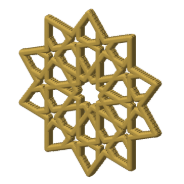
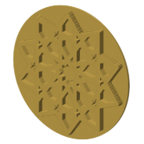
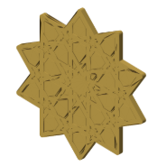
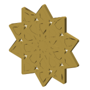

# The Itimad-ud-Daula ten-fold rosette in a rhombus tile (CS-13)

Rebuilt step by step from [the video](https://www.youtube.com/watch?v=gBV_JTt3Kxk), written in naqsh and made in 5 coaster styles. Its catalog id is CS-13.

## Pictures

One heading per style, so each picture has its own link: the note's link plus the style
name, for example #minimal.

### minimal

The straps alone: no slab, every empty space in the pattern is a hole, top edges rounded over.

### minimal-pieces

Every hole of the ten-fold minimal coaster filled back in as a loose piece, one color per ring, set in a strap frame — the coaster to color piece by piece.

### split-flange

The pieces coaster cut into two printed halves with flush faces: each piece carries a thin flange at the cut that sits in an undercut in both halves, so it cannot fall out either way.

### split-lip

The pieces coaster cut into two printed halves that trap the pieces between them: each pocket has a lip on both faces and the pieces drop in from the cut, two halves joined by studs (the stars stay open).

### split-pocket

The pieces coaster cut into two printed halves, each printing its piece halves in place in closed pockets: a plug through each neck and a band in the room, air above and below, nothing placed by hand (the stars stay open).

## Checks against the video

From the [constructions ledger](../../constructions/ledger.md).

0 of the three checks pass and 2 fail; the ledger's notes say why.

- every labelled point and line: 134 compared, 20 failed (FAIL);
- the drawn lines: recall 0.997, precision 0.4291 (FAIL);
- the solid coverage: not run.

## Coaster styles and plates

| Plate | Styles of this pattern on it |
|---|---|
| [pkt-2](../../design/plates/pkt-2.md) | split pocket |
| [sheets-01](../../design/plates/sheets-01.md) | minimal |
| [sheets-02](../../design/plates/sheets-02.md) | minimal |
| [sheets-03](../../design/plates/sheets-03.md) | minimal |
| [sheets-04](../../design/plates/sheets-04.md) | minimal |
| [sheets-04c](../../design/plates/sheets-04c.md) | minimal |
| [sheets-04g](../../design/plates/sheets-04g.md) | minimal, minimal pieces |
| [sheets-04g-fit](../../design/plates/sheets-04g-fit.md) | minimal, minimal pieces |
| [split-01](../../design/plates/split-01.md) | split lip |
| [split-02](../../design/plates/split-02.md) | split flange |
| [stud-1](../../design/plates/stud-1.md) | split lip |
| [swatch-10101](../../design/plates/swatch-10101.md) | minimal |
| [swatch-10204](../../design/plates/swatch-10204.md) | minimal |
| [swatch-10501](../../design/plates/swatch-10501.md) | minimal |
| [swatch-13903](../../design/plates/swatch-13903.md) | minimal |
| [theme-iznik-tile-10100](../../design/plates/theme-iznik-tile-10100.md) | minimal, minimal pieces |
| [theme-iznik-tile-10205](../../design/plates/theme-iznik-tile-10205.md) | minimal pieces |
| [theme-iznik-tile-10604](../../design/plates/theme-iznik-tile-10604.md) | minimal pieces |
| [theme-iznik-tile-10605](../../design/plates/theme-iznik-tile-10605.md) | minimal pieces |
| [theme-midnight-blue-10101](../../design/plates/theme-midnight-blue-10101.md) | minimal, minimal pieces |
| [theme-midnight-blue-13903](../../design/plates/theme-midnight-blue-13903.md) | minimal pieces |
| [theme-night-sky-11600](../../design/plates/theme-night-sky-11600.md) | minimal pieces |
| [theme-night-sky-11602](../../design/plates/theme-night-sky-11602.md) | minimal pieces |
| [theme-night-sky-13101](../../design/plates/theme-night-sky-13101.md) | minimal, minimal pieces |
| [theme-night-sky-13402](../../design/plates/theme-night-sky-13402.md) | minimal pieces |
| [theme-terracotta-souk-10101](../../design/plates/theme-terracotta-souk-10101.md) | minimal, minimal pieces |
| [theme-terracotta-souk-10401](../../design/plates/theme-terracotta-souk-10401.md) | minimal pieces |
| [theme-terracotta-souk-11203](../../design/plates/theme-terracotta-souk-11203.md) | minimal pieces |
| [theme-terracotta-souk-11401](../../design/plates/theme-terracotta-souk-11401.md) | minimal pieces |

## Prints

| Print | Piece | Verdict | What was seen |
|---|---|---|---|
| [2026-10-02-sheets-04](../../prints/2026-10-02-sheets-04/index.md) | minimal | keep | no remark on the coaster itself; it is kept as the frame the next pieces plate is set into |
| [2026-10-04-sheets-04g](../../prints/2026-10-04-sheets-04g/index.md) | minimal, 112.5 mm | not-judged | no remark on the coaster itself yet |
| [2026-10-04-sheets-04g](../../prints/2026-10-04-sheets-04g/index.md) | minimal pieces, middle, 112.5 mm | adjust | adn the middle piece was too lose |
| [2026-10-04-sheets-04g](../../prints/2026-10-04-sheets-04g/index.md) | minimal pieces, kite, 112.5 mm, 10 of them | adjust | the small kits were too tight ti fit |
| [2026-10-04-sheets-04g](../../prints/2026-10-04-sheets-04g/index.md) | minimal pieces, hex, 112.5 mm, 10 of them | not-judged | no remark yet |
| [2026-10-04-sheets-04g](../../prints/2026-10-04-sheets-04g/index.md) | minimal pieces, star, 112.5 mm, 10 of them | not-judged | no remark yet |
| [2026-10-04-sheets-04g](../../prints/2026-10-04-sheets-04g/index.md) | minimal pieces, outer, 112.5 mm, 10 of them | not-judged | no remark yet |

<!-- written by hand below this line; the sync tool stops here -->

## Notes

Nothing written by hand yet. This is the place for what makes the pattern work, what went
wrong, and what to try next.
