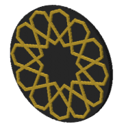

# Variable-angled 12-6-4 Star Rosette (CS-10)

Rebuilt step by step from [Sarah Brewer's video](https://www.youtube.com/watch?v=n3IidKfXE1I), written in naqsh and made in 1 coaster style. Its catalog id is CS-10.

## Pictures

One heading per style, so each picture has its own link: the note's link plus the style
name, for example #plain.

### plain

The pattern's straps raised on a full slab.

## Checks against the video

From the [constructions ledger](../../constructions/ledger.md).

All three checks against the video's GeoGebra construction pass:

- every labelled point and line: 64 compared, none failed (PASS);
- the drawn lines: recall 1.0, precision 1.0 (PASS);
- the solid coverage: 1.000 (PASS).

## Coaster styles and plates

No plate uses this pattern yet.

## Prints

No print record names this pattern yet.

<!-- written by hand below this line; the sync tool stops here -->

## Notes

Nothing written by hand yet. This is the place for what makes the pattern work, what went
wrong, and what to try next.
