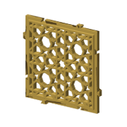
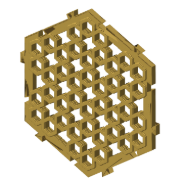

# The minimal-pegs coaster style

Minimal-frame with the dovetails cut into the frame; the frame is at least slot depth + clearance + 1.6 mm, so no slot breaks into a hole.

The name, the file it comes from and where it was decided are in the [coaster styles table](../../../.claude/skills/import-construction/coaster-styles.md).

## Patterns in this style

### 7apC5Q9QS-8

[Geogebra for Beginners — 8-Fold Rosette Walkthrough (CS-2)](../patterns/geogebra-for-beginners-8-fold-rosette-walkthrough-cs-2.md#minimal-pegs)

### GimTvN9hw4U

[Simple 20-step Six-Fold Star Rosette (CS-1)](../patterns/simple-20-step-six-fold-star-rosette-cs-1.md#minimal-pegs)

<!-- written by hand below this line; the sync tool stops here -->

## Notes

Nothing written by hand yet.
