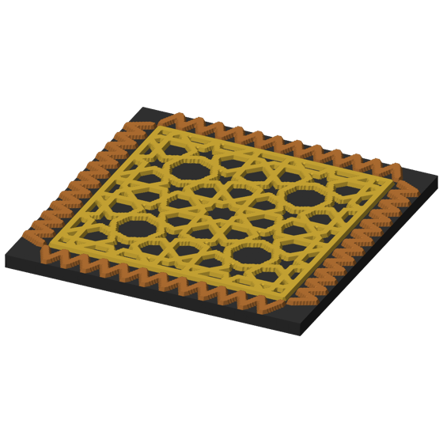
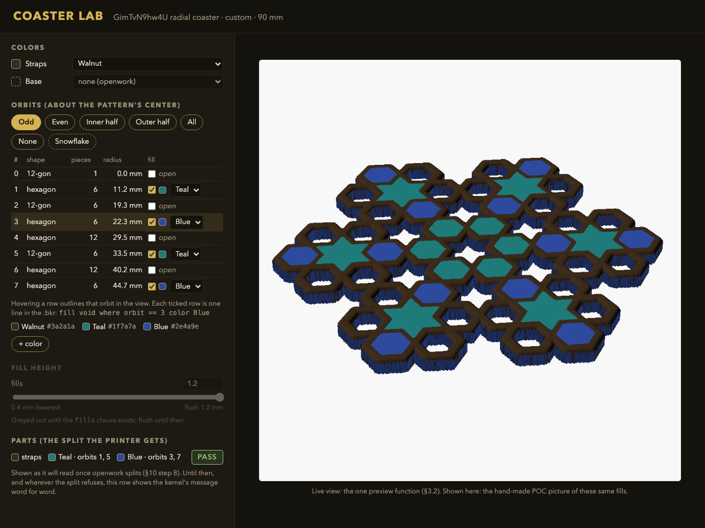

# Coloured coaster pictures and the Coaster Lab colour controls — the consolidated design

Omar, 2026-09-28: "Do we have the ability to alternate colors / customize colors on the PNGs we
are generating? If not, would we need to integrate an alternate CAD software?" — and then: "we
should have options to configure all of these in a robust easy to use fashion in coaster lab":
which orbits are filled, each orbit's colour, flush or lowered, and a live coloured preview, with
the Lab preview and the printed parts coming from one code path.

*Status: consolidated design, the one to act on. §10 steps 1–5 are built (bikar
[#271](https://github.com/NaqshCoffee/bikar/pull/271)–[#274](https://github.com/NaqshCoffee/bikar/pull/274),
3d-models #381; pictures below); the Coaster Lab controls (§5, steps 6–8) are not. It supersedes the two
research designs it was built from, researcher A's [colour-preview-design-a.md](colour-preview-design-a.md)
(raw notes: [research/colour-preview-2026-09-28-a.md](research/colour-preview-2026-09-28-a.md)) and
researcher B's [colour-preview-design-b.md](colour-preview-design-b.md) (raw notes:
[research/colour-preview-2026-09-28-b.md](research/colour-preview-2026-09-28-b.md)), which stay as
the record. It builds on [multicolor-design.md](multicolor-design.md) (how shapes are grouped into
orbits, flush vs lowered, how colours reach the printer) and does not redo it. The checker re-read
the bikar code at `f8796fc` (branch `feat/orbit-radial-fill`, open bikar
[PR #270](https://github.com/NaqshCoffee/bikar/pull/270)) and re-ran the experiments §9 names.*

## 0. The answer in one screen

| Question | Answer |
|---|---|
| Can we colour the PNGs today? | **Partly.** The Coaster Lab already paints each printed body in its palette colour, and B coloured the CS-1 slab coaster's orbits alternately ruby and teal end to end (Lab, printer parts, a picture). The **gallery** PNGs are one colour only because the gallery script draws the single whole-coaster STL in OpenSCAD's fixed gold scheme |
| Why is the CS-1 radial variant one colour? | Not the renderer. That coaster is openwork (`outline pattern`): its filled orbits are **one body with the straps**, and the colour split refuses it. The printer would get one colour too. It also carries a top-edge fillet, which the split refuses separately (§4) |
| Do we need other CAD software? | **No.** Of the seven routes the two researchers weighed (§2), none needs a CAD feature we lack. The geometry and the split already live in bikar; what is missing is a picture drawn from the split bodies outside a browser, and the Lab controls |
| Recommendation | **One bikar function turns the split bodies into a coloured picture**, and both the Lab viewer and a new `bikar render --format preview` call it. Before that, one shared body-to-colour function, because the Lab and the CLI already work out colours in two places (§3) |
| Lab controls | An **Orbits** panel: one row per orbit with a fill tick and a colour; presets *odd, even, inner half, outer half, all, none*; a fill-height slider once the `fills` clause exists. Every control rewrites `.bkr` lines, like today's colour knob (§5) |
| Does *odd* give the snowflake? | **Yes, on CS-1.** Orbits are numbered outwards by radius; the snowflake is orbits 1, 3, 5, 7 = *odd* (checker ran `bikar bands`, §9). *Alternate* is ambiguous (start at 0 or 1), so the Lab says *odd* and *even* |

### What it looks like now

Both pictures come from `bikar render --format preview` on bikar main (`654fae2`), drawn from the
same split bodies the printer gets, so the colors here are the colors that print. They were
re-rendered for this doc and are byte-identical to the step-4 check.

| Fill coaster | Border coaster |
|---|---|
|  |  |
| `7apC5Q9QS-8-fill-coaster.bkr`: straps gold, the inner stars ruby, the other faces and the base dark | `7apC5Q9QS-8-border-coaster.bkr`: lattice gold, zigzag border copper, base dark |

The stepped edges are in the mesh, not the picture: the kernel's outlines sit on a fine grid, an
open kernel issue separate from color.

The earlier proof-of-concept pictures, made by hand before the pipeline existed (OpenSCAD
`color()` over bikar's per-orbit meshes, [colour.scad](research/colour-poc-2026-09-28/colour.scad)):
[every orbit filled, top view](research/colour-poc-2026-09-28/all-orbits-top.png),
[the snowflake (odd orbits)](research/colour-poc-2026-09-28/snowflake-iso.png) and
[lowered fills](research/colour-poc-2026-09-28/lowered-strip.png).

## 1. What exists today

| Picture | Made by | Coloured? | Drawn from the bodies the printer gets? |
|---|---|---|---|
| Gallery coaster PNG | [`build/brick_previews.py`](../build/brick_previews.py): OpenSCAD `import()` of the single STL, Cornfield scheme, camera `0,0,0,60,0,25,0`; [`build/process_images.py`](../build/process_images.py) then turns every pixel within 14 of `#FFFFE5` transparent | No, one gold | The whole mesh, not the parts |
| Coaster Lab live view | bikar `packages/lab/src/evaluate.ts` calls `buildCoasterParts(built, { pinch: 'fillet' })`, `coasterTintMesh` tags each triangle with its body's colour, `packages/lab/src/viewer.ts` paints it (canvas, painter's sort, head-light shade `0.4 + 0.6·max(0, n·l)`) | Yes | Yes, but the pinch option is fixed in the Lab, and the body-to-colour rule is a second copy of the CLI's (§3) |
| Lab picker thumbnails | bikar `scripts/render-coaster-thumbnails.ts`: Playwright copies the Lab canvas | Only if the preset sets colours | Same as the Lab view |
| `bambu slice coaster` colour plate picture (#342) | flat top-down SVG from `renderCoasterTopSVG` | Yes | **No**: drawn from the description; its check `missingRegionColours` only asks that each hex appears somewhere |
| Bambu Studio thumbnails | the Studio window | Yes | Yes, but headless export hangs ([issue](issues/coaster-3mf-filament-shape-and-export-hang.md)) |
| Orb gallery | `bikar render --format views` → core `renderOrbViewSVG` (shaded, per-face colour) → `rsvg-convert` | Per face | Orbs, not coasters — but it is **the precedent**: a 3D view drawn to SVG in core and rasterised by a tool bikar already uses |

## 2. The options

"Verifies" asks: does the picture come from the same bodies, in the same colours, that the printer
gets — and would the Lab and the gallery ever show different things for one `.bkr`?

| Option | What it verifies | Pros | Cons | Implications |
|---|---|---|---|---|
| **1. One core preview function, shared by the Lab and `bikar render --format preview`** (A's B; recommended) | Same bodies and colours **by construction**: one function takes the `buildCoasterParts` map and the one body-to-colour map; Lab and gallery cannot drift | One code path for Lab, CLI, gallery and thumbnails; no new tool (`rsvg-convert` is what bikar's `packages/cli/src/rasterize.ts` already uses, and the orb views already work this way); A's scratch probe drew 1024 px in about 2 s; transparent background removes the cream-key problem | A bikar change: move the Lab viewer's projection and shading into core, add `--format preview`; painter's sort by triangle centre is approximate (seen right on one flat coaster, not tried on tall walls); ~200k triangles per SVG | Gallery coasters move off OpenSCAD; the Lab viewer's code moves into core (it is already a port of the studio's orb preview, so this ends a copy rather than making one) |
| 2. OpenSCAD `color(hex) import(part.stl)` per sidecar part in `brick_previews.py` (B's A) | Same bodies (reads the part STLs `--format parts` wrote) and the sidecar's hex — the same hex the 3MF gets | Tried by both: right colours in about 0.3–0.5 s on the installed 2021.01; about 30 lines; keeps the gallery camera and the mating pair | **A second renderer** beside the Lab's, so the two can disagree in look; colour shows only in OpenSCAD's preview mode, so adding `--render` would drop it silently; a cream or white filament gets keyed to transparent by `process_images.py` | Cheapest; ties the gallery to OpenSCAD; nothing reaches the Lab. Valid **stop-gap** only |
| 3. Playwright capture of the Lab for gallery PNGs too (extends B's B) | Exactly what the Lab shows | Pixel-identical to the Lab; the script exists | Needs Vite and a headless browser in `make coasters`; 184 px today; dark Lab background | Right for thumbnails (kept); heavy for the gallery. Under option 1 the thumbnails become the same picture anyway |
| 4. Flat top-view SVG (`renderCoasterTopSVG`) | **Nothing about the bodies**: drawn from the description | Exists; fast | A shrunk or missing body still draws right (§7, hard case) | Keep as a plate legend, never as proof of colours |
| 5. 3MF viewers (3MF Consortium viewer, F3D, three.js loader) | The 3MF, if they read Bambu's colours | One link further down the chain | Bambu keeps colour in its own config (`filament_colour`, `extruder`), not core 3MF materials (printago, fetched by B); per-object colour in the 3MF Consortium viewer is snippet-only; F3D not installed | A new dependency reading the same STLs option 1 reads |
| 6. Blender headless | Whatever it is fed (the part STLs) | Best-looking renders | Not installed; heavy; manual fetch returned 403 to both, so nothing about it is grounded | A product-photo job, not a preview job |
| 7. Bambu Studio thumbnails | The sliced plate | The slicer's own view | Headless path blocked (hang, colour override, crash) | Not available headless today |

**Why option 1.** The owner's requirement is "Lab preview and printed parts from one code path",
and this repo treats two code paths that can disagree as the defect itself (CLAUDE.md, "robust and
simple beat cheap and easy"). Option 2 verifies the right bodies but adds a second renderer; option
1 deletes the question. The extra cost is one move of existing code into core plus one CLI format,
two or three small bikar PRs (§10). Option 2 stays a stop-gap if Omar wants coloured gallery PNGs
before §10 step 3 lands; it verifies the bodies and the colours, only not the look.

## 3. Recommended design

### 3.1 First, one body-to-colour function (a defect that exists today)

The checker found the rule "which colour does this body get" written twice:

- CLI: `pieceColour` in bikar `packages/cli/src/index.ts` (L953 at `f8796fc`) — writes the sidecar
  hex that `tools/bambu` turns into `filament_colour`.
- Lab: the `rgbByKey` map inside `coasterTintMesh` in `packages/lab/src/evaluate.ts` (L324).

They agree today (region keys take the `color <region>` choice; any other key is a palette name).
But they are two copies, and the Lab also fixes `pinch: 'fillet'` in its own call while the CLI
reads `--pinch`. Move the rule into core next to `buildCoasterParts` (for example
`coasterPieceColours(coaster3d, parts)`), call it from both, and have the Lab pass the CLI's default
pinch constant rather than a literal. This is small, needs no UI, and is the part of the "one code
path" requirement that is broken now.

### 3.2 Then, one preview function

1. **Core module** (for example `coaster-preview`), moved from the Lab, not rewritten: projection
   and head-light shading from `viewer.ts`. Input: the parts map, the §3.1 colour map, a camera.
   Output: a list of shaded, depth-sorted polygons. Keep the viewer's own choices (no back-face
   culling, back faces darker) so the Lab looks the same after the move.
2. **Lab viewer** draws that list on its canvas. Behaviour unchanged; thumbnails, which copy the
   canvas, follow for free.
3. **CLI**
   `bikar render <file> --coaster <name> --format preview -o <file>.png [--pinch …] [--mate <dx,dy>]`: evaluates, splits with the same pinch option `--format parts` takes, writes
   the polygon list as SVG with no background, and rasterises with `rasterize.ts`. It **refuses
   exactly where `--format parts` refuses**, with the same message, so a picture never promises a
   split the printer cannot get. `--mate` draws the second copy the gallery shows for mating
   coasters (today `brick_previews.py --mate`).
4. **Gallery**: `make coasters` calls `--format preview` for coasters that split and carry colours;
   the rest keep `brick_previews.py`. No colour key runs on these PNGs.

**Default:** the preview camera is the gallery's three-quarter view `0,0,0,60,0,25,0` at 1024 px,
as [brick_previews.py at 5938f31](https://github.com/omars-lab/3d-models/blob/5938f3145eb697abf3fc25cff50c9b82b6627951/build/brick_previews.py) sets it — a house choice so coloured and
plain coasters sit side by side at one angle, not a measured value. In bikar it becomes the two
rotations (60° tilt, 25° turn) framed from the mesh bounds.

## 4. The openwork change (why the CS-1 radial coaster stays one colour)

Both researchers agree: colouring an openwork coaster is a kernel change, not a renderer change.
The checker adds a second blocker neither found.

1. **The `outline pattern` refusal.** `assertSplittable` in bikar
   `packages/core/src/kernel3d/coaster.ts` (L3295) refuses every openwork coaster. Commit `f8796fc`
   closes filled faces by growing the solid footprint (`signedInset` takes the larger of the strap
   inset and the filled-face inset), so straps and fills are one body.
2. **The top-edge fillet refusal (checker, reproduced).** The radial coaster says
   `edge fillet $round top`, and `hasSlabReshapingClause` refuses any `edges` entry. The checker
   added `edge fillet 0.6 top` to the splittable 7apC5Q9QS-8 fill coaster and `--format parts`
   refused it with the edge-bevel message. So lifting refusal 1 alone would still refuse CS-1
   radial. The split must learn the top fillet, or the coloured variant must drop it.

**The split to build** (merging A §3 and B §4 item 3): on `outline pattern`, one **straps** body
plus **one body per fill colour**, cut by the same column rule the slab split uses, with the
strap-wins rule of [multicolor-design §3.1](multicolor-design.md#31-strap-wins-both-researchers-built-in-261):
a cell within half a strap width of a strap centreline belongs to the straps, the rest of a filled
face to its colour. The bodies must reunite into the single mesh, cell for cell. The top fillet,
if kept, rounds only the outer boundary of the union (as `f8796fc` does now), so each body's
top edge where it meets another body stays square.

**Proved by hand, 2026-09-28** ([the proofs](research/colour-poc-2026-09-28.md)): the snowflake's four orbit
fill bodies (orbits 1, 3, 5, 7, in three colours) were cut in OpenSCAD (filled minus plain) and fed to `bambu slice coaster` in place of
bikar's parts output. The pipeline assembled a 4-slot 3MF that sliced clean headless, with no
change downstream. So the split above is the only missing piece for a coloured radial coaster.
Printing one is still the owner-gated first-layer question below.

**The printing risk this opens (A raised it; B's "small colour islands" is the same risk).** On a
slab coaster the first layer is one colour and colour starts above it
([multicolor-design §5](multicolor-design.md#5-printability)). An openwork coaster has no slab:
every body stands on the bed, so the **first layer holds several colours**, with the fills as
islands between straps. Whether that prints cleanly on the X2D is unmeasured; it may be fine, or
the fills may need to start one layer up (resting on nothing, which is its own risk). This is a
calibration question for a coupon, owner-gated like all printing; this doc does not settle it.
Until then the preview work in §3 pays off on the slab and border styles, which split today.

## 5. Coaster Lab controls

Lab rules kept: a knob is a `.bkr` edit (numbers are `param`s; colour has no param, so it is a line
rewrite, as today's `color <region>` knob in `packages/lab/src/coaster-colors.ts`); touched knobs
are tracked; editing a preset makes it "custom"; the print target never enters a share link. A
custom coaster's source already travels in the share link, so fills and colours travel with it.

A mockup, not the Lab: [lab-controls-mockup.html](colour-preview-design/lab-controls-mockup.html)
in the Lab's own colors and classes (copied from bikar `packages/lab/src/style.css` and
`coaster.css`), screenshotted with headless Chrome. The eight orbit rows are the CS-1 radial
coaster's real orbits (`bikar bands`, as §9 run 1) with *odd* ticked; the view is the hand-made POC
picture of those fills, standing in for the §3.2 function. The Parts row reads as it will once
openwork splits (§10 step 8); today this coaster shows the refusal there.

- **Orbit rows** come from `computeOrbits` in core (what `bikar bands` prints), added to the Lab's
  evaluate reply. Each ticked row is one `fill void where orbit == N color <Name>` line, written by
  a pure `setOrbitFill(source, orbit, name | null)` beside `setCoasterColor`, unit-tested the same
  way. One explicit line per orbit keeps the `.bkr` the whole truth: no hidden Lab state.
- **Presets are rules over the orbit list**, so they carry to any pattern: *odd* and *even* by
  orbit id (ids run outwards by radius, ties broken by area, so on CS-1 *odd* = 1, 3, 5, 7), *inner
  half* and *outer half* by id, *all*, *none*. A preset only ticks rows; the result is ordinary
  `fill` lines. *Odd/even* replaces A's *alternate*, which does not say where it starts.
- **Author-named sets** ("snowflake") are **committed preset `.bkr` files**, which is how the radial
  coaster already ships as a Lab preset — no grammar change (A's route). B's alternative, a name for
  an orbit set inside the `.bkr`, needs grammar and buys nothing the preset file does not.
- **Palette** edits the `palette` block (another line rewriter). A colour must be named before a
  row can use it, so the `.bkr` stays valid after every click. First version: pick from the names
  the file declares; adding a name comes second.
- **Fill height** is an ordinary numeric knob once `relief both emboss 1.2 fills $fill` exists
  ([multicolor-design §3](multicolor-design.md#3-the-look-flush-or-lowered-fills)). Flush is fill =
  strap height, so it is one slider, not a mode switch.
- **Refusals show, not hide.** Where `--format parts` refuses (today openwork, interlock, rim,
  trivet, edge bevels, deboss), the Orbits panel shows the refusal message instead of a silent
  bronze preview.

**Default:** fill height flush (equal to the 1.2 mm strap relief), the build-order default in
[multicolor-design §3](multicolor-design.md#3-the-look-flush-or-lowered-fills): the one version
built and passing the mesh gate, bikar [PR #261](https://github.com/NaqshCoffee/bikar/pull/261);
the 1.2 mm rise stays inside the relief bet CAL-CST-04. A build order, not a verdict on the look,
which is Omar's call.

### 5.1 What the `.bkr`, grammar and kernel must change

| Control | Change needed | What |
|---|---|---|
| Fill tick, per-orbit colour | None | `fill void where orbit == N color X` exists (D-081, bikar PR #270) |
| A number from a param in `where` | None | Params are replaced token by token at parse time, so any number slot takes `$name`; checker ran `where orbit == $pick` with `--param pick=5` and the fill moved to orbit 5 (§9). Not used for ticks — the orbit count differs per pattern — but it settles B's open question |
| Palette colours | None | `palette` block exists; Lab rewrites lines |
| Presets | None | Rules computed in the Lab; named sets are preset files |
| Orbit list in the Lab | Lab only | The evaluate reply carries `computeOrbits` output |
| Fill height | **Grammar + kernel** | The `fills <mm>` clause (multicolor-design §10 step 6); takes a `$param` by the mechanism above |
| Colour on openwork | **Kernel** | Split accepts `outline pattern` and a top fillet (§4) |
| `round` slider at 0 | **Fix in three files** | `param round = 1 range 0..1.5` fails to parse at 0 ("edge run must be a positive number"), checker reproduced on the radial coaster. Also in `GimTvN9hw4U-minimal-coaster.bkr` and `7apC5Q9QS-8-minimal-coaster.bkr`. A Lab slider dragged to its minimum errors. Either raise the range floor or let 0 mean "no fillet" |

## 6. What the Lab and CLI share

| Piece | Lives in | Called by |
|---|---|---|
| Split into bodies | core `buildCoasterParts` | CLI parts, CLI preview, Lab |
| Body → colour | core, new (§3.1) | CLI sidecar, CLI preview, Lab |
| Default pinch | one core constant | CLI `--pinch` default, Lab |
| Projection + shading → polygons | core, moved from the Lab (§3.2) | Lab canvas, CLI preview SVG |
| Refusal message | core `assertSplittable` | CLI parts, CLI preview, Lab panel |

## 7. Validators

**Validator:** the preview is drawn from the same bodies the export writes, checked body by body:
for each body key, the triangle count and a hash of the vertex data the preview function receives
equal those of the STL `--format parts` writes for the same source, params and pinch.
PASS: 7apC5Q9QS-8 fill coaster at defaults — four bodies whose counts match row for row (base
204,300, Slab 106,772, Ruby 14,972, straps 105,132; both researchers measured these), and the
hashes match.
FAIL: a preview that splits with `pinch: 'merge'` while the export uses the default `fillet`, on a
pattern with pinches: the base and straps rows differ while the set of colours on screen is the
same. A check on the colour set alone passes this case, which is why the check is per body.

**Validator:** each body is painted in the colour the sidecar records for it: for each body key,
the unshaded colour the preview assigns equals the sidecar's `hex` for that key.
PASS: Ruby body `#9b1b30`, straps `#d4af37`, base and Slab `#333333`, matching
`Coaster.parts.json`.
FAIL: a colour rule that handles only the three regions and leaves bodies made by orbit or ring
fills in the default: the Ruby row reads bronze while the base and straps rows match. Two copies of
the colour rule (today's state, §3.1) is how this happens.

**Validator (the hard case):** with the strap-wins rule switched off, the preview must show the
straps body shrunk to its outer ring.
PASS: the per-body preview draws the shrunk straps body, so the inner straps are visibly missing.
FAIL: the flat top-view SVG (option 4) still shows every strap and every hex is present, so
`missingRegionColours` passes. An aggregate (every hex somewhere) cannot vouch for every body;
this is the case per-body pictures exist for.

**Validator:** the Lab and the CLI draw the same thing: for one `.bkr` source, the polygon list the
Lab viewer receives equals the one `--format preview` rasterises (same count, same colours, same
order).
PASS: after §3.2 both call one core function with the same inputs.
FAIL: today — the Lab paints bodies on a canvas and the gallery draws the combined STL in
Cornfield gold; the lists differ in count and colour for every coloured coaster.

**Validator:** the openwork split reunites, body by body: every body passes the mesh gate
(`--format parts --check`) on its own, no body is empty, and the bodies' cells add up to the single
mesh's solid cells with none counted twice.
PASS: CS-1 radial with orbits 1, 3, 5, 7 coloured Ruby gives a straps body and one Ruby body, both
watertight, whose cells sum to the single STL's.
FAIL: a fill body that keeps the half strap width inside its face (strap-wins off): the straps
body loses cells, the cell sum counts the overlap twice or leaves a gap, and a check on total
volume or on "two bodies came out" still passes.

**Validator:** a gallery PNG has no hole inside the coaster: every pixel inside the coaster's
outline, projected at the preview camera, is fully opaque.
PASS: `--format preview` writes no background, so no colour key runs and a cream fill stays opaque.
FAIL: the option 2 stop-gap through `process_images.py` with a body coloured `#fffde8` (cream
filament): lit faces fall within the 14-step key of `#FFFFE5` and turn transparent.

## 8. Where A and B agreed, disagreed, and what the sources say

Verdicts: **agree**; **A only / B only**; **disagree** (and which side the source backs);
**snippet-only** (not load-bearing). Evidence is the checker's re-run or re-read unless it says
otherwise.

| Claim | Who | Verdict | Evidence |
|---|---|---|---|
| The Lab already paints split bodies in palette colours | both | agree | `evaluate.ts` L385 and L324 read |
| Gallery PNGs are one colour because OpenSCAD draws the single STL in Cornfield | both | agree | `build/brick_previews.py` read |
| `--format parts` refuses `outline pattern`, so CS-1 radial is one body | both | agree | `coaster.ts` L3295 read |
| The radial coaster's `edge fillet … top` is refused by the split too | neither | **checker only**, reproduced | §4 item 2 |
| No new CAD software needed | both | agree, hedged: over the seven routes in §2 | — |
| OpenSCAD `color()` shows in CLI PNGs because PNG export uses preview mode | both | agree; **fetched** by the checker (command-line page: "cmdline .png output uses Preview mode (f5)"; Transformations page: `color()` "is only used for the F5 preview") | wikibooks, re-fetched |
| OpenSCAD `color()` over the part STLs gives the right picture | both | agree, both ran it; checker did not re-run (both saw it by eye) | research A §3.2, B §2 |
| Gallery route: shared core renderer (A) vs OpenSCAD per part (B) | disagree | **A backed** on the owner's "one code path"; B's route verifies the bodies but is a second renderer. B's route kept as stop-gap | §2 |
| The Lab and printer "already share one function" (B) | B only | **half true**: they share the split, not the colour rule or the pinch default | `pieceColour` vs `coasterTintMesh`, §3.1 |
| A core SVG view renderer already exists for orbs | A (as a PNG path) | agree, and it is the precedent for option 1 | `orb-view-renderer.ts` read |
| Keep the Playwright capture for thumbnails | B | agree; under option 1 it captures the shared function's output | `render-coaster-thumbnails.ts` read |
| Presets *alternate* (A) vs *odd/even* (B) | disagree | **B backed**: orbit ids run outwards by radius (ties by area), so *odd* = 1, 3, 5, 7 = the snowflake; *alternate* does not say where it starts | `bikar bands` run; `orbit.ts` `number()` read |
| *Inner/outer* by median radius (A) | A only | kept as *inner half / outer half* by id; the radial file's own "inner rosette" (`orbit <= 1`) is narrower — that is an author's set, so it is a preset file | radial `.bkr` comments |
| Named sets as preset `.bkr` files (A) vs grammar, deferred (B) | disagree | **A backed**: the radial coaster already ships as a Lab preset file; no grammar needed | `f8796fc` commit message |
| Whether params reach `where` clauses | B: not checked | **settled: yes** for any number slot (parse-time token substitution); run confirmed | `parser.ts` `substituteParam`; §9 |
| Colours cannot be params (numbers only) | both | agree | `ParamSpec` in `ast.ts` |
| Openwork split: straps body + one body per fill colour, strap-wins | both | agree | — |
| First layer holds several colours on openwork | A (B: "small colour islands") | agree in substance; **unmeasured** | geometry |
| Cream fill punched out by `process_images.py` | both | agree; `BG = (255, 255, 229)`, `TOL = 14` read | `build/process_images.py` |
| Bambu colour lives in its own config, not core 3MF materials | B only | fetched by B; not re-fetched | printago |
| 3MF Consortium viewer per-object colour | A only | **snippet-only** | — |
| F3D reads 3MF | B (formats page) vs A (options page silent) | both fetched different pages; F3D not installed, not load-bearing | — |
| Blender manual | both | 403 to both; nothing taken | — |
| OpenSCAD 3MF colour export bugs (#5848, #5849, #5994, #6522) | both | #5849 and #6522 fetched; the rest snippet-only; not load-bearing (we export 3MF through `tools/bambu`, not OpenSCAD) | — |

## 9. The checker's re-runs

All with Node 22.22.3 and the built bikar CLI at `f8796fc`; scratch files only.

1. `bikar bands` on the radial coaster: orbits 0–7 at radii 0.00, 11.16, 19.33, 22.32, 29.53,
   33.49, 40.24, 44.65 mm; Gold on 1, 3, 5, 7. Ids are assigned after sorting by radius (ties by
   area, sides, first member), in `number()` in the core orbit module (theme/orbit.ts, only on the bikar PR #270 branch so far).
2. The radial coaster with its four fill lines replaced by `param pick = 3 range 0..7` and
   `fill void where orbit == $pick color Gold`, run with `--param pick=5`: only orbit 5 is Gold.
3. The 7apC5Q9QS-8 fill coaster plus `edge fillet 0.6 top`, `--format parts`: refused, "interlock,
   rim, trivet and edge bevels reshape the slab…". With `edge fillet 0 top`: parse error "edge run
   must be a positive number, got 0".
4. The radial coaster with `--param round=0`: the same parse error.
5. Re-read, not re-run: `assertSplittable` / `hasSlabReshapingClause` (L3277–L3316),
   `coasterTintMesh` and the Lab's split call, `pieceColour`, `shadeTriangles` in `viewer.ts`,
   `setCoasterColor`, `rasterize.ts`, the thumbnail script, `brick_previews.py`,
   `process_images.py`.

## 10. Next steps, smallest first

Each is one bikar PR unless it says otherwise; none needs the printer.

1. **`round` range fix** in the three minimal coasters (or 0 means "no fillet"), with a test that
   every param range endpoint parses. Tiny; unblocks the Lab slider.
2. **One body-to-colour function and one pinch default** in core (§3.1); CLI sidecar and Lab call
   it. Second validator as a test. No visible change.
3. **Core preview function** moved from the Lab viewer; Lab switched to it (§3.2 items 1–2). First
   and fourth validators as tests. The Lab must look the same: compare a thumbnail before and after.
4. **`bikar render --format preview`** with `--pinch` and `--mate`, same refusals as
   `--format parts`. Hard-case validator as a test.
5. **3d-models PR:** `make coasters` uses `--format preview` for coloured, splittable coasters; the
   no-hole validator on its output. Look at the PNGs before merging.
6. **Orbit list in the evaluate reply; Orbits panel** with ticks, colours, presets and the parts
   row; `setOrbitFill` with unit tests; refusal messages shown.
7. **`fills <mm>` clause** (multicolor-design §10 step 6), then the fill-height slider.
8. **Openwork split** (§4): straps body + one body per fill colour, the top fillet on the union's
   outside only; openwork validator as a test. Buildable now; **printing** a coloured openwork
   coaster waits on a first-layer coupon (owner-gated; use `calibrate` to write the bet).

Stop-gap, only if Omar wants coloured gallery PNGs before step 5: option 2 in `brick_previews.py`,
reading the sidecar, with the colour key skipped for those files.

## 11. Still unverified

- Nothing here was sliced or printed; every picture was judged by eye (both researchers).
- Whether a multi-colour first layer on an openwork coaster prints cleanly on the X2D.
- The painter's sort on tall or deep shapes; seen right only on one flat coaster.
- Whether the split can keep the top fillet on openwork without breaking the bodies' reunion.
- Build time of `--format parts` or `--format preview` across every coaster in `make coasters`.
- The look of lowered fills (Omar's call, after a sample plate).
- 3MF Consortium viewer per-object colour (snippet-only); Blender (403).
- The PNG-path survey is a grep over the folders the researchers name, not every file.

## 12. Read against itself (K7) and transfer conditions (K10)

- §0 says "partly": the Lab colours bodies (§1), the gallery does not; §2 and §3 build on exactly
  that. §0 and §4 agree the CS-1 blocker is the split, and §4 adds the fillet so §10 step 8 is
  complete. §5's refusal row shows the message rather than a colour it cannot print.
- §0 says the Lab and printer do not yet share one code path; §3.1 names the two copies and §10
  step 2 removes them before anything else builds on them.
- §5's mockup rows 0–7 are CS-1's real orbits from §9 run 1, and *odd* ticks 1, 3, 5 and 7 — consistent
  with the snowflake.
- The first validator's PASS numbers were measured by both researchers on `buildCoasterParts`, the
  function §3 reuses; its FAIL uses the pinch option, not the renderer.
- The openwork validator's FAIL is the defect multicolor-design §3.1 found and fixed on slab
  coasters; it transfers to openwork because the strap-wins rule is the same column test.
- **K10, OpenSCAD colour (stop-gap only):** `color()` shows because CLI PNG export uses preview
  mode (fetched). It holds while the script never passes `--render`.
- **K10, the Lab's shading on gallery PNGs:** the rule was chosen for a live bronze viewer; it
  transfers because the gallery picture is the same mesh under the same kind of fixed-light
  orthographic view. It is a look, not a colour claim — the colour check is the second validator on
  unshaded colours.
- **K10, the gallery camera:** `0,0,0,60,0,25,0` was set for OpenSCAD's `--viewall --autocenter`;
  in bikar it transfers as the two rotations with framing from the mesh bounds. A's probe used a
  near, not identical, angle, so matching OpenSCAD's view exactly is part of §10 step 4.
- **K10, params in `where`:** the run shows a param reaches `orbit == $pick`; it transfers to the
  future `fills $fill` because substitution happens before any clause is parsed, as long as the
  param is declared above its use.
