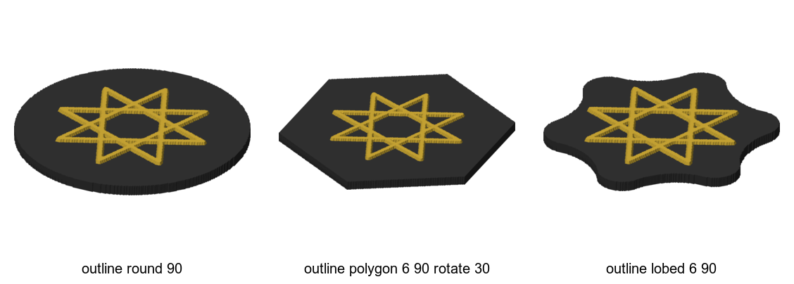
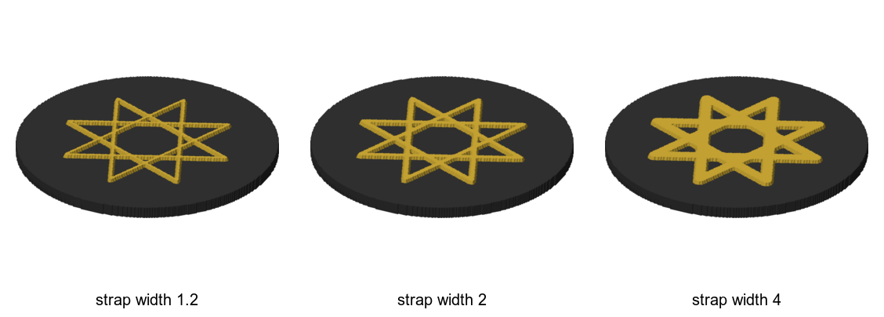
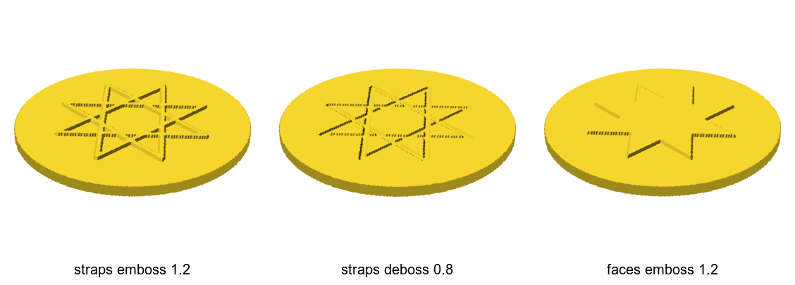
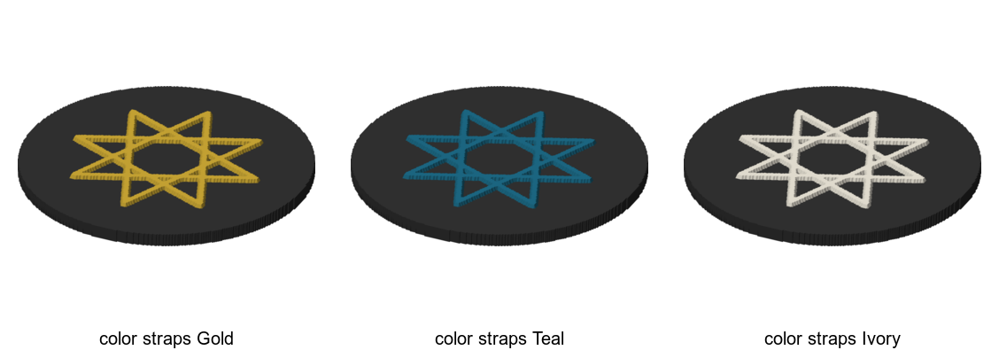
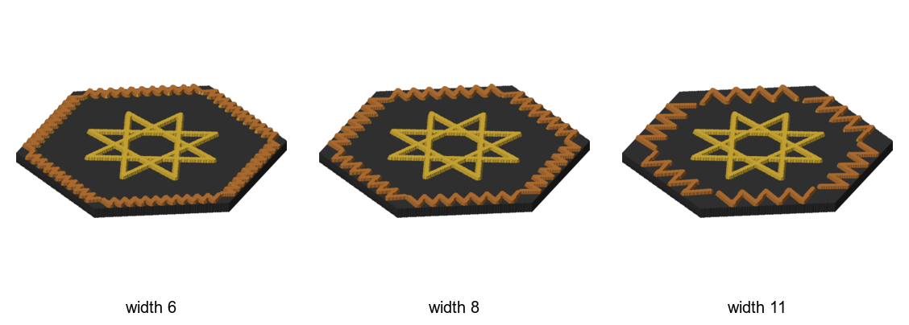
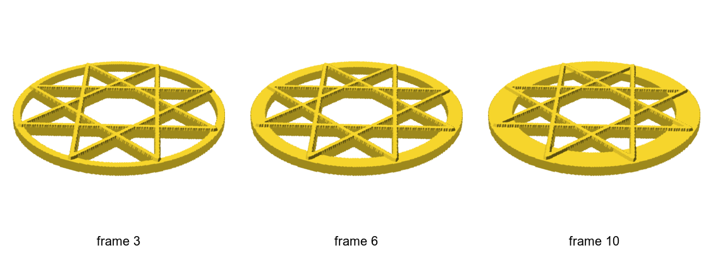
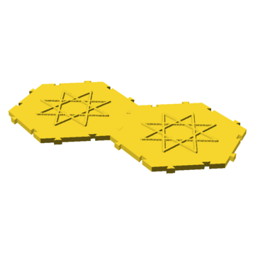
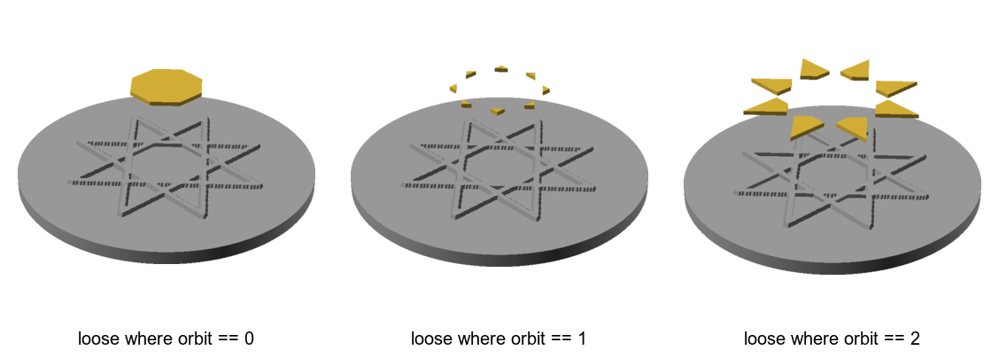
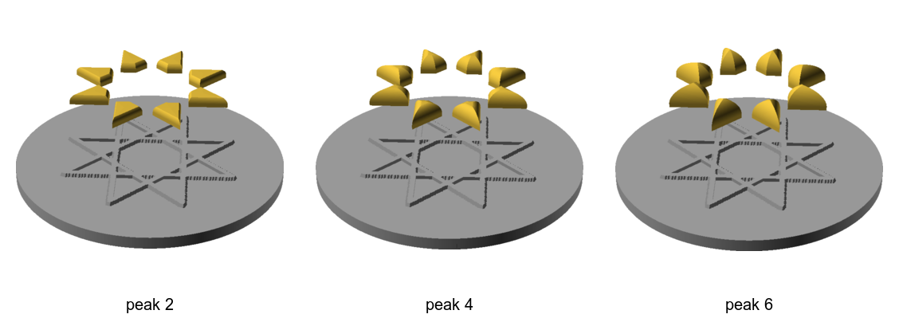

# Coaster knobs

A `coaster` turns a pattern into a printable disc: a solid slab in the shape of the
outline, with the pattern's lines standing up from it as straps. Every recipe here uses the
same eight-point star, so the only thing that changes between pictures is the knob.
Back to the [cookbook index](README.md). Language reference:
[Coaster declarations](https://github.com/NaqshCoffee/bikar/blob/main/docs/language-reference.md#coaster-declarations-3d).
For why the coaster is built this way, see the [coaster design](../design/coaster/coaster-design.md); the
named styles in the set are listed in [coaster styles](../../.claude/skills/import-construction/coaster-styles.md).

The pictures come from bikar's own color preview (`render --format preview`). Coasters
bikar can't split into color parts are carved, open or jointed. Those are drawn the way
`make coasters` draws them for the gallery: the printable mesh, in OpenSCAD's gold.

## The outline
<!--covers:coaster--><!--covers:outline--><!--covers:inscribe--><!--covers:base-->

Four lines make a coaster:
- `outline` is the shape and size in mm;
- `inscribe` names the pattern that goes on top;
- `base` is the slab's thickness;
- `relief straps emboss` raises the pattern's lines by that many mm.

The pattern is used at the size it is drawn, in mm, so a star of radius 30 sits well
inside a 90 mm coaster.

<!-- recipe: coaster-outline; swap: outline round 90 | outline polygon 6 90 rotate 30 | outline lobed 6 90 -->
```bkr
pattern star
  circle c center(0, 0) radius 30
  divide c into 8
  connect every 3
  palette pal
    Slab = #333333
    Gold = #d4af37

coaster Coaster
  outline round 90
  inscribe star
  base 4
  relief straps emboss 1.2
  strap width 2
  color base Slab
  color straps Gold
```


**Watch out:** the pattern must fit inside the outline, with every strap end at least
half a strap width in. A lobed outline dips at its waists, so art that fits a round
coaster of the same size can poke out of a lobed one. bikar refuses it (check CV7) rather
than cropping it.

Related: [strap width](#strap-width), [color regions](#color-regions), [join coasters](#join-coasters-edge-to-edge).

## Strap width
<!--covers:strap-->

`strap width` is how wide each raised line prints, in mm. Thin straps look fine drawn
and lacy printed. Wide ones are bold, and they crowd the small shapes near the star's
middle.

<!-- recipe: coaster-strap; swap: strap width 1.2 | strap width 2 | strap width 4 -->
```bkr
pattern star
  circle c center(0, 0) radius 30
  divide c into 8
  connect every 3
  palette pal
    Slab = #333333
    Gold = #d4af37

coaster Coaster
  outline round 90
  inscribe star
  base 4
  relief straps emboss 1.2
  strap width 2
  color base Slab
  color straps Gold
```


**Watch out:** there is a floor. A raised strap must be at least 0.8 mm wide, and a strap
standing with no slab under it (openwork, minimal) at least 1.6 mm. bikar refuses
anything thinner (check CV2), because the printer can't lay it down reliably.

Related: [the outline](#the-outline), [band width in a flat weave](weave.md#band-width).

## Raised or carved
<!--covers:relief-->

`relief` says what stands out and which way. `straps emboss` raises the lines, and
`straps deboss` carves them into the slab. `faces emboss` raises the shapes *between* the
lines, which needs `voids detect` in the pattern so there are faces to raise.

<!-- recipe: coaster-relief; swap: straps emboss 1.2 | straps deboss 0.8 | faces emboss 1.2 -->
```bkr
pattern star
  circle c center(0, 0) radius 30
  divide c into 8
  connect every 3
  voids detect

coaster Coaster
  outline round 90
  inscribe star
  base 4
  relief straps emboss 1.2
  strap width 2
```


**Watch out:** a carve can't go deeper than the slab allows. At least 0.6 mm of floor must
stay under a deboss (check CV1), so `base 4` with `deboss 0.8` is comfortable, while
`base 1.4` with `deboss 1` is refused.

Related: [the outline](#the-outline), [openwork](#openwork-cut-through-between-the-straps).

## Color regions
<!--covers:color-->

A coaster has up to three regions: `base` (the slab), `straps` (the raised pattern) and
`border` (a [border band](#a-border-band)). `color <region> <name>` gives each one a color
from the pattern's `palette`. It is a label for the print: each region becomes its own
body for a multi-color print, and the hex only tints the preview.

<!-- recipe: coaster-color; swap: color straps Gold | color straps Teal | color straps Ivory -->
```bkr
pattern star
  circle c center(0, 0) radius 30
  divide c into 8
  connect every 3
  palette pal
    Slab = #333333
    Gold = #d4af37
    Teal = #1e6f8c
    Ivory = #f4efe1

coaster Coaster
  outline round 90
  inscribe star
  base 4
  relief straps emboss 1.2
  strap width 2
  color base Slab
  color straps Gold
```


**Watch out:** the name must be in the *inscribed* pattern's palette. That is the only
palette a coaster can see. And a carved, open or jointed coaster stays one color: bikar
doesn't split those.

Related: [color faces in a flat pattern](stars-and-fills.md#color-the-faces-by-how-many-sides-they-have), [border band](#a-border-band).

## A border band
<!--covers:border-->

`border <pattern> width <mm>` lays a second, small pattern along the edge, repeated as
many times as fit, and moves the main art inward to make room. The motif here is one
chevron. The band width is in mm and does not grow with the coaster. The motif is
scaled to the band, so a wider band fits fewer, bigger chevrons, and at 11 mm they no
longer meet at the corners.

<!-- recipe: coaster-border; swap: width 6 | width 8 | width 11 -->
```bkr
pattern star
  circle c center(0, 0) radius 26
  divide c into 8
  connect every 3
  palette pal
    Slab = #333333
    Gold = #d4af37
    Copper = #b87333

blueprint chevron_cell
  circle bl center(-3, 0) radius 1
  circle br center(3, 0) radius 1
  circle ap center(0, 6) radius 1

pattern chevron on chevron_cell
  connect bl.mpt -> ap.mpt
  connect ap.mpt -> br.mpt

coaster Coaster
  outline polygon 6 90 rotate 30
  inscribe star
  border chevron width 8
  base 4
  relief straps emboss 1.2
  strap width 2
  color base Slab
  color straps Gold
  color border Copper
```


**Watch out:** the main art must now fit inside the band, not the outline. A border can't
share the edge with a `rim`, and it can't go on a lobed or minimal coaster.

Related: [color regions](#color-regions), [the outline](#the-outline),
[border design](../design/coaster/coaster-border-design.md).

## Openwork: cut through between the straps
<!--covers:openwork-->

`openwork frame <mm>` cuts the slab away everywhere except the straps and a solid frame
round the edge. What is left is a lattice you can see through. The star here reaches out to
the frame, so the whole thing prints as one piece.

<!-- recipe: coaster-openwork; swap: frame 3 | frame 6 | frame 10 -->
```bkr
pattern star
  circle c center(0, 0) radius 43
  divide c into 8
  connect every 3

coaster Coaster
  outline round 90
  inscribe star
  base 4
  relief straps emboss 1.2
  strap width 2
  openwork frame 3
```


**Watch out:** the straps must touch the frame, or they print as a loose star inside a
ring. bikar refuses a coaster that comes out as two separate pieces (check CV6b). And
both the frame and the straps now stand with nothing under them, so both are held to the
1.6 mm floor.

Related: [strap width](#strap-width), [join coasters](#join-coasters-edge-to-edge).

## Join coasters edge to edge
<!--covers:interlock-->

`interlock dovetail <neck> <depth>` cuts a tab and a matching slot on every straight
edge, so any edge of one coaster fits any edge of another. The picture shows two copies
pushed together, with the tab at 2, 3 and 5 mm: a bigger tab and its slot take more of the
margin. `clearance` is the gap left around the tab, and it decides whether the fit is
snug or free.

<!-- recipe: coaster-interlock; mate: 90; swap: dovetail 2 2 | dovetail 3 3 | dovetail 5 5 -->
```bkr
pattern star
  circle c center(0, 0) radius 30
  divide c into 8
  connect every 3

coaster Coaster
  outline polygon 6 90 rotate 30
  inscribe star
  base 4
  relief straps emboss 1.2
  strap width 2
  interlock dovetail 3 3 clearance 0.15
```


**Watch out:** a dovetail needs a straight edge, so a round or lobed outline is refused.
The slot also cuts into the margin, so the art has to clear the slot as well as the edge
(check CV8). Why a dovetail, and how tight to make it, is in the
[interlock design](../design/coaster/coaster-interlock-design.md). The other joins (key, tab, pegs) are in
[joins without a wide border](../design/coaster/coaster-borderless-joins-design.md).

Related: [the outline](#the-outline), [openwork](#openwork-cut-through-between-the-straps).

## Loose pieces in pockets
<!--covers:loose-->

`loose where <condition>` takes the colored faces the condition picks out of the coaster and
makes them separate pieces, which drop into pockets in a solid frame. It uses the same picker
as `fill`, and each face it picks must already be filled with a palette color: that color is
the piece's filament. The frame prints as `--piece Frame`, and each color's pieces print as
`--piece <color>`. The pockets are the cells the straps wall in, so the frame looks just like
the plain coaster. The picture lifts the pieces 30 mm above it, for the centre octagon, the
eight triangles and the eight four-sided faces. `clearance` is the gap between a piece and
its pocket wall. All of it comes off the piece, so the pocket keeps the drawn shape.

<!-- recipe: coaster-loose; swap: loose where orbit == 0 | loose where orbit == 1 | loose where orbit == 2 -->
```bkr
pattern star
  circle c center(0, 0) radius 30
  divide c into 8
  connect every 3
  palette pal
    Slab = #9a9a9a
    Gold = #d4af37
    fill void where orbit == 0 color Gold
    fill void where orbit == 1 color Gold
    fill void where orbit == 2 color Gold

coaster Coaster
  outline round 90
  inscribe star
  base 4
  relief straps emboss 1.2
  strap width 2
  color base Slab
  loose where orbit == 1 clearance 0.15
```


**Watch out:** a piece is only as thick as the straps stand (`emboss 1.2` gives 1.2 mm
pieces), because its pocket is the cell between them. A piece taller than its pocket needs
an option bikar does not have yet. A loose face with no fill color is refused, because a
piece needs a filament. A face within two grid cells of the coaster's edge stays part of the frame. Only the solid
frame is built so far: openwork, joins, a border, a twist and the color preview are all
refused alongside `loose`. The 0.15 mm gap is a starting guess until the
[gBV fit sheet](../plates/sheets-04.md) prints.

Related: [color regions](#color-regions), [stars and colored faces](stars-and-fills.md),
[the loose-pieces design](../design/coaster/loose-pieces-design.md),
[peaked pieces](#peaked-pieces-a-soft-point-on-top).

## Peaked pieces: a soft point on top

`peak <mm>` at the end of a `loose` line keeps each piece's outline and wall just as they
were, then lifts its top that many millimetres to a point over the piece's middle. The top
leaves the wall going straight up and curves in to the point, like a pointed dome, so the
pieces look soft and rounded rather than cut flat. The picture lifts the eight four-sided
pieces above their pockets with the top rising 2, 4 and 6 mm: the higher the peak, the
taller and more pointed each dome. Leave `peak` off, or write `peak 0`, for a flat top.

<!-- recipe: coaster-loose-peak; swap: peak 2 | peak 4 | peak 6 -->
```bkr
pattern star
  circle c center(0, 0) radius 30
  divide c into 8
  connect every 3
  palette pal
    Slab = #9a9a9a
    Gold = #d4af37
    fill void where orbit == 0 color Gold
    fill void where orbit == 1 color Gold
    fill void where orbit == 2 color Gold

coaster Coaster
  outline round 90
  inscribe star
  base 4
  relief straps emboss 1.2
  strap width 2
  color base Slab
  loose where orbit == 2 clearance 0.15 peak 4
```


**Watch out:** the same peak looks different on different sizes of piece. It is a tall
point on a narrow piece and only a low dome on a wide one: 6 mm on this star's wide
centre octagon barely rises. A cup no longer sits flat on peaked pieces, so a peaked
coaster is mostly for looking at. A piece whose middle cannot
see all of its own edge (a U or a crescent) would fold its top over itself, so bikar refuses
a peak on it by name; the same piece is fine flat. Nothing has printed with a peak yet.

Related: [loose pieces in pockets](#loose-pieces-in-pockets), [the smooth-lines design](../design/coaster/smooth-lines-design.md).
