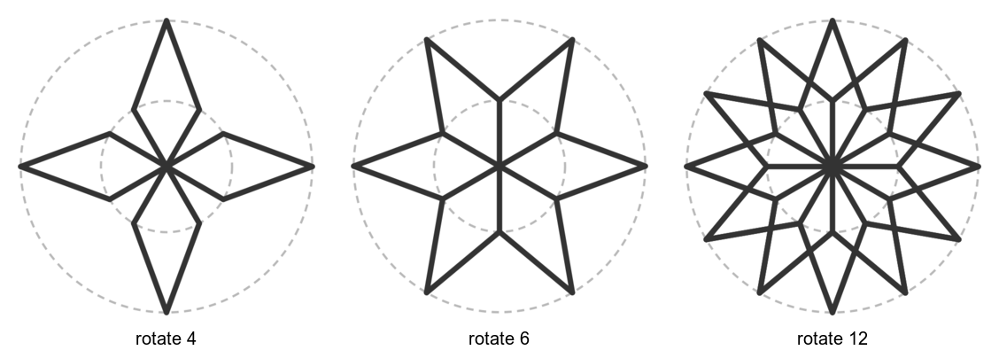
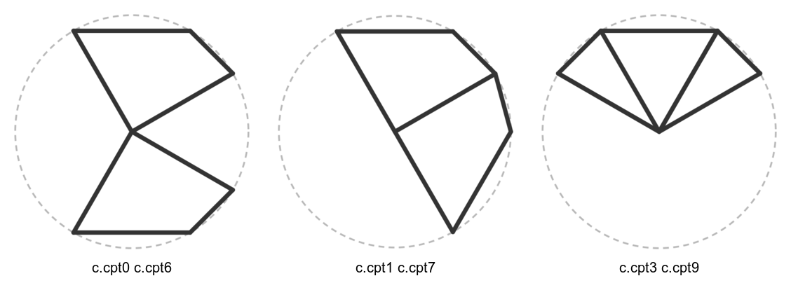

# Copies: rotate and mirror

Draw one piece of a pattern, then let the language repeat it. There are two
different things called "rotate", and mixing them up is the most common slip:
- `rotate N around P`, on a line of its own with an indented block under it, **repeats**
  everything in the block N times.
- `point X = rotate A by 60 around P` **makes one new point**.

Back to the [cookbook index](README.md). Language reference:
[Geometry transforms](https://github.com/NaqshCoffee/bikar/blob/main/docs/language-reference.md#geometry-transforms).

## Rotated copies around a point
<!--covers:rotate-->

One kite is drawn from four points of a twelve-step circle. `rotate N around c.mpt`
repeats it evenly around the middle. The kite doesn't change, only the number of copies,
so the copies spread apart or pack together until they overlap.

<!-- recipe: rotate-copies; swap: rotate 4 | rotate 6 | rotate 12 -->
```bkr
blueprint spokes
  circle c center(0, 0) radius 40
  divide c into 12
  circle m center(0, 0) radius 18
  divide m into 12
  polygon kite [ c.mpt m.cpt11 c.cpt0 m.cpt1 ]

pattern turned on spokes
  rotate 6 around c.mpt
    edges from kite
```


**Watch out:** the count repeats the block. It doesn't split the circle for you. If you want
the copies to meet edge to edge, the kite's own angle has to fit: this kite spans 60°, so
6 copies tile the circle, 4 leave gaps and 12 overlap.

Related: [mirror a piece](#mirror-a-piece-across-a-line), [the petal ring](lines.md#a-petal-from-bisectors-and-a-reflection).

## Mirror a piece across a line
<!--covers:mirror-->

`mirror around P Q` draws the block once as written and once reflected across the line
from P to Q. Draw half a motif and mirror it, and it comes out symmetric by construction.

<!-- recipe: mirror-half; swap: c.cpt0 c.cpt6 | c.cpt1 c.cpt7 | c.cpt3 c.cpt9 -->
```bkr
blueprint half
  circle c center(0, 0) radius 40
  divide c into 12
  polygon wing [ c.mpt c.cpt1 c.cpt2 c.cpt4 ]

pattern wings on half
  mirror around c.cpt0 c.cpt6
    edges from wing
```


**Watch out:** the mirror line runs through the two points you name, so it must pass
through the part you want symmetric. A line that misses the shape gives a copy floating
off to one side.

Related: [rotated copies](#rotated-copies-around-a-point), [reflect a single point](lines.md#a-petal-from-bisectors-and-a-reflection).
