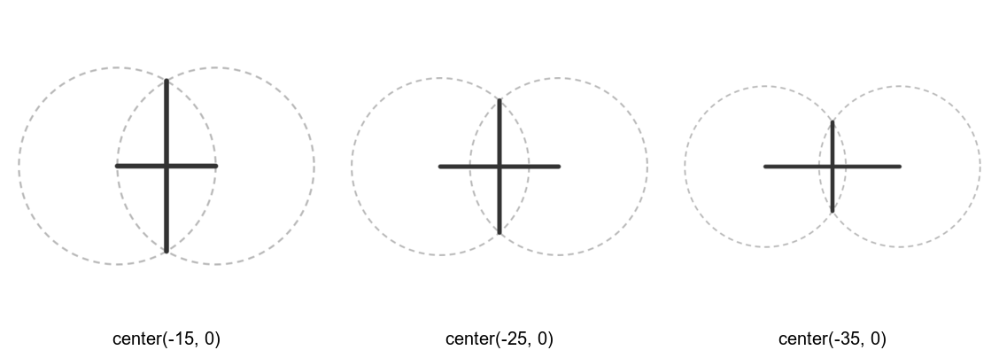
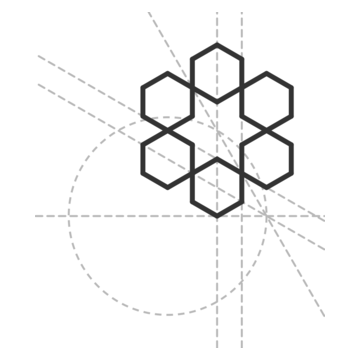

# Lines, bisectors and crossing points

Once the scaffold has points, you find new points where lines cross. This is how a
GeoGebra construction reads step by step, and how the imported catalog patterns are
written. Back to the [cookbook index](README.md).

Language reference: [Derived objects](https://github.com/NaqshCoffee/bikar/blob/main/docs/language-reference.md#derived-objects),
[Derived lines, circles and regular polygons](https://github.com/NaqshCoffee/bikar/blob/main/docs/language-reference.md#derived-lines-circles-and-regular-polygons).
To turn a GeoGebra construction into naqsh, use bikar's
[GeoGebra to naqsh cookbook](https://github.com/NaqshCoffee/bikar/blob/main/docs/cookbook/geogebra-to-naqsh.md);
this page doesn't repeat it.

## Where two circles cross
<!--covers:intersect-->

`intersect X a b` names the points where `a` and `b` cross, as `X.cpt0` and `X.cpt1`.
Here two circles cross, and the line through their two crossing points is drawn with
`connect ... -> ...`. Moving the circles apart moves the crossing points closer together.

<!-- recipe: circles-cross; swap: center(-15, 0) | center(-25, 0) | center(-35, 0) -->
```bkr
pattern vesica
  circle a center(-15, 0) radius 30
  circle b center(15, 0) radius 30
  intersect X a b
  connect X.cpt0 -> X.cpt1
  connect a.mpt -> b.mpt
```


**Watch out:** when two circles don't touch, there is nothing to name and the render fails.
Keep the centers closer than the two radii added together.

Related: [bisector and petal](#a-petal-from-bisectors-and-a-reflection), [name points](scaffold.md#name-points-and-build-a-polygon-from-them).

## A petal from bisectors and a reflection
<!--covers:bisector--><!--covers:line--><!--covers:reflect-->

This is the petal of the six-fold rosette the coasters are built on, cut down from
`src/Coasters/GimTvN9hw4U-coaster.bkr`.
- `bisector l from A to B` is the line halfway between two points, square to the line
  joining them.
- `point G = intersect l m` is where two lines cross.
- `line n through I parallel l` copies a direction.
- `reflect ... across` mirrors a point or a line.

The petal's six corners come out of those crossings, and `rotate 6 around G` turns it
into a ring.

<!-- recipe: bisector-petal -->
```bkr
blueprint petal
  circle unit center(0, 0) radius 30
  divide unit into 4
  point A = unit.mpt
  point B = unit.cpt0
  point C = rotate A by -120 around B
  point D = rotate B by -120 around C
  point E = rotate C by -120 around D
  point F = rotate D by -120 around E
  bisector l from A to B
  bisector m from A to C
  point G = intersect l m
  line f from A to B
  point H = intersect l f
  point I = midpoint A C
  line n through I parallel l
  line p from B to F
  point J = intersect n p
  line np = reflect n across m
  point K = intersect l np
  point Ip = reflect I across l
  point Jp = reflect J across l
  polygon pet [ H J I K Ip Jp ]

pattern rosette_ on petal
  rotate 6 around G
    edges from pet
```


**Watch out:** some words are reserved by the language, so a shape can't be named
`rosette` or `hex`. The GeoGebra importer adds an underscore (`rosette_`), and so should
you.

Related: [rotated copies](copies.md#rotated-copies-around-a-point), [name points](scaffold.md#name-points-and-build-a-polygon-from-them).
