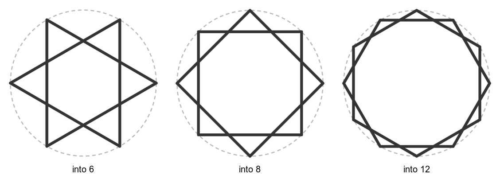
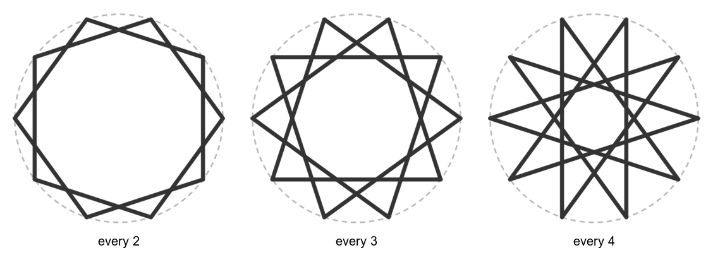
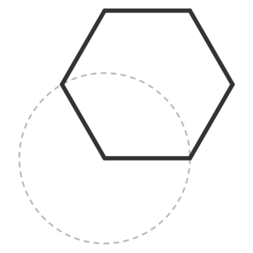

# Circles, divisions and points

Almost every pattern in the catalog starts with the same three moves: draw a circle, divide
it into equal steps, then join the division points. These recipes cover that scaffold. Back
to the [cookbook index](README.md).

Language reference: [Blueprint statements](https://github.com/NaqshCoffee/bikar/blob/main/docs/language-reference.md#blueprint-statements),
[Connections](https://github.com/NaqshCoffee/bikar/blob/main/docs/language-reference.md#connections),
[Point addressing](https://github.com/NaqshCoffee/bikar/blob/main/docs/language-reference.md#point-addressing).

## Divide a circle, join every second point
<!--covers:circle--><!--covers:divide--><!--covers:pattern-->

`circle` draws a circle. `divide` marks equal steps around it, starting at 3 o'clock.
`connect every 2` joins each point to the one two steps along. That gives a star made of
two overlapping polygons, and the number of steps decides which.

<!-- recipe: divide-count; swap: into 6 | into 8 | into 12 -->
```bkr
pattern star
  circle c center(0, 0) radius 40
  divide c into 6
  connect every 2
```


The faint gray circle is the construction. bikar hides it in a normal render; the cookbook
shows it so you can see where the points came from.

**Watch out:** `divide` counts steps, not points you draw. `into 6` with `every 2` gives two
triangles. It is not a six-pointed star drawn in one stroke: an even count split in half
always gives two separate polygons.

Related: [how far to step](#how-far-to-step-when-joining), [rotated copies](copies.md#rotated-copies-around-a-point).

## How far to step when joining
<!--covers:connect-->

With ten points, the step size decides the whole character. Step 2 gives two pentagons, 3
gives a sharp ten-pointed star, and 4 gives two five-pointed stars.

<!-- recipe: connect-step; swap: every 2 | every 3 | every 4 -->
```bkr
pattern star
  circle c center(0, 0) radius 40
  divide c into 10
  connect every 3
```


**Watch out:** when the step shares a factor with the count (10 and 2, 10 and 4), the star
breaks into separate closed shapes. That is fine for drawing, but a coaster strap network
made that way is still one piece only because the shapes cross each other.

Related: [divide a circle](#divide-a-circle-join-every-second-point), [Hankin stars](stars-and-fills.md#hankin-stars-one-angle-sets-the-star).

## Name points and build a polygon from them
<!--covers:blueprint--><!--covers:point--><!--covers:polygon--><!--covers:edges-->

A `blueprint` holds construction you want to name and reuse. `unit.mpt` is a circle's
middle and `unit.cpt0` its first division point. `point X = rotate A by -120 around B`
makes a new point by turning A around B. Walking that rule round four times finds a
hexagon's corners, and `polygon` names the shape. The pattern then draws it with
`edges from`.

<!-- recipe: point-and-polygon -->
```bkr
blueprint corners
  circle unit center(0, 0) radius 30
  divide unit into 4
  point A = unit.mpt
  point B = unit.cpt0
  point C = rotate A by -120 around B
  point D = rotate B by -120 around C
  point E = rotate C by -120 around D
  point F = rotate D by -120 around E
  polygon poly1 [ A B C D E F ]

pattern hexagon on corners
  edges from poly1
```


This is the opening of the six-fold rosette the coaster set is built on
(`src/Coasters/GimTvN9hw4U-coaster.bkr`), where A is the circle's center.

**Watch out:** a blueprint draws nothing by itself. Everything in it is construction until
a `pattern ... on <blueprint>` draws something with `edges from` or `connect`.

Related: [lines and crossing points](lines.md), [rotated copies](copies.md#rotated-copies-around-a-point).
