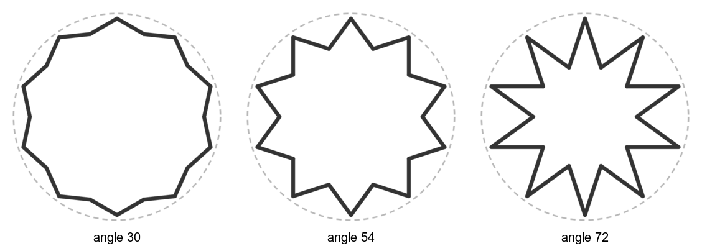
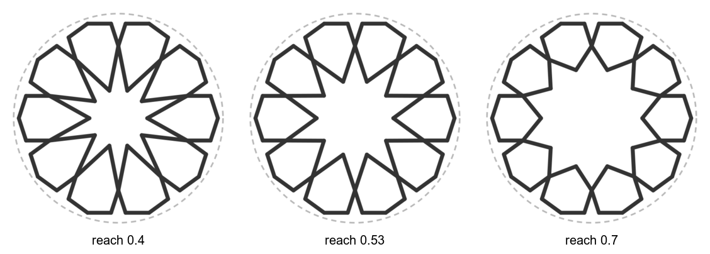
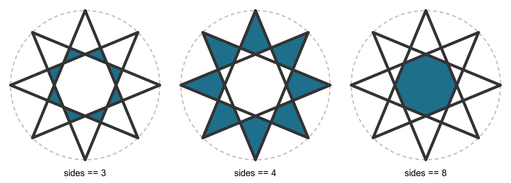
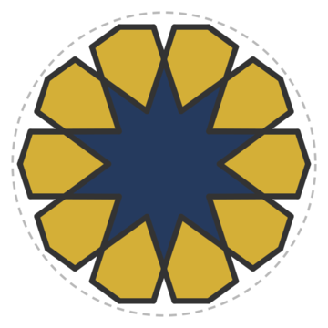

# Stars and colored faces

Two statements build a whole star from a single circle: `hankin` and `rosette`. After
that, `voids detect` finds the closed shapes between the lines, so you can color them.
Back to the [cookbook index](README.md). Language reference:
[Hankin](https://github.com/NaqshCoffee/bikar/blob/main/docs/language-reference.md#hankin-line-construction),
[Rosette](https://github.com/NaqshCoffee/bikar/blob/main/docs/language-reference.md#rosette),
[Fill and palette](https://github.com/NaqshCoffee/bikar/blob/main/docs/language-reference.md#fill--palette).

## Hankin stars: one angle sets the star
<!--covers:hankin-->

`hankin angle θ` sends two rays in from the middle of each side of the polygon the
division points make, at angle θ to that side. Where neighboring rays meet, you get
the star's inner corners. On a single polygon, a small angle barely dents the outline and
a large one cuts deep, sharp points.

<!-- recipe: hankin-angle; swap: angle 30 | angle 54 | angle 72 -->
```bkr
pattern kaplan
  circle c center(0, 0) radius 40
  divide c into 10
  hankin angle 54
```


**Watch out:** `hankin` works on the most recent `divide`. Without one it has no polygon to
work from. Use `on <circle>` to pick a different circle.

Related: [rosette](#rosette-a-star-ringed-by-petals), [how far to step](scaffold.md#how-far-to-step-when-joining).

## Rosette: a star ringed by petals
<!--covers:rosette-->

`rosette N` draws the figure at the center of most Islamic star patterns: an N-pointed
star with N six-sided petals around it. The circle sets the size and doesn't need
dividing. `reach` is how far the petals reach in toward the middle, and it is the
designer's free choice. A low reach gives a sharp star, and a high reach a rounder,
almost circular middle.

<!-- recipe: rosette-reach; swap: reach 0.4 | reach 0.53 | reach 0.7 -->
```bkr
pattern bloom
  circle c center(0, 0) radius 40
  rosette 10 reach 0.53 on c
```


**Watch out:** `reach` has a ceiling, `cos(180/N)`, where a petal's inner point crosses its
own sides. For 10 points that is about 0.95, and for 5 points it is 0.81.

Related: [Hankin stars](#hankin-stars-one-angle-sets-the-star), [color the faces](#color-the-faces-by-how-many-sides-they-have).

## Color the faces by how many sides they have
<!--covers:voids--><!--covers:fill--><!--covers:palette-->

`voids detect` finds every closed shape the lines make. A `palette` names your colors,
and `fill void where sides == N color <name>` paints each shape with that many sides.
Change the condition and a different set of faces lights up.

<!-- recipe: fill-by-sides; swap: sides == 3 | sides == 4 | sides == 8 -->
```bkr
pattern octagram
  circle c center(0, 0) radius 40
  divide c into 8
  connect every 3
  voids detect
  palette sea
    azure = #1E6F8C
  fill void where sides == 3 color azure
```


**Watch out:** a side cut in two by a crossing still counts as one side. The count is of
corners you can see, not of line pieces. And `voids detect` must come before any `fill`.

Related: [name a set of faces](#name-a-set-of-faces-with-classify), [color a coaster](coaster-knobs.md#color-regions).

## Name a set of faces with classify
<!--covers:classify--><!--covers:style-->

`classify .name where ...` gives a name (a class) to every face that matches, so a `style`
can color the class. A rosette's star is the one face with 2N sides, so
`sides >= 7` picks it out from the six-sided petals.

<!-- recipe: classify-star -->
```bkr
style theme
  palette dial
    gold = #D4AF37
    indigo = #253A5E
  .petal
    fill gold
  .star
    fill indigo

pattern bloom
  circle c center(0, 0) radius 40
  rosette 10 reach 0.53 on c
  voids detect
  classify .star where sides >= 7
  style theme
```


`.petal` needs no classify line, because `rosette` tags its own petals.

**Watch out:** a classify rule that matches no face used to fail silently. bikar now
reports it, so read the render's messages if a color doesn't show.

Related: [color by sides](#color-the-faces-by-how-many-sides-they-have), [rosette](#rosette-a-star-ringed-by-petals).
