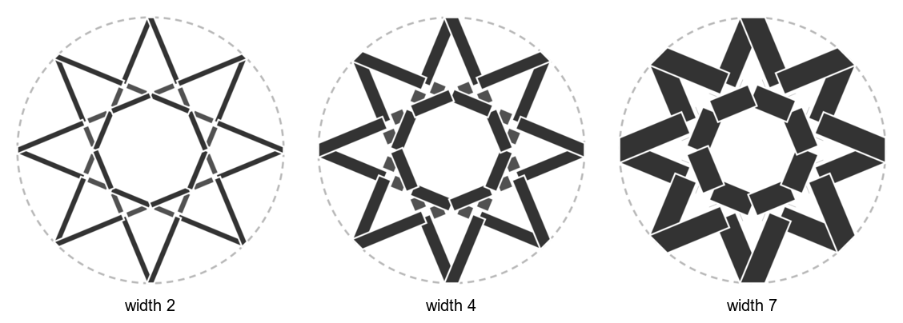

# Weave: lines as interlaced bands

`strapwork` redraws every line as a band that passes over at one crossing and under at
the next: the woven look of Islamic geometric panels. The line centers stay the same. Only
the way they're drawn changes, so faces, fills and coasters are unaffected. Back to the
[cookbook index](README.md). Language reference:
[Strapwork](https://github.com/NaqshCoffee/bikar/blob/main/docs/language-reference.md#strapwork).

## Band width
<!--covers:strapwork-->

`width` is the band's width, in the same units as the drawing. Narrow bands read as
lines, and wide ones as a woven lattice with small gaps.

<!-- recipe: strapwork-width; swap: width 2 | width 4 | width 7 -->
```bkr
pattern woven
  circle c center(0, 0) radius 40
  divide c into 8
  connect every 3
  strapwork
    width 4
    crossing alternating
```


**Watch out:** a band wider than the gap between two nearby crossings swallows the
gap, and the over-under stops reading. Keep the width well under the shortest line piece.

This is the flat weave. An **orb** weaves in 3D with its own `weave` clause (the only way
the orb kernel resolves two bands crossing). That lives in the orb gallery pipeline, not
here; see the
[orb declarations](https://github.com/NaqshCoffee/bikar/blob/main/docs/language-reference.md#orb-declarations-3d).

Related: [how far to step](scaffold.md#how-far-to-step-when-joining), [coaster strap width](coaster-knobs.md#strap-width).
