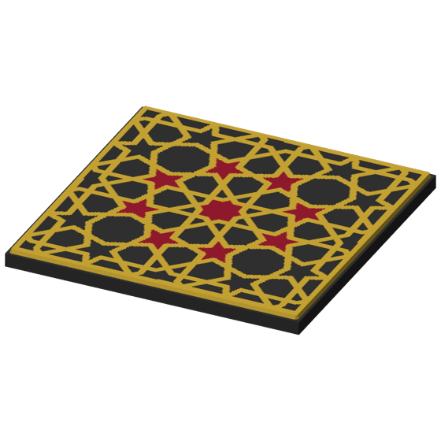
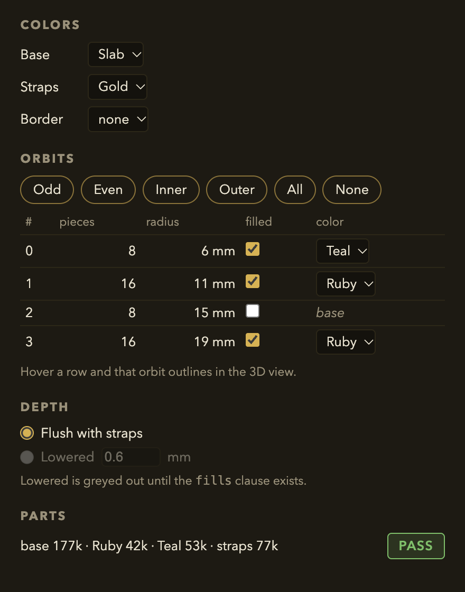

# Colored coaster previews and Coaster Lab color controls — design (researcher B) ^e7b42d

**Status:** proposal from researcher B of two; a checker consolidates both. Raw findings,
experiments and sources: [`docs/research/color-preview-2026-09-28-b.md`](../../research/color-preview-2026-09-28-b.md).
Builds on [`docs/design/coaster/multicolor-design.md`](multicolor-design.md) (orbits, flush vs lowered, the
printer route) and does not repeat it.

**The question (Omar):** can we alternate or customise colors on the PNGs we generate, and if
not, do we need another CAD tool? Scope addition: make orbits, colors, flush vs lowered and a
live colored preview easy to set in Coaster Lab, with the Lab preview and the printed parts
coming from one code path.

**Pictures:** this proposal was written before any colored picture existed. What got built from it,
with the pictures it now makes, is in the consolidated design:
[What it looks like now](color-preview-design.md#what-it-looks-like-now).

## 1. Short answer

1. **Colors per orbit already work** on slab coasters (`outline square` / `polygon` with
   `relief`): I colored the CS-1 coaster's orbits alternately ruby and teal, and the printer
   parts, an OpenSCAD picture and the Coaster Lab view all showed the same thing (research §2).
2. **Our PNGs are one color only because of how they are made.** The gallery script imports the
   single whole-coaster STL into OpenSCAD with a fixed color scheme; the catalog thumbnails
   capture preset coasters that have no colors set, so they come out Lab bronze.
3. **No new CAD software is needed.** The installed OpenSCAD 2021.01 draws one `color()` per part
   STL in about half a second, and the Lab already paints the split parts in color.
4. **The one real gap is in bikar's kernel, not in any renderer:** openwork coasters
   (`outline pattern`, including the radial GimTvN9hw4U variants) are refused by the color
   split, so they cannot be colored by any tool until the split handles them.
5. **Flush fills build today; lowered fills do not** (a grammar and kernel change already
   proposed in [multicolor-design §3](multicolor-design.md#3-the-look-flush-or-lowered-fills)).

## 2. What exists today

| Picture | Made by | Colored? | Same code as the printed parts? |
|---|---|---|---|
| Gallery / coaster PNGs | `build/brick_previews.py` → OpenSCAD `import()` of the one `--format stl` mesh, Cornfield scheme | No, one gold | No: the whole mesh, not the parts |
| Catalog / Lab thumbnails | bikar `scripts/render-coaster-thumbnails.ts`, Playwright capture of the Lab canvas | Only if the preset sets colors (none do) | **Yes**: the Lab tints the `buildCoasterParts` bodies |
| Coaster Lab live view | bikar `packages/lab`, `coasterTintMesh` over `buildCoasterParts` | Yes, base/straps/border knobs plus whatever the source colors | **Yes** (with pinch fixed to `fillet`, the CLI default) |
| `bambu slice coaster` `<plate>.preview.png` | `renderCoasterTopSVG` flat top view | Yes | **No**: drawn from the spec; its check only asks that each hex appears somewhere |
| Bambu Studio plate thumbnails | Studio GUI slice | Yes, in filament colors | Yes (it reads the 3MF) but GUI only: headless export hangs and overrides colors ([issue](../../issues/coaster-3mf-filament-shape-and-export-hang.md)) |

## 3. Options for colored static PNGs

| # | Option | Pros | Cons | Implications |
|---|---|---|---|---|
| **A** | **OpenSCAD `color(hex) import(part.stl)` per manifest part** (a parts mode in `brick_previews.py`) | Installed; ~0.5 s per coaster; draws the exact STLs the printer gets; same camera and background as today's gallery | Needs `--format parts` to run in `make coasters` (extra build time, not measured for all coasters); only works where the split works; a cream palette color would be keyed out as background by `process_images.py` (tolerance 14 around `#FFFFE5`) | Small change in this repo; the gallery becomes a check of the split, not only a picture. Openwork coasters stay one color until the kernel change (§5) |
| **B** | **Lab capture** (the existing Playwright thumbnail script, extended to take custom source) | Pixel-identical to what Omar sees in the Lab; already the thumbnail path | Needs Vite plus a headless browser; 184 px; dark Lab background, not the gallery's | Right for catalog thumbnails and for "what the Lab shows"; a second picture style next to the gallery's |
| C | Flat top-view SVG (`renderCoasterTopSVG`) | Exists; fast; no 3D | Drawn from the spec, not the split: a shrunk or missing body still looks right | Keep as a quick plate sheet, never as the proof of colors |
| D | Bambu Studio thumbnails | The slicer's own picture | Headless path blocked (hang, color override, crash); GUI only | Cannot be automated today |
| E | three.js / F3D / other 3MF viewers | General tools | Bambu keeps color in its own config files (`filament_colour`, `extruder`), not in core 3MF materials (printago, fetched), so they would not show our colors without extra work; F3D not installed | A new dependency that reads the same STLs A already reads |
| F | Blender headless | Best-looking renders | Not installed; heavy; still reads the same part STLs | Only worth it for marketing renders, not for checking |
| G | Another CAD system | — | Nothing it would add: the geometry and the split live in bikar | Rejected: none of the options above lacks a CAD feature |

## 4. Recommendation

**One code path: the split (`buildCoasterParts`).** Every colored picture is drawn from the
bodies it makes, never from the spec.

1. **Gallery PNGs → Option A.** When a coaster has colors, `make coasters` also runs
   `--format parts`, and `brick_previews.py --coasters` writes one `color(hex) import(stl)` per
   manifest part instead of one `import()`. Coasters without colors keep today's picture.
2. **Catalog / Lab thumbnails → Option B**, as today; once presets carry orbit colors, the
   thumbnails pick them up with no change.
3. **Kernel:** lift the openwork refusal for filled faces — a straps body plus one body per fill
   color, cut by the same column rule and strap-wins rule the slab split uses
   ([multicolor-design §3.1](multicolor-design.md#31-strap-wins-both-researchers-built-in-261)).
   This unlocks the radial variants in the Lab, the gallery and the printer at once. Printability
   of small color islands on an openwork coaster is not measured.
4. **Lab controls → §6.**

**Default:** the gallery camera stays `0,0,0,60,0,25,0` with `--viewall --autocenter`, as in
[brick_previews.py at 5938f31](https://github.com/omars-lab/3d-models/blob/5938f3145eb697abf3fc25cff50c9b82b6627951/build/brick_previews.py), so a colored picture sits beside the
existing ones unchanged in framing.

**Transfer conditions (K10).** OpenSCAD draws `color()` only in its preview render, not in a full
(CGAL) render ([OpenSCAD manual](https://en.wikibooks.org/wiki/OpenSCAD_User_Manual/Transformations),
fetched). Option A works because `brick_previews.py` exports the PNG without `--render`, which is
preview mode — seen working on 2021.01. If the script ever adds `--render`, or moves to a build
that changes this, the colors are lost without an error. The Lab-to-parts match holds because
both call `buildCoasterParts` with pinch `fillet`; a CLI run with `--pinch merge` would differ.

## 5. Validators

**Validator:** the colored PNG's `.scad` imports every part in `<name>.parts.json` exactly once,
with that part's hex, and imports nothing else (in particular not the whole `--format stl` mesh).
PASS: the 7apC5Q9QS-8-fill manifest's four parts (base, Slab, Ruby, straps) each appear once with
their hex, and no other `import()` is present.
FAIL: a `.scad` that imports the whole coaster STL in one color, or drops the `Ruby` part — the
picture would still look plausible, which is why the check reads the `.scad`, not the pixels.

**Validator:** for the same source and params, the Lab's per-part triangle counts equal the
manifest's `triangles` for every part.
PASS: CS-1 alternate-orbit source → base 177308, Ruby 41968, Teal 52968, straps 76816 in both.
FAIL: the CLI run with `--pinch merge` while the Lab uses `fillet` — counts differ, so the Lab
is not showing what prints.

**Validator (the hard case):** with the strap-wins rule switched off, the parts-based picture
must show the straps body shrunk to its outer ring.
PASS: Option A's picture shows the missing inner straps (it draws the shrunk body).
FAIL: the spec-drawn top-view SVG (Option C) — it still shows every strap and every hex is
present, so `missingRegionColors` passes. This is the case per-part pictures exist for: an
aggregate check (every hex somewhere) cannot vouch for every body.

## 6. Coaster Lab: configuring orbits, colors and depth

### 6.1 What the Lab does today

A live colored view built from the split (§2), color knobs for base, straps and border that
rewrite `color <region> <name>` lines in the source (D-076, `setCoasterColor`), numeric params
from `packages/knobs` with touched-set overrides, and share URLs that leave out the print target.
There is no per-orbit control, and openwork coasters show bronze because the split refuses them.

### 6.2 What the `.bkr` needs to expose

| Control | Params (numbers) or source edit? | Grammar change? |
|---|---|---|
| Which orbits are filled | **Source edit**: `fill void where orbit == N color <Name>` lines, one per filled orbit, written by a pure `setOrbitFill(source, orbit, name \| null)` in the style of `setCoasterColor` | No (the `orbit ==` form ran on the bikar branch I tested; D-081) |
| Color of each orbit | Same source edit (the `<Name>` in that line) — params are numbers only, so colors cannot be params | No |
| Palette hexes | Source edit of the `palette` block (later; the first version picks from the names the file declares) | No |
| Flush vs lowered | **Param** once it exists: `relief both emboss 1.2 fills $fill_mm`, flush when omitted | **Yes**: `fills <mm>` is proposed, not built ([multicolor-design §3](multicolor-design.md#3-the-look-flush-or-lowered-fills)); that a param may sit in this clause is assumed from `base $height`, not checked |
| Presets (odd, even, inner, outer, all, none) | Computed in the Lab from the orbit list, then applied as source edits | No |
| Author-named presets ("snowflake") | Needs a way for the `.bkr` to name a set of orbits | **Yes**, and deferred: what a "snowflake" is depends on the construction, so the name belongs to the author, not the Lab |

Why source edits and not 0/1 params per orbit: the number of orbits differs per construction, a
fixed list of `$orbitN_on` params would be wrong for most files, and whether `where` clauses can
read params was not checked. Source edits are how D-076 already solved colors, and the edited
source is what the share URL carries, so a shared link reproduces the colors exactly.

The Lab also needs the orbit list (id, member count, radius) from the worker — the same function
`bikar bands` prints — so the panel shows real orbits, not guesses.

### 6.3 Rough UI (piece counts and radii are illustrative) ^vlz2rj

<table>
<tr><th>The HTML (<a href="color-preview-design-b/rough-ui.html">rough-ui.html</a>; its styles are in the file)</th><th>What it draws</th></tr>
<tr><td><pre><code class="language-html">&lt;aside class="lab-panel"&gt;
  &lt;section&gt;
    &lt;h2&gt;Colors&lt;/h2&gt;
    &lt;div class="color-row"&gt;&lt;span&gt;Base&lt;/span&gt;&lt;select&gt;&lt;option&gt;Slab&lt;/option&gt;&lt;/select&gt;&lt;/div&gt;
    &lt;div class="color-row"&gt;&lt;span&gt;Straps&lt;/span&gt;&lt;select&gt;&lt;option&gt;Gold&lt;/option&gt;&lt;/select&gt;&lt;/div&gt;
    &lt;div class="color-row"&gt;&lt;span&gt;Border&lt;/span&gt;&lt;select&gt;&lt;option&gt;none&lt;/option&gt;&lt;/select&gt;&lt;/div&gt;
  &lt;/section&gt;
  &lt;section&gt;
    &lt;h2&gt;Orbits&lt;/h2&gt;
    &lt;div class="chips"&gt;
      &lt;button class="chip"&gt;Odd&lt;/button&gt;&lt;button class="chip"&gt;Even&lt;/button&gt;
      &lt;button class="chip"&gt;Inner&lt;/button&gt;&lt;button class="chip"&gt;Outer&lt;/button&gt;
      &lt;button class="chip"&gt;All&lt;/button&gt;&lt;button class="chip"&gt;None&lt;/button&gt;
    &lt;/div&gt;
    &lt;table&gt;
      &lt;tr&gt;&lt;th&gt;#&lt;/th&gt;&lt;th&gt;pieces&lt;/th&gt;&lt;th&gt;radius&lt;/th&gt;&lt;th&gt;filled&lt;/th&gt;&lt;th&gt;color&lt;/th&gt;&lt;/tr&gt;
      &lt;tr&gt;&lt;td&gt;0&lt;/td&gt;&lt;td class="num"&gt;8&lt;/td&gt;&lt;td class="num"&gt;6 mm&lt;/td&gt;&lt;td&gt;&lt;input type="checkbox" checked /&gt;&lt;/td&gt;&lt;td&gt;&lt;select&gt;&lt;option&gt;Teal&lt;/option&gt;&lt;/select&gt;&lt;/td&gt;&lt;/tr&gt;
      &lt;tr&gt;&lt;td&gt;1&lt;/td&gt;&lt;td class="num"&gt;16&lt;/td&gt;&lt;td class="num"&gt;11 mm&lt;/td&gt;&lt;td&gt;&lt;input type="checkbox" checked /&gt;&lt;/td&gt;&lt;td&gt;&lt;select&gt;&lt;option&gt;Ruby&lt;/option&gt;&lt;/select&gt;&lt;/td&gt;&lt;/tr&gt;
      &lt;tr&gt;&lt;td&gt;2&lt;/td&gt;&lt;td class="num"&gt;8&lt;/td&gt;&lt;td class="num"&gt;15 mm&lt;/td&gt;&lt;td&gt;&lt;input type="checkbox" /&gt;&lt;/td&gt;&lt;td class="base"&gt;base&lt;/td&gt;&lt;/tr&gt;
      &lt;tr&gt;&lt;td&gt;3&lt;/td&gt;&lt;td class="num"&gt;16&lt;/td&gt;&lt;td class="num"&gt;19 mm&lt;/td&gt;&lt;td&gt;&lt;input type="checkbox" checked /&gt;&lt;/td&gt;&lt;td&gt;&lt;select&gt;&lt;option&gt;Ruby&lt;/option&gt;&lt;/select&gt;&lt;/td&gt;&lt;/tr&gt;
    &lt;/table&gt;
    &lt;p class="note"&gt;Hover a row and that orbit outlines in the 3D view.&lt;/p&gt;
  &lt;/section&gt;
  &lt;section&gt;
    &lt;h2&gt;Depth&lt;/h2&gt;
    &lt;label class="radio"&gt;&lt;input type="radio" name="d" checked /&gt; Flush with straps&lt;/label&gt;
    &lt;label class="radio off"&gt;&lt;input type="radio" name="d" disabled /&gt; Lowered &lt;input type="number" value="0.6" disabled /&gt; mm&lt;/label&gt;
    &lt;p class="note"&gt;Lowered is greyed out until the &lt;code&gt;fills&lt;/code&gt; clause exists.&lt;/p&gt;
  &lt;/section&gt;
  &lt;section&gt;
    &lt;h2&gt;Parts&lt;/h2&gt;
    &lt;div class="parts"&gt;
      &lt;span&gt;base 177k · Ruby 42k · Teal 53k · straps 77k&lt;/span&gt;&lt;span class="pass"&gt;PASS&lt;/span&gt;
    &lt;/div&gt;
  &lt;/section&gt;
&lt;/aside&gt;</code></pre></td>
<td></td></tr>
</table>

The last row is the per-part list from the same split the printer gets, so what the panel counts
is what the 3MF holds. When the split refuses a style, the Orbits panel says why (the kernel's
message) instead of showing bronze silently.

## 7. Read against itself (K7) and hedges kept (K1, K2)

- §1 says "per-orbit colors work today" only for slab styles; §4 item 3 and §6.1 agree that
  openwork does not.
- The first validator's PASS names four parts, matching research §2, experiment 1; the
  second's counts match experiment 2.
- "No new CAD software is needed" rests on options A–G in §3, the ones considered here, not on a
  search of every tool. Build time for `--format parts` across all coasters, openwork island
  printability, and the look of lowered fills are **not measured**.
- Lowered fills and author-named presets are marked as grammar changes, not as things that exist.
