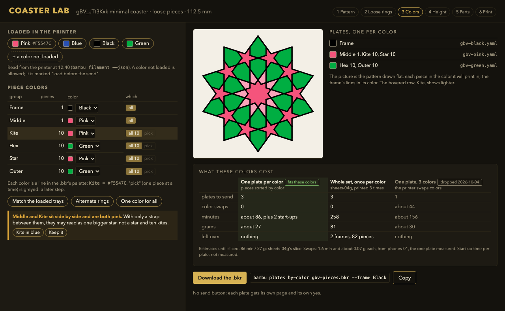

# Piece colors: a Coaster Lab screen for coloring the pieces, with helpers that show the cost

> Status: draft 2026-10-04, for Omar to decide the four calls in
> [Open calls for Omar](#8-open-calls-for-omar). Asked by Omar on 2026-10-04: "i also want to
> build a customization ux where one can confifure the infill colors with tooling helpers". Built
> since: phase 1 (`plates by-color`), phase 2 (its `--costs` view, 2026-10-05), phase 3 (the
> Piece colors screen) and phase 4 (its helpers, all but "match the loaded trays", which waits on
> call 4); phase 5 is not. It adds no grammar and changes no decision; it is the detailed design of steps 3,
> 5 and 6 of the guided page in
> [loose-pieces §4](loose-pieces-design.md#4-the-assemble-your-own-coaster-guided-page), plus
> the helpers around them.



A mockup, not the Lab: [piece-colors-mockup.html](infill-color-ux-media/piece-colors-mockup.html),
in the Lab's own colors and classes (copied from the
[color controls mockup](color-preview-design/lab-controls-mockup.html), which copied bikar
`packages/lab/src/style.css`), screenshotted with headless Chrome. What is real and what stands in:

| Part of the picture | Real or stand-in |
|---|---|
| The coaster drawing | **Real.** bikar's own flat render of gBV_JTt3Kxk with its five groups ([gbv-groups.svg](infill-color-ux-media/gbv-groups.svg), bikar main 6629f24), recolored by group in the page |
| Group names and counts (Middle 1, Kite 10, Hex 10, Star 10, Outer 10) | **Real**, the pieces file sheets-04g prints |
| Pink `#F5547C` and black `#000000` | **Real**, colors the plate recipes already use ([sheets-04g](../plates/sheets-04g.md), [phones-01](../plates/phones-01.yaml)) |
| 86 minutes, 27 g | **Real**, sheets-04g's local slice |
| 1.6 minutes and about 0.07 g a swap | **Real**, from phones-01, the one two-color plate measured (§6) |
| The blue and green tray colors, the read time 12:40 | Stand-ins. The page records that blue and green are loaded, not their codes |
| The command name `bambu plates by-color` | A working name for a tool this doc proposes (§4.5) |

## 1. The ask and the assumption

Omar asked for a screen where someone sets "the infill colors", with helpers.

**The assumption.** "Infill colors" means the colors of the pieces that fill the coaster's holes:
the loose pieces that drop into a frame ([D-090](../../working-model/decisions-log.md#d-090--lines-and-loose-pieces-in-two-colors-true-edges-first)),
and the filled rings of a one-piece coaster
([D-081](../../working-model/decisions-log.md#d-081--pieces-are-grouped-by-orbit-about-the-patterns-true-centre-and-the-openwork-coaster-fills-chosen-orbits-solid)).
A person picks them in a UI, a whole group at a time (all ten kites) or, later, one piece at a
time. Everything below follows from that reading. If it is wrong, §1.1 is the other one.

**What changed on 2026-10-04 and shapes the whole design.** Omar dropped multi-color plates: one
color per plate, picked at the send with `bambu print send --color`
([sheets-04g](../plates/sheets-04g.md)). In his words: "i dont want to do multi color plate
anymore, instead i want to go back to single plate with all the pieces ... then have the option to
choose color at print time". The reason is measured: phones-01, in two colors, took about 62
minutes against 22 sliced, and about a third of its plastic went to the color swaps
([phones-02](../plates/phones-02.md#cost-and-risk)). So a coaster in three colors is printed as
separate one-color prints, and the screen's job is to make that cost plain before anyone commits
to it (§6).

### 1.1 The other reading: the slicer's infill

To a slicer, "infill" is the hidden lattice inside a solid part. It is out of scope here, for two
reasons. On an opaque coaster nobody sees it, so its color buys nothing. And if it differs from the
walls, every layer swaps color, which is the cost Omar just stopped paying. Whether Bambu Studio
can give an object's infill its own filament was not checked for this doc. If it is ever wanted, it
belongs in a plate recipe's `profile` block, which already names the filament, not in the Lab.

## 2. What exists today

This doc builds on the color docs and does not repeat them. The pieces it uses:

| Piece | What it does | Where it is written down |
|---|---|---|
| `color <region> <Name>` | The frame's color: base, straps, border, each a palette name | [coaster-color-design §4](coaster-color-design.md#4-grammar--color-region-palettename), [D-073](../../working-model/decisions-log.md#d-073--coaster-color-is-per-region-symbolic-labels-compiled-to-per-body-export-never-painted-pixels-or-a-dsl-bound-slot) |
| The Lab's color knob | Rewrites the `color` line; tints the preview per region | [coaster-color-design §7](coaster-color-design.md#7-coaster-lab-knob), [D-076](../../working-model/decisions-log.md#d-076--the-coaster-lab-color-knob-adds-a-palette-block-to-the-splittable-presets-and-tints-the-whole-preview-per-region) |
| `fill void where orbit == N color <Name>` | One group (an orbit: every piece the pattern's turns carry onto each other) in one palette name | [multicolor-design §2](multicolor-design.md#2-color-classes-the-orbit-word), D-081 |
| The Lab's Orbits panel and fill picker | Tick an orbit, or click a piece to light its whole orbit; presets odd, even, inner, outer, all, none | [color-preview-design §5](color-preview-design.md#5-coaster-lab-controls); bikar `packages/lab/src/coaster-orbits.ts`, `packages/lab/src/coaster-fill-picker.ts` |
| `loose where …` | Prints the chosen orbits as separate pieces; `--piece Frame` is the frame, `--piece <Name>` every piece of that palette name | [loose-pieces §3.5](loose-pieces-design.md#35-what-bikar-would-emit), D-090; bikar #292, and `pack zipper` bikar #302 |
| Palette name → printer slot | First-seen order, slot 1 the plate default | [D-075](../../working-model/decisions-log.md#d-075--coaster-plate-color-maps-palette-name--a-logical-ams-slot-by-first-seen-order-slot-1-the-plate-default-baked-into-a-multi-part-input-3mf-the-composer-assembles) |
| `slice coaster`; "warn, not cap" on colors past the loaded trays | Slices the colored coaster; warns, never refuses, when there are more colors than trays | [D-077](../../working-model/decisions-log.md#d-077--the-coaster-color-plate-is-a-separate-slice-coaster-verb-headless-verifies-geometry-on-a-tag-stripped-copy-while-color-is-a-gui-check), [D-078](../../working-model/decisions-log.md#d-078--radial-band-color-reuses-the-shipped-fill-where-ring-clause-as-a-print-region-no-second-radial-grammar) |
| Plate recipes | A YAML per plate: `profile` (settings, filament, `color`) and `items` (`bkr`, `piece`, `params`, `count`, `label`) | `tools/bambu/src/commands/compose.ts`; [sheets-04g.yaml](../plates/sheets-04g.yaml) |
| The loaded trays | `bambu filament` lists them, read-only; `--json` gives the raw frame | `tools/bambu/src/commands/filament.ts` |
| Color at the send | `print send --color "#RRGGBB"` feeds a one-color plate from the tray nearest that color; it refuses a plate with more than one filament | `tools/bambu/src/filament-sync.ts` (`chooseColor`, `reconcile`), `tools/bambu/src/commands/print.ts` |
| Minutes and grams of a slice | `bambu validate sliced <3mf>` prints the slicer's time and grams worked out from length | `tools/bambu/src/commands/validate.ts` |
| Beds per slice | A recipe that spills onto a second bed prints only the first on a send | `parseBeds` in `tools/bambu/src/threemf.ts` |

Three gaps turned up while reading bikar main 6629f24. Each one shapes the build plan:

1. **The Lab's colored preview goes bronze on a loose coaster.** The Lab tints by splitting the
   coaster into colored bodies (`buildCoasterParts`), and that split refuses a loose coaster, as
   `--format parts` does. `packages/lab/src/evaluate.ts` catches the refusal and shows plain
   bronze. So the coaster sheets-04g prints has no colored preview in the Lab today. The flat
   render above is bikar's 2D renderer, which colors every face by its palette name and has no such
   limit. That is the cheap route to a preview (§4.6).
2. **No Loose button in the Lab.** [loose-pieces §6](loose-pieces-design.md#6-what-would-need-building)
   item 4 is not built. A loose coaster can be opened in the Lab but not made there.
3. **The Lab never edits a palette color.** It reads the palette's colors (to paint swatches) and
   rewrites which name a line uses, but nothing changes `Kite = #e05a47` to another color. Choosing
   a tray color for a group is exactly that edit, so it is new.

## 3. The screen

The mockup at the top is the screen. It is step 3 of the guided page, "Pick colors", with the
parts list (step 5) and the print hand-off (step 6) shown beside it, because the cost of a color
choice only makes sense next to the plates it makes. Where the guided page itself lives is
[loose-pieces call 2](loose-pieces-design.md#7-open-calls-for-omar), still open; this screen goes
wherever that page goes and does not reopen the question.

**What is on it, top to bottom:**

- **Loaded in the printer.** A chip per loaded tray, in its own color (§4.1). A chip for "a color
  not loaded" stays available: a color with no tray is allowed and marked "load before the send",
  the same "warn, not cap" rule as D-078.
- **Piece colors.** One row per group: the frame first, then each orbit that is loose or filled,
  with its piece count, its color and a "which" switch: all the group's pieces, or picked pieces
  (greyed until the per-piece step, §7 phase 5).
- **Quick choices.** "Match the loaded trays", "Alternate rings", "One color for all" (§4.2).
- **A hint**, when two groups that sit side by side share a color (§4.3). It suggests; it never
  changes a color by itself.
- **The picture:** the pattern drawn flat, each piece in its chosen color, the frame's lines in
  the frame's color. Hovering a row lights its group; clicking a piece selects its row.
- **Plates, one per color:** which groups land on which plate, and the recipe file each becomes.
- **What these colors cost:** three ways to print the same choice, side by side (§6).
- **The hand-off:** download the `.bkr`, and copy the one command that turns it into plate
  recipes. There is no send button, as loose-pieces §4 already decided: each plate gets its own
  page and its own yes ([D-093](../../working-model/decisions-log.md#d-093--omars-yes-to-a-send-lives-on-the-plate-page-one-per-send)).

**The flows.**

| Flow | The person does | What changes in the `.bkr` |
|---|---|---|
| A. Color by group (the main one) | Picks a tray color in a group's row, or clicks a piece and picks it there | That group's palette line: `Kite = #F5547C` |
| B. Match what is loaded | Clicks "Match the loaded trays" | Every palette line moves to its nearest loaded tray; the hint lists any that moved far |
| C. One piece different (later, §7 phase 5) | Switches a row to "pick", clicks one kite, gives it blue | A new palette name for that piece and one `fill … where index == N` line ahead of the orbit line |
| D. Hand off to print | Downloads the `.bkr` and runs the command beside it | Nothing; the recipes are written from the `.bkr` (§4.5) |

Every flow is a `.bkr` edit, as every Lab knob is: the source is the whole truth, the share link
carries it, and the print target never enters the link
([color-preview-design §5](color-preview-design.md#5-coaster-lab-controls)).

## 4. The helpers

Six helpers, each grounded in what exists. "New" means nothing does this today.

| # | Helper | Exists or new | Built from |
|---|---|---|---|
| 4.1 | Palette from the loaded trays | **New in the Lab**; the tray read exists | `bambu filament --json` |
| 4.2 | Group selection: a whole group, or one piece | Whole group **exists** (orbit lines, presets, fill picker); one piece is **new** | `setOrbitFill`, `presetOrbits`; the `index` fill attribute |
| 4.3 | Contrast hints | **New** | core's face-neighbor lookup; a color distance |
| 4.4 | Cost readout | **New**, from existing numbers | `bambu validate sliced`; phones-01's swap cost |
| 4.5 | Export to plate recipes, one per color | **New** | the recipe format in `compose.ts` |
| 4.6 | Preview in the chosen colors | **Partly exists**: the flat render does it today, the Lab's 3D view does not for loose coasters | bikar's 2D renderer |

### 4.1 Palette from the loaded trays

`bambu filament --json` already reads the loaded trays off the printer
(`tools/bambu/src/commands/filament.ts`). The Lab cannot ask the printer itself: it is a web page,
and the printer's access code stays with the tools that send, which is why 3d-model-hub stays the
plate builder and the Lab stays a design tool. So the tray list reaches the Lab one of two ways,
and that is call 4. Either way the Lab only reads a list of colors; it never talks to the printer.

### 4.2 Group selection

A group is an orbit, and the Lab already selects by orbit: the Orbits panel ticks one, the presets
tick sets of them, and the fill picker lights a whole orbit when you click one piece. The new part
is one row per group with a color, which is a palette edit (gap 3 in §2), not a new selection.

One piece at a time is new and less certain. The fill grammar already has an `index` attribute
(bikar `packages/core/src/theme/fill-resolver.ts`), so `fill void where index == 37 color KiteBlue`,
placed before the orbit line (the first matching line wins), should give one face its own palette
name, and so its own `--piece` output. Two things are untested: whether `index` numbers the faces
the way the Lab's piece list does, and whether `loose` honors a face picked by `index`. Phase 5's
test answers both before any UI is drawn for it.

### 4.3 Contrast hints

The hint fires when two groups that sit side by side share a color, or have colors close enough to
blur together. "Side by side" comes from the faces' neighbors, which core already works out for
the `neighbors` and `neighbor_sides` fill attributes. Same tray color is a sure hint. "Close" needs
a number, and none we have transfers: `filament-sync`'s match tolerance answers "is this the same
spool", a different question from "will a person see two shapes". So the threshold starts as a
number to tune by eye on the first prints, and the hint only ever suggests.

On a loose coaster the frame's strap runs between every two pieces, so two same-color neighbors are
still split by a line. That is why the mockup's hint says "may read as one bigger star", not "will".

Dark-next-to-light bleed, a real risk on a multi-color plate
([multicolor-design §4.2](multicolor-design.md#42-purge-bleed-and-the-second-nozzle)), does not
arise when each color prints on its own plate. The hint does not warn about it unless the person
picks the multi-color route.

### 4.4 Cost readout

§6 has the numbers and the formula. The readout shows two kinds of number and labels them: an
**estimate** the Lab can work out on its own (plates, swaps, and minutes and grams scaled from the
pieces' volume), and a **slice** number, which only the plate tools can produce because only they
run the slicer. The Lab shows the estimate at once. The command in §4.5 prints the slice numbers.

### 4.5 Export to plate recipes

A new `bambu` command (working name `plates by-color`) reads a `.bkr`, groups its palette names by
color, and writes one recipe per color in the format `compose.ts` already reads:

```yaml
# gbv-pink.yaml, written by the command, one of three
bed: x2d
profile:
  settings: "Bambu Lab X2D 0.4 nozzle;0.20mm Standard @BBL X2D"
  filament: "Bambu PLA Basic @BBL X2D 0.4 nozzle"
  color: "#F5547C"          # only if call 3 says the color goes in the recipe
items:
  - { bkr: bikar:patterns/Constructions/gBV_JTt3Kxk-minimal-pieces.bkr, piece: Middle, params: { size: 112.5 }, label: MIDDLE }
  - { bkr: bikar:patterns/Constructions/gBV_JTt3Kxk-minimal-pieces.bkr, piece: Kite,   params: { size: 112.5 }, label: KITE }
  - { bkr: bikar:patterns/Constructions/gBV_JTt3Kxk-minimal-pieces.bkr, piece: Star,   params: { size: 112.5 }, label: STAR }
```

Why a command in this repo and not a button that writes YAML in the Lab: a recipe names a `.bkr`
by its place in a repo, and the plate pages, approvals and sends all live here. A Lab-written
recipe would point at a file nobody committed, and recipes would have two writers that could
disagree. One writer, fed by the `.bkr` the Lab downloads, keeps one path. The Lab's part is to
show the command, filled in.

The frame rides on the plate of its color when a group shares it, and gets its own plate when none
does. sheets-04g already fits the frame and all 41 pieces on one bed, so a frame plus a subset of
pieces fits too. The command checks it anyway (§9).

### 4.6 Preview in the chosen colors

bikar's 2D renderer already draws every face in its palette color (the picture at the top). For a
loose coaster, that flat picture is the honest preview: the pieces are flat, and the colors are
the point. The Lab's 3D tint is the better picture for a one-piece filled coaster and goes on
working there. For a loose coaster it stays bronze today (gap 1 in §2), so the screen shows the
flat picture. Where the 3D view cannot color, it says why rather than showing silent bronze; that
rule is [color-preview-design §5](color-preview-design.md#5-coaster-lab-controls)'s "refusals
show, not hide".

## 5. Where the color choice lives

Three places could hold "the kites are pink": the `.bkr` (the design), the plate recipe (what one
plate prints) and the plate page (what was approved and sent). Each holds a different part:

| Holds | Where | Why there |
|---|---|---|
| Which pieces are one group, and that group's color | The `.bkr`: the `fill … color <Name>` line names the group; the palette line `Name = #hex` gives its color | The Lab only edits the `.bkr`; the share link carries it; the palette name is already the `--piece` a recipe asks for (D-090) |
| Which groups print together, and on which plate | The recipe: one per color, its `items` naming the pieces | Recipes are what the slicer and the plate pages read |
| Which tray actually fed it | The send (`--color`, or the recipe's `profile.color`) and the plate page's record of the run | The tray is a fact about the printer on the day, not about the design |

**The name is the group; the color is not the name.** Two groups can share a color and keep their
own names (Middle, Kite and Star are all pink above and still print as three `--piece` outputs on
one plate). That keeps the names stable when colors change, so a recolor never renames a piece or
breaks a recipe that names it. It also follows D-073: a palette name is a label, and the color
is resolved later.

**The color in the `.bkr` is a wish; the tray is the fact.** The hex in the palette tints the
picture. What prints is the tray the send feeds from. Whether the recipe also records the color,
so the send finds the tray with no `--color`, is call 3.

## 6. What a color choice costs

Three ways to print the same choice. The numbers are for the mockup's choice on the sheets-04g
coaster: the frame in black, Middle, Kite and Star in pink, Hex and Outer in green. They are from
`bambu plates by-color --costs --slice` (phase 2, built 2026-10-05), which sliced every plate it
names; only the third column's swaps are an estimate.

| | One plate per color | The whole set, once per color | One plate, three colors |
|---|---|---|---|
| What it is | Pieces sorted onto plates by color | sheets-04g as it is, printed once in each color | One plate; the printer swaps colors |
| Plates to send (each its own yes) | 3 | 3 | 1 |
| Color swaps | 0 | 0 | about 44 |
| Minutes, as sliced | 97.5 (57 + 16.5 + 24) | 260.4 (3 × 86.8) | about 157 (86.8 + 44 × 1.6) |
| Grams | 27.3 | 81.8 | about 30.4 |
| Filament cost, refill price | $0.43 | $1.32 | about $0.49 |
| Left over | nothing | 2 frames and 82 pieces | nothing |
| Status | fits Omar's 2026-10-04 rule | what sheets-04g does today, one color per run | dropped by Omar on 2026-10-04 |

**Where each number comes from.**

- **Minutes and grams** are each plate's own slice (Bambu Studio 02.08.02.61, X2D, PLA Basic), read
  from its `slice_info.config` the way `bambu validate sliced` reads it. The slicer's time
  includes each plate's warm-up: the three one-color plates add up to about 11 minutes more than
  the one whole-set plate (97.5 against 86.8) while their grams add up to the same 27.28 g, so
  the difference is the two extra warm-ups. Before phase 2 this column said "about 86, plus two
  start-ups"; the slices measured the start-ups.
- **The whole set, once per color** is three runs of one plate: 260 minutes and 82 g. It is the
  costliest for one coaster, and the only one with no new recipe. Its spares are not waste if the
  goal is three coasters: three frames and three full sets in three colors make three coasters in
  any mix.
- **One plate, three colors:** the coaster is 4.4 mm tall, 22 layers at 0.2 mm (the slice's own
  layer count). If all three colors print on every layer, each layer needs two swaps, so about 44.
  phones-01 took about 62 minutes against the slicer's 22 with a swap on each of its 22 layers;
  the [phones-02 page](../plates/phones-02.md#why-print-it) puts that at about 1.6 minutes a swap
  (40 extra minutes over 22 swaps would be 1.8, if nothing else were slower), and its
  [cost section](../plates/phones-02.md#cost-and-risk) puts the swaps and prime tower at about
  1.5 g, about 0.07 g a swap. That gives
  86.8 + 44 × 1.6 ≈ 157 minutes and 27.3 + 44 × 0.07 ≈ 30.4 g.
- **Dollars** are grams times the store's price per kilogram in
  [prices.yaml](themes/catalog/prices.yaml) (first read 2026-10-04 for the
  [pricing research](../../research/2026-10-04-coaster-pricing.md), now written from the store's
  own product pages by the color-themes skill's `prices.py refresh --write`), at the price of one refill
  bought on its own unless `--price-tier` says otherwise. A line with no price shows grams and no
  dollars. Filament only: no power, wear or failed prints.
- **Watched minutes**, a column on the page, are the sliced minutes times the watched-over-sliced
  ratio of past timed prints of the same filament, from the plate print logs. The swaps are added
  on top, since phones-01's ratio already holds its own.

**This transfers only so far.** The per-swap figures come from one plate in one pair of colors,
pink and black. Watching that print, swaps into pink looked about twice as slow as swaps into black
(roughly 2.2 against 1.0 minutes); that split is a session note, not yet in the
[print log](../plates/print-logs/phones-01.md), so treat it as a lead. They transfer to
another plate on the same printer, filament and purge settings, and only as an average: a choice
with more light colors will swap slower than 1.6, a choice with more dark ones faster. For three
colors or more they are low: phones-01's two colors sat on the X2D's two nozzles, so a swap was a
nozzle change with no flush, while a third color shares a nozzle and flushes the old color out on
every change, which nobody has timed. The cost view says so on that route. They do not
transfer to another printer, or to the second nozzle, which might purge less (unverified,
[multicolor-design §4.2](multicolor-design.md#42-purge-bleed-and-the-second-nozzle)). The screen
says "about" and names the plate it came from, as the mockup does.

**What the readout always shows**, for any choice: the number of plates (the number of distinct
colors, with the frame riding on a plate of its own color when it can), the swaps, the minutes and
grams with their source, and what is left over. It never hides a route because it costs more; it
marks the one that fits the current rule.

## 7. The build, in order of value for the work

Each phase names the test that shows it works. Ordered by what it gives Omar for what it costs.

| Phase | What | Where | Value | Test |
|---|---|---|---|---|
| 1 | **Export by color.** The `plates by-color` command: read a `.bkr`, group palette names by color, write one recipe per color, the frame riding along when it shares a color; print each recipe's slice minutes, grams and bed count | 3d-models `tools/bambu` | Makes a multi-color coaster printable today, by editing palette lines by hand, with no Lab work. Everything after builds on it | On the gBV pieces file with the mockup's colors: three recipes; `bambu slice compose <each> --dry-run` places every item; the per-piece check in §9 passes; a recolor of one group moves only that group's items |
| 2 | **The cost table in the command.** All three routes of §6 for the chosen colors, slice numbers where sliced, estimates labeled where not. **Built 2026-10-05:** `plates by-color --costs [--slice]` writes `costs.json` and `costs.html`, a page with each plate's picture, time, watched time, grams and dollars, and the time and cost per coaster | 3d-models | Omar sees the cost before any plate page exists | The one-color route's minutes equal `bambu validate sliced`'s for the same recipe; a choice that spills one recipe onto a second bed shows that bed, not a total |
| 3 | **The Piece colors screen.** Group rows with a color each (a palette-line rewriter, tested apart from the page like `setOrbitFill`), the tray chips, the flat colored picture, the filled-in command. **Built 2026-10-05** (bikar #304): the rows, the themes and gradient, the flat colored preview and the share link | bikar `packages/lab` | The screen Omar asked for, on top of a tool that already works | A real-browser run: pick pink for Kite, the `.bkr` has `Kite = #F5547C`, the picture's kites turn pink, the command matches; the share link carries the colors and no printer detail |
| 4 | **The helpers in the screen.** Contrast hints, "match the loaded trays", the estimate half of the cost table. **Built 2026-10-05:** the contrast hints (bikar #304); a row whose color no loaded tray holds says "load before the send" and still exports, and a cost estimate shows the three routes with plates, swaps, minutes and grams, each marked "about" (bikar #310). "Match the loaded trays" waits on call 4, how the Lab gets the printer's tray list | bikar `packages/lab` | Speeds up choosing; nothing new reaches the printer | The mockup's choice raises the Middle/Kite hint; Kite in blue clears it; a color with no tray shows "load before the send" and still exports |
| 5 | **One piece at a time.** Prove `index` with `loose` first, then the "pick" switch | bikar core test, then the Lab | The finest choice, and the one that adds most plates; last because it is the least certain and the least asked for | A gBV fixture with one kite named apart: `--piece KiteBlue` gives exactly one body, `--piece Kite` gives nine, and the Lab's piece numbering picks the same face |

The Loose button (loose-pieces §6 item 4) is not in this list: it is that doc's, and phases 1 and 2
do not need it. Phase 3 needs it only for coasters that are not loose yet.

## 8. Open calls for Omar

Tick one box per call. My pick is first, with its reason.

**1. Which way of printing does the screen offer first?** (§6)

| Option | Pros | Cons | Implications |
|---|---|---|---|
| **One plate per color** (my pick) | No swaps, no leftovers, about the time of one plate; fits the 2026-10-04 rule | Three plates, three yeses, three sends for one coaster; start-up time per plate unmeasured | Phase 1 writes recipes per color; each gets a plate page through prioritize-prints |
| The whole set, once per color | No new recipe at all: sheets-04g plus `--color`; the spares make more coasters in any mix | Three times the time and plastic for one coaster; two frames and 82 pieces left over | Phase 1 shrinks to the cost table; the screen picks the colors to send in |
| Allow one plate, many colors, with its cost shown | One send; nothing to sort by hand | The route Omar dropped: about 70 extra minutes and a prime tower here | Reopens the 2026-10-04 decision; the bleed hint (§4.3) has to be built |

- [ ] **One plate per color**, and show the other two as costs beside it.
- [ ] The whole set, once per color.
- [ ] Allow a many-color plate.
- Notes:

**2. A color per group, or per piece too?** (§4.2, §7 phase 5)

| Option | Pros | Cons | Implications |
|---|---|---|---|
| **Per group now, per piece later** (my pick) | Uses only what is built and tested; groups keep a pattern's symmetry, which is what the orbit work was for | No single odd piece until phase 5 | Phase 5 waits for the `index` test |
| Per piece from the start | Full freedom | Rests on the untested `index` path; every odd piece can add a plate | The screen needs the pick switch and per-piece checks from day one |
| Per group only, never per piece | Simplest, always symmetric | Rules out a single accent piece | Phase 5 is dropped |

- [ ] **Per group now, per piece later.**
- [ ] Per piece from the start.
- [ ] Per group only.
- Notes:

**3. Does a plate's color go in its recipe, or only at the send?** (§5)

| Option | Pros | Cons | Implications |
|---|---|---|---|
| **In the recipe for a per-color plate, at the send for a whole-set plate** (my pick) | The pink plate is pink on its page and in its yes, and the send finds the tray with no `--color`; sheets-04g's "pick at print time" stays as it is | Two habits, chosen by kind of plate | Changing a per-color plate's color is a recipe edit, which resets its yes ([D-097](../../working-model/decisions-log.md#d-097--a-recipe-changes-in-place-as-a-numbered-iteration-and-the-change-resets-the-yes)) |
| Always at the send | One habit; recipes never change for color | The pink plate's page does not say pink; the yes covers a plate whose color is a word in chat | `profile.color` goes unused by this screen |
| Always in the recipe | Every page shows its color | sheets-04g's "pick at print time" goes away | Each color of the whole-set route is its own recipe |

- [ ] **In the recipe for per-color plates, at the send for whole-set plates.**
- [ ] Always at the send.
- [ ] Always in the recipe.
- Notes:

**4. How does the Lab learn which trays are loaded?** (§4.1)

| Option | Pros | Cons | Implications |
|---|---|---|---|
| **Paste or drop the output of `bambu filament --json`** (my pick) | No new connection; the access code never leaves the plate tools; works on the hosted Lab | One manual step, and the list goes stale when a spool changes | The chips show when the list was read |
| 3d-model-hub serves the list and the Lab asks it | Always current, no manual step | A hosted page asking a home machine for data needs a route between them that does not exist today | The hub grows a read-only tray endpoint; a hosting question first |
| No tray list; any color | Nothing to build | The person guesses what is loaded; "match the loaded trays" cannot exist | The send's refusal is the only check |

- [ ] **Paste or drop the tray list.**
- [ ] The hub serves it.
- [ ] No tray list.
- Notes:

Where the screen lives is not asked again here: it follows
[loose-pieces call 2](loose-pieces-design.md#7-open-calls-for-omar), still open.

## 9. Checks

**Validator (every piece prints once, in its color):** for the `.bkr` and the recipes the export
writes, list every piece the `.bkr` makes (the frame, and each face its `loose` or `fill` lines
pick) with the color its palette name gives it. Then, for each piece, find the recipes whose items
make it, by building each item's `--piece` and matching bodies to faces. The check is per piece,
never per group: a count of ten kites across all recipes says nothing about which kite went where.

PASS: the mockup's choice on the gBV pieces file. 42 pieces (the frame and 41) each appear in
exactly one recipe, and that recipe's color is the piece's color: the frame in black, Middle,
Kite and Star (21 pieces) in pink, Hex and Outer (20) in green.

FAIL: one kite is given blue through an `index` line, but the export still writes `piece: Kite`
and no `piece: KiteBlue`. Ten kite bodies still print and the total is still 41, so a count per
group passes, yet the blue kite's face lands in the pink recipe and in no blue one. The per-piece
check names that face.

**Validator (the cost shown is the cost of what is exported):** for each exported recipe, slice it
and compare the readout's minutes and grams with `bambu validate sliced` on that slice, and its
bed count with the slice's beds.

PASS: one plate per color for the mockup's choice: three recipes, each one bed, and the readout
shows each recipe's own sliced minutes and grams and their sum.

FAIL: the pink recipe's pieces spill onto a second bed. A send prints only the first bed, so the
real pink run leaves pieces off, while a readout that adds up minutes across beds still shows a
believable total. The check reads the bed count per recipe and fails on any recipe over one bed.

**Validator (the picture shows what will print):** for each piece, the color the screen draws is
the color of the recipe that prints it.

PASS: the flat picture of the mockup's choice: every face's fill equals its recipe's color.

FAIL: a loose coaster in the Lab's 3D view, which today draws every piece bronze while the recipes
are pink and green (gap 1 in §2). The check fails it until the view either colors the pieces or
says it cannot.

## 10. Read against itself and what transfers

- **The flagship example can be built by what this doc ships.** The mockup's choice needs palette
  edits (phase 3, or by hand before it), the export (phase 1) and the cost table (phase 2). None of
  it needs per-piece picks or the Loose button.
- **The numbers agree.** §6's 44 swaps are two per layer over 22 layers; 156 is 86 + 44 × 1.6,
  rounded; 258 and 81 are three times 86 and 27; 82 pieces is two spare sets of 41. The PASS line's
  21 pink pieces are 1 + 10 + 10 and its 20 green are 10 + 10.
- **The swap cost transfers on stated conditions only** (§6): same printer, filament and purge
  settings, as an average across colors. The contrast threshold does not transfer from
  `filament-sync` (§4.3). sheets-04g's one-bed fit carries to a subset of its pieces because a
  subset takes less room, not more.
- **No decision is changed.** D-073 (a name is a label), D-075 (name to slot), D-076 (the Lab's
  color knob), D-077 and D-078 (slice, warn not cap), D-081 (groups are orbits) and D-090 (loose
  pieces in two colors) are used as they stand. Omar's 2026-10-04 one-color rule is the default
  here; reopening it is option 3 of call 1.
