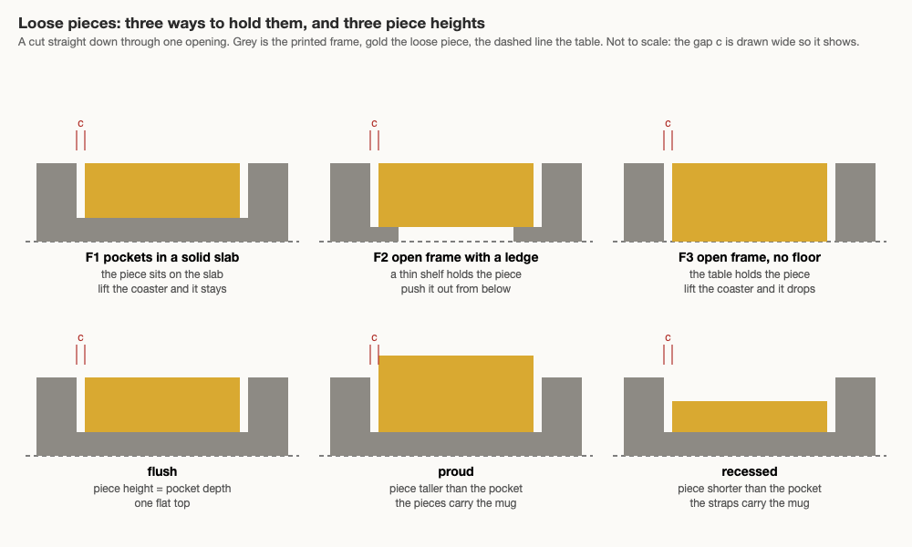

# Loose pieces, fill height either way, and "assemble your own coaster"

> Status: draft 2026-09-30, for Omar to decide the four calls in
> [Open calls for Omar](#7-open-calls-for-omar). Asked by Omar on 2026-09-29 in review thread
> 3kqnku (typos fixed in the quotes) on the flush-or-lowered call of the
> [open-calls page](../../working-model/feedback-requests/2026-09-29-open-calls.md): "we should
> have options to select this too in the ui ... and do so at either ends ... and even print
> without the borders and only the inner shapes and 'fit them'", "or even for folks to
> 'assemble their own coaster'", "see if we can make a guided ui for this". Tracked as item 6
> of the [catalog-expansion backlog](../../tasks/catalog-expansion/backlog.md). Built so far:
> §6 items 2 and 3, the exact pocket walls and the loose pieces with the backed frame F1
> (bikar #292, 2026-10-01). Nothing has been printed.

Three asks, in order of how much is unknown:

1. **Fill height either way.** The Lab's fill slider only goes down. Let it go up too. Small:
   one refusal lifted and one kernel rule extended (§2).
2. **Loose pieces.** Print the filled shapes on their own and drop them into a printed frame.
   This is a new joint: nothing we have printed tells us how much gap a loose piece needs (§3).
3. **A guided page** where someone assembles their own coaster, step by step (§4).

The second and third are the hard asks. §5 lays out their options side by side, §6 lists what
would need building, §7 has the calls, §8 the checks.

## 1. What we have today

Everything below is on bikar origin/main cca3adb or this repo's master c2e37c9.

**Fill height.** `relief both emboss <h> fills <f>` sets the fills' height apart from the straps
([bikar #283](https://github.com/NaqshCoffee/bikar/pull/283)). The parser refuses `f` above `h`
with "fills may be at most the relief height (equal is flush)"
(`packages/core/src/dsl/parser.ts`). The kernel lifts any face cell below the fill height up to it
(`reliefAmountAt` in `packages/core/src/kernel3d/coaster.ts`), and `lowerFillVertices` moves the
one-cell ramp between a fill and a strap into the strap, so a lowered fill stays flat to its edge.
It runs only when `f < h`. The preset `patterns/Constructions/7apC5Q9QS-8-fill-coaster.bkr`
declares `param fill = 1.2 range 0.2..1.2`, and the Lab turns that range into the slider with no
Lab code. Which height should be the default is call 2 of the open-calls page, still open;
[multicolor-design §3](multicolor-design.md#3-the-look-flush-or-lowered-fills) has the argument.

**The color split.** An `outline pattern` coaster with `fill void where orbit == N color <name>`
lines splits into one straps body plus one body per fill color
([bikar #284](https://github.com/NaqshCoffee/bikar/pull/284), `assembleOpenworkParts`). The cut
follows the grid columns, full height, with no floor: a cell within half a strap of a centreline
belongs to the straps ("strap wins",
[multicolor-design §3.1](multicolor-design.md#31-strap-wins-both-researchers-built-in-261)). Take
the fill bodies away and the straps body has through-holes. `openwork frame` is still refused by
the split. [color-preview-design §4](color-preview-design.md#4-the-openwork-change-why-the-cs-1-radial-coaster-stays-one-color)
covers why, and the unmeasured risk of a first layer in two colors on openwork.

**Picking pieces in the Lab.** The Orbits panel
([bikar #282](https://github.com/NaqshCoffee/bikar/pull/282)) writes the `fill ... where orbit == N`
lines, with presets Odd, Even, Inner half, Outer half, All, None. The fill picker
([bikar #288](https://github.com/NaqshCoffee/bikar/pull/288)) lets you click a piece on the
coaster; the reply from the evaluator now carries every bounded face of the pattern with its ring
number (`packages/lab/src/coaster-pieces.ts`), and its chip reads "Ring N: M pieces, r X mm" with
Fill ring and Clear ring buttons. Both go through the same edit path. The Coaster Lab is
`packages/lab/coaster.html`, the Orb Lab pattern (decision D-067 in bikar's coaster-lab doc).

**Walls.** The coaster is a height field sampled on a 0.4 mm grid. A wall sampled on the grid is a
staircase: on a slanted side it strays up to ±0.27 mm from the true line (measured on the CS-1
coaster at 90 mm, 2026-09-29,
[interlock design §5](coaster-interlock-design.md#5-kernel-change) item 3). Two things are emitted
exactly instead: the interlock's outer ring (same place), and the key join's pocket, whose cells
are clipped to the exact ring (`keyedRing` and `earClip` in
`packages/core/src/kernel3d/coaster-key.ts`).

**A loose part already exists: the key.** The butterfly key
([borderless joins, option A](coaster-borderless-joins-design.md#a-a-butterfly-key-through-the-frames-into-the-patterns-own-openings-recommended);
bikar #255, clearance bikar #264) is a straight prism printed on its own and dropped into pockets
that go through the frame; the table holds it up. The whole clearance comes off the key, so trying
another fit means reprinting only keys. It is registered as a second output, `--piece Key`, through
`registerCoasterKey` in `packages/core/src/dsl/evaluator.ts`.

**Fit numbers.** Every join (dovetail, key, tab) uses 0.15 mm per face, the `sliding` step of
CAL-FIT-01 (press −0.1, snug 0.05, sliding 0.15, free 0.35). That ladder is Creative3DP's, measured
across the diameter, and it assumes the printer's hole and outline errors are corrected separately;
we apply it per face with no correction
([print-quality design §3](../printing/print-quality-design.md#3-pegs-too-tight)). Its status is
provisional; nothing has been measured
([bets](../../../.claude/skills/calibrate/bets.md)). The two hand readings we have, minis-03 at
0.15 "a bit loose" and minis-04 at 0.10 "too tight", do not count: both were sliced on Studio's
built-in values, not the X2D preset, and the dovetail slot was not yet a true offset of the tab
([sample rules](../../../.claude/skills/print-coaster-samples/sample-rules.md#mini-params)). The
key ladder (0.05, 0.10, 0.15 on `docs/design/plates/minis-05.yaml`) and the dovetail ladder T1 have not
been printed.

**The pieces on CS-1.** From `bikar bands` on `patterns/Constructions/GimTvN9hw4U-radial-coaster.bkr`
at its default size 90, strap 3, measured on the strap centrelines:

| Ring | Pieces | Sides | Area mm² | Radius mm | In the snowflake fill |
|---|---|---|---|---|---|
| 0 | 1 | 12 | 161.84 | 0 | no |
| 1 | 6 | 6 | 80.92 | 11.16 | yes |
| 2 | 6 | 12 | 161.84 | 19.33 | no |
| 3 | 6 | 6 | 80.92 | 22.32 | yes |
| 4 | 12 | 6 | 80.92 | 29.53 | no |
| 5 | 6 | 12 | 161.84 | 33.49 | yes |
| 6 | 12 | 6 | 80.92 | 40.24 | no |
| 7 | 6 | 6 | 80.92 | 44.65 | yes |

The snowflake is 24 pieces: 18 six-sided and 6 twelve-sided. At the sample size of 80 mm with a
2 mm strap, a six-sided piece would be roughly 6.5 mm across. That is worked out by scaling the
90 mm area and assuming the six-sided faces are regular; a render gives the real number.

## 2. Fill height either way

**What changes.** The same word, `fills <f>`, allowed above the relief height:

- **Parser.** Lift the refusal of `f > h` and keep refusing `f ≤ 0`. The refusal exists because,
  with today's kernel, fills above the straps would swallow them. `reliefAmountAt` raises every
  cell inside a face to the fill height, and the strap cells near a face would go with them.
- **Kernel.** Strap wins on height as well as on color: a cell within half a strap of a centreline
  keeps the strap height. The straps then read as grooves between raised pads.
- **The ramp goes into whichever body is taller.** When `f < h`, `lowerFillVertices` puts the
  one-cell ramp into the strap, because the strap is on top anyway. When `f > h`, the mirror rule
  puts it into the fill: vertices touching a strap cell are sampled at the strap height, so the
  strap stays flat and the pad's edge takes the ramp. Either way the layers above the lower body
  hold one color only. When `f = h`, nothing runs and the output is byte-identical, as today.
- **The preset.** Widen `param fill` on the fill preset past 1.2 (for example `range 0.2..2.4`).
  That width is a choice for the slider, not a measured limit. The Lab needs no code, because the
  slider comes from the range.

**Two checks that stop holding (K10).** The mesh gate's minimum feature leaves `fills` out, and
bikar's height-field doc gives the reason: "the thinnest wall is still the strap." A raised pad is
a wall standing above the straps. Where a face is clipped by the coaster's edge, the pad can be a
sliver narrower than the strap, so the gate must count raised fills. Second, the relief height
limit (CAL-CST-04, height no more than twice the width) was set for a raised rib. A groove between
two pads is a slot, not a rib, and nothing says the same ratio holds for a slot. At strap 2 and a
pad 1.2 mm above the straps the ratio is 0.6, so it does not bite at the preset's values; it would
bite only at thin straps and tall pads.

**The minimal coaster has no fill height.** The CS-1 radial coaster is an `outline pattern` coaster
with no relief clause; its filled rings close at strap height. A fill height there needs a new word
on the fill line or a relief clause on `outline pattern`. That is left out here, and flagged in §6.

**Loose pieces give "raised" for free.** A loose piece stands as high as it is printed, so a piece
taller than its pocket is a raised fill with no kernel change to the fill rule at all (§3.2). If
Omar only wants raised fills on loose-piece coasters, this section's kernel work is not needed.
That is call 3.

## 3. Loose pieces

### 3.1 What the frame is

The frame is the coaster with the loose rings left as openings. Three ways to hold a piece, drawn
in cross-section below ([picture source](loose-pieces-media/frames.html), rendered headless):



- **F1, pockets in a solid slab.** The plain coaster (`relief straps`, a full slab under the
  straps) with the chosen faces made into pockets whose floor is the slab. Lift the coaster and the
  pieces stay. The frame shows two colors at most (slab and straps), and the pieces add theirs.
- **F2, an open frame with a ledge.** The minimal coaster, with a thin shelf round the bottom of
  each chosen opening. The piece rests on the shelf, and you can push it out from below. It needs
  a second exact outline per opening (the shelf's inner edge), and the shelf is a new thin part:
  its floor thickness would start from the deboss floor (CAL-CST-03, three 0.2 mm layers) and its
  width from the strap floor (CAL-CST-01, 0.8 mm), and neither transfers without a check, because
  both were set for a shelf joined to a slab on its whole underside, not for a ledge hanging off a
  1.4 mm strap.
- **F3, an open frame with no floor.** The straps body from bikar #284 as it is, with exact walls.
  The table holds the pieces, like the key. Least new geometry, but lift the coaster and every
  piece drops unless the fit holds it by friction, and whether a friction fit holds on this printer
  is exactly what is not known.

### 3.2 The fit, and whether the piece sits flush, proud or recessed

- **The opening** is the face polygon moved in by half a strap, with exact walls. The work is the
  key pocket's exact-wall clipping, done for every chosen opening instead of for one known shape.
- **The piece** is a straight prism of the face polygon moved in by half a strap plus the gap `c`,
  using `insetPolygon` in `packages/core/src/kernel3d/solidify-lattice.ts`. It returns null when
  the result folds, and the caller must refuse rather than guess (a piece too thin to print is a
  refusal that names the face).
- **The whole gap comes off the piece**, as with the key. The frame is printed once; a different
  fit means reprinting only pieces.
- **Sharp tips.** Moving a corner in by `c` pulls the tip back by c ÷ sin(θ/2), where θ is the
  corner's angle: 2c at 60°, 2.6c at 45°. The printed pocket's corner also fills in, because a
  0.4 mm line cannot turn a sharp inside corner. So the tip is where a piece will catch first.
  Creative3DP's advice (re-opened in
  [print-quality-verification §2](../../research/print-quality-verification.md#2-web-sources-re-opened))
  is a small chamfer or rounding on mating edges; how much, at this size, only a print shows.
- **Height sets the look.** A piece as tall as the pocket is deep sits **flush**; taller sits
  **proud** (a raised fill, and the pieces carry the mug); shorter sits **recessed** (a lowered
  fill). In F1 at the sample size, the pocket is 1.2 mm deep, since the straps stand 1.2 mm above
  a 1.4 mm slab ([sample rules](../../../.claude/skills/print-coaster-samples/sample-rules.md#mini-params)).
  So a flush piece is six 0.2 mm layers.
- **The first layer.** Bambu's own page on elephant foot says that on "assemblies, snaps ... the
  flared base directly affects fit" (verification §2). The X2D preset sets compensation 0.15, and
  plates are now sliced with the whole preset chain
  ([#349](https://github.com/omars-lab/3d-models/pull/349)). A piece lies flat on its first layer,
  so the flare is on the piece's bottom edge, which enters the pocket last.

**Default:** loose-piece gap = 0.15 mm per face, the `sliding` step of CAL-FIT-01, the same
convention as the key, tab and dovetail. This is a starting point, not a result: the reasons it may
not transfer are in §3.4, and LP-1 (§3.6) is what settles it.

### 3.3 How the piece is held

| Frame | What holds the piece | Lift the coaster | Take a piece out |
|---|---|---|---|
| F1 | the slab below, the pocket walls round it | pieces stay | tip it over and tap, or a fingernail at the gap; hard at a small gap |
| F2 | the ledge below, the walls round it | pieces stay | push from below |
| F3 | the table below, friction round it | pieces drop unless the fit is tight | push from either side |

None of the three glues or clips anything. A tighter gap holds a piece by friction in all three,
but a gap tight enough to hold in F3 is also tight enough to jam, and the only reading we have near
there (minis-04 at 0.10, "too tight") does not count (§1).

**Printed 2026-10-02, sheets-04:** the F3 row held. Pieces 1.2 mm tall at every gap from 0.05 to
0.20, set into the floorless gBV minimal coaster, all fell right through, judged by hand
([the record](../../prints/2026-10-02-sheets-04/index.md)). So in F3 a positive gap holds
nothing. [sheets-04b](../plates/sheets-04b.md) tries pieces 4 mm tall, flush with that
coaster, at 0.05, 0 and two press fits, where the piece is larger than its hole (bikar #300).

A coaster split through its height can hold pieces a fourth way: a lip round each opening on both
halves, so a piece is dropped into the lower half and trapped when the upper half is pressed on,
with no fit to tune ([split-with-studs §11](../pieces/split-with-studs-design.md#11-loose-pieces-in-a-split-coaster-trapped-between-two-lips)).

### 3.4 Which fit numbers transfer, and on what condition

- **CAL-FIT-01, as a starting point.** It transfers because a loose piece in a pocket is what the
  ladder describes: two parts printed separately on the same printer and nozzle, fitted together in
  the plane. It does not transfer as a result, for three reasons, each a condition the ladder needs
  that does not hold here:
  1. **A closed pocket is a hole to the slicer; the key pocket is not.** Bambu's X-Y hole
     compensation acts only on closed hollow paths, and contour compensation on the outer outline
     (verification §2). The key pocket opens to the coaster's edge, so it is outline. A loose-piece
     pocket in F1 or F2 is closed at every layer above the floor, so it is a hole. The same `c` can
     print differently in the two. How much the printer shrinks a hole is its own bet, CAL-HOL-01,
     also unmeasured.
  2. **The ladder is across the diameter, with errors corrected separately.** We use it per face,
     with no correction ([print-quality design §3](../printing/print-quality-design.md#3-pegs-too-tight)).
  3. **The ladder was read off round holes and pins.** These are six- and twelve-sided outlines with
     tips, where the gap at a tip is wider than `c` but the corner is where the printed pocket
     fills in (§3.2).
- **CAL-CLR-01 (0.4 mm) does not transfer.** It is the gap at which two surfaces printed *in place*
  come apart as two objects. Loose pieces are printed apart and put together afterwards; that is
  a different question.
- **Generic PLA clearances (0.3, 0.5 mm) do not transfer**, for the reason the borderless-joins
  doc gives: other printers, larger joints
  ([§7](coaster-borderless-joins-design.md#7-what-transfers-from-other-materials-and-why)).
- **The key ladder transfers only partly.** KEY-1 on minis-05 is the nearest joint: a loose prism
  in a nominal pocket, all gap off the prism. It differs in the three ways above. If LP-1 and KEY-1
  come back with different windows, that is the sign the `calibrate` skill should split CAL-FIT-01
  into a hole bet and an outline bet, rather than move one number for both.

No source gives a gap for a loose polygon piece in a closed pocket on this printer. Until LP-1
prints, the answer is the CAL-FIT-01 bet and nothing firmer.

### 3.5 What bikar would emit

A per-ring clause in the coaster block, next to the fill lines that already pick rings and colors.
Sketch only; the grammar is bikar's to settle:

```
fill void where orbit == 1 color Gold
fill void where orbit == 3 color Gold

coaster Coaster
  ...                                           # outline, inscribe, base as today
  relief straps emboss 1.2
  strap width 2
  loose where orbit == 1 clearance $clearance   # new: this ring prints as loose pieces
  loose where orbit == 3 clearance $clearance
```

- **Outputs.** The frame as `--piece Frame`, and one output per loose color, `--piece Gold`, holding
  every piece of that color as separate bodies in the places they sit in the coaster. Printed that
  way, neighbouring pieces are about a strap apart (2 mm at the sample size), well above the 0.4 mm
  at which in-place surfaces come apart (CAL-CLR-01), so the plate needs no layout of its own. This
  is the key's registry (`registerCoasterKey`) with more than one shape.
- **Per-piece list.** The alternative to a per-ring word is a list of face numbers. It is what the
  fill picker would need to make single pieces loose, but the picker today works a ring at a time,
  and a ring keeps the coaster's symmetry. Start with rings.
- **The floor.** In F1 the floor is the slab the plain coaster already has. F2 needs the ledge
  emitted as its own exact ring. F3 needs nothing. Every frame refuses a pocket whose floor or
  ledge falls under its floor (§3.1) rather than printing it.
- **Refusals.** A piece whose inset folds (`insetPolygon` returns null) or comes out under the
  1.2 mm feature floor (CAL-FEA-01) is refused by name. A face cut by the coaster's edge stays part
  of the frame in the first version, because its piece would have one side on the rim and no strap
  to sit against.

### 3.6 The sample plate: LP-1 (a working name)

Built with the print-coaster-samples rules: size 80, height 1.4, strap 2, one pattern (CS-1), sliced
with the whole preset chain, checked by the mesh gate and review-print before Omar sees it. Nothing
is sent by a session; the send is Omar's.

- **One F1 frame** with the snowflake rings (1, 3, 5, 7) as pockets.
- **Ring 1's six pieces at four gaps:** 0.05, 0.10, 0.15, 0.20 mm per face. Same shape, only the gap
  changes, as T1 does for the dovetail. The rungs bracket the default with the key ladder's
  0.05–0.15 plus one looser step; they are a choice for the ladder, not a claim about the answer.
- **Ring 5's six twelve-sided pieces at 0.15 only,** to see whether the tips catch at the default.
- **Mixing up rungs ruins the reading.** The four sets look alike. Each set is its own plate item,
  and goes in its own bag straight off the plate.

**Validator (LP-1, by hand):** each piece is tried in its pocket on its own.
PASS: the piece drops in by hand with no tool, sits level with the frame's surface to the eye, does
not rattle when the frame is shaken gently face up, and comes out by tipping the frame and tapping.
FAIL: a piece needs force or a tool, stands proud of a pocket it was drawn flush with, catches at a
tip, or rattles. Report the window per rung and per shape; "most pieces fitted" answers nothing.

### 3.7 The printer comes first

Guide-print gate 3: "a coupon that could physically damage the printer is never sliced-for-dispatch
or sent", and a coupon whose parts could come loose and be dragged by the nozzle is acceptable only
with on-device failure detection **and** small part mass
([guide-print](../../../.claude/skills/guide-print/SKILL.md)). LP-1's pieces are the smallest
things we would have printed: about 6.5 mm across and 1.2 mm tall, smaller than minis-05's keys
(about 8 × 4 mm, 1.4 mm tall), whose plate already names "can lift or be knocked off the bed" as a
risk. Their mass is small; that part of the rule is met. The failure detection is the X2D's own:
this doc used to ask Omar to confirm it was on and that they would watch the first layer, and their
answer was that the printer does this itself, so it is not asked per plate
([D-092](../../working-model/decisions-log.md#d-092--failure-detection-is-the-printers-job-not-a-per-plate-yes)).
A brim would still help, but this repo's plate files cannot set one today: the per-plate settings
override (print-quality change 4) is not in `tools/bambu/src/commands/compose.ts`. If a piece is
ever dragged by the nozzle without the printer stopping, that answer is reversed, and the pieces
come off the plate, or print at a larger size, until a brim can be set.

## 4. The "assemble your own coaster" guided page

**Steps, and what each one shows.**

| Step | You do | The page shows | Reuses |
|---|---|---|---|
| 1. Pick a pattern | choose from the roster | the coaster, one color | the Coaster Lab's roster |
| 2. Pick the loose rings | click a piece or a preset | the ring lit, "Ring N: M pieces"; the rest stays frame | fill picker (#288), Orbits panel presets (#282) |
| 3. Pick colors | a color per loose ring, one for the frame | the colored preview | the Colors panel and the color preview |
| 4. Pick the height | flush, proud or recessed | the preview's side view | the Knobs panel; a height param like `fill` |
| 5. Parts list | read it | frame ×1, then pieces per color with counts ("Gold: 24 pieces") | the evaluator's piece list |
| 6. Print | download one STL per color | the files and the plate note; never a send button | Download STL |
| 7. Put it together | follow the picture | the finished coaster, and which ring goes where | the preview, rings numbered |

**Where it lives.** Two places are credible (§5, table B): a guided mode inside the Coaster Lab,
which shows the existing panels one step at a time, or a separate page next to it. Either way it
is in bikar's `packages/lab`, like every other Lab page. Nothing new is drawn for it: every step
above is a panel or a preview the Coaster Lab already has, and the one new output (the parts list)
is text from the piece list the evaluator already sends. That is also why this doc has no mock-up
of the page; the only picture drawn is the frame cross-section, which nobody had drawn before.

**Who can open it.** The Lab sits behind the org's sign-in today. "For folks" may mean people
outside the org. That would be a separate call about hosting, not a change to this design.

## 5. Options for the two hard asks

"Verifies" says what each option checks. An option that checks nothing is named as such.

**A. How loose pieces are held (for the first sample).**

| Option | Pros | Cons | What it leads to | Verifies |
|---|---|---|---|---|
| **F1, pockets in a slab** (my pick) | Pieces stay when you lift it; still a full coaster; the slab is geometry we have; one exact outline per pocket | Heavier; a piece is hard to get out at a small gap; the pocket is a closed hole to the slicer | LP-1 on one frame; a raised fill falls out of piece height | the gap window for a closed pocket, per rung and per shape |
| F2, open frame with a ledge | Looks open when empty; push pieces out from below | Two exact outlines per opening; a thin ledge nobody has printed, with no floor that transfers | A ledge bet before LP-1 | the gap window and whether a thin ledge survives |
| F3, open frame, no floor | Least new geometry; the #284 split is most of it | Lift it and the pieces drop, unless a friction fit holds, which is unmeasured and close to jamming | LP-1 becomes a friction-fit test | only whether friction holds |
| Do nothing | No work | Omar's ask stays unanswered; the split's through-holes are the only "frame" | Call 2 on the open-calls page closes without loose pieces | nothing |

**Recommendation:** F1 first, because it is the only frame that holds its pieces with no fit
number known, and its one new piece of geometry (exact pocket walls) is needed by all three.

**B. The guided page.**

| Option | Pros | Cons | What it leads to | Verifies |
|---|---|---|---|---|
| **Guided mode in the Coaster Lab** (my pick) | One page, one set of panels, one share link; every step is a panel that exists | The Lab page grows a mode; the step bar has to stay in step with the panels | A step bar over `coaster.html`; the same URL state | each step's panel end to end, in a real browser |
| A separate page beside the Lab | A clean page with no knobs; easy to open to people outside later | A second page wiring the same panels, which drifts unless both import the same modules | `assemble.html` next to `coaster.html` | the same, twice |
| A written how-to in this repo | No code; pictures of each step | Not a UI, which is what Omar asked for | A gallery page linking to the Lab | nothing about the software |
| Do nothing | No work | Anyone but us has to know the Lab's panels | The loose-piece output exists but nobody is led to it | nothing |

**Recommendation:** a guided mode in the Coaster Lab, because it adds no second copy of any panel,
and a separate page stays possible later if the audience moves outside the org.

## 6. What would need building

In order; each item names the test that shows it works. Nothing here is started.

**bikar**

1. **Raised fills** (only if call 3 says yes). Lift the parser refusal; strap wins on height; the
   mirror of `lowerFillVertices`; the minimum feature counts raised fills; widen the preset range.
   *Test:* the fill preset at `fill = 1.8` renders and passes `--check`; a strap-centre cell sits at
   the strap height and a face-centre cell at the fill height; the same test against today's
   kernel fails (the strap cell comes out at the fill height). At `fill = 1.2` the output is
   byte-identical to today.
2. **Exact pocket walls.** Emit each chosen opening's wall from its exact outline, the key pocket's
   clipping made general. *Test:* the §8 mesh validator on every CS-1 opening at 80 and 90 mm, plus
   watertight and Euler checks; a fixture with the old staircase wall fails it.
3. **Loose pieces and the frame.** The `loose` word, `--piece Frame` and one `--piece <color>` per
   loose color, the inset with its null refusal, the edge-face rule. *Test:* `--piece Gold` on the
   snowflake gives 24 separate watertight bodies (18 six-sided, 6 twelve-sided); every inset at gaps
   0.05 to 0.35 is non-null on CS-1; a sliver-face fixture is refused by name.
   *Done for items 2 and 3, bikar #292 (2026-10-01):* on CS-1 every piece keeps its full 0.150 mm
   gap at 80 and 90 mm (the staircase wall touched all 24, and that case stays in the tests as one
   that must fail); 24 pieces, 18 six-sided and 6 twelve-sided; gBV gives 41, the smallest 2.4 mm
   across. A face within two grid squares of the coaster's edge stays part of the frame.
4. **The Lab.** A Loose button on each ring row and on the picker chip; the parts list; the guided
   mode's step bar. *Test:* a Playwright run through the seven steps of §4, and a look in a real
   browser before it ships.
5. **Fill height on the minimal coaster** (flagged, not designed here). A relief clause or a word on
   the fill line for `outline pattern` coasters. *Test:* to be written with its design.

**3d-models**

6. **The style name** in `.claude/skills/import-construction/coaster-styles.md`, once Omar names it
   (for example `<id>-loose-coaster.bkr`). *Test:* `make validate` passes with the new row.
7. **The LP-1 plate** under `docs/design/plates/`, with its header, risks and validator (§3.6), and an
   LP-1 entry in the prototype catalog. *Test:* `bambu slice compose <plate> --dry-run` places
   every item; the catalog hook (36) confirms each `--piece` and `--param` exists in the `.bkr`;
   mesh gate and review-print as the sample rules require.
8. **The bet.** After LP-1 prints, the `calibrate` skill either confirms CAL-FIT-01's use here or
   splits it (§3.4). *Test:* the bets table's gate (D5) still passes on every doc that cites it.
9. **The decisions.** Omar's answers in §7 go into the decisions log with an id from
   `tools/next_id.py`, and the backlog item moves.

## 7. Open calls for Omar

Tick one box per call. My pick is first, with its reason.

**1. Which frame for the first loose-piece sample?** (§3.1, §5 A)

- [x] **F1, pockets in a solid slab.** Pieces stay put with no fit number known.
- [ ] F2, open frame with a ledge.
- [x] F3, open frame, no floor.
- Notes: Omar wants both, as a two-color option on any coaster: the lines open (F3) and the lines
  backed (F1), with the same pieces. The pattern is gBV_JTt3Kxk, not CS-1.

**Decided 2026-10-01:** F1 first for the gap reading, then F3; the edges are made true before any
fit sample → [D-090](../../working-model/decisions-log.md#d-090--lines-and-loose-pieces-in-two-colors-true-edges-first)

**2. Where does the guided page live?** (§4, §5 B)

- [ ] **A guided mode in the Coaster Lab.** No second copy of any panel.
- [ ] A separate page next to the Lab.
- [ ] A written how-to, no new UI.
- Notes:

**Decide it on:** three pictures, one per option, in the
[sampler sheets design](sampler-sheets-design.md#where-the-guided-page-lives-three-pictures-not-a-sheet).

**3. Raised fills: on every fill coaster, or only through loose pieces?** (§2)

- [ ] **On every fill coaster, the same slider going up.** It is one refusal and one kernel rule,
  and it answers "either end" on the coaster that has the slider today.
- [ ] Only through loose pieces, where a taller piece is a raised fill with no kernel change.
- Notes:

**Decide it on:** sampler sheet 5, fill height (lowered, flush and raised on the same windows) —
[the sheet](sampler-sheets-design.md#3-the-sheets), [its plate page](../plates/sheets-05.md).

**4. LP-1's gaps, and printing it.** (§3.6, §3.7)

- [ ] **0.05, 0.10, 0.15, 0.20 per face on ring 1, plus ring 5 at 0.15.** Brackets the default the
  way the key ladder does, with one looser step.
- [ ] Other gaps (write them in the notes).
- [ ] Wait for KEY-1 and T1 to print first, then choose the gaps.
- Can failure detection be on and the first layer watched for this plate? **Decided 2026-10-02:**
  not a per-plate question, the X2D does its own failure detection →
  [D-092](../../working-model/decisions-log.md#d-092--failure-detection-is-the-printers-job-not-a-per-plate-yes)
- Notes:

**Decide it on:** sampler sheet 4, fit (these four gaps on gBV, and its small stars at 0.15) —
[the sheet](sampler-sheets-design.md#3-the-sheets), [its plate page](../plates/sheets-04.md).

**Printed 2026-10-02:** sheets-04 put these gaps in the floorless minimal coaster, not an F1
frame, and every piece fell through (§3.3). The F1 reading is still to come; the floorless
reading moves to [sheets-04b](../plates/sheets-04b.md), gaps 0.05 down to −0.10.

## 8. Checks

**Validator (the gap, on the mesh, per piece):** for every loose piece, read its outline off the
`--piece <color>` mesh at mid-height, and its opening's outline off the `--piece Frame` mesh at
the same height. The opening is read from the frame's wall vertices, not from the polygon that
made them, or the check only compares a polygon with itself.
PASS: for every piece, every point of its outline is at least c − 0.001 mm from its opening, and
the midpoint of every straight side is within c ± 0.001 mm of it.
FAIL: any one piece has a point closer than c − 0.001 mm, or a side midpoint off by more than
0.001 mm. Today's grid-sampled walls fail this: their staircase strays up to 0.27 mm from the
true line. So does a piece whose inset folded at a tip. A pass on the smallest gap across the
whole plate cannot stand in for this: one piece jammed at a tip among 24 leaves every summary
number looking fine.

**Validator (raised fills, on the mesh):** on the fill preset at a fill height above the straps.
PASS: every strap-centre cell sits at the strap height, every face-centre cell at the fill height,
and the layers above the strap height hold fill color only.
FAIL: any strap-centre cell raised to the fill height (the straps swallowed), or strap color above
the strap height (the ramp on the wrong side).

LP-1's hand check is in §3.6.

**Read against itself (K7).** The Default in §3.2 is the same number the key, tab and dovetail use,
and §3.4 says why it may still be wrong; §3.6 is what settles it. F1 is recommended in §5 and
drawn in §3.1 as the only frame whose pieces stay when lifted, which the §3.3 table agrees with.
The guided page reuses only panels named in §1. The CS-1 sizes in §1 are measured at 90 mm and
scaled to 80 mm by assumption, and §3.7 relies on that scaled size; the render in §6 item 7
replaces it.

**Not sourced.** No source gives a gap for a loose polygon piece in a closed pocket on this
printer (§3.4). Whether a raised pad's groove prints clean at any ratio (§2). How much tip rounding
a piece needs (§3.2). Whether the X2D's own failure detection stops for a dragged piece this small
(§3.7, D-092). Each is left to a print or to Omar, not guessed.
