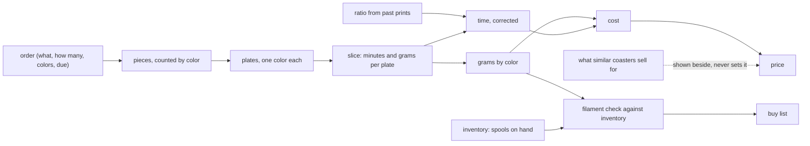
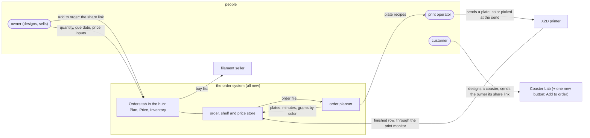
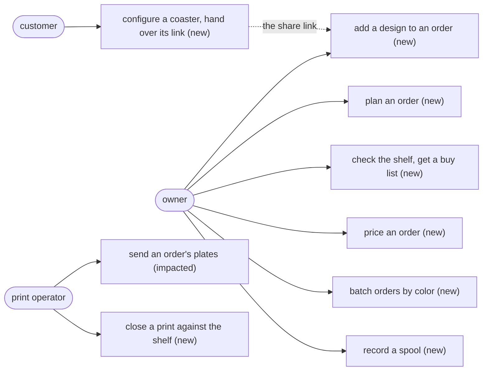
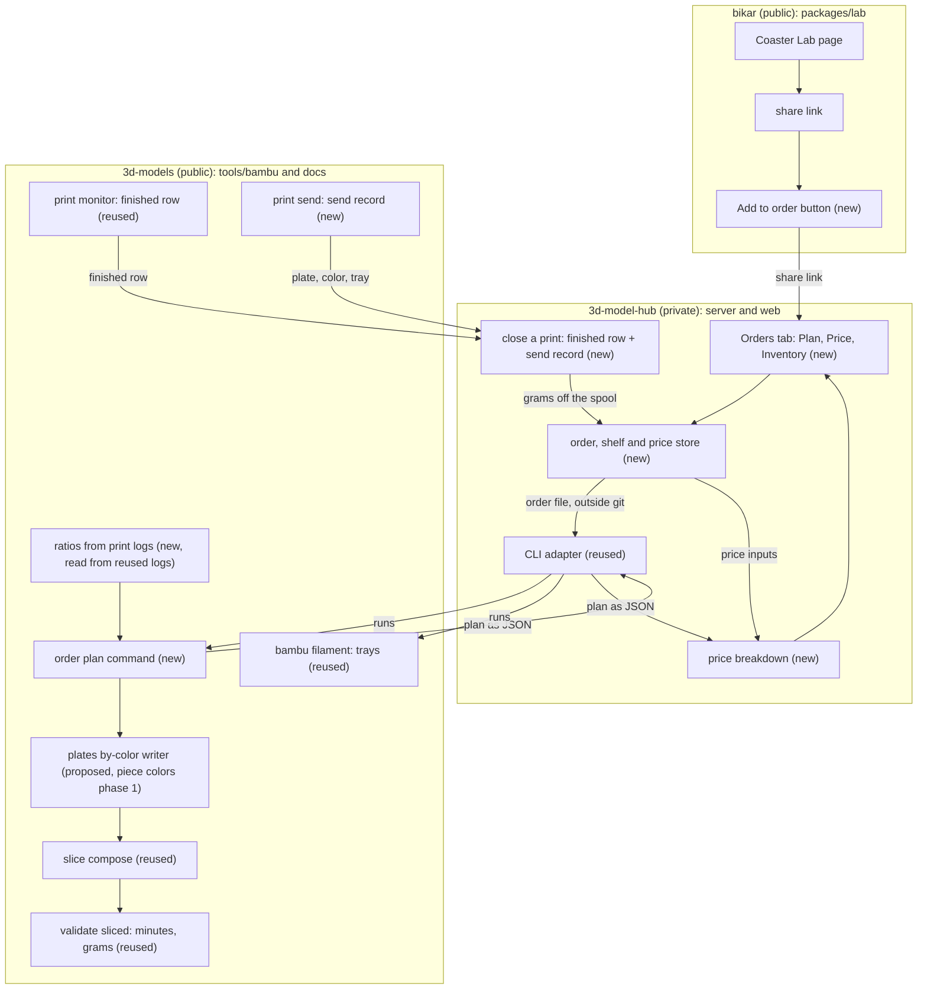
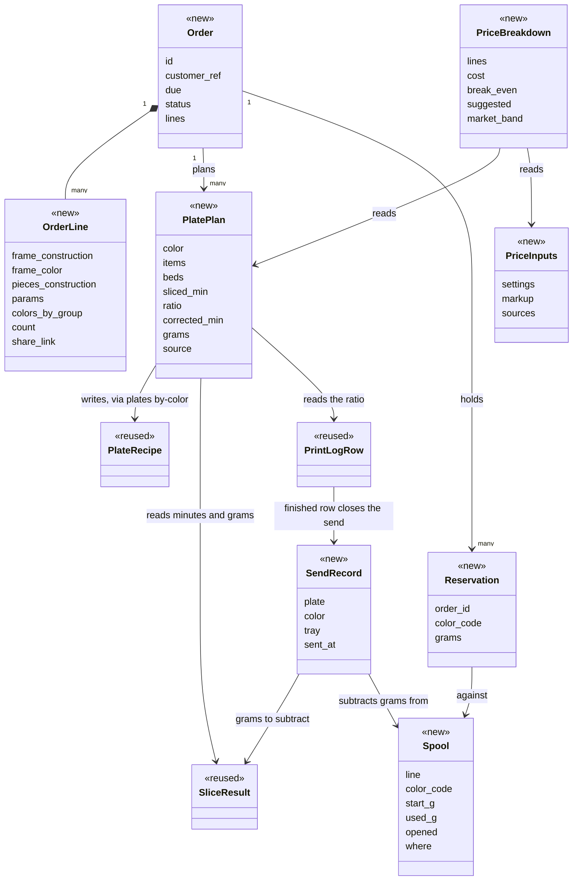
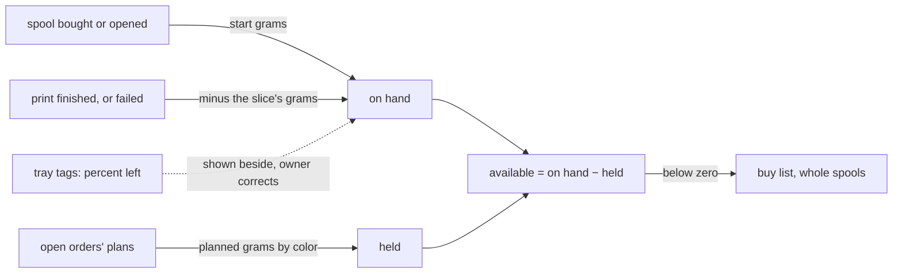

# Orders: type in what someone wants, and get the plates, the time, the filament and the price

This design turns one typed order — which coaster, what size, which colors, how many, by when —
into everything needed to make and sell it: the plates[^plate] to print, the time on the printer,
the filament[^filament] by color, what to buy, and a price. Today all of that is worked out by hand, and
the price and the stock of filament are not worked out anywhere. It proposes one command that
does the working out, and three pages over one private store that show it: a plan, a price and
the shelf of filament.

> Status: draft, 2026-10-04. Nothing here is built. Omar, who designs, prints and sells the
> coasters, has three calls to make, in
> [§10](#10-open-calls-for-omar). No price is worked out here on purpose: every price setting is
> still empty. Four have looked-up references to confirm (§9.3), five come only from Omar's own
> records, and three are his to choose.

## 1. The problem: an order is five questions, answered by hand

Omar asked, on 2026-10-04: "if I order different prints, will I know how much material i will
need? how much time it will take to make? how many plates we will need to print? how much I
should price/sell things for?"

Someone wants four of the gBV coaster[^gbv] in the Ice to navy theme[^theme], by a date. Before
saying yes, Omar needs five answers: how much
plastic, how long on the printer, how many plates, what to charge, and whether the colors
are on the shelf. Today each one is worked out by hand, from different places, and two of them
have nowhere to be worked out at all.

| Question | What exists today | What is missing |
|---|---|---|
| **Material** | The slicer's[^slicer] filament length for one plate, turned into grams by `bambu validate sliced` (the bambu CLI[^bambu]). A designed, unbuilt "live estimates" panel that adds grams piece by piece ([plate-builder §6](../printing/plate-builder-design.md#6-the-live-estimates-panel--grams-exact-time-a-floor)). The printer has not been seen to report the grams a print used (unconfirmed) | Grams per color for a number of coasters |
| **Time** | Sliced minutes for one plate. Print logs[^printlog] that show how long a plate really took: of the five in this repo, three are one-color PLA[^pla] Basic plates watched from start to finish, sheets-04g[^sheets04g], [sheets-04c](../plates/print-logs/sheets-04c.md) and [phones-02](../plates/print-logs/phones-02.md)[^phones] | A total for an order, corrected by what prints really take |
| **Plates** | One plate recipe[^recipe] per plate, written by hand. A proposed command that writes one recipe per color from a design ([piece colors[^piececolors] §4.5](infill-color-ux-design.md#45-export-to-plate-recipes)), not built | "Four coasters in five colors" turned into a list of plates |
| **Price** | Nothing | Everything: no cost, no price, no record of what was charged |
| **Inventory** | `bambu filament` reads the four loaded trays[^tray] and, for a tagged spool[^spool], the percent left. The [color catalog](themes/bambu-color-catalog.md) says which colors are owned | Grams on the shelf, what open orders already need, what to buy |

**Plainly: there is no order, no price and no inventory model anywhere in these repos today.**
The Coaster Lab[^lab], where a coaster is designed, knows nothing about grams or money. Its share
link[^sharelink] records the design and nothing about how many or for whom.

## 2. Why it matters now

Three things changed on 2026-10-04, and each one makes the hand method worse:

- **One color per plate.** Omar dropped plates that switch colors mid-print, because phones-01[^phones]
  took about 62 minutes against 22 sliced and lost about a third of its plastic to the switches
  ([phones-02](../plates/phones-02.md#cost-and-risk)). The color is now picked when the plate is
  sent. So a coaster in five colors is five plates, five sends and five warm-ups[^warmup]. Nobody can see
  that from a picture of a coaster.
- **Themes need colors we do not own.** The gBV themes page lists themes built from the whole
  range of Bambu Lab, the maker of our printer and its filament. Ice to navy uses five PLA Matte colors and none of them is on the shelf. An order
  in that theme starts with a purchase.
- **A spool is bought whole, but an order uses grams.** Four coasters use about 108 g (from a PLA
  Basic slice), and buying
  their colors means five whole spools. Without a record of what is left, the second order in the
  same theme looks like it needs five more.

And one thing makes a better method possible: there are now three one-color prints where both the
sliced time and the real time are known, so the slicer's estimate can be corrected instead of
trusted.

Without this, a quote is a guess. A low guess loses money on warm-ups and spools; a high one loses
the order.

## 3. The idea: an order is a recipe card scaled for guests

A recipe says what one serving needs. Tell it eight guests, and it gives the shopping list, the
oven time and the cost per plate, and you check the pantry before you shop. An order[^order] works
the same way. It is **the only thing anyone types**: which coaster, which size, which colors, how
many, by when. Everything else is worked out from it and worked out again whenever it changes:



**In the diagram:** order[^order]; plate[^plate]; slice[^slicer]; ratio[^ratio];
inventory[^inventory]; buy list[^buylist]; price[^price].

Two rules follow. **Nothing downstream is typed**: a page that shows a plate count or a price
has worked it out, and says from what. **A number nobody has measured or looked up is shown as
missing**, never filled with a guess. An estimate is labeled "estimate", a looked-up range is
shown as a range with its source, and neither is ever shown as measured. The pricing page in §7
has no prices in it today for exactly that reason.

## 4. A worked example: four gBV coasters in Ice to navy

| Step | What comes out | From |
|---|---|---|
| The order | 4 × gBV at 112.5 mm, strap[^strap] 3.75, height 4.4, round 1.25, Ice to navy | typed |
| Pieces | 4 frames and 164 pieces: 4 middles, 40 kites, 40 hexes, 40 stars, 40 outers (the five groups[^palette]) | 4 × the 1 + 41 that sheets-04g prints |
| Colors | Frame ivory white; middle ice blue; kites sky blue; hexes marine blue; stars and outers dark blue | the theme |
| Plates | 5, one per color, each one bed[^bed] if the pieces fit (the packer[^packer] checks) | one color per plate |
| Grams | about 108 g | 4 × 27 g |
| Sliced minutes | 344, from a PLA Basic slice, standing in until the Matte re-slice | 4 × 86 |
| Corrected minutes | none yet: no Matte plate has been timed. Once the Matte slices exist, the page shows them alone, marked "floor" (the least the print can take), with 5 plates' warm-ups not timed. PLA Basic's ratio would give about 388, and the page names it as not used | the ratio rule, §9.1 step 4 |
| Filament check | none of the five colors on hand | the loaded trays are pink, blue, black, green |
| Buy list | 5 spools of PLA Matte, by color code[^code]: 11100, 11601, 11603, 11600, 11602 | what the shelf is short of, rounded up to whole spools |
| Price | not yet: every setting is empty; four have looked-up references to confirm, five come only from Omar's own records and three are his to choose | §9.3 |

Two things this example shows that a single plate does not. The split of the 108 g by color is
an estimate, from each group's share of the plastic, until each color's plate is sliced: the
frames are most of the plastic (about 62 of the 108 g, by the [gBV themes](themes/gbv-themes.md#ice-to-navy)
split), so the ivory spool does most of the work. And five spools bought for 108 g leave most of five spools on the shelf, so
the order should be charged for its grams, not for the spools, and the shelf should remember the
rest.

**Batching.** If a second open order also wants dark blue, its stars and outers ride on the same
dark blue plate while it fits the bed. Fewer plates, fewer warm-ups, fewer sends.

## 5. Context: who uses it and what it touches



**In the diagram:** Coaster Lab[^lab]; share link[^sharelink]; hub[^hub]; order planner[^planner];
plate recipe[^recipe]; X2D[^x2d]; print monitor[^monitor]; buy list[^buylist].

Everything inside the box is new; the Lab gains one button; the printer and the people are as
they are today. Today the owner and the print operator are the same person, Omar. They are drawn
apart because they do different things at different times. The customer never touches the hub
or the planner: the hub is private, so a customer designs in the Lab and sends the owner the
share link, and the owner adds it to an order.

## 6. Use cases

Each is an actor doing something. "New" means nothing does it today; "impacted" means an existing
step changes.

1. **A customer configures a coaster and sends the owner its link; the owner adds it to an
   order** (new). The design is made in the Coaster Lab as today. On the owner's own devices a
   new Add to order button hands the share link to the hub. A customer who presses it sees "Send
   this link to the shop to order" with the link to copy, because their device cannot reach the
   private hub.
2. **The owner plans an order** (new): pieces, plates, minutes and grams by color.
3. **The owner checks an order against the shelf and gets a buy list** (new).
4. **The owner prices an order** (new): the cost built up line by line, the lowest price that
   breaks even, a suggested price, and what similar coasters sell for.
5. **The owner batches open orders by color** (new): plates of the same color merge.
6. **The print operator sends an order's plates** (impacted): the recipes now come from the plan,
   and each send still needs its own yes.
7. **The print operator closes a print against the shelf** (new): the plate's grams come off the
   spool that fed it.
8. **The owner records a spool bought or opened** (new).



**In the diagram:** order[^order]; spool[^spool]; buy list[^buylist]; plate[^plate].

## 7. What a user sees

A command, three pages and a button, with one store behind them. Where the store and the three pages live is call 1 in §10;
the pictures assume the recommended answer, the hub.

| Surface | Where | What is new |
|---|---|---|
| `bambu order plan <order.yaml>` | the command line, this repo | A new command. Prints the plan; with `--write`, writes the plate recipes |
| **Plan** page | the hub, a new Orders tab | A new page: the order, its pieces, its plates, time, material, filament check. Buttons: Write the plate recipes, Reserve filament, Price this order |
| **Price** page | the hub, Orders tab | A new page: every price input with where it comes from, the cost built up, the price, the market band |
| **Inventory** page | the hub, Orders tab | A new page: spools on hand, what prints used, what open orders hold, the buy list. Buttons: Read the trays, Mark the buy list ordered, Add a spool by hand |
| **Add to order** | the Coaster Lab, beside the share button | One new button. On a device that can reach the private hub, it opens the hub with the share link filled in. Anywhere else it shows "Send this link to the shop to order" and the link to copy |

The three pages are drawn below as mockups, not built pages, in the Coaster Lab's own colors and
classes ([mockup.css](order-driven-lab-media/mockup.css), copied from the
[Piece colors mockup](infill-color-ux-media/piece-colors-mockup.html)) and screenshotted with
headless Chrome. Numbers with a dotted underline are stand-ins or estimates. First the Plan page:


[order-plan-mockup.html](order-driven-lab-media/order-plan-mockup.html). What is real and what
stands in:

| Part of the picture | Real or stand-in |
|---|---|
| The theme Ice to navy and its five colors, hex color values and codes | **Real**, [the gBV themes](themes/gbv-themes.md) and the [color catalog](themes/bambu-color-catalog.md) |
| The groups and counts per coaster (frame, Middle 1, Kite 10, Hex 10, Star 10, Outer 10) | **Real**, the pieces [sheets-04g](../plates/sheets-04g.md) prints |
| 344 sliced minutes for four coasters | **Real for PLA Basic**, four times sheets-04g's local slice (86 minutes); a stand-in for Matte until the Matte re-slice (§9.1), so not yet a floor for this order |
| 108 g for four coasters | **Real for PLA Basic**, four times sheets-04g's 27 g; a stand-in for Matte until the Matte re-slice (§9.1) |
| The ratio 1.13, shown as not used | **Real** for PLA Basic: three one-color prints, 1.08, 1.13 and 1.14, pooled as total watched over total sliced minutes (§12). Not used for this Matte order, so the corrected column is empty and the total is tagged "Basic stand-in" |
| None of the five colors on hand | **Real**: the four loaded trays are pink, blue, black and green |
| The split of minutes and grams by color | Estimates, labeled so: the 344 minutes and 108 g shared out by the [gBV themes](themes/gbv-themes.md#ice-to-navy) split, until each color's plate is sliced |
| The bed count per color | Stand-in. It comes from packing each color's plate, which nothing does yet |
| The order number, the due date, the `theme=` end of the link | Stand-ins. The share link carries no colors today |

Then the Price page and the Inventory page:


[pricing-mockup.html](order-driven-lab-media/pricing-mockup.html). Real: 5 plates, 5 spools
and the shape of the formula. Stand-ins until the Matte re-slice: 108 g and about 5¾ hours, both
from the PLA Basic slice. The references on the left are the consolidated research's (§9.3), not
values, and not yet confirmed on our orders. The page shows no price because every setting is
still empty: four have looked-up references to confirm, five come only from Omar's own records,
and three are his to choose.


[inventory-mockup.html](order-driven-lab-media/inventory-mockup.html). Real: the four owned
colors, the two "used by prints" rows (sheets-04g, 27 g of green; phones-02, 3.5 g of pink, each
from its slice), and the five colors on the buy list with their codes. Estimates: the grams by
color the order needs are the gBV themes split (§4), until each plate is sliced. Stand-ins: tray
slots, percent left and the grams that follow from it.

## 8. The pieces and where they live

Three repos are involved. **bikar**[^bikar] owns the Coaster Lab. **This repo** owns the planning:
the catalog of designs, the plate recipes, the measured ratios, and the new `order plan` command,
all public. **The hub** owns everything private: orders and customers, the shelf, price inputs
and quotes.



**In the diagram:** Coaster Lab[^lab]; share link[^sharelink]; order planner[^planner];
plate recipe[^recipe]; ratio[^ratio]; tray[^tray]; print monitor[^monitor]; hub[^hub];
CLI adapter[^adapter]; price[^price].

**One recipe writer.** The planner does not write recipes itself. It counts pieces by color across
the order, then hands each color to the `plates by-color` writer, so a recipe has one writer
whether it came from one coaster or an order of twenty. As piece colors §4.5 designs it,
`plates by-color` takes one design and writes for the fixed PLA Basic profile. Phase 1 here
extends it: many lines with counts, colors from the order file, and each line's filament profile.
That is why phase 1 here and piece colors phase 1 are built together (§11).

**The data it touches**, drawn at type level because the set is small. Eight types are new; three
already exist and keep their format: the planner writes recipes in the existing format, and the
print log keeps its rows. The new send record is what lets a finished row find its spool.



| Type | Where | Status | Why it is touched |
|---|---|---|---|
| Order | hub store | new | The one input; it holds the customer only as a reference to a private record |
| OrderLine | hub store, copied into the order file | new | One design at one size in one coloring, times a count; carries the share link it came from |
| PlatePlan | worked out by the planner, never stored by hand | new | One plate of one color: what is on it, beds, sliced and corrected minutes, grams, and where each number came from |
| Spool | hub store | new | The shelf: what was bought, what is left |
| Reservation | hub store | new | Grams an open order will use, so two orders cannot count the same spool |
| PriceInputs | hub store (private ones); this repo (public ones) | new | Every setting the price formula needs, each with its source |
| SendRecord | this repo, written by `bambu print send` beside the print log | new | Which plate went out in which color from which tray, so the finished row knows which spool to subtract from |
| PriceBreakdown | worked out by the hub's pricer from the plan JSON and PriceInputs, stored with a quote | new | The cost line by line and the price, so a quote can be explained later |
| PlateRecipe | this repo, plate YAML | reused | What the planner's writer produces, in the format the slicing step already reads |
| SliceResult | this repo, `bambu validate sliced` | reused | The source of minutes and grams |
| PrintLogRow | this repo, print logs | reused | The source of real minutes (the ratio) and of the "finished" event that closes a print against the shelf |

The buy list is not a type: it is worked out each time from Reservation and Spool.

## 9. How it works

### 9.1 Planning an order

In plain words: count the pieces, sort them by color, put each color on as few beds as fit, slice
each, then correct the time.

The order file the planner reads is plain YAML. It names no person:

```yaml
# an order file, written by the hub into its private store, never into this repo
id: "0007"
due: 2026-10-18
lines:
  - count: 4
    frame:                      # the coaster itself, one per count
      construction: bikar:patterns/Constructions/gBV_JTt3Kxk-minimal-coaster.bkr
      params: { size: 112.5, strap: 3.75, height: 4.4, round: 1.25 }
      color: { line: PLA Matte, code: "11100" }
    pieces:                     # the loose pieces that drop into it
      construction: bikar:patterns/Constructions/gBV_JTt3Kxk-minimal-pieces.bkr
      params: { size: 112.5, strap: 3.75, height: 4.4, gap: 0 }
      colors:                   # palette name → a color from the catalog
        Middle: { line: PLA Matte, code: "11601" }
        Kite: { line: PLA Matte, code: "11603" }
        Hex: { line: PLA Matte, code: "11600" }
        Star: { line: PLA Matte, code: "11602" }
        Outer: { line: PLA Matte, code: "11602" }
```

1. **Pieces.** Each line has a count and two constructions[^construction], the same two
   [sheets-04g](../plates/sheets-04g.yaml) prints: the frame, one per count, and the loose
   pieces, each group times the count. The pieces' groups are the palette names[^palette] the
   design already uses for `--piece` (the flag that picks one group of pieces,
   [loose pieces](loose-pieces-design.md)), so nothing is renamed. "Frame" is the order file's
   name for the coaster construction, not a palette name: the pieces file's own frame is only
   the host its pieces are cut from, and is never printed.
2. **Plates.** Pieces are grouped by color across every line, and, when batching, across every
   open order. Each color goes to the `plates by-color` writer, which writes one recipe per color
   and lets the packer spread a color over two beds when it does not fit one (the X2D bed is
   256 × 256 mm). A frame rides with pieces of its own color when they share one.
3. **Slice.** Each recipe is sliced. Minutes and grams come from the slice. Until a recipe is
   sliced, the page shows an estimate scaled from the pieces' volume, labeled "estimate", the way
   plate-builder §6 adds grams.
4. **Correct the time.** Sliced minutes are a floor. The planner multiplies by the ratio of real
   to sliced minutes from past prints with the same printer, process and filament profile, and
   shows how many prints the ratio rests on. With no matching print, it shows the sliced minutes
   alone, marked "floor", and names the nearest ratio it did not use and why. Warm-ups are
   counted, not timed: whether a slice's minutes include its warm-up is not known. The gBV
   themes page assumes they do (it calls them start-ups), so 4 × 86 would hold four and five
   plates add one more. Until a warm-up is timed, the page says "5 plates, warm-ups not timed".
   The price's warm-up setting (§9.3) is only the part a slice leaves out, so it is zero if a
   timed print shows the slice already includes it, and nothing is counted twice.

**Grams depend on the filament.** The slicer reports filament length; `validate sliced` turns it
into grams with a density it attributes to PLA (1.24 g/cm³), overridable with `--density`. sheets-04g
was sliced with the PLA Basic profile. A Matte order is re-sliced with the Matte profile and
weighed with Matte's density; the 108 g in §4 is a Basic number standing in for it. Minutes
depend on the filament too: the Matte re-slice replaces both numbers.

### 9.2 The shelf: reserving, buying, closing a print

In plain words: the shelf is a list of spools and how much is left. An open order holds the grams
it will use. What is short goes on the buy list. When a print finishes, its grams come off the
spool that fed it.



**In the diagram:** spool[^spool]; inventory[^inventory]; tray[^tray]; buy list[^buylist].

- **On hand** for a spool is its starting grams minus what prints used. A tagged spool also
  reports a percent left through `bambu filament`; the page shows both and, when they disagree,
  the owner corrects the book by hand. No tolerance is set: there is no measurement to set it
  from.
- **Held** is the sum of open orders' planned grams for that color. **Available** is on hand
  minus held.
- **Buy list**: every color where available is below zero, rounded up to whole spools, with the
  line and code from the catalog. Whether to buy before a level is reached (a reorder level) is
  the owner's choice and is shown as such.
- **Closing a print** happens on the print monitor's[^monitor] `finished` row. The grams are the slice's,
  because the X2D has not been seen to report what it used (the field is marked unconfirmed in the code). A
  failed print still used its plastic and counts, as its full slice grams: an overcount for a print stopped early, until the owner corrects the book. The tray comes from the send record: the color
  `bambu print send --color` used to pick the tray, written beside the print log at the send.

### 9.3 The price

In plain words: add up what the order costs to make, divide out the selling fee to find the lowest
price that breaks even, add a markup for the suggested price, and show what similar coasters sell
for beside it.

Every name in the formula is a setting with a source, never a number typed in as settled. The
order's grams, print minutes and plates come from the plan (§9.1), so how many coasters fit on a
plate is counted by the planner, not typed; the price per coaster is the order's price over its
coasters.

```text
printer hours = print minutes ÷ 60 + plates × warm-up minutes ÷ 60
material      = Σ over colors ( grams × price per gram of that line )
power         = printer hours × printer watts ÷ 1000 × electricity rate
wear          = printer hours × printer price ÷ payback hours
made          = (material + power + wear) ÷ good-plate share
cost          = made + hands-on minutes ÷ 60 × labor rate + packaging
break-even    = (cost + fixed fee) ÷ (1 − fee percent)
suggested     = break-even × (1 + markup)
```

**Print minutes** are the corrected minutes when a ratio matches. With no matching ratio, they are
the sliced minutes marked "floor", and every amount built on them is marked "floor" too, as the
least the order can cost.

A **markup** is added on top of the break-even price (break-even × (1 + markup)); a margin is a share of the selling
price. The research keeps the two apart, and this formula uses a markup.

The public inputs were looked up on 2026-10-04 in the
[consolidated pricing research](../../research/2026-10-04-coaster-pricing.md), which checks two
independent passes ([A](../../research/2026-10-04-coaster-pricing-a.md),
[B](../../research/2026-10-04-coaster-pricing-b.md)) against their sources and is the one to act
on. Each value it gives is a starting point or a reference, not a settled value, so every one of
the twelve settings starts empty. Four have looked-up references Omar confirms or replaces: price
per gram, printer watts, printer price and the selling fee. Five come only from Omar's own
records: his electricity rate, warm-up minutes, the good-plate share, hands-on minutes and
packaging. Three are his to choose: payback hours, labor rate and markup. The market band is not
a setting; it is shown beside the price.

| Setting | What it is | What the research found | Where its value comes from |
|---|---|---|---|
| Price per gram, by line | What a spool costs, over its grams | PLA Basic and Matte $15.99 a refill (the same filament without the plastic reel) or $18.99 a spool; Silk+ the same, with refills in four colors only; Sparkle and Silk Multi-Color $24.99, spool only, no bulk discount. Bulk: 5% off at 2 items up to 30% at 10 ($11.19 a roll), called a sale with no end date; whether different lines count together was not tested | looked up; Omar's real receipts replace it |
| Printer watts | Power drawn while printing | 262 W: Bambu's 250 W steady state for PLA at 25 °C plus 12 W for the filament feeder. One owner saw about 170 W on PETG (a tougher plastic than PLA, which these coasters do not use). The 1100 W maximum only matters for sizing the circuit | looked up; a plug meter on one plate settles it |
| Electricity rate | What a kWh costs Omar | 18.31¢ is the US average for July 2026; of the three states read, Texas 15.88¢, New York 29.90¢, California 33.61¢ | Omar's own bill |
| Printer price | What the printer cost | $899 for the X2D combo (the printer with its automatic filament feeder), listed that day | looked up; what Omar actually paid replaces it |
| Payback hours | The printer hours the printer price is spread over | assumptions only: 2,000 h ($0.45 an hour; one forum member's assumption, for a different Bambu printer) or 4,380 h ($0.21 an hour; Prusa's calculator's 6 h a day over a 2-year life one researcher chose); no source measured an X2D's life | Omar's to choose |
| Warm-up minutes | The heat-up and checks before each plate's first layer that its sliced minutes leave out; zero if a timed print shows the slice already includes them | not found in the sources read | measured: a timed print |
| Good-plate share | The share of plates that come out good | starting guesses only: divide by 0.8, or add 30% of the material cost; both passes say measure it | measured: kept against failed plates in the print logs |
| Hands-on minutes | Clearing the plate, pressing pieces in, packing; unattended print time is not labor | reference points only, from other shops | measured: timed real orders. Likely the largest cost per coaster |
| Labor rate | What an hour of Omar's time is worth | not a lookup | Omar's to choose |
| Packaging | Box, insert, label, per order | not found in the sources read; one forum example lumps it with other costs | measured: the boxes Omar picks |
| Fee percent and fixed fee | What the selling channel takes | Etsy (an online marketplace for handmade goods): $0.20 a listing, 6.5% of item and shipping, 3% + $0.25 for payment on the whole order; about 11% of a $25 set with no shipping or tax. When an Offsite Ad (Etsy advertising the listing on other sites) brought the sale, 15% more under $10,000 a year of sales (12% at or above it), about 26% in all | looked up, Etsy only; per order |
| Markup | What is added on top of the break-even price | not a number: retail margins of 30 to 57% (as a markup, about 43% to 133%) are whole sectors and only a rough guide for a one-person shop | Omar's to choose, checked against the market band |
| Market band | What similar coasters are listed at | printed coasters about $5 each (median of 39 listings, one pass, not re-checked); printed Islamic sets $25 to $45 for 4 to 6 coasters, about $6.25 to $7.50 each, from 4 listings, three from one shop and all smaller than ours. Asking prices on one day's first page, not sales | looked up; repeat the search when setting a price |

The research puts one full coaster's plastic, power, wear and a failure allowance at about $0.98
to $1.37, before labor, packaging and fees; most of the spread is the payback hours. That is not
an input here, and it is small next to a $25 set: labor, fees and markup set the price.

The formula is cost-plus with a market check. Whether that is the method at all is call 2.

**Charged against spent.** The order is charged for its grams. The spools bought for it are cash
out, and what is left on them is shelf stock for the next order. The Price page shows both lines
so a big first purchase does not read as a loss on one order.

### 9.4 What may go in the public repo

This repo is public, so the line is drawn by what would hurt if read by anyone:

| Public, in this repo | Private, in the hub |
|---|---|
| The catalog, the designs, plate recipes, the planner | Customer names and contact details |
| Measured ratios and print logs | The list of orders, due dates, what each paid |
| Public prices: what a spool or a channel charges | Labor rate, markup, quotes |

An order file is written by the hub into its own private store and passed to the planner by path.
It never enters this repo, and it names the customer only by a reference the hub resolves.

### 9.5 Checks

**Validator:** the planner's numbers add up per plate, and no number is invented.

PASS: for the 4 × gBV order, the plates hold exactly 4 frames, 4 middles, 40 kites, 40 hexes, 40
stars and 40 outers, each on the plate of its color; every plate's minutes and grams equal its own
`bambu validate sliced` output; the order total equals the sum of its plates; a plate with no
matching print shows "floor" and no corrected minutes.

FAIL: one color's pieces spill onto a second bed and the plan still says one bed for that color,
with the right order total. The total cannot vouch for each plate, so the check compares beds and
items plate by plate, not the sum. Also FAIL: any price shown while one of its inputs is pending.

## 10. Open calls for Omar

Tick one box per call. My pick is first, with its reason. A call with no tick stays open.

### Call 1: where the orders, the shelf and the three pages live

| | A. Order files in this repo | **B. The hub (recommended)** | C. The Coaster Lab, in the browser | D. A spreadsheet |
|---|---|---|---|---|
| What it is | A folder of order files here, pages on this repo's public website | The private hub owns orders, the shelf and price inputs; it runs the planner; the Lab only hands over a link | Orders saved in the Lab's browser storage, beside the design draft | A sheet the owner fills in, with the plan pasted in |
| Pros | One repo; history in git; no new server | Private by default; already runs the CLI and reads the printer; already on Omar's list ("estimates" is its next step); one store for three pages | No server; next to the design | Fastest to start; familiar |
| Cons | **Customer names would be public**; a quote is a commit | Only reachable on Omar's private network; hub work before pages appear | One browser, one device; lost when cleared; the Lab is public, so no private inputs | Nothing is worked out from the order; numbers drift from the slices |
| Implications | Rules out storing a customer; forces call 3 to "never" or a second repo | The planner stays here and public; the hub is the only writer of orders; the Lab gains one button | Rules out batching and inventory across devices | Every later page re-types what the sheet holds |
| Better version searched for | "Files here with a code instead of the customer's name": still public order history and prices. Not found to dominate B | "Hub stores, Lab shows read-only plan": possible later, same store | "Lab plus export to the hub": that is B | "Sheet fed by the planner's JSON": B without the pages |
| Short-term challenge | None technical; the privacy fix is policy | The hub's Orders tab and store are new; its plate queue is only half built | Storage limits; no shared shelf | None |
| Long term, build or reuse | Builds here, on a public surface | Builds on the hub we already own | Builds in the Lab, the wrong place for money | Depends on a sheet tool and hand entry |
| What it verifies | The plan, by its commit | The plan against real slices and the real trays; the shelf against finished prints | The plan only | Nothing: the numbers are typed |

**Pick B**, because it is the only option that keeps customers private and still works the shelf
out from real prints. The planner stays public in this repo either way.

- [ ] A. Order files in this repo
- [ ] B. The hub (recommended)
- [ ] C. The Coaster Lab in the browser
- [ ] D. A spreadsheet

### Call 2: how the price is set

| | **Cost-plus with a market band (recommended)** | Market price | Value price |
|---|---|---|---|
| What it is | The break-even price from cost, a markup on top, what similar coasters sell for drawn beside it | Price at what similar coasters sell for | Price at what this design is worth to a buyer |
| Pros | Never sells below cost; every number explained; the band catches a price far off the market | Easy to sell at; no cost model needed | Can earn most on a striking design |
| Cons | Needs every cost setting; the markup is a judgment | Can sell below cost for a five-color order nobody else makes | No way to check it; hard to explain a quote |
| Implications | Phase 3 needs all twelve settings filled before it quotes: the four looked-up ones confirmed, the five from Omar's records, and the three his to choose | The cost lines become a warning, not the price | Needs sales history we do not have |
| Better version searched for | It is the better version: cost-plus alone ignores the market, market alone ignores cost | "Market, never below break-even": the same as the recommended one | "Value, never below break-even": a markup choice inside the recommended one |
| Short-term challenge | The looked-up settings have references to confirm; warm-up, hands-on minutes, the good-plate share and packaging need timed prints and a real order, and the electricity rate needs Omar's bill | Usable now: the research gives a band (Etsy, one day's asking prices) | Nothing to set it from until there are sales |
| Long term, build or reuse | Builds on phase 1's numbers, which we own and re-measure with every print | Reuses other sellers' prices, which move without us | Reuses Omar's judgment, unrecorded |
| What it verifies | Cost against slices and measured time | Nothing about our cost | Nothing |

**Pick cost-plus with a market band**, because it is the only one that cannot quote below cost,
and it keeps the market in view. Either way, the settings from Omar's own records come from real
orders, his print logs and his bill.

- [ ] Cost-plus with a market band (recommended)
- [ ] Market price
- [ ] Value price

### Call 3: orders as files in git

This repo is public. A committed customer name is public for good, even after it is deleted.

| | **Never in this repo (recommended)** | In this repo, a code instead of the customer's name | In a private repo |
|---|---|---|---|
| Pros | Nothing private can leak by a commit | Orders get history and review | History, and private |
| Cons | Order history lives in the hub's store, which needs its own backup | Order volume, dates and prices are still public | A fourth repo to keep in step |
| Implications | The planner reads order files by path from outside the repo | Prices and quotes must stay out too | Could hold the hub's store later |
| Better version searched for | "Never here, and the hub's store backed up to a private repo": the same pick plus a backup, so a possible later step, not a different option | "Codes instead of names, and no prices": still shows how many orders, and when | "Private repo with only the store's backup": that is the version left |
| Short-term challenge | The hub needs a store and a backup it does not have yet | A gate to keep names and prices out, which the next mistake defeats | A fourth repo, with its own hooks and pins, before there is one order |
| Long term, build or reuse | Builds the store once, in the hub we already own | Reuses git, but every commit is public for good | Reuses git, and doubles the repos kept in step |
| What it verifies | The planner, which is public and tested here; orders are checked by the hub, not by git | The commit log, and it leaks what it logs | The commit log, privately |

**Pick "never in this repo"**, because the other two make some part of the business public or
add a repo for a store that has none yet. What git would check about an order (who changed it,
when) the hub's store records itself.

- [ ] Never in this repo (recommended)
- [ ] In this repo, a code instead of the customer's name
- [ ] In a private repo

## 11. The build, in order of value for the work

Build the command first, because it answers material, time and plates with no pages. Then the
shelf, then pricing once its inputs exist. The pages come last, since they only show what the
first three work out.

| Phase | What | Where | Value | Test |
|---|---|---|---|---|
| 1 | **`bambu order plan`**, built with piece colors phase 1 (`plates by-color`): read an order file, count pieces by color, write or print one recipe per color, slice each, print minutes, grams, beds and the ratio used, as text and JSON | 3d-models `tools/bambu` | Answers material, time and plates for any order, today, with no pages | The 4 × gBV order gives 5 recipes holding exactly the §9.5 counts; each recipe's numbers equal `bambu validate sliced` on it; a color forced onto two beds shows two; no matching print shows "floor" |
| 2 | **The shelf**: a spool file, reservations from open orders, the buy list, closing a print on the monitor's finished row | the hub's store; the planner prints what the shelf is short of | Answers "is it on the shelf" and "what to buy"; stops double counting spools | A send with a send record (sheets-04g, green, the tray it picked) followed by its finished row subtracts 27 g from the green spool; a failed print subtracts too; two orders in dark blue reserve the sum; a color short by 1 g lists one spool |
| 3 | **Price**: the inputs, the formula, the breakdown, the market band | the hub's pricer runs the formula on phase 1's JSON; public settings' references in this repo from the consolidated research, private ones in the hub | Answers "what to charge", explained line by line | With every setting filled, break-even and suggested match the formula by hand; with any setting empty, no price shows |
| 4 | **The pages**: Plan, Price, Inventory in a hub Orders tab, and the Lab's Add to order button | the hub web; bikar `packages/lab` | The same answers without a terminal, and from a design straight to an order | A real-browser run: Add to order in the Lab opens the hub's Plan page with the design filled in; its numbers equal phase 1's JSON |

Pricing is third, not first, because its inputs are not settled and phases 1 and 2 are useful
without it. The pages are last because each one only shows what phases 1–3 already work out.

## 12. Checking the numbers, and where they stop holding

This section checks that the example's sums add up, and says when the time ratio and the grams
can be reused for another print.

- **The example satisfies its own formulas.** 4 × 27 = 108 g; 4 × 86 = 344 minutes;
  344 × 158 ÷ 140 ≈ 388, the figure the page names but does not use for a Matte order. The
  mockups' per-color rows (Plan and Inventory) are estimates, the gBV themes split times four
  (Ivory 200 min and 62.4 g, Dark Blue 72 and 22.4, Marine 60 and 18.4, Ice 8 and 3.2, Sky 4 and
  1.6), which sum to 344 minutes and 108 g; the Plan's corrected column is empty and its total is
  tagged "Basic stand-in", as the ratio rule below requires.
- **The ratio** rests on the three one-color PLA Basic prints watched from start to finish, of
  the five print logs in this repo (phones-01 switched colors, and [sheets-04b](../plates/print-logs/sheets-04b.md)'s watch began at 38%
  after a cancelled first send, so its real minutes are not known): sheets-04g 97 watched minutes
  over 86 sliced, about 1.13; sheets-04c 48 over 42, about 1.14; phones-02 13 over 12, about
  1.08. Pooled as total watched over total sliced, 158 over 140, about 1.13. All
  three start at the monitor's first row, which may be after the printer began warming up, so all
  may run a little low. Three prints are not enough to say whether long plates or short ones run
  over more. **This transfers** to another plate only on the same printer, process profile and
  filament profile; it never transfers to PLA Matte, a different profile: a Matte ratio replaces it once a Matte plate is
  timed. The page always names the prints a ratio rests on.
- **Grams transfer** from one profile to another only through the density, which is attributed,
  not measured (§9.1).
- **No price appears anywhere in this doc**, and none should until all twelve settings are filled:
  the four looked-up ones confirmed, the five from Omar's own records, and the three his to choose
  (payback hours, labor rate, markup). Until a Matte plate is timed, a price rests on the sliced
  floor and says so. The
  research values in §9.3 are references, not a price. Its cost of about $0.98 to $1.37 for one
  full coaster leaves out labor, packaging and fees, and is not an input here.
- **The flagship can be built by what this doc ships**: phase 1 alone produces every row of §4
  down to the corrected minutes, with Matte slices in place of the Basic stand-ins; the filament
  check and buy list need phase 2's shelf.

## Glossary

[^gbv]: **gBV** — short for gBV_JTt3Kxk, one geometric pattern, first drawn in GeoGebra (a geometry drawing app), made
    into a coaster: a frame with 41 loose pieces that drop into its holes, in five groups (1
    middle, 10 kites, 10 hexes, 10 stars, 10 outers). The frame and the pieces are two
    constructions.
[^theme]: **theme** — a named set of colors, one for each group of pieces. Ice to navy runs from
    pale ice blue in the middle to dark navy at the edge.
[^plate]: **plate** — one print job: everything that goes on the printer's bed at once. Since
    2026-10-04, one color per plate.
[^slicer]: **slicer, slice** — the program (Bambu Studio) that turns a 3D model into printer
    instructions, layer by layer, and estimates the minutes and the filament length. A
    **profile** is its saved settings for one printer, one print style (the process profile) or one
    filament.
[^strap]: **strap** — the width, in mm, of the band lines that form the pattern's frame.
[^code]: **color code** — Bambu Lab's five-digit product number for one color in one line of
    filament.
[^bambu]: **bambu CLI** — this repo's command-line tool for the printer: it builds plates,
    slices, checks, sends and watches prints.
[^printlog]: **print log** — a page per plate with one row each time the printer's state changed
    while it printed, written by the print monitor; the source of real print times.
[^recipe]: **plate recipe** — a YAML file that lists what goes on one plate (which design, which
    pieces, how many, at what size) and with which printer settings.
[^tray]: **tray** — one of the four filament slots on the printer that feed it a spool.
[^spool]: **spool** — a reel of filament, bought whole, of one line (PLA Basic, PLA Matte) and one
    color. Most Bambu spools carry a tag the printer reads for the color and the percent left: a
    **tagged spool**.
[^filament]: **filament** — the plastic a 3D printer melts to build a part, sold as a thin thread
    wound on a spool; bought by the spool, used by the gram.
[^construction]: **construction** — the design file (a `.bkr`) a coaster is made from: the
    pattern, its pieces and its knobs.
[^lab]: **Coaster Lab** — the web page in bikar where a coaster is designed: pick a pattern, turn
    knobs, see it in 3D.
[^sharelink]: **share link** — the Coaster Lab's address for a design: the pattern and every knob
    changed from its default, short enough to paste anywhere.
[^order]: **order** — what someone wants: which coaster, which size, which colors, how many, by
    when. The only input in this design.
[^ratio]: **ratio** — real print minutes over sliced minutes, from past prints with the same
    settings; used to correct the slicer's estimate.
[^inventory]: **inventory, the shelf** — the spools on hand and how many grams each has left.
[^buylist]: **buy list** — the colors the shelf is short of for open orders, in whole spools.
[^price]: **price** — what an order is sold for; here worked out from cost, a markup, and a look
    at what similar coasters sell for.
[^packer]: **packer** — the step that lays pieces out on a bed and decides how many beds a plate
    needs.
[^warmup]: **warm-up** — what the printer does before the first layer of every plate: heating
    and checking the bed. Each extra plate repeats it; nobody has timed it yet.
[^hub]: **hub** — 3d-model-hub, a private web app on Omar's own private network (Tailscale, a service that links one person's devices) that shows
    the printer and the print queue and runs the bambu CLI. Not reachable from the internet.
[^planner]: **order planner** — the proposed `bambu order plan` command: an order file in, plates,
    minutes and grams by color out.
[^x2d]: **X2D** — the Bambu Lab printer these coasters are printed on.
[^sheets04g]: **sheets-04g** — the plate that printed one gBV coaster's frame and all 41 of its
    pieces in green on 2026-10-04. Its slice and its watched print are the measured numbers this
    doc scales up.
[^phones]: **phones-01, phones-02** — two test plates of phone-shaped blocks. phones-01 switched
    between two colors mid-print; phones-02 printed the same shapes in one color. Together they
    show what a color switch costs.
[^pla]: **PLA, PLA Basic, PLA Matte** — PLA is the plastic these coasters print in. Bambu sells it
    in lines: Basic (glossy), Matte (flat finish), Silk+ (shiny), Silk Multi-Color (shiny, more
    than one color on a spool) and Sparkle (with glitter), each with its own colors and its own
    slicer settings.
[^piececolors]: **piece colors** — the sibling design for choosing a color for each group of loose
    pieces in the Coaster Lab; its phase 1 is a command that writes one plate recipe per color.
[^palette]: **palette name** — the name a design gives one group of pieces (for gBV: Middle, Kite,
    Hex, Star, Outer), used to pick that group's color. The frame is a separate construction, not a
    palette name.
[^adapter]: **CLI adapter** — the part of the hub that runs this repo's bambu CLI and reads its
    JSON output.
[^bed]: **bed** — the flat plate inside the printer that a print is built on, 256 × 256 mm on the
    X2D. A plate whose pieces do not fit one bed needs a second print.
[^monitor]: **print monitor** — this repo's script that watches a running print and writes a row
    to the print log whenever the printer's state changes, ending with a `finished` row.
[^bikar]: **bikar** — the sibling repo with the pattern language and geometry engine, and the web
    Labs built on it.

## Appendix: anchors

The facts above, pinned to the lines that hold them.

- The share link's budget, 1800 characters: `bikar:packages/lab/src/url-state.ts:L12 "URL_BUDGET_CHARS = 1800"`.
- The Coaster Lab keeps one design draft in browser storage: `bikar:packages/lab/src/custom-state.ts:L106 "COASTER_DRAFT_SLOT"`.
- The X2D has not been seen to report grams used (unconfirmed): `3d-models:tools/bambu/src/actuals.ts:L46 "[X2D-UNCONFIRMED] consumed grams"`.
- A spool with no tag reports no percent: `3d-models:tools/bambu/src/commands/filament.ts:L48 "remain unknown (no RFID)"`.
- Grams are worked out with an attributed PLA density: `3d-models:tools/bambu/src/commands/validate.ts:L33 "DEFAULT_PLA_DENSITY = 1.24"`.
- The X2D bed is 256 × 256 mm: `3d-models:tools/bambu/src/commands/compose.ts:L279 "X2D single-nozzle build area 256×256 mm"`.
- The hub's next step is estimates (private repo, read 2026-10-04): its README, "Next: estimates (P1's third surface)".
