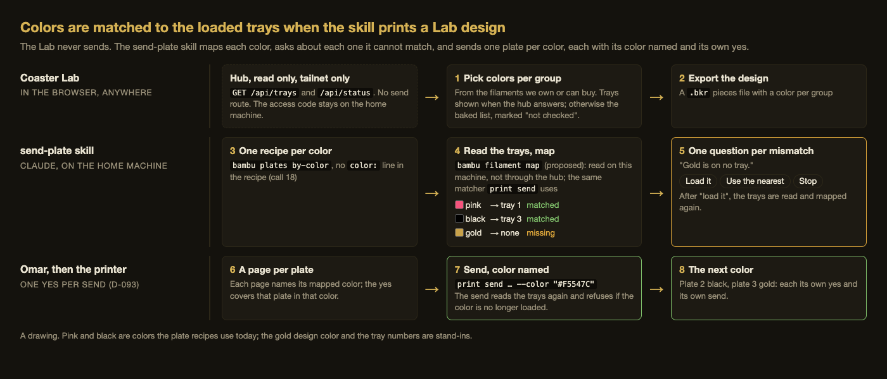

# Print-time color map: matching a Lab design's colors to the loaded trays

> **Status: draft, written from Omar's picks of 2026-10-08.** Only build step 1 (call 18, §8) is
> built; the rest is not. The parts
> already built that it leans on are named in §2. Its open calls are in §12, and they are only
> the ones Omar has not answered.

## 1. What Omar decided

On 2026-10-08, answering calls 16 to 19 of the
[2026-10-06 open-calls page](../../working-model/feedback-requests/2026-10-06-open-calls.md#19-how-the-lab-learns-which-colors-are-loaded),
Omar asked: "can there be a color mapping process that runs when our claude skill takes lab stuff
and tries to print it?" He then picked these:

- **Call 19: map colors at print time.** The Lab offers colors from the filaments we own or can
  buy. When the print skill takes a Lab design, it reads the printer's trays on this machine and
  maps each design color to a loaded tray. For each color that does not match, it asks Omar one
  question: load it, use the nearest, or stop. Then it makes one plate per color, and each is sent
  with its color named.
- **The Lab never sends.** He asked, "lab won't be sending prints directly right?" Right: sends
  stay in the send-plate skill, one yes per send
  ([D-093](../../working-model/decisions-log.md#d-093--omars-yes-to-a-send-lives-on-the-plate-page-one-per-send)).
- **A read-only printer API, in the hub.** He asked, "or should we host an api that wraps our
  printer on our tailscale network?" and picked: read-only, inside 3d-model-hub. It serves the
  trays and the status. It has no send route, and the printer's access code stays on the home
  machine. It builds on the hub's live printer read (hub step 1, task #74), which comes first.
- **Call 18: the color is always picked at the send.** This is not what is built today; §8 lists
  what changes (task #244).
- **Call 16: one plate per color.**
- **Call 17: a color per group now, per piece later.**

This doc says how those fit together. It does not re-ask any of them.

## 2. The flow, end to end

*A drawing ([source](print-time-color-map-media/flow.html)), not a screenshot of anything built.
Pink and black are colors the plate recipes use today. The gold design color and the tray numbers
are stand-ins.*

1. **The Lab: pick a color per group.** The Coaster Lab already offers each group a color "from
   the loaded trays or the full Bambu catalog"
   (`bikar:packages/lab/src/coaster-piece-colors.ts:L3 "from the loaded trays or the full Bambu catalog"`).
   Its "loaded trays" are a list baked into the Lab
   (`bikar:packages/lab/src/color-themes.ts:L101 "export const TRAYS"`), marked in the code as
   standing in "until call 4 says how the Lab reads the printer's"
   (`bikar:packages/lab/src/coaster-piece-colors.ts:L93 "until call 4 says how the Lab reads the printer's"`).
   That call 4 is call 19 on the 10-06 page, now answered: the Lab asks the hub (§6, §7). A color
   no tray holds already gets the line "Not on a tray: load before the send. It still exports."
   (`bikar:packages/lab/src/coaster-piece-colors.ts:L361 "Not on a tray: load before the send. It still exports."`).
   That stays: a design can carry any color, and the map at print time decides. "Can buy" is the
   Bambu catalog of 314 colors (`docs/design/coaster/themes/catalog/catalog.yaml`). A spool we own
   that is not in that catalog joins the list once the shelf of owned spools has a home, which
   waits on call 20 of the same page.
2. **The Lab: export the design.** A `.bkr` pieces file with a palette color per group. This is
   built.
3. **The skill: one recipe per color.** `bambu plates by-color` writes one plate recipe per color
   (`3d-models:tools/bambu/src/commands/plates.ts:L97 "async function runByColor("`). With
   `--json` it already prints each recipe's name, path and design color
   (`3d-models:tools/bambu/src/commands/plates.ts:L146 "color: r.plate.color.hex"`). After call 18
   the recipe file itself no longer carries a `color:` line (§8). The design color travels in the
   JSON and the recipe's name.
4. **The skill: read the trays and map.** It reads the trays on this machine through the `bambu`
   command, not through the hub (§3). Each design color is matched to a loaded tray by the same
   matcher the send uses (§4).
5. **The skill: one question per mismatch.** For each design color without a clean match, it asks
   Omar with AskUserQuestion: load it, use the nearest, or stop (§5).
6. **A page per plate, and Omar's yes.** Each plate gets its review page, and the page names the
   color it will print in, which is the mapped tray's color. His yes covers that plate in that
   color.
7. **The send, color named.** send-plate runs `print send … --color "#RRGGBB"` with the mapped
   tray's color. The send reads the trays again and refuses if that color is no longer loaded
   (`3d-models:tools/bambu/src/commands/print.ts:L411 "✗ filament:"`).
8. **The next color.** Each plate is its own yes and its own send.

The send's re-read is the gate (step 7); the map at step 4 is a plan. The trays can change between
the map and the send, which may be days apart. When they do, the send refuses, the skill maps that
one plate again, and if the color changes the old yes no longer covers it (§5).

## 3. Who owns the mapping, and where the code lives

**The matching stays in one code path.** The send already matches a plate's colors to the loaded
trays: `reconcile` pairs each color with a tray
(`3d-models:tools/bambu/src/filament-sync.ts:L153 "export function reconcile("`), using plain RGB
distance (`3d-models:tools/bambu/src/filament-sync.ts:L81 "export function colorDistance("`), and
`planAmsMapping` refuses rather than guess
(`3d-models:tools/bambu/src/filament-sync.ts:L272 "export function planAmsMapping("`). A second
matcher in a Python script would be two code paths that can disagree. Then the skill could promise
a plate in pink and the send could refuse it. So the map is a new verb on the same code:

- **New in the `bambu` command:** `bambu filament map --colors <by-color JSON> --json`. It reads
  the trays the way `bambu filament` does (it prints `{ams, vt_tray, vir_slot}`,
  `3d-models:tools/bambu/src/commands/filament.ts:L84 "vir_slot: r.vir_slot"`). It runs
  `reconcile` with each design color as a one-color plate and prints one row per design color:
  status, tray, tray hex, distance, and the nearest tray when there is no match. It is read-only,
  like `bambu filament`.
- **New in the send-plate skill:** a script, color_map.py, in the skill's own scripts folder. It
  runs `plates by-color --json` on the design, calls `bambu filament map`, and turns each row that
  is not `matched` into one question. It writes the answers to a color-map.json beside the
  recipes in `build/`, writes or updates each plate's page with its color, and lists each send's
  `--color`. SKILL.md gets a "From a Lab design" section and a "Scripts, when to use each" table
  with the exact command.

**Why send-plate, not a new skill or print-model.** send-plate already owns the filament check
(step 4.2, `bambu filament-sync`) and already passes `--color` for a recipe with no color
(`3d-models:.claude/skills/send-plate/SKILL.md:L97 "picked at the send"`). Putting the map in the
same skill means one skill reads the trays at the plan and again at the send. A new skill would
split that reading across two skills. print-model plans a print up to the owner's gate and never
sends; it does not own the trays. This choice is easy to undo, since the script can move later.

**What it does not do.** It never runs `print send --yes`. It never writes a yes. The Lab never
reaches it: the Lab is a web page and cannot run a command on this machine.

## 4. The map: how a design color finds a tray

Each design color goes through `reconcile` as a one-color plate, against every loaded tray at once.
`reconcile` uses each tray at most once, across all the colors, so two design colors cannot both
claim one tray without the skill noticing.

**Default:** a design color matches a tray when their RGB distance is at most 60, the tolerance the
send already uses ([`MATCH_TOLERANCE = 60`](https://github.com/omars-lab/3d-models/blob/90ab01f4b5e0cb566a394a982a2078d6e76110d3/tools/bambu/src/filament-sync.ts#L61)),
and a match is ambiguous when a second tray is within 15 of the best
([`AMBIGUITY_MARGIN = 15`](https://github.com/omars-lab/3d-models/blob/90ab01f4b5e0cb566a394a982a2078d6e76110d3/tools/bambu/src/filament-sync.ts#L63)).
The same numbers at the plan and at the send mean a map that passes here also passes there.

That 60 was set for a different question. In the send it answers "is this the spool the slice
expected", which a few shades of drift should not break. Here it answers "is this tray close enough
to the color Omar picked in the Lab". These two questions match only when the design color came
from the same filament list the trays hold. That holds when the Lab's color came from a tray or the
Bambu catalog: the catalog hex and the tray's reported hex come from the same Bambu codes. It does
not hold for a color typed in by hand. There, 60 can call two colors a match that look different
side by side. The code's own comment says a perceptual measure would track the eye better
(`3d-models:tools/bambu/src/filament-sync.ts:L78 "A weighted/CIELAB metric would track perception better"`).
Whether to keep 60 is open call 1 (§12).

The statuses `reconcile` gives, and what the skill does with each:

| Status | What it means | What the skill does |
|---|---|---|
| matched | one tray within 60, and no second within 15 of it | maps it; no question |
| missing | no tray within 60 | asks: load it / use the nearest / stop |
| ambiguous | two trays both close | asks which tray, plus stop |
| material-mismatch | close color, different material | asks: load the right material / use it anyway / stop |
| low-remain | the tray is under 10% | maps it and says so on the plate page; no question |

**Edge cases.**

- **Two design colors, one tray.** If two Lab colors both sit nearest one tray, `reconcile` gives
  that tray to the closer color, and the other comes back missing or matched to a farther tray. The
  skill says this in the question ("gold and tan both want the gold tray"), because answering "use
  the nearest" would print two groups the same color.
- **A spool with no tag.** A tray with no RFID tag reports whatever color was set by hand
  (`remain` is -1 for these). Its hex is only as right as that setting. The skill shows "no tag"
  beside such a tray in the question.
- **After "load it".** Omar loads the spool. The skill reads the trays again and maps every color
  again, since loading one spool can unload another.
- **The design uses more colors than trays.** Fine: one plate per color means the trays only need
  to hold the color of the plate being sent. The map reports which colors are loaded now and which
  need a swap before their send. "Load it" can mean "before that plate's send", not "now".

## 5. The questions

One AskUserQuestion per design color that is not matched, asked one at a time. Each question names
the design color, the group it colors, the nearest tray and its distance, and whether that tray has
a tag. The options, with what each leads to:

| Option | What happens | What it leads to |
|---|---|---|
| Load it | The skill waits, reads the trays again, and maps again | The plate prints in the color designed |
| Use the nearest | The plate is mapped to the nearest tray's color | The plate page says "designed gold, prints in the nearest tray's yellow"; the yes covers the tray color |
| Stop | Nothing more is mapped; no page is written | The recipes stay in `build/`; nothing was sent |

The answers go in color-map.json: one row per design color with the design hex, the tray, the tray
hex, the status, the answer, and the time the trays were read. The plate page shows the same row.
Omar's yes on that page covers that plate in that tray color. The skill records the color with the
yes: `plate_approve.py` gains a `--color` that puts the color into the yes row's "Covers" cell.
Without it, a yes on a recipe with no color would not say which color it allowed, after call 18.

**When the trays change before the send.** The send refuses (step 7). The skill maps that plate
again. If the new map gives the same tray hex, the yes still covers it. If it gives a different
color, that is a new color, and the old yes does not cover it. This matches
[D-103](../../working-model/decisions-log.md#d-103--a-custom-order-prints-one-plate-per-color-so-each-new-coloring-gets-its-own-yes),
where each new coloring gets its own yes.

## 6. The read-only hub API

**What is there today.** The hub is a small web server on the home machine. It is bound to
127.0.0.1:4717, and its README publishes it to the tailnet with `make tailnet-serve`, using
Tailscale Serve and never Funnel, so only devices signed in to the tailnet reach it. Its
`GET /api/status` (server/src/app.ts L61 at 5193db4) runs `bambu status show --json` with a
45-second timeout (server/src/bambu/adapter.ts L164). It copies the fields it shows one by one, and
it returns a fixed reason, never the raw error text, when the read fails. Concurrent requests
share one read (`inFlight`, app.ts L60). The hub holds no secret of its own: the `bambu` command
it runs decrypts this repo's `.env`, so the access code never leaves the home machine.

**What is added.** The trays are already in the output the hub reads: `status show --json` prints
the whole status frame, AMS units included. The hub drops them today. The addition:

- `GET /api/trays` returns `{ ok, trays, readAt }` from the same read as `/api/status`, sharing
  its `inFlight`, so asking for both costs one printer read.
- Each tray is copied field by field into a fixed shape, never spread from the raw frame:
  `where` ("AMS 1 slot 2" or "external"), `index` (the number `--ams-mapping` takes), `hex`
  (#RRGGBB), `type` ("PLA"), `subBrand` ("PLA Basic"), `infoIdx`, `remain` (a percent, or null
  for a tray with no tag), and `tagged` (true or false).
- Failures use the same fixed reasons as `/api/status`.

**What is not added.** No send route, no route that changes a printer setting, nothing that writes.
The hub's own rule says the app never passes `--yes`. The new route keeps that, and the check in
§10 tests for it.

**It comes after hub step 1.** The live printer read on the hub page is built, and running it is
Omar's step (task #74,
`3d-models:docs/working-model/feedback-requests/2026-09-29-open-calls.md:L197 "run the live printer read on the hub page"`).
The tray route reuses that read, so it is only as live as that read is: until the hub reads the
printer, the route has nothing to serve. The hub README also notes that macOS may block a
background `node` from the local network until it is allowed under Local Network settings. The
same applies here.

## 7. How the Lab reaches the API, and what happens off the tailnet

**On the tailnet.** The Lab page, opened in a browser on a device signed in to the tailnet, fetches
`https://<machine>.<tailnet>.ts.net/api/trays`. The hub answers it only if it allows the Lab's
address. Today the hub enables no cross-site requests at all: "no CORS is enabled, so another
site's form cannot post here" (app.ts L4). The change allows cross-site reads on the two GET
routes, `/api/trays` and `/api/status`, and only from a fixed list of Lab addresses. The POST
routes keep refusing cross-site requests. With trays in hand, the Lab marks each catalog color
"loaded" or "not loaded" and shows when the trays were read.

**Off the tailnet.** The fetch fails: a phone on cell data without Tailscale, or any visitor to the
public Lab. The Lab then falls back to what it does today. It offers the full catalog, shows the
baked list as "loaded, not checked", and shows "tray status unknown". Picking and exporting work
the same. Nothing is lost, because the real map happens at print time on the home machine. The
Lab's tray marks are a hint, not a promise.

This is the same split the order design already uses for "Add to order": on a device that can
reach the hub it opens the hub, and anywhere else it shows a link to send
(`3d-models:docs/design/coaster/order-driven-lab-design.md:L222 "Send this link to the shop to order"`).
That one is a navigation, though, and this one is a fetch, so it needs the hub to allow it.

**Two things not checked here.**

- **The Lab's hosted address.** I did not find the address the Lab is served from, so the
  allowed-address list is not written here. It is part of open call 2.
- **Browser rules for a public page reading a private address.** A tailnet address is in the
  100.64.0.0/10 range. Chrome has been adding checks before a public page may read a private or
  local address. I have not confirmed whether those checks treat a tailnet address as private, or
  whether they need an extra header or a permission prompt. The first build must test this in a
  real browser, on the real Lab address, against the real hub, before the Lab's tray marks are
  called done.

## 8. What call 18 changes in the built code

Call 18 picked "always at the send". What is built writes the color into the recipe for a
per-color plate. The changes, which are task #244:

1. **The recipe writer stops writing `color:`.** Before call 18, `recipeText` wrote a
   `  color:` line under `profile:`. It now writes a header line in its place
   (`3d-models:tools/bambu/src/by-color.ts:L255 "${COLOR_AT_SEND}"`), and the type comment says the
   hex goes in the recipe's title, never its profile
   (`3d-models:tools/bambu/src/by-color.ts:L141 "never its profile"`). One writer serves
   both `plates by-color` and `bambu order plan`, so both change, and so does
   `.claude/skills/color-themes/scripts/theme_plates.py`, which calls `plates by-color`. The
   design color stays in the recipe's name (`<prefix>-<code or hex>`), its comment header, and the
   `--json` output.
2. **The recipes that carry a color today.** Sixteen files in `docs/design/plates/` have a
   `color:` line: phones-01, phones-02, and fourteen `theme-*.yaml`. They need three different
   treatments:
   - **The fourteen theme plates** have no yes on their pages (only "proposed" and "sliced" rows),
     so removing their color is a recipe edit with nothing to reset
     ([D-097](../../working-model/decisions-log.md#d-097--a-recipe-changes-in-place-as-a-numbered-iteration-and-the-change-resets-the-yes)).
     Their slice pictures will then show the preset's default color, not the theme color.
     Their pages need to say the color in words.
   - **phones-02** is a production plate with a standing yes. Its recipe is frozen, and a change
     is a new experiment plate
     ([D-095](../../working-model/decisions-log.md#d-095--production-plates-have-a-standing-approval-their-recipe-is-frozen-and-a-change-is-a-new-experiment-plate)).
     Removing its color would end its standing yes. That is open call 3.
   - **phones-01** prints two colors from one plate. `--color` cannot pick for it, because it
     throws on a plate with more than one filament
     (`3d-models:tools/bambu/src/filament-sync.ts:L125 "export function chooseColor("`). Its
     colors stay in its recipe, as the one exception, mapped with `--ams-mapping` at the send.
3. **The send refuses a one-color plate with no color named.** Before call 18, a plate sent with
   no `--color` printed in the slice's own color, Studio's default green, which is the
   preset's color set by `setFilamentColor`
   (`3d-models:tools/bambu/src/commands/slice.ts:L156 "export function setFilamentColor("`). Under
   "always at the send", printing green because nobody named a color is a silent default. So
   `print send` refuses a one-color plate whose recipe has no color unless `--color` or
   `--ams-mapping` is given, dry run too
   (`3d-models:tools/bambu/src/color-at-send.ts:L59 "and this one names none"`). It already
   refused both at once
   (`3d-models:tools/bambu/src/commands/print.ts:L290 "--color and --ams-mapping both pick the spool"`).
4. **send-plate's step 4.2 text** changes from "a recipe with no `color:` is one whose color is
   picked at the send" to "every one-color plate's color is picked at the send".
5. **The compose field stays.** `PlateProfile.color` in `slice compose`
   (`3d-models:tools/bambu/src/commands/compose.ts:L55 "the color(s) the slice carries"`) is still
   needed by phones-01. It stops being written for one-color plates.

## 9. Build order

Highest value for the work first. Each step is usable alone.

| Step | What | Where | Why this order |
|---|---|---|---|
| 1 | Call 18 (§8): the writer, the sixteen recipes, the send's refusal, the skill text | 3d-models | Small, and every later step assumes recipes carry no color |
| 2 | `bambu filament map` and its tests | 3d-models `tools/bambu` | The one matcher; usable by hand before any skill calls it |
| 3 | send-plate's color_map.py, the questions, color-map.json, pages, and `plate_approve.py --color` | 3d-models skill | Makes Omar's call 19 real from a terminal, with no hub work |
| 4 | Hub step 1 running (Omar's), then `GET /api/trays` | 3d-model-hub | Needs the live read first |
| 5 | The Lab fetches trays, with the fallback and the browser check of §7 | bikar `packages/lab` | A hint on the screen; the least load-bearing step |

## 10. Checks

**Validator:** every design color comes out as exactly one plate, sent in its mapped tray color.
This is checked plate by plate: for each design color in the `plates by-color --json` output,
color-map.json has one row, that plate's page names that row's tray hex, and the send's `--color`
equals it. No two design colors share a tray hex unless Omar answered "use the nearest" for both.
A count of plates against a count of colors does not discharge this.

PASS: a three-color gBV design with pink and black loaded and gold missing. The map gives pink →
tray 1 and black → tray 3, and asks about gold. Omar answers "load it", the skill maps again, and
gold → tray 2. Three rows, three pages, three different `--color` values, each equal to its
row's tray hex.

FAIL: a design with gold #C8A24A and tan #C9A44C, with one gold tray loaded. A matcher that takes
each color's nearest tray on its own maps both to the gold tray. That gives three plates for three
colors, so the count check passes, but two plates carry the same `--color`. The per-plate check
fails with "gold and tan both on the gold tray". With `reconcile`, which uses each tray once, tan
comes back missing and is asked about instead.

**Validator:** the hub's tray route serves only the listed fields and the hub has no route that
sends or writes to the printer. A test lists the server's routes and compares them to a fixed set
(`/health`, `/api/status`, `/api/trays`, `/api/records`, `/api/plates`, the picture route,
`POST /api/verdict`). It then reads a `/api/trays` reply built from a recorded status frame and
compares every tray's keys to the eight in §6.

PASS: the routes match the set, and every tray has exactly the eight keys
`where, index, hex, type, subBrand, infoIdx, remain, tagged`.

FAIL: an adapter that copies each tray with `{ ...tray }` passes through the frame's own tray
fields, such as the tag's id. The key comparison fails on the first extra key. A route added as
`POST /api/print` fails the route comparison.

**Validator:** the Lab keeps working off the tailnet. With the hub unreachable, the Lab lists the
catalog, labels the baked trays "not checked", and exports a design.

PASS: the hub's address refuses the connection; the color list still opens, a catalog color can be
picked, and the export downloads.

FAIL: a Lab that waits on the tray fetch before it fills the color list shows an empty list until
the request times out. The check fails on the empty list.

**Validator:** call 18 holds. Every recipe `plates by-color` writes has no `color:` line, and
`print send` refuses a one-color plate given neither `--color` nor `--ams-mapping`.

PASS: by-color on gBV writes three recipes, none with `color:`; a dry-run send of one of them with
no `--color` refuses with a reason that names `--color`.

FAIL: the same dry run with the refusal missing prints "matched" against a green tray, which is
the slice's default green and not a color anyone picked. The check fails because the send did not
refuse.

## 11. Read against itself, and what transfers

- **The map and the send agree by construction.** Both run `reconcile` with the same two numbers
  (§4). The doc's PASS example in §10 uses only statuses that `reconcile` gives.
- **"The Lab never sends" holds through every step.** The Lab's only new call is a GET (§7). The
  only route the hub adds is a GET (§6). The skill never passes `--yes` (§3).
- **Call 16 and the questions.** One plate per color means a design with more colors than trays is
  not a failure (§4). Each plate needs only its own color loaded at its own send.
- **Call 17.** The map works on design colors, not groups. When per-piece color arrives, a piece
  taken out of its group is one more design color in the `--json` output, and nothing here
  changes.
- **The tolerance transfers only for catalog colors.** §4 says when 60 carries over from "the
  same spool" to "the color Omar picked": when both hexes come from Bambu's own codes. For a
  hand-typed color it does not transfer, which is open call 1.
- **Hub off.** The skill does not need the hub (§3); only the Lab's hint does (§7). That is why
  open call 4 is a convenience question, not a blocker.

## 12. Open calls for Omar

Only what his 2026-10-08 picks left open. The recommended option is first in each.

### Call 1. The color-match rule

| Option | Pros | Cons | What it leads to |
|---|---|---|---|
| **Nearest by RGB within 60, the send's own rule** (recommended) | Already built and used by every send; the plan and the send can never disagree | Set for "same spool", not "same look"; a hand-typed color can match a tray that looks different | No new code; a hand-typed color gets a "not from the catalog" note in its question |
| Exact filament: the same line and color code | Never a surprise color; the yes means one exact spool | A tray without a tag reports only the color set by hand; I have not checked that the tray report carries the five-digit color code at all | Needs that check first; untagged spools always ask |
| By eye: a perceptual distance (CIELAB) | Closer to what Omar sees | A second distance next to the send's; the plan could pass and the send refuse unless the send changes too | Both the map and the send move to the new distance together, or the map is only a hint |

Recommended because it keeps one matcher. The cost is a weaker answer for hand-typed colors, and
the question says so when it happens.

### Call 2. How the Lab may read the hub on the tailnet

| Option | Pros | Cons | What it leads to |
|---|---|---|---|
| **The hub allows cross-site reads on its two GET routes, from a fixed list of Lab addresses** (recommended) | The Lab shows live trays; the POST routes stay closed; Tailscale Serve stays as built | Needs the Lab's address written into the hub; needs the browser check of §7 | The first build tests a real browser on the real Lab address |
| The hub opens the Lab with the trays in the link | No cross-site read at all; works like "Add to order" | Not live: the trays are as old as the link; one more click from the hub | The Lab reads trays from its link, beside the share state |
| The hub serves its own copy of the Lab | Same address, so no cross-site rules | A second place the Lab is published; it can drift from bikar's | The hub grows a Lab build step |

Also part of this call: whether a phone counts. A phone signed in to Tailscale reaches the hub like
any other device. A phone without it falls back (§7).

### Call 3. phones-02 under "always at the send"

| Option | Pros | Cons | What it leads to |
|---|---|---|---|
| **Leave phones-02 frozen with its color, as a production plate** (recommended) | Its standing yes holds (D-095); nothing printed again to prove it | One more exception besides phones-01; its color is in the recipe, not at the send | The send checks that a `--color`, if given, equals the recipe's; the rule reads "always at the send, except frozen production plates" |
| Remove its color and derive a new experiment | One rule with no frozen exception | Ends its standing yes; it prints as an experiment until graded again | A new plate page, and a print to grade it |

### Call 4. Must the hub always run?

| Option | Pros | Cons | What it leads to |
|---|---|---|---|
| **No: the Lab works without it; the hub is a convenience** (recommended) | Nothing is blocked when the home machine sleeps; the map at print time is the real check | The Lab's tray marks are often "unknown" away from home | The fallback of §7 is the normal case, not an error |
| Yes: keep the hub up and treat it being down as a fault | Live trays whenever the Lab is open on the tailnet | The home machine must stay awake and on the network; a fault shows when it does not | A check that pages when the hub is down, and a decision about the machine's sleep settings |
