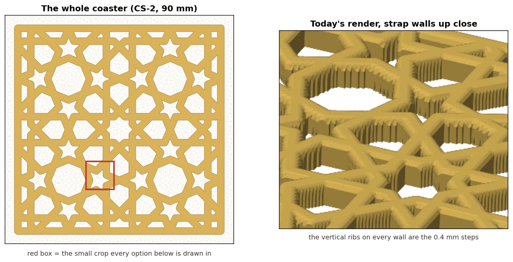
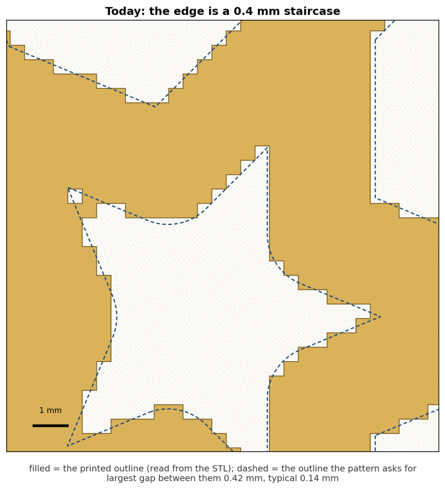
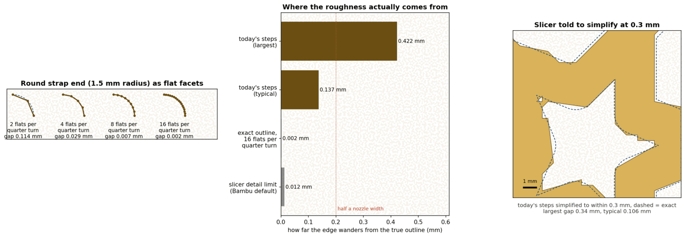
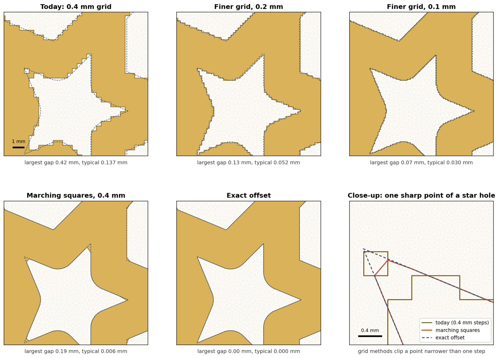
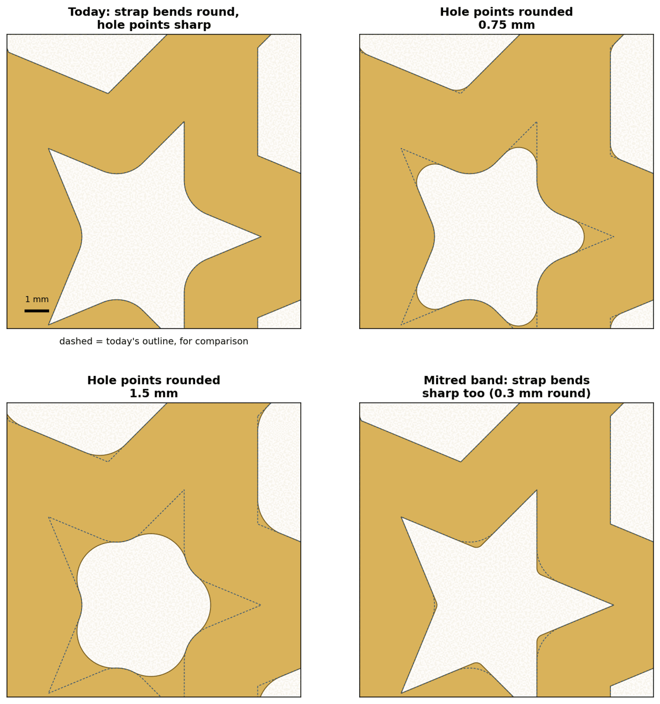
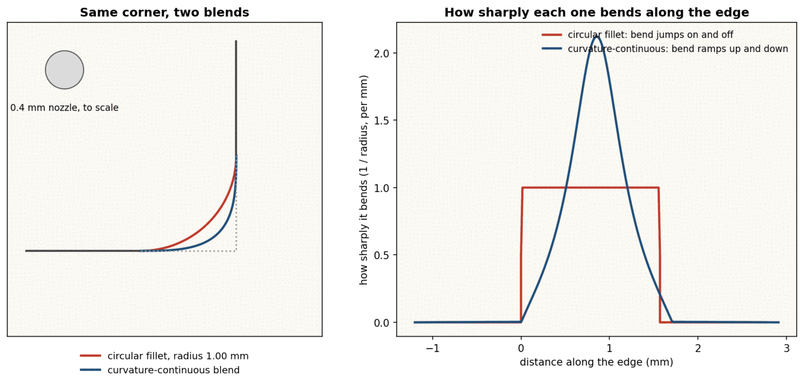
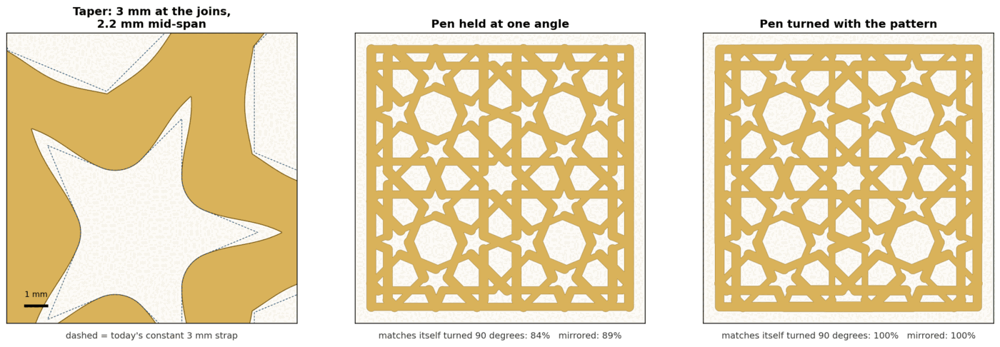
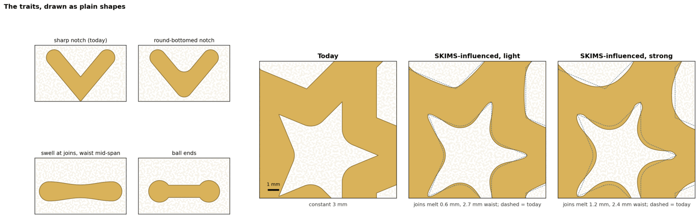
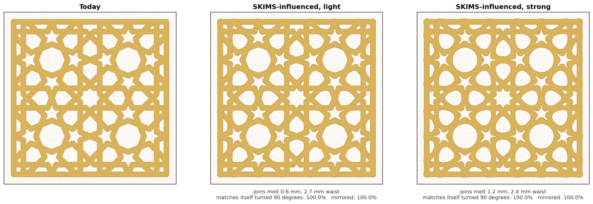
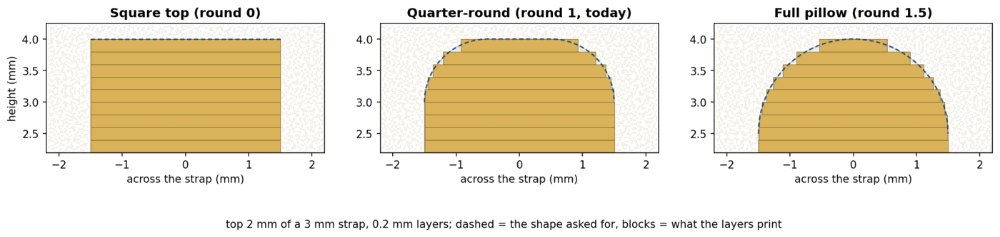

# Smoother lines on the coasters — options (researcher A)

Omar, 2026-09-29: "when it comes to our lines... put together options for making them smoother.
Web search and prepare a design.md with options and screenshots we can review in Obsidian. One of
the options should be lines influenced by the SKIMS font design."

*Status: researcher A's pass, one of two independent ones; a checker consolidates them. Nothing
here is built or printed. Sources, quotes and the full table of measurements:
[../../research/smooth-lines-research-a.md](../../research/smooth-lines-research-a.md). Every
picture is our own drawing or a render of our own coaster; no SKIMS or maker image is copied.*

## 0. The answer in one screen

**Why the lines look rough today.** bikar builds a coaster by checking a grid of points 0.4 mm
apart and keeping the ones that land on a strap. Every strap wall therefore follows the grid, as a
staircase of 0.4 mm steps. On the CS-2 coaster, the printed outline wanders from the true outline
by 0.14 mm on a typical point and up to 0.42 mm at the sharp points of the star holes. That is
ten or more times bigger than anything the mesh or the slicer adds, and the slicer cannot remove it,
because the steps are in the model it is given.

**So the order is:** fix the edge first (option A), then decide how the lines should *look*
(options B to E). A shape choice made before the edge is fixed would still print as a staircase.

| Option | What it changes | Smoother? | Keeps the symmetry? | Keeps the Islamic look? | Size of the change in bikar |
|---|---|---|---|---|---|
| [A. Smooth the edge](#a-smooth-the-edge-the-real-fix) | how the wall is traced | yes, the main win | yes | yes, it is today's shape, drawn true | A1 small, A2 medium, A3 large |
| [B. Round or sharpen the corners](#b-round-or-sharpen-the-corners) | the hole points and strap bends | softer points, or crisper ones | yes | small radius yes; large radius turns stars into flowers | small to medium, after A |
| [C. Let the width vary](#c-let-the-width-vary) | strap width along its length | a hand-drawn swell | only if the "pen" turns with the pattern | yes, it reads as calligraphy | medium |
| [D. SKIMS-influenced strap](#d-skims-influenced-strap) | soft melted joins and a slight waist | the softest look | yes (measured 100%) | light: yes; strong: the octagons become circles | medium |
| [E. The top of the strap](#e-the-top-of-the-strap) | the rounded top edge | only once A is done | yes | yes | small, but tied to A |
| [F. Mesh and slicer settings](#f-mesh-and-slicer-settings) | facets, arc fitting, contour simplify | no | — | — | none |

**Recommendation:** build A3 (an exact strap outline, the way the interlock coaster already builds
its outer ring), then offer D-light and a small hole-point rounding as style knobs — and print one
edge coupon before choosing between them.

## 1. Where the roughness comes from

Every option below is drawn in the same 12 mm crop (the red box): one six-point star hole with
its neighbours. The render on the right is today's bikar output at the gallery camera; the
vertical ribs on every wall are the grid steps.

The filled shape is read straight from today's STL; the dashed line is the outline the pattern
asks for (every strap drawn as a 3 mm band with round ends). The worst spot is a star point, where
a single grid cell is left hanging off the tip. Our simulation of the grid matches the STL to one
cell in this crop, so the other pictures, which use the same simulation, are a fair comparison.

The bar chart ranks the layers: the grid steps (0.42 mm worst, 0.14 mm typical) against the
flat facets of a fine mesh (0.002 mm) and the slicer's own detail limit (0.012 mm, the Bambu
Studio default read from the app's profiles). Half a nozzle width (0.2 mm) is marked because a
round 0.4 mm bead cannot draw detail much finer than that on an outside corner.

## A. Smooth the edge (the real fix)

Three ways to trace the wall, all keeping today's shape:

- **A1. Finer grid.** Sample at 0.2 or 0.1 mm instead of 0.4. Still a staircase, just smaller:
  largest gap 0.13 / 0.07 mm, typical 0.05 / 0.03 mm.
- **A2. Marching squares.** Keep the 0.4 mm grid, but place each wall point *between* two grid
  points, where the strap edge actually falls (the grid already knows how far each point is from
  the edge). Typical gap drops to 0.006 mm — the edge looks exact — but a star point narrower than
  one grid step still gets clipped: largest gap 0.19 mm (see the close-up).
- **A3. Exact outline.** Draw each strap as a true band (straight sides, round ends), merge them,
  and build the wall along that outline instead of the grid. Gap 0 by construction.

| | A1 finer grid | A2 marching squares | A3 exact outline |
|---|---|---|---|
| **Pros** | one number changes; no new geometry code; the grid's internal knob already exists (`gridPitchMm`) | nearly exact edges at today's grid size; no new library | exact edges and sharp star points; the only option that makes the later corner and width options clean; follows the interlock coaster's exact ring |
| **Cons** | still steps; roughly 4× the triangles at 0.2 and 16× at 0.1 (today's STL is 6.8 MB, so an estimated 27 MB / 100+ MB — not measured); slower renders | clips star points narrower than 0.4 mm by up to 0.19 mm; the top surface still has to be cut to meet the slanted wall; saddle cells (two straps nearly touching) need a rule | the most code: a polygon offset and merge step, and the cell tops must be stitched to the exact wall along every hole, not just one ring |
| **What it commits us to** | a bigger mesh everywhere; the grid pitch stops being "one nozzle width", so the reason written next to it (below) has to be rewritten | a second way of tracing walls beside the staircase one, unless the staircase path is retired | a polygon library (or our own offset code) in the kernel; retiring the staircase wall for plain coasters |
| **Symmetry** | kept | kept | kept |
| **Islamic look** | kept | kept, star points slightly blunted | kept exactly |

**Where the code changes (bikar `bikar/packages/core/src/kernel3d/coaster.ts`, read at e2b65c4):**

- A1: the constant `COASTER_GRID_PITCH_MM` at L200, or a naqsh clause that sets the spec's
  `gridPitchMm`. A few lines, plus re-checking every validator that counts cells.
- A2: `boundaryLoops` (L1462) and `emitWall`, which today walk cell sides; they would walk the
  interpolated crossings instead, and `emitTopCells` would need part-cells along the edge. A few
  hundred lines.
- A3: a new outline builder next to `distToStraps` (L629), then a plain-coaster version of what
  `assembleInterlock` (L2180) does for its ring: `emitExactWall` for every loop and a collar that
  joins the cell top to it. Several hundred lines and the most tests.

**Transfer check on the grid size (K10).** The comment beside the constant says the pitch is one
nozzle width because that is "the finest lateral feature the nozzle can place". That reason is
about how *narrow* a strap can be. It does not carry over to *where* a strap's edge sits: a 3 mm
strap can start at 10.13 mm as easily as at 10.0 mm, because the slicer moves the nozzle in
steps far smaller than its width (the Bambu default contour detail is 0.012 mm). So the grid size
is right for deciding what exists and wrong for placing edges — which is why A2 and A3 keep the
grid for the first job and stop using it for the second.

**This is backlog item 7** in [the catalog-expansion backlog](../../tasks/catalog-expansion/backlog.md),
which measured the same staircase on CS-1's outer sides (`tools/edge_stairs.py`) and is waiting on a
look at a printed edge. The same coupon settles both.

**Validator:** the edge check for A — points every 0.05 mm along each wall loop of the STL, each
measured to the exact outline; the result is the largest gap *per loop*, not one average over the
coaster (an average would hide one bad star point among hundreds of good edges).
PASS: every loop's largest gap is at most 0.05 mm — A3 gives 0 on the CS-2 crop.
FAIL: any loop over 0.05 mm — today's 0.42 mm at a star point fails, and so does A2's 0.19 mm at
the same point, even though A2's typical gap (0.006 mm) is far below the limit.

## B. Round or sharpen the corners

A strap pattern has two kinds of corner. Where a strap bends, the outside of the bend is already
round (bikar draws each strap with round ends). Where straps meet around a hole, the hole's points
are sharp. The options change one or the other.

- **B1. Round the hole points** by a set radius (grow the solid by r, then shrink it by r). At
  0.75 mm the star still reads as a star with soft tips; at 1.5 mm it becomes a flower-shaped blob.
- **B2. Mitred band** — the textbook way to draw strapwork: straight band ends, sharp mitred
  bends (Kaplan & Salesin: "we must perform a mitered join"), with a 0.3 mm rounding so the nozzle
  can follow it. Crisper, not softer; included because it is the traditional reading and the
  opposite choice to B1.

- **B3. Curvature-continuous blend.** A normal round-off (a circle arc) switches its bend on and
  off suddenly; a curvature-continuous blend ramps it up and down (right panel). Car and product
  designers use it because a reflection runs across the corner without a visible kink. At 1 mm,
  though, the two curves differ by less than the width of the nozzle drawn to scale beside them,
  and the ramp needs a sharper peak (about 2.1 per mm against the circle's 1) that the bead may
  not follow. On a printed coaster the difference is most likely not visible — an inference, not a
  measured result.

| | B1 round the hole points | B2 mitred band | B3 curvature-continuous blend |
|---|---|---|---|
| **Pros** | softer, friendlier feel; hides any leftover point roughness; one number to tune | the traditional look; crisp, architectural | the smoothest-reading curve in theory |
| **Cons** | above ~1 mm the stars stop reading as stars | sharper bends print a little rounded anyway (a round nozzle leaves about half its width as a radius on outside corners); crisper is the opposite of what was asked | at coaster scale it looks the same as B1; needs its own curve code |
| **What it commits us to** | a `round`-style knob on the pattern outline, with an upper limit to protect the stars; the minimal design's note that "a fillet there is a second offset and is not asked for" changes | building the band from line segments rather than round-ended strokes | a curve builder we would use nowhere else |
| **Symmetry** | kept (the same radius everywhere) | kept | kept |
| **Islamic look** | kept at 0.3–0.75 mm, lost at 1.5 mm | the strongest | kept |

**Where the code changes:** B1 and B2 are two extra offsets of the outline A3 builds — tens of
lines once A3 exists, and messy on the grid without it. B3 needs its own corner-finding and curve
code, a few hundred lines. The minimal-coaster design already lists sharp hole points as a known
gap ([coaster-minimal-design](coaster-minimal-design.md), "Reflex corners are sharp").

## C. Let the width vary

- **C1. Taper.** Wider at the joins (3 mm), narrower mid-span (2.2 mm). The straps look drawn
  rather than stamped, and the joins look stronger.
- **C2. Calligraphic, pen held at one angle.** Width depends on the strap's direction, as with a
  broad-nib pen held at 30°. It breaks the pattern's symmetry: the coaster matches itself turned
  90° only 84% and mirrored only 89%. **Not recommended**; shown so the reason is visible.
- **C3. Calligraphic, pen turned with the pattern.** The same effect, but the pen's angle is
  measured from the line toward the coaster's centre, so it turns as the pattern turns. Symmetry
  back to 100% / 100%.

| | C1 taper | C3 pen turned with the pattern |
|---|---|---|
| **Pros** | hand-drawn feel; stronger joins; keeps the pattern's rhythm | a real calligraphic contrast that still respects the symmetry |
| **Cons** | the narrowest point must stay above the printable floor (1.6 mm, CAL-CST-07); a thinner middle is weaker | harder to explain as a knob; the thin parts must also stay above 1.6 mm |
| **What it commits us to** | width becoming a function along each strap, not one number; the exact outline (A3) or a finer grid to draw it smoothly | the same, plus a centre point per pattern |
| **Symmetry** | kept | kept (measured 100%) |
| **Islamic look** | kept | kept; reads as calligraphy |

**Where the code changes:** `distToStraps` (L629) and `signedInset` (L645) would read a width
that varies along each strap. A hundred or so lines in the field; the pictures were made that way.

## D. SKIMS-influenced strap

**The wordmark and who made it.** SKIMS is Kim Kardashian's shapewear brand; its wordmark dates
from the end of 2019. It is custom lettering, not a font you can buy ("most probably not a font",
dafont forum). In 2019 Kardashian said of Kanye West (now Ye), "For SKIMS, he drew the logo"
(quoted by Complex, 2025); Wikipedia also credits him with the logo. That he drew it by hand is in
search snippets only. The design sources describe heavy capitals of even weight, "fully rounded"
ends, "very tight spacing", a slight slant and a little hand-made irregularity — a soft bubble
feel. See the [SKIMS logo on 1000logos](https://1000logos.net/skims-logo/) and the
[mojomox write-up](https://mojomox.com/skims-font) for the real thing; nothing of it is copied here.

**What carries over from a 2D wordmark to a printed strap, and what does not (K10):**

| Trait | Carries over? | Why |
|---|---|---|
| Even, heavy strokes | yes — already true | our straps are one width, 3 mm; the wordmark's even weight is what we have |
| Soft, melted joins (the inside of a join has a rounded bottom, not a sharp notch) | **yes, the core of this option** | a blend between neighbouring straps at each join; it is a 2D outline change, and a printer draws a rounded inside corner as easily as a sharp one |
| A slight swell toward the joins and a waist mid-span | yes, gently | the same as the C1 taper; kept to 2.7 mm at the waist so the strap stays well above the 1.6 mm floor |
| Fully rounded ends | nothing to do on CS-2 | CS-2 has no free strap ends — every strap ends in a join or the frame; on patterns that do, bikar's ends are already round |
| The slant | **no** | slanting the straps breaks the pattern's turn and mirror symmetry (the same failure as C2) |
| Hand-made irregularity | **no** | it would make the eight repeats differ; the symmetry is the pattern |
| Very tight spacing | **no** | it would close the holes; Omar has rejected near-solid pieces |

The blend is done with a "smooth minimum" of the two nearest straps at each point. The usual
formula gives a different answer depending on which strap is blended first (Quilez notes these
blends are "not associative"), which would break the symmetry; taking only the two nearest,
sorted, avoids that. The outer frame keeps a constant width, so the coaster's edge stays square.

Both strengths match themselves turned 90° and mirrored 100%. At **light** (joins blended over
0.6 mm, 2.7 mm waist) the stars keep their points and the whole piece softens. At **strong**
(1.2 mm, 2.4 mm waist) the octagons become circles and the small polygons become pebbles — the
SKIMS feel is unmistakable, but much of the Islamic reading goes with it.

| | D-light | D-strong |
|---|---|---|
| **Pros** | a softer, contemporary look that still reads as the pattern; hides grid roughness at the joins | the clearest SKIMS reference; very tactile |
| **Cons** | subtle — may not read as "SKIMS" to a customer | stars stay, but octagons and polygons lose their straight sides; the pattern reads as blobs |
| **What it commits us to** | a style knob (blend width, waist) on the coaster; the exact outline (A3) or a fine grid so the soft curves are not stepped | the same; and a product call on whether a coaster this far from the source pattern is still ours |
| **Symmetry** | kept (measured 100%) | kept (measured 100%) |
| **Islamic look** | kept | largely lost |

**Where the code changes:** the blend replaces the plain nearest-strap distance in `distToStraps`
(L629) with a blend of the two nearest, plus the waist from option C1. About a hundred lines in the
field. Without A, the soft curves print as a staircase like everything else.

## E. The top of the strap

bikar already offers a rounded top edge (`round`, 0 to 1.5 mm; today 1). Across the strap it
prints as terraces of 0.2 mm layers — a normal FDM staircase in height, the same for every maker.

Along the strap, though, the renders show the rounded edge following the grid too: its top line
is a saw-tooth, because the round-over is worked out per grid cell (`topEdgeDrop`, L864). A rounder
top alone does not make the lines smoother; with A3 the round-over would be built along the exact
outline and would then read as a clean bevel.

| | Keep round 1 | Full pillow (round 1.5 on a 3 mm strap) |
|---|---|---|
| **Pros** | today's look; a flat top reads the pattern clearly | the softest top; pairs well with D |
| **Cons** | — | the pattern reads less crisply from above; the rule `2·round ≤ strap` leaves no flat on a 3 mm strap |
| **What it commits us to** | nothing new | nothing new — it is an existing knob |

**Where the code changes:** none for the knob. Making the round-over follow the exact outline is
part of A3's work (the collar has to carry the round-over, not a flat top).

## F. Mesh and slicer settings

These were checked because they are the usual advice for "smoother prints". None of them helps
here.

- **More facets.** A 1.5 mm round end drawn with 16 flats per quarter turn is within 0.002 mm of a
  true circle — already far below what the printer can show. bikar's round ends are not the
  problem.
- **Arc fitting** (the slicer sends real arcs instead of many short lines). On the X2D Bambu Studio
  turns it off by itself when the printer's curve planning is on (Bambu forum: "automatically
  disabled arc fitting"). Either way it smooths the *motion* along curves already in the model; it
  cannot turn a 0.4 mm staircase into a slope.
- **Contour simplify** (the slicer's `resolution`, 0.012 mm by default). Loosening it to 0.3 mm
  in our trial (right panel of the picture in §1) left a jagged edge that is still wrong: typical
  gap 0.106 mm against today's 0.137, largest 0.34. The trial used the standard Douglas–Peucker
  simplify; Bambu's own simplifier was not read. It would also coarsen every other model on the
  plate.

Not measured: whether the printed wall *shows* the 0.4 mm steps. A round 0.4 mm bead softens
outside steps, so the print may be smoother than the STL. That is the one question a print
settles, and it is the same coupon backlog item 7 is waiting for.

## G. What other makers do

None of the 12 Printables Islamic-coaster listings surveyed here says anything about smoothing a
stepped edge, rounding hole points or arc fitting; one offers "square and round corners" for the
coaster's outline, and one prints at 0.12 mm layers "for sharp detail". Their files come from CAD
or vector tools, so their edges are most likely exact to begin with — our staircase comes from
building the coaster as a grid. Laser-cut and CNC coasters (Etsy, snippet only) get rounded inside
corners from the cutter's radius, whether wanted or not. Listing ids and what each says:
[research §7](../../research/smooth-lines-research-a.md#7-what-other-makers-do).

## H. Order of work, and what each step verifies

1. **Print one edge coupon** of today's CS-2 corner and look at it and feel it. Verifies whether
   the staircase shows on a real print (the open question in F and backlog item 7). If it does not
   show, A drops to a nice-to-have and D becomes a pure style choice.
2. **Build A3** for plain openwork coasters, using the interlock's exact wall as the pattern.
   Verified by the per-loop edge check in A.
3. **Add D-light and B1 (0.3–0.75 mm) as knobs** on top of A3, each with the whole-coaster symmetry
   check (turned and mirrored overlap must stay 100%) and a look at the render before it goes on a
   plate.
4. D-strong, C3 and B2 are offered as looks, not defaults; each is a taste call for Omar.

## I. How the pictures were made

All figures come from `make_figures.py` in the media folder, reading a CS-2 render of bikar-main
(read-only, rendered into a scratch folder with `render … --format stl|svg|preview --param size=90`
and `--param round=0|1|1.5` for the previews). Shrunk with
`magick … -resize 1400x -strip -colors 64 PNG8:…`. Run it with `--svg`, `--stl`, `--previews`
(three PNGs, comma separated) and `--out`; `--only fig02` redraws one figure. It prints the
measured numbers quoted in this doc as it goes.
