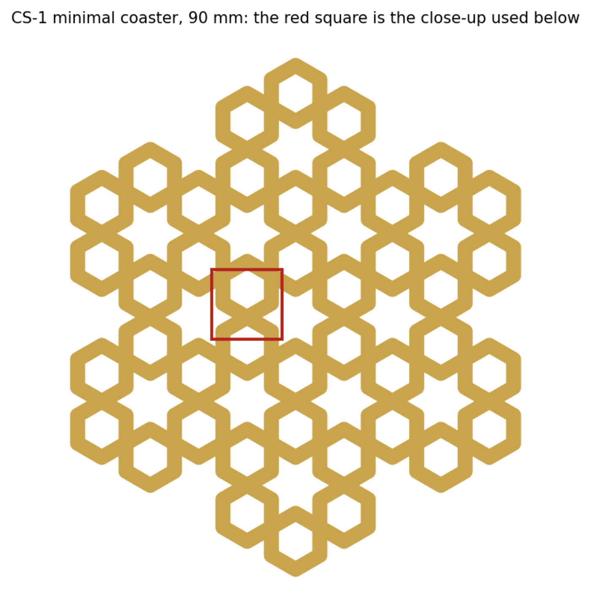
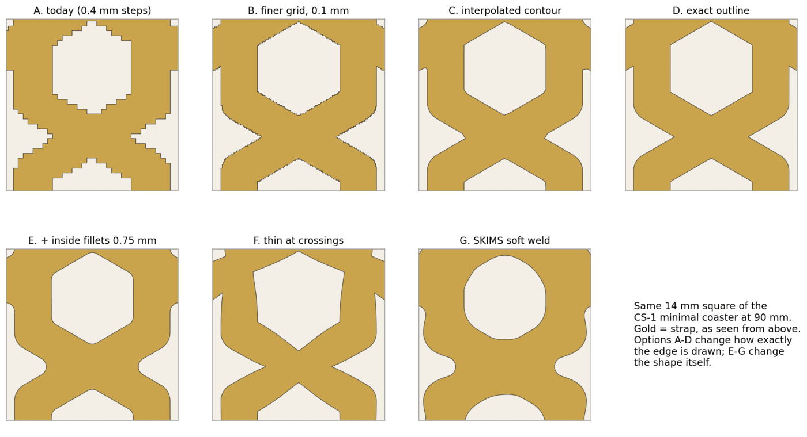
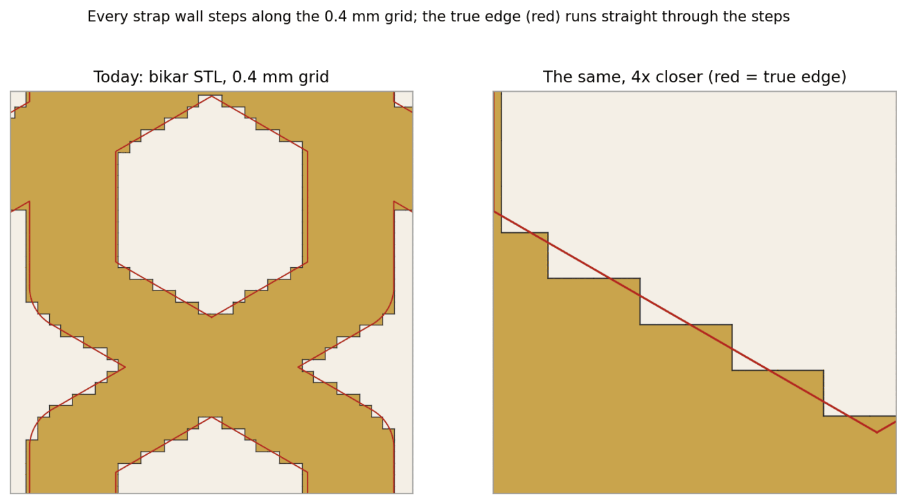
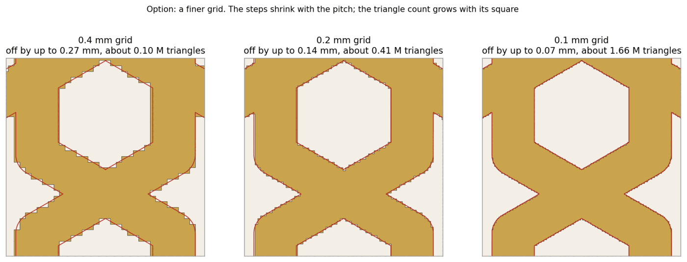
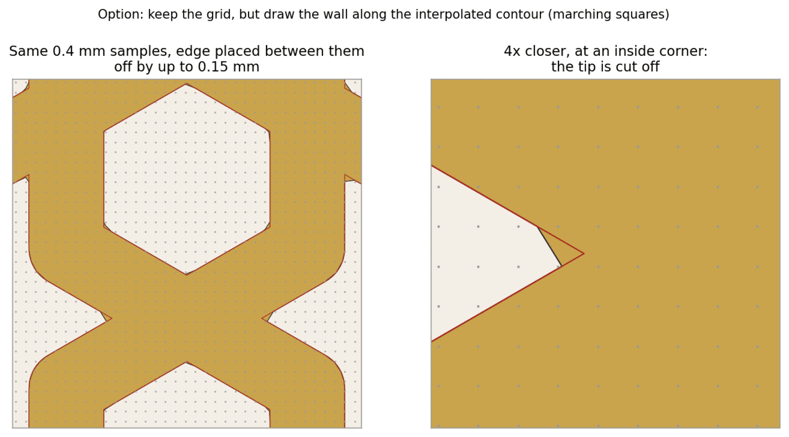
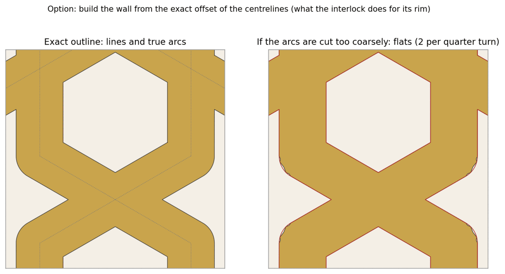
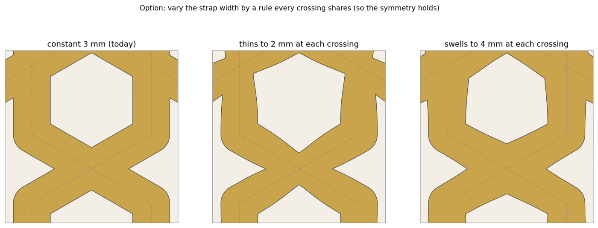
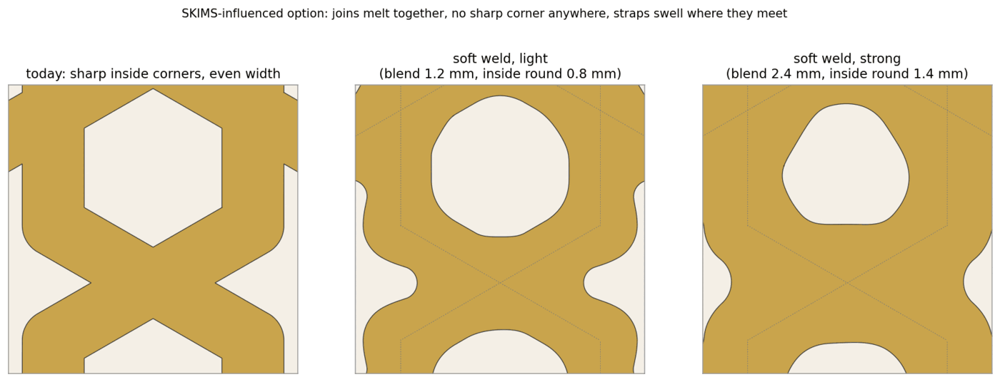
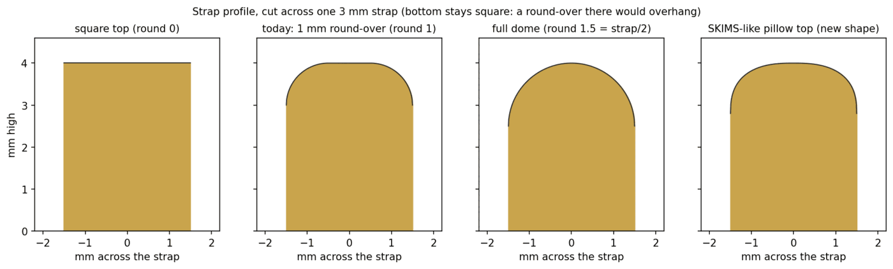
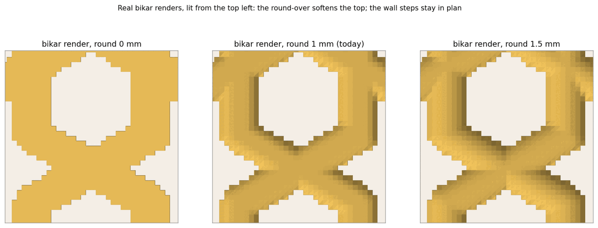

# Smoother strap lines on the coasters (researcher B)

**Status:** research draft, 2026-09-29. Nothing here has been printed or sliced. It is one of two
independent write-ups on the same question. The sources and every measurement are in
[`../../research/smooth-lines-research-b.md`](../../research/smooth-lines-research-b.md), each web
source marked as a fetched page or a search snippet. No decision id is taken here.

**The question** (Omar, 2026-09-29): "when it comes to our lines... put together options for
making them smoother", with one option "influenced by the SKIMS font design".

## In short

- **Why the lines look rough.** bikar builds every coaster on a grid of 0.4 mm squares, and a
  square is either strap or not. So every strap wall that runs at a slant comes out as a
  staircase, not a straight line. On the CS-1 minimal coaster the wall strays up to **0.27 mm**
  from where it should be, and 0.13 mm on average. The top round-over softens the top edge but
  cannot move the wall off the staircase.
- **The slicer cannot fix this.** Arc fitting and curve planning smooth how the nozzle moves along
  the outline it is given, and the outline it is given is the staircase.
- **The fix is in bikar**, in how the wall is drawn. The cheapest real fix (option C) keeps the
  grid but draws the wall between the grid points, where it really is. That cuts the average
  stray from 0.10 mm to 0.005 mm in the same crop, at today's triangle count.
- **The SKIMS option** (G) takes three traits of the SKIMS wordmark that make sense on a printed
  strap: joins that melt together, a swell where straps meet, and a pillowy top. It leaves out the
  two that do not: the slant, which breaks the mirror symmetry, and the tight spacing, which would
  close the open cells.
- **Recommendation, in one line:** build C first, because it removes the staircase on every strap
  and is the machinery the shape options need; then add inside fillets (E) as a knob, and the
  SKIMS soft weld (G) as a style on top of it.

All pictures show the same 14 mm square of the CS-1 minimal coaster (`GimTvN9hw4U`, 90 mm across,
3 mm straps), so they can be compared side by side. Gold is strap, seen from above. A red line is
the true edge.

## All options side by side

| Option | Changes | Worst / mean stray from the true edge | Keeps the symmetry? | Where the change is | Size (my estimate) |
|---|---|---|---|---|---|
| A. Today | nothing | 0.27 / 0.10 mm | only mirror-and-quarter-turn; the grid differs between the six rotated copies | none | none |
| S. Slicer settings only | toolpath | 0.27 / 0.10 mm, or worse | a coarse setting makes left and right differ | print profile | none in bikar |
| B. Finer grid | how finely the edge is drawn | 0.14 / 0.045 mm at 0.2; 0.07 / 0.022 mm at 0.1 | better, still grid-bound | a naqsh clause for the grid | small, but a much bigger file |
| C. Wall drawn between grid points | how exactly the edge is drawn | 0.15 / 0.005 mm (the worst only at sharp inside corners) | nearly exact | bikar coaster kernel | medium |
| D. Exact outline | how exactly the edge is drawn | exact, to the arc tolerance chosen | exact | bikar coaster kernel plus a 2D union with holes | large |
| E. Inside fillets | the shape | not a stray option; changes the true edge | yes | kernel plus a naqsh knob | medium on C |
| F. Width varies at crossings | the shape | same | yes, if one rule applies at every crossing | kernel plus a naqsh knob | medium on C |
| G. SKIMS soft weld | the shape | same | yes | kernel plus a naqsh style | medium on C |
| H. Top profile (dome, pillow) | the top only | does not touch the wall | yes | none today (dome); kernel for the pillow | none / small |

The stray numbers are measured on the real bikar STL (A) or on a simulation that reproduces the
real STL to 0.003 mm² in this crop (B, C, S). How, in
[research §1](../../research/smooth-lines-research-b.md#1-our-own-measurements-the-part-that-matters-most).

## A. Today: every strap wall is a staircase

The kernel decides each 0.4 mm square from its centre: strap if the centre is within half the strap
width of a pattern line. The side walls then follow the square edges. A wall along the grid comes
out straight; a wall at a slant (most of an Islamic pattern) comes out in steps one square high.
This is the same staircase `tools/edge_stairs.py` measured on a slab coaster's outer rim, and the
same 0.27 mm. The minimal coaster has it on every strap, inside and out.

The grid itself is only symmetric under quarter turns and mirrors. A six-fold pattern's six rotated
copies therefore get six slightly different staircases. At 0.27 mm this is small, but it is a
symmetry break the pattern does not have.

**Why the 0.4 mm grid was chosen, and why it does not settle wall position (K10).** The kernel's
comment says the pitch is one perimeter width, "the finest lateral feature the nozzle can place,
so sampling at the perimeter width resolves every strap the machine can actually lay down." That
reasoning is about which features exist: a strap narrower than a line cannot print. It does not
transfer to where a wall sits. The nozzle's path is not limited to 0.4 mm positions; our slicer
keeps outline detail down to 0.01 mm (research §1.4). So the grid can stay at 0.4 mm for deciding
features, while the wall is drawn somewhere finer.

## S. Slicer settings only

| | |
|---|---|
| **What it smooths** | How the nozzle moves along the outline. Arc fitting turns short straight moves into arcs; curve planning on the X2D does something similar in firmware. |
| **Pros** | No bikar change. Curve planning is described by Bambu's own release notes as better "especially on rounded features". |
| **Cons** | There is no curve in a staircase to find. Our minis-04 slice used resolution 0.01 mm, far below the 0.4 mm step, so every step reaches the nozzle. A coarse resolution (the right panel, 0.25 mm) cuts across the steps, but unevenly: the left and right sides of the same crossing come out different, which breaks the symmetry. Arc fitting is called "effectively lossy" on the Bambu forum, and on the X2D curve planning reportedly switches arc fitting off (user reports, no Bambu statement). |
| **Commits us to** | Nothing, and it verifies nothing: no measurement of the file changes. Worth doing only after C or D, when the outline has real curves to fit. |
| **Symmetry and reading** | Fine resolution: unchanged. Coarse: breaks left–right symmetry. |

## B. A finer grid

| | |
|---|---|
| **What it smooths** | The staircase shrinks with the grid: steps half as tall at 0.2 mm, a quarter at 0.1 mm. |
| **Pros** | The kernel already has the setting (`gridPitchMm` in the coaster spec); only a naqsh clause to set it is missing. Also refines the rounded top, which is drawn on the same grid (option H). |
| **Cons** | Still a staircase, just finer. The file grows with the square of the refinement: today's 103,524 triangles (5 MB) becomes about 0.41 M (about 20 MB) at 0.2 mm and about 1.66 M (about 80 MB) at 0.1 mm. Those are scaling estimates, not renders. Render time, the mesh gate and the Coaster Lab preview all pay for it. |
| **Commits us to** | A new clause, and a bigger file on every coaster that uses it. It is a dial, not a fix: the rough edge is still there at 0.07 mm. |
| **Where** | The naqsh grammar (a grid clause passed through to `gridPitchMm`) and the pitch rule's comment in `bikar/packages/core/src/kernel3d/coaster.ts`. Small. |
| **How we would check it** | The stray measurement in research §1.3, on a real render at the new pitch. |

## C. Keep the grid, draw the wall between the grid points

The kernel already knows, at every grid point, how far that point is from the strap's edge. Today
it only asks "inside or out?". Asking "where between these two points does the edge cross?" places
the wall where it really is. This is the standard marching-squares method; it is what turns a blocky
grid drawing into a smooth one.

| | |
|---|---|
| **What it smooths** | Every wall, inside and out. Mean stray 0.005 mm against today's 0.097 mm in this crop. |
| **Pros** | Same grid, same sample count, roughly the same triangle count: the wall's corners move, they are not multiplied. Works for any shape the kernel can compute a distance for, so it is also the drawing method for E, F and G. |
| **Cons** | A sharp inside corner, where two straps meet at an angle, gets its tip cut off (the close-up): worst stray 0.15 mm, only there. E removes those corners, so C and E together have no weak spot. The top surface near the wall has to be cut along the new wall rather than square by square, which is the bulk of the work. |
| **Commits us to** | A new wall-and-edge path in the coaster kernel. The interlock coaster already has a precedent: its outer ring is an exact wall joined to the grid top by a flat collar (`emitExactWall`, `assembleInterlock`; [interlock design §5](coaster-interlock-design.md#5-kernel-change)). |
| **Where** | `bikar/packages/core/src/kernel3d/coaster.ts`: the cell classification stays, the wall emitter and the top cells along the edge change. Medium. |
| **How we would check it** | The same stray measurement on a real render; the mesh gate must still pass (watertight, no zero-area triangles). |
| **Symmetry and reading** | Nearly exact symmetry: the interpolation error is far smaller than the grid step. Straight straps stay straight. |

## D. Build the wall from the exact outline

Each strap is a pattern line widened by half the strap width on each side, with round ends. The
union of all of those is the exact outline. OpenSCAD's `offset(r=…)` does this in one line, and
Clipper2 is the common library for it.

| | |
|---|---|
| **What it smooths** | Everything: straight walls are straight, round ends are true arcs. |
| **Pros** | Exact; the reference the other options are measured against. |
| **Cons** | bikar has a 2D union (`bikar/packages/core/src/graph/polygon-union.ts`) but it walks the outer perimeter only; the strap network also needs its inner loops, the open cells. Every shape option then needs its own exact construction: an inside fillet is a second offset, and the SKIMS soft weld has no simple exact form. Arcs must be cut into straight pieces: a 1.5 mm strap end needs 28 pieces per half-circle to stay within 0.01 mm (Hubs suggests a deviation of about 1/20 of the layer height, 0.01 mm at 0.2 mm layers) and 13 to stay within 0.05 mm. Too few pieces show as flats (right panel). |
| **Commits us to** | A 2D geometry path beside the grid, and keeping the two in agreement: two ways of computing the same wall is a known source of disagreement. |
| **Where** | `polygon-union.ts` extended to return holes, or a new offset module, plus the interlock-style collar in `coaster.ts`. Large. |
| **Symmetry and reading** | Exact. |

## E. Round the inside corners

Today the outside corners and strap ends are round (a widened line is round at its ends) but the
inside corners, where two straps meet, are sharp. The
[minimal-coaster design](coaster-minimal-design.md#10-not-yet) already names this: a fillet there
"is a second offset and is not asked for". The OpenSCAD recipe is to grow by r and then shrink by r.

| | |
|---|---|
| **What it smooths** | The one kind of corner that is still sharp. |
| **Pros** | A small radius (0.75 mm) reads as a well-finished version of the same pattern: hexagons stay hexagons. It removes C's only weak spot. A rounded inside corner is also easier for a 0.4 mm nozzle to trace than a sharp one (my reasoning, not measured). |
| **Cons** | A large radius (1.5 mm) turns hexagons into rounded hexagons and the X crossing into a waisted joint; it starts to read as a different pattern. It adds material, so the open cells shrink a little. |
| **Commits us to** | A knob with a sensible range, and re-running the open-cell and strap-floor checks with it on. |
| **Where** | The coaster kernel (a closing on the strap shape) and a naqsh knob beside `strap width`. Medium on top of C; large on top of D. |
| **Symmetry and reading** | Keeps every symmetry: the same round is applied at every corner. |

## F. Let the strap width change near crossings

A calligraphic idea: the strap is not one width everywhere. The rule here depends only on the
distance to the nearest crossing, so every crossing gets the same treatment and the pattern's
symmetry holds.

| | |
|---|---|
| **What it smooths** | The joins: straps flow into each other instead of meeting as two bars. |
| **Pros** | Thinning makes the crossing lighter and leaves more open cell; swelling makes it read as one welded joint. |
| **Cons** | The straight straps become curved, which changes the pattern's look more than any other option here. Thinning pushes the strap toward the minimum printable width at every crossing, exactly where the coaster carries its load. None of the sources I read says whether traditional strapwork keeps a constant width, so I make no claim either way. |
| **Commits us to** | A width rule and its range, and a strap-floor check at the thinnest point, not only along the straight run. |
| **Where** | The strap distance in the coaster kernel, plus a naqsh knob. Medium on top of C. |
| **Symmetry and reading** | Keeps the symmetry if one rule is applied at every crossing. Reads as a softer, hand-drawn variant. |

## G. The SKIMS option: a soft weld

### What the SKIMS wordmark is

The SKIMS logo is custom lettering, not a font you can buy. Two fetched pages credit Kanye West with
it; no source I read names a type designer, so treat the credit as reported. Sources call it a
"bubble font" with "soft rounded contours" ([1000logos](https://1000logos.net/skims-logo/)) and
letters like a "silicone mass, slightly spread" ([logos-world](https://logos-world.net/skims-logo/)).
The logo itself: [the SKIMS logo file on SKIMS's Shopify CDN](https://cdn.shopify.com/s/files/1/0259/5448/4284/files/Skims-Logo-Shopify_afa1385f-2e6f-46f3-940e-923f2385bc9b.svg)
(linked, not copied).

What I saw looking at it: heavy capitals with no straight line anywhere; big round bulges with tight,
rounded pinches where strokes meet; S ends that swell past the stroke's waist; a forward lean; and
letters so close that the holes inside them are narrow slits. The repo's
[bubble-lettering research](../../research/coaster-bubble-lettering.md) reads the same look for
putting letters on a coaster; this option applies it to the strap lines instead.

### Which traits carry over to a strap

A trait carries over only where the reason it works on the logo also holds on a printed strap
(K10):

- **Joins melt together: yes.** It is a plan-view shape rule, and a strap network is all joins.
- **Swelling where strokes meet: yes, at crossings.** One rule at every crossing keeps the symmetry.
- **A pillowy top: yes.** The wordmark's 3D versions look inflated, and the coaster already has a
  top round-over (option H).
- **Tight spacing and slit holes: no.** On a coaster the holes are the open cells; closing them
  gives a near-solid piece, which Omar has turned down before.
- **The lean: no.** It breaks the mirror symmetry the pattern is built on.

### What it looks like on our coaster

Built by blending the straps' distances with a smooth minimum (Íñigo Quilez's method) instead of a
hard one, so where two straps meet they melt into each other and swell. A small inside round then
takes off any sharp notch left over. The light version keeps the hexagon and star readable; the
strong one turns the cells into soft blobs.

The fourth profile is the SKIMS-like pillow: straight sides, then a soft, flat-topped dome, rather
than a round-over at each edge. The bottom stays square in every profile; a round-over there would
overhang the plate.

| | |
|---|---|
| **What it smooths** | Every corner and every join; nothing in plan view is sharp. |
| **Pros** | A distinct, soft style that is still clearly our pattern at the light setting. It is built from the same distances the kernel already computes, so on top of C it is a change to one function plus a knob. |
| **Cons** | Adds material at every crossing, so open cells shrink; the strong setting nearly closes the small cells and reads as bubbles rather than as a geometric pattern. The smooth minimum as I drew it is applied pair by pair and depends slightly on the order of the straps; the kernel should use an order-free blend (a sum over all nearby straps, such as the exponential form) so that every rotated copy comes out the same. |
| **Commits us to** | A style name in naqsh, a blend-width knob with a range capped well below where cells close, and re-running the open-cell checks with it on. |
| **Where** | The strap distance in the coaster kernel, a naqsh style clause, and (for the pillow) the top-profile function. Medium on top of C. Not practical on D. |
| **Symmetry and reading** | Keeps every symmetry if the blend is order-free. Light: a softened Islamic pattern. Strong: reads as a bubble pattern. |

## H. The top profile: a dome today, a pillow later

These are real renders from bikar, not a simulation. `round` can already go up to half the strap
width, so on a 3 mm strap `round 1.5` gives a full dome, and the mesh gate passes it (13.4 cm³
against 14.0 today).

| | |
|---|---|
| **What it smooths** | The top edge. It does not touch the wall staircase, which stays the same in plan view (compare the outlines). |
| **Pros** | The dome needs no code: it is `--param round=1.5` today. It is the cheapest way to see a softer strap on the printer. |
| **Cons** | The rounded top is drawn on the same 0.4 mm grid, so a 1 mm round-over gets only two or three samples across: the shading shows bands. Whether that banding survives printing at 0.2 mm layers is not known; nothing was printed. The pillow needs a new profile function. |
| **Commits us to** | Nothing for the dome. The pillow is a small kernel addition, best done with G. |
| **Symmetry and reading** | Unchanged in plan; the top reads softer. |

## Recommendation

**Build C (draw the wall between the grid points) first, because it removes the staircase on every
strap at today's file size and is the machinery E, F and G need; then add E (inside fillets) as a
knob, and G (the SKIMS soft weld, light setting) as a style on top.** Meanwhile, a `round=1.5` dome
print costs no code and shows whether a softer top alone is what Omar is after.

Not recommended: S alone (it verifies nothing and cannot remove the steps); B as the fix (a finer
staircase at up to 16 times the file size); D before C (large, and a second geometry path the shape
options cannot use).

## Not known

- **Nothing was printed.** Whether a 0.27 mm staircase is visible on a real print at all, after a
  0.4 mm nozzle traces it, is the first thing a print would tell us. The measurements here are of
  files.
- **Makers' methods.** None of the maker pages I surveyed (8, listed in research §7) says how the
  maker smooths their lines.
- **Snippet-only claims** (none load-bearing here): Bambu's recommended resolution, that X2D curve
  planning uses splines, Prusa's resolution default, Fusion's export tolerance and sketch-fillet
  behaviour.
