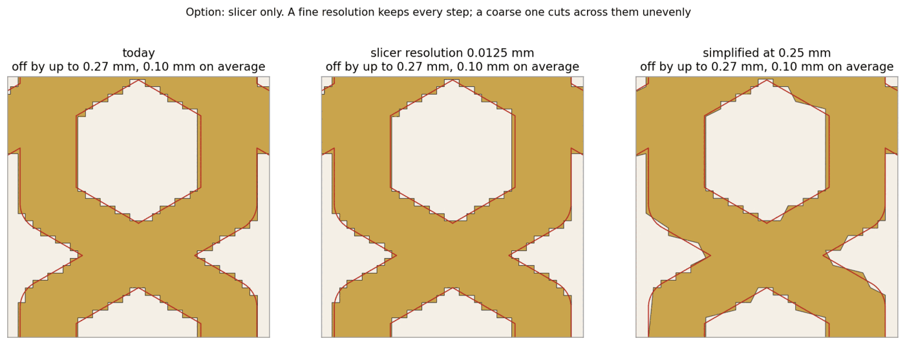
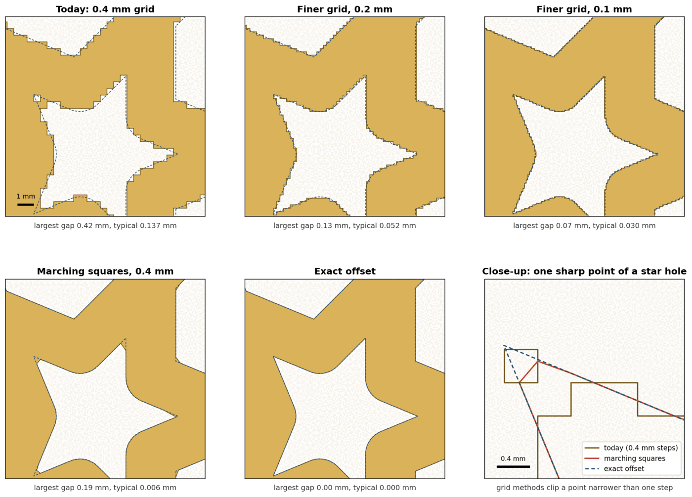
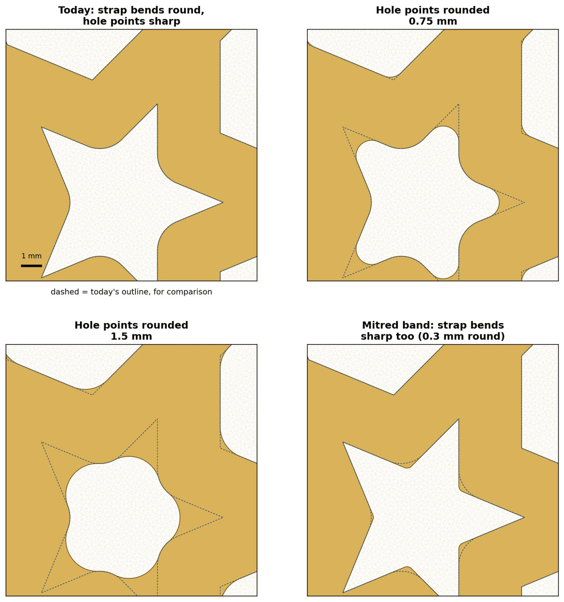
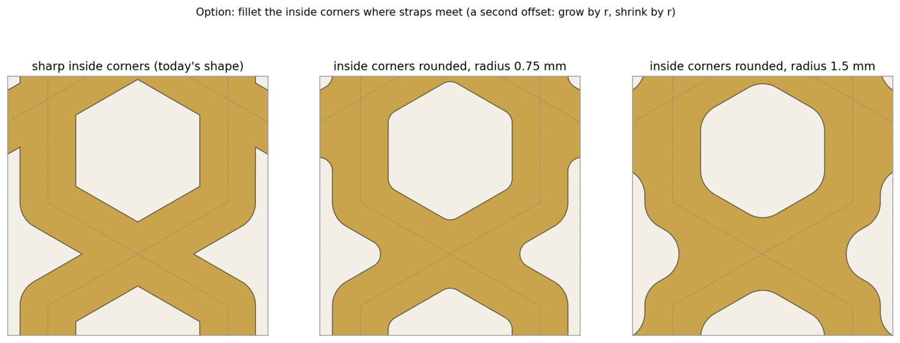
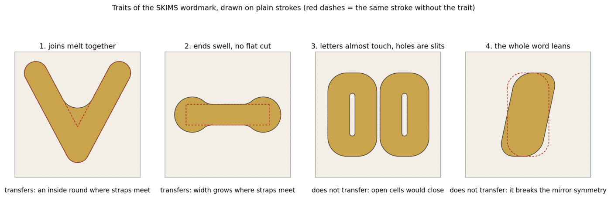
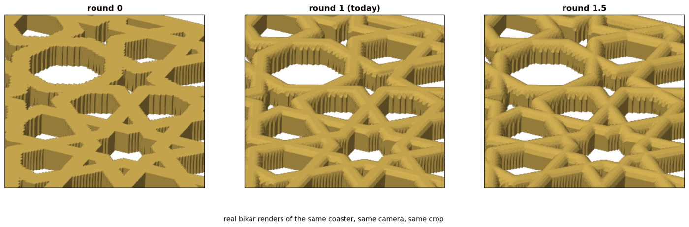

# Smoother coaster lines — the options, side by side

Omar, 2026-09-29: *"our coaster lines are rough; put together options for making them smoother,
with web research and pictures we can review in Obsidian. One option should be lines influenced by
the SKIMS font design."*

*Status: draft, the one to act on. Nothing here is built or printed. It merges two independent
research passes — researcher A ([PR #433](https://github.com/omars-lab/3d-models/pull/433),
measured on the CS-2 coaster) and researcher B
([PR #432](https://github.com/omars-lab/3d-models/pull/432), measured on CS-1) — both merged
2026-09-30 and kept as the record. A checker re-read both, re-opened the sources that decide the order, and re-read the
bikar coaster code at `bikar-main` e2b65c4; what agreed, what did not and what nobody could confirm
is in [smooth-lines-consolidation.md](../../research/smooth-lines-consolidation.md).*

## 0. The answer in one screen

**Why the lines are rough.** bikar builds a coaster on a grid of 0.4 mm squares and decides for
each square, from its centre, whether it is strap or hole. So every slanted edge is a staircase of
0.4 mm steps. Both researchers measured it on real bikar output: the printed outline wanders from
the true one by about 0.1 mm on a typical point (0.10–0.14 mm), and by up to 0.28 mm (CS-1) or 0.42 mm (CS-2) at
the worst point. The slicer cannot remove the steps, because they are in the model it is given.

**What fixes it.** Draw the edge *between* the grid points instead of along them. It keeps today's
grid, today's shapes and today's file size, and brings the typical error from about 0.1 mm to
about 0.005 mm. Its one weakness — it shaves the very tip of a sharp star point — goes away if those
points are rounded a little, which is also a look option in its own right.

**Then the look.** Once the edge is true, the SKIMS-influenced option (joins that melt together,
straps that swell a little where they meet) and the other shape options are small changes on top.

| # | Option | Smoother edge? | Changes the pattern's look? | Recommended? |
|---|---|---|---|---|
| [1](#1-leave-the-model-tune-the-slicer) | Leave the model, tune the slicer | no | no | no — verifies nothing |
| [2](#2-a-finer-grid) | A finer grid | partly (still a staircase) | no | no, except as a quick test |
| [3](#3-draw-the-edge-between-grid-points) | Draw the edge between grid points | yes, the main win | no | **yes — build first** |
| [4](#4-an-exact-outline) | An exact outline | yes, perfect | no | only if star points must stay needle-sharp |
| [5](#5-round-the-hole-points) | Round the hole points | softer points | small at 0.3–0.75 mm; stars become flowers at 1.5 | **yes, as a knob** |
| [6](#6-mitred-bends) | Mitred bends | crisper | yes, sharper | a look to show, not a default |
| [7](#7-let-the-width-vary) | Let the width vary | a drawn feel | yes | a look to show, later |
| [8](#8-skims-influenced-soft-weld) | **SKIMS-influenced soft weld** | the softest look | light: a little; strong: a lot | **light as a style knob** |
| [9](#9-the-top-of-the-strap) | The top of the strap | the round-over softens the top | a little | full dome: try now, no code |
| [10](#10-up-the-wall-layer-lines) | Up the wall: layer lines | a different roughness — the slicer's, not the model's | no | per plate, no code: finer layers, scarf seam; check precise wall on a coupon first |

## 1. Where the roughness comes from

B's close-ups use the square marked on CS-1: two straps crossing, with a hexagon above and below.
A's close-ups use a 12 mm square of CS-2 around one six-point star hole.

**The steps are at the model's grid, not at the printer.** The grid size is one nozzle width
(0.4 mm) because that is "the finest lateral feature the nozzle can place" — the reason written
beside the constant in bikar. That reason is about how *narrow* a feature can be. It does not carry
over to *where* an edge sits: the slicer moves the nozzle in steps far smaller than 0.4 mm (its
detail setting is 0.012 mm in our preset chain and was 0.01 mm in the minis-04 slice,
[print-quality-verification §1.2](../../research/print-quality-verification.md#12-the-sliced-plates-against-the-preset-chain)).
So the 0.4 mm grid is right for deciding what exists and wrong for placing edges.

**Two measurements, two coasters.**

| Edge drawn by | CS-1 crop (B), worst / typical | CS-2 crop (A), worst / typical |
|---|---|---|
| today, 0.4 mm squares | 0.273 / 0.097 mm (whole coaster: 0.277 / 0.126) | 0.42 / 0.137 mm |
| 0.2 mm squares | 0.136 / 0.045 | 0.13 / 0.052 |
| 0.1 mm squares | 0.069 / 0.022 | 0.07 / 0.030 |
| edge between grid points (option 3) | 0.150 / 0.005 | 0.19 / 0.006 |
| exact outline (option 4) | 0 | 0 |

Both "exact" rows were measured in Python's shapely library, not in bikar. Why CS-2's worst is
bigger: when each square is judged from its centre, the edge can be off by at most half a square's
diagonal, about 0.28 mm. CS-1 fits that. CS-2's 0.42 mm does not; the checker's reading is that
bikar's step that closes corner-to-corner pinches filled the square nearest a star tip — inferred
from the code and the picture above (the lone empty square at the upper-left point), not confirmed
by a re-render.

**Not known: whether the steps show on a print.** Nothing was printed. A round 0.4 mm bead softens
steps, so the print may look smoother than the STL. The open backlog item on this
([catalog-expansion backlog, item 7](../../tasks/catalog-expansion/backlog.md)) already waits on
exactly that look at a printed edge.

## 2. The options

### 1. Leave the model, tune the slicer

- **Arc fitting** swaps many short moves for real arcs. It "mainly reduces G code size"
  ([Bambu forum](https://forum.bambulab.com/t/253630)), and on the X2D Bambu Studio turns it off
  on its own when the printer's curve planning is on. Either way it can only follow curves that are
  in the model; a staircase has none.
- **Curve planning** on the X2D gives "better surface quality in certain scenarios, especially on
  rounded features" ([X2D firmware notes](https://forum.bambulab.com/t/250867)) — again, curves in
  the model.
- **Coarser contour detail** cuts across the steps: B's trial at 0.25 mm left the worst gap at
  0.273 mm and treated the left and right sides differently; A's at 0.3 mm left 0.34 mm. It would
  also coarsen everything else on the plate. Neither trial used Bambu's own simplifier.

This is "do nothing" with a setting changed. It checks nothing, so it is not offered as a fix.

### 2. A finer grid

bikar already has a setting for the grid size that nothing in the coaster language sets. Exposing
it is small. But it is still a staircase, just finer, and the file grows with the square of the
refinement: today's CS-1 STL is 103,524 triangles (5 MB); B estimates about 0.41 M at 0.2 mm and
about 1.66 M at 0.1 mm — estimates by scaling, not renders. Rendering, the mesh check and the
Coaster Lab preview all pay for it. Useful as a quick look at "does a finer edge show on a print",
not as the fix.

### 3. Draw the edge between grid points

Each grid point already knows how far it is from the nearest strap. Today bikar only asks "inside or
outside?" of each square's centre. This option asks "where between these two points does the
distance cross zero?" and puts the edge there. The method is called **marching squares**; it finds
each edge point by "linear interpolation between the original field data values"
([Wikipedia](https://en.wikipedia.org/wiki/Marching_squares)).

- **What it gives.** Typical error about 0.005 mm on both coasters (from about 0.1 mm). Same grid,
  same number of squares; only the squares on the edge get a few more triangles.
- **Its weakness.** A sharp star point narrower than one square gets its tip cut off: 0.19 mm on
  CS-2, 0.15 mm on CS-1. By reasoning, not measured: a round nozzle rounds a printed corner anyway —
  one maker discussion puts it at "roughly equal to half the extrusion width"
  ([tchncs](https://discuss.tchncs.de/post/9917920)), about 0.2 mm here. If that holds for a star
  point's tip, the cut may hide inside what the nozzle does anyway. Rounding the points (option 5)
  removes the cut outright.
- **Why it fits bikar.** Two neighbouring squares compute their shared edge point from the same two
  numbers, so the model closes with no gaps by construction. bikar's code already names the one
  awkward case (two solid squares touching only at a corner) and has a step for it; that step would
  be replaced by the standard rule of looking at the square's centre value. The round top follows
  the new edge too, which also fixes a second, smaller staircase A found in the round-over.
- **The shape options ride on it.** Options 5, 7 and 8 all change "how far from the strap is this
  point" — the same number this option traces. So once it is built, each shape option is a change
  to that number, with no extra edge code.

### 4. An exact outline

Build the strap outline as a true polygon — every strap's outline joined, with every hole — and put
the walls on it. Zero error, and needle-sharp star points stay sharp. The interlock coaster already
builds one exact wall this way
([coaster-interlock-design §5](coaster-interlock-design.md#5-kernel-change)).

Why it is not first, from the bikar code:

- The interlock's exact wall takes **exactly one** loop and sits flat at the base; a strap coaster
  has dozens of holes, each needing the round top carried round it.
- bikar's polygon-joining code walks only the **outer** edge, and draws round ends with 6 pieces per
  half circle — about 0.05 mm off on a 1.5 mm round end (checker's arithmetic), so even it would not
  give "zero" as it stands.
- bikar decided in May 2026 not to take a polygon-clipping library and to reuse its own code
  instead; holes mean either reopening that or writing hole-tracing into its own code.
- Every shape option would have to be redone as polygon offsets rather than as a change to one
  number. (A's own SKIMS pictures were drawn by tracing the number, option 3's way.)

The outer ring alone is a different story: one loop, and the outer-edge walk already exists.
That is the route backlog item 7 names for a slab coaster's outer sides.

### 5. Round the hole points

Where straps meet around a hole, the hole's points are sharp; the outside of each strap bend is
already round. A small round on the points (0.3–0.75 mm) softens the look, keeps the stars reading
as stars, and makes option 3 exact at the tips. At 1.5 mm the stars turn into flowers — a different
pattern. A smoother-than-round blend (A's curvature-continuous corner) is possible; A judged it
likely invisible at this size.

### 6. Mitred bends

The traditional way to draw a strap pattern mitres the bends: "Where two thickened line segments
meet, we must perform a mitered join"
([Kaplan & Salesin 2004](https://grail.cs.washington.edu/wp-content/uploads/2015/08/kaplan-2004-isp.pdf)).
bikar's straps have round outside bends today, so they are already a small departure from that.
Mitring (bottom-right of the picture above) makes the pattern crisper, not softer — the opposite of
the ask, offered so the choice is visible.

### 7. Let the width vary

A width that changes along the strap reads as drawn by hand. It only keeps the pattern's symmetry
if the rule is shared by every crossing: a pen held at one angle scored 84% when the coaster is
turned 90° and 89% mirrored (A's measure), so it is not offered; a pen turned with the pattern, a
taper, or a thin or swell at each crossing keep it.

### 8. SKIMS-influenced soft weld

**What the SKIMS mark is.** Custom lettering, not a font you can buy: "It appears to be custom
rather than a licensed retail typeface"
([mojomox](https://fonts.mojomox.com/blogs/brand-fonts/what-font-does-skims-use)). Credited to
Kanye West ([Wikipedia](https://en.wikipedia.org/wiki/Skims)); Kim Kardashian said in 2019, "For
SKIMS, he drew the logo" ([Complex](https://www.complex.com/style/a/tracewilliamcowen/kanye-west-skims-logo-explainer)).
The claim that it is his handwriting is unverified. Its traits, from sources the checker re-opened:
"The strokes are thick and even, with no real thick-to-thin variation. The terminals are fully
rounded, so the letters read as soft rather than engineered", with "very tight spacing" (mojomox);
"a slanted designer typeface with … soft rounded contours" ([1000logos](https://1000logos.net/skims-logo/)).
One source sees it differently — "geometric with subtle humanist touches"
([designyourway](https://www.designyourway.net/blog/skims-logo/)).

**What carries over, and why.** The mark is thick, even strokes that meet; so is a strap pattern.
That is the condition for a trait to carry over, and two traits meet it:

- **joins that melt together** — the inside corner where straps meet fills with a soft curve;
- **a swell where strokes meet** — the strap is a little fuller at the joins, with a slight waist
  between.

Two do not: the **lean** breaks the pattern's mirror symmetry, and the **tight spacing** would close
the small openings — and near-solid pieces are the kind Omar has rejected before. We borrow the
feel, never the SKIMS letters.

The two researchers set "light" and "strong" differently (A: 0.6 / 1.2 mm melt on a 12 mm view of
CS-2; B: 1.2 / 2.4 mm blend on CS-1); the pictures show both. Light keeps the pattern readable;
strong turns CS-2's octagons into circles and CS-1's hexagons into rounded triangles.

**One building rule.** The usual formula for melting two shapes together is "not associative": "the
order in which you blend objects matters" ([Quilez](https://iquilezles.org/articles/smin/)). Blending
straps one after another in file order would make the shape depend on file order. Both researchers
used an order-free form (A: blend only the two nearest straps; B: a sum over nearby straps), and A
measured it 100% symmetric.

### 9. The top of the strap

The coaster language already has `edge fillet $round top`, with `round` from 0 to 1.5 mm (1 today;
the minimal-coaster check CV10 needs 2 × round ≤ strap,
[coaster-minimal-design §6.2](coaster-minimal-design.md#62-cv10--the-round-over-fits-the-strap)).
**`round=1.5` makes a full dome on a 3 mm strap with no code** — the softest top available today.
B measured the model still passes the mesh check at 0, 1 and 1.5. The **pillow top** (flat middle,
soft shoulders) is a new shape; the lettering research proposes the same kind of profile for bubble
letters ([coaster-bubble-lettering](../../research/coaster-bubble-lettering.md)). Until option 3 is
built, the round-over follows the staircase too (visible in the renders).

### 10. Up the wall: layer lines

Omar asked whether this covers the *sides* — the wall a strap shows edge-on — and whether the
optional Bambu settings count. Options 1–9 are all about the outline seen from above. The wall has
a second texture that none of them touches: the layer lines running around it.

**How tall the wall is.** Every coaster file sets `param height = 4 range 1.4..16` (mm), so a
strap wall is 4 mm tall unless a plate says otherwise; minis-04 printed most pieces at 1.4 mm and
the twist at 4 mm ([minis-04 index](../../prints/2026-09-26-minis-04/index.md)). Our layer height
is 0.2 mm — `layer_height` in the flattened X2D preset
`tools/bambu/test/fixtures/minis-04/process.flat.json` (`0.20mm Standard @BBL X2D`) and
`layer_mm: 0.2` in that index. So a 1.4 mm wall is 7 layers and a 4 mm wall is 20, each line
0.2 mm tall beside steps 0.4 mm wide: the wall is stepped both ways.

**Two textures, two owners.** The staircase *across* the wall (options 2–4) is in the model; no
slicer setting removes it (§1). The layer lines *up* the wall are put there by the slicer and the
printer; none of options 2–9 changes them, because they change the outline, not how the wall is
stacked. Fixing one leaves the other. The one place they meet is the round-over top (option 9): a
dome is a slope, and on a slope each layer's outline shrinks, so the layer lines show most exactly
where the top is softest.

**What shows on a 3–5 mm wall.** Three things, all set per plate in Bambu Studio, none needing
the model changed:

1. **The lines themselves**, every 0.2 mm.
2. **The seam**, where each wall loop starts and stops, once per loop per layer. On a coaster
   every hole is its own loop, so every hole wall has a seam of its own; the outer wall has one.
3. **Outer-wall speed marks** — width wobble and ringing on the visible wall.

**The settings, against today's plate.** "Today" is the flattened minis-04 preset above and the
slice's `project_settings.config` beside it. All sources are named in
[smooth-lines-consolidation §5.5](../../research/smooth-lines-consolidation.md#55-the-vertical-wall);
Bambu's own wiki pages for these settings could not be fetched (HTTP 402 on 2026-09-29), so the
wording comes from the OrcaSlicer wiki — the slicer Bambu Studio's Precise Wall was ported from —
and from Bambu forum and issue threads.

| Setting | Today | Can it help *this* wall? | Where the claim comes from |
|---|---|---|---|
| Layer height | 0.2 mm | **Yes.** Finer layers mean "Less noticeable layer lines" and "Smoother surface finishes". A 20-layer wall becomes 33 at 0.12 mm; print time grows with the layer count. Bambu ships finer X2D process presets, but which ones was not checked here. | OrcaSlicer wiki, layer height (fetched) |
| Variable (adaptive) layer height | off (`adaptive_layer_height = 0`) | **Not on the straight wall, yes on the dome.** It varies the layer height with the model's slope; the page says nothing about vertical walls, and a wall whose outline is the same at every height gives it nothing to adapt to — the checker's reasoning, not a source's. Over the round-over's last millimetre it would put finer layers exactly where the lines show most. | OrcaSlicer wiki, variable layer height (fetched) |
| Seam position | `aligned` | **Moves the seam, does not remove it.** A forum user: aligned "puts the seam on the sharpest corner, and works best for most models"; back puts it on the min-Y side but "still seeks out angles on the back side"; random and nearest scatter it. Star holes are all sharp corners, so aligned already tucks each hole's seam into a point. A seam-painting brush exists for hand placement. | Bambu forum 29435 (fetched, a user's account); OrcaSlicer wiki, seam (fetched) |
| Scarf seam | off (`seam_slope_type = none`; `seam_slope_min_length = 10` mm) | **Yes on the outer wall, doubtful on the holes.** It "Reduces visible z-seams" but is "Less effective on sharp corners and overhangs" and "Requires tuning". With today's minimum length, a hole loop shorter than 10 mm gets no scarf. It needs `aligned` or `back`: with Bambu's smart scarf, random or nearest gives no scarf at all (issue #10050, Studio 2.5.0.66). The keys are in the X2D preset chain, so the setting exists for it; whether the X2D filament presets turn it on was not checked. | OrcaSlicer wiki, seam (fetched); BambuStudio issue #10050 (fetched); 3djake guide (fetched) |
| Outer wall speed | 200 mm/s, the first entry of a six-entry list whose other entries were not decoded; `small_perimeter_speed = 50%` | **Yes, a little.** The outer wall "is outermost and visible. It's used to be slower than inner wall speed to get better quality". Small loops are already halved; what counts as small was not checked. | OrcaSlicer wiki, other layers speed (fetched) |
| Precise wall | off (`precise_outer_wall = 0`) | **Maybe, and check the size first.** Made for "improving the dimensional accuracy of prints and minimizing layer inconsistencies" by spacing the inner wall off the outer one; works only with inner-then-outer order, which is ours. But issue #8030 (Studio 2.2.1.60, open, no reply visible) reports that in Bambu Studio "all walls move inward" and the part shrinks, where OrcaSlicer keeps the outer wall in place. On a 3 mm strap with two wall loops, and on an interlock tab, a shrink is a fit change. Whether our 02.08.02.61 behaves the same is not known. | OrcaSlicer wiki, precision (fetched); BambuStudio issue #8030 (fetched) |
| Precise Z height | off (`precise_z_height = 0`) | **No.** It makes the total height exact when the model's height is not a multiple of the layer height, by adjusting the last layers. 4 mm and 1.4 mm are multiples of 0.2 mm, so it would do nothing; it is not a wall-texture setting. Some users report the top layers bulging with it on — snippet only. | OrcaSlicer wiki, precision (fetched); search snippets (not fetched) |
| Curve planning (X2D firmware) and arc fitting | firmware; `enable_arc_fitting = 1`, which Studio turns off when it detects curve planning | **Not until the outline has curves.** "Better surface quality in certain scenarios, especially on rounded features" — and the staircase has none. After option 3 or 4 the hole walls become real curves and this starts to matter. | Bambu forum 250867, 253630 (fetched, §1 of option 1) |

**What to try, no code.** A finer layer height, the scarf seam with `aligned` kept, and the outer
wall slowed a step, all on one plate; precise wall only on a coupon whose size gets measured, because
of #8030. None of this changes what §4 checks — the edge check reads the STL, and the STL has no
layers. A wall coupon is judged by eye and by a measured size.

**No picture here, on purpose.** The renders in figures 14 and 15 have no layers, and the two
minis-03 photos ([index](../../prints/2026-09-26-minis-03/index.md)) are shot from above, where
no layer line can be told apart. The honest picture is a wall coupon photographed edge-on; that is
open call 1's coupon, with a side view added.

## 3. Side by side

| # | What it buys | What it costs or risks | What it commits us to |
|---|---|---|---|
| 1 Slicer only | nothing in the model changes | fixes nothing; a coarse setting makes a wrong, lopsided edge and coarsens every other part on the plate | nothing — and checks nothing |
| 2 Finer grid | quick to expose; halves or quarters the error | still stepped; file about ×4 at 0.2 mm, ×16 at 0.1 mm (estimates); slower renders, mesh check and Lab preview | a new language setting to keep; every check that counts squares sees a different count |
| 3 Edge between points | typical error ~0.005 mm; same grid, same size; model closes by construction; carries options 5, 7, 8 and the round top | shaves sharp star tips by 0.15–0.19 mm; new wall, top and bottom code in bikar's coaster builder; the corner-pinch step is replaced | the builder draws edges from distances, not squares; checks that count squares (they read the grid) now describe a shape a hair different from the printed one — worth a note in those checks |
| 4 Exact outline | zero error; needle-sharp points | the most code: hole-tracing in bikar's own polygon code or reopening the no-library decision; the interlock wall is one loop and flat; each shape option redone as polygon offsets | a second way of building walls beside the grid, for every coaster |
| 5 Round hole points | softer look; makes option 3 exact at the tips | at 1.5 mm the pattern changes; one more knob | a knob per coaster; choosing whether it is on by default |
| 6 Mitred bends | crisper, the traditional drawing | the opposite of "smoother" | a look, not a default |
| 7 Width varies | a drawn feel; symmetry kept with a shared rule | a pen at one angle breaks symmetry (84% / 89%); thinning risks the strap minimum | a width rule in the language |
| 8 SKIMS soft weld | the softest look; symmetric (100% measured); a named style | strong changes the pattern; the blend must be order-free; looks stepped until option 3 exists | a style knob with light and strong settings; the borrowed traits stated so the SKIMS letters are never copied |
| 9 Top: full dome | softest top today, no code | slightly less volume (B: 14.0 → 13.4 cm³ on CS-1); steps still show on the round-over until option 3 | a default change only if Omar likes it; pillow top would be new code |
| 10 Layer lines up the wall | per plate, no code: finer layers hide the lines, scarf seam hides the outer-wall seam, slower outer wall steadies it | more layers, more time; scarf does little on short hole loops and sharp corners; precise wall may shrink the part in Bambu Studio (#8030, unconfirmed on our version) | a plate preset, not a model change; the staircase stays until option 3 or 4, and the layer lines stay whatever 2–9 do |

## 4. How we check it

**Validator:** the edge check. Sample each wall loop of the STL every 0.05 mm, measure each point to
the outline the coaster asks for (today's outline plus whatever rounding is switched on), and report
the largest gap *on each loop*, not one average over the coaster. The limit, 0.05 mm, is researcher
A's pick, not a measured print threshold; a printed coupon is what would tell us if it is too strict
or too loose.
PASS: every loop's largest gap is at most 0.05 mm — the exact outline measured 0 in the researchers'
trials, and option 3 needs its star points rounded to get there.
FAIL: any loop over 0.05 mm — today's 0.42 mm at a CS-2 star point fails, and so does option 3 with
sharp points (0.19 mm on CS-2), even though its typical gap is 0.006 mm; one bad point among
hundreds of good ones still fails, which an average would hide.

Alongside it: the coaster still closes and passes the mesh check; the symmetry number stays at
1.00 turned and mirrored (A's measure, and the `sym` column of `print_review.py sheet`); and
`tools/edge_stairs.py` shows every side straight.

## 5. Recommended order

1. **Now, no code: look at the full dome.** Figure 14 already compares round 0, 1 and 1.5. Omar
   picks whether 1.5 becomes the default.
2. **Decide on a printed edge coupon** (open call 1). If Omar prints one and the steps cannot be
   seen or felt, backlog item 7's own rule applies: close the edge work and treat options 5–8 as
   pure style.
3. **Build option 3** (edge between grid points) in bikar's coaster builder: walls, top and flat
   bottom from the traced edge, the round-over following it, the standard centre-value rule for
   corner pinches. Checked by §4 with rounding on, the mesh check and the symmetry number.
4. **Add option 5** (hole-point rounding, 0.3–0.75 mm) as a knob; it also makes option 3 exact at
   the tips.
5. **Add option 8 light** (SKIMS soft weld) as a style knob, order-free blend; strong as a look.
6. Later looks: option 7 (width), the pillow top, option 6 (mitred).
7. **Option 4 only if** open call 2 says star points must stay needle-sharp and the coupon shows the
   shaved tip is visible.

Alongside, on whichever plate prints next and with no code: the wall settings of
[option 10](#10-up-the-wall-layer-lines) — finer layers, scarf seam, a slower outer wall — with
precise wall held back for a measured coupon.

This follows researcher B's order (edge between points, then rounding, then SKIMS light, full dome
meanwhile). It keeps researcher A's per-loop check and A's point that a printed look should come
before building. It differs from A's first choice (the exact outline) for the code reasons in
[option 4](#4-an-exact-outline).

## 6. Open calls for Omar

**Call 1 — print a small edge coupon first?** Whether to print is always yours.

| | Buys | Costs | Implies |
|---|---|---|---|
| **Yes, print a coupon** (recommended): a CS-2 star corner and a CS-1 crossing, today's edge, round 1 and 1.5 | settles whether the steps show, and backlog item 7 with it | one small print while printing is paused | if the steps don't show, steps 3–4 drop to nice-to-haves |
| No, build option 3 anyway | no print needed | may build something no one can see | step 3 goes ahead on the STL numbers alone |

**Call 2 — star points: sharp or softened?**

| | Buys | Costs | Implies |
|---|---|---|---|
| **Softened a little, 0.3–0.75 mm** (recommended) | option 3 alone is exact; softer look | points are no longer needle-sharp | option 4 is not needed |
| Needle-sharp | the traditional crisp point | needs option 4, the most code | a second wall builder in bikar |
| Softened a lot, 1.5 mm | a flower-like, very soft look | the stars stop being stars | a different pattern, better as a look than a default |

**Call 3 — how much SKIMS?**

| | Buys | Costs | Implies |
|---|---|---|---|
| **Light, as a knob** (recommended) | the soft, melted feel; pattern still reads | a little less open area | one style knob, off or on per coaster |
| Strong | a bold, bubbly style | octagons become circles; the pattern changes | a named style, not a default |
| None | today's look | — | options 5 and 9 carry the softness |

**Call 4 — the top.**

| | Buys | Costs | Implies |
|---|---|---|---|
| **Try the full dome (round 1.5) now** (recommended) | the softest top, no code | slightly less volume | a default change if you like it |
| Keep round 1 | no change | — | — |
| Pillow top | flat middle, soft shoulders | new code | pairs with the bubble-lettering work |

## 7. Where this came from

- Researcher A: [PR #433](https://github.com/omars-lab/3d-models/pull/433) — design doc
  [smooth-lines-design-a.md](smooth-lines-design-a.md), research
  [smooth-lines-research-a.md](../../research/smooth-lines-research-a.md), figures and `make_figures.py`.
- Researcher B: [PR #432](https://github.com/omars-lab/3d-models/pull/432) — design doc
  [smooth-lines-design-b.md](smooth-lines-design-b.md), research
  [smooth-lines-research-b.md](../../research/smooth-lines-research-b.md), figures.
- The checker's comparison and source re-checks:
  [smooth-lines-consolidation.md](../../research/smooth-lines-consolidation.md).
- Figures here are copies of the researchers' figures, shrunk with
  `magick … -resize 1400x -strip -colors 64 PNG8:…`; 01, 03, 05, 07, 09, 10, 13 and 15 are B's;
  02, 04, 06, 08, 11, 12 and 14 are A's.
