# Bambu filament colors: the catalog to mix and match from

> Generated from [catalog/catalog.yaml](catalog/catalog.yaml) by `catalog.py sheets`. Edit nothing here; rebuild the catalog instead.

Every color Bambu Studio knows, 314 in 46 lines, read from Bambu Studio 02.08.02.61's own color list ([how it was read](../../../research/2026-10-04-bambu-filament-color-catalog.md)). The 22 lines a coaster can print in on this printer hold 222 of them, drawn below one sheet per line, grouped by finish. The [color themes](gbv-themes.md) draw from these.

**How to read a sheet.**

- **A filled black dot** means a tray on the printer has exactly this hex (13 swatches). A hex does not say which product is loaded: black matches several lines.
- **A white ring** means it is on the [buy list](../../../../.claude/skills/color-themes/palette.yaml) a theme may use (33 swatches). No mark: in the catalog, not yet on the list.
- **Finishes are drawn, roughly.** Silk, silk+ and metal get a white sheen, sparkle and galaxy get flecks, and translucent colors are half see-through over a checkerboard. Matte, basic and the rest are flat. A sheen on a screen is a reminder, not a picture of the plastic.
- **A gradient or multi-color spool** shows its hexes side by side. Where along the spool the color shifts cannot be predicted for a given piece, so a coaster's pieces will not come out matching the picture.
- **A hex is Bambu's label for the color,** not a measurement of a printed part, and a screen is not a spool.

| Finish | Lines | Colors |
|---|---|---|
| [basic](#basic) | PLA Basic, PETG Basic | 51 |
| [matte](#matte) | PLA Matte, PETG Matte | 33 |
| [silk](#silk) | PLA Silk | 18 |
| [silk+](#silk-plus) | PLA Silk+ | 13 |
| [sparkle](#sparkle) | PLA Sparkle | 6 |
| [galaxy](#galaxy) | PLA Galaxy | 4 |
| [marble](#marble) | PLA Marble | 2 |
| [metal](#metal) | PLA Metal | 5 |
| [translucent](#translucent) | PLA Translucent, PETG Translucent | 19 |
| [glow](#glow) | PLA Glow | 5 |
| [wood](#wood) | PLA Wood | 6 |
| [uv color change](#uv-color-change) | PLA Dynamic | 1 |
| [carbon fiber](#carbon-fiber) | PLA-CF | 7 |
| [plain](#plain) | PLA Lite, PLA Pure, PLA Tough, PLA Tough+, PLA Aero, PETG HF | 52 |

## basic

### PLA Basic

38 colors (8 gradient).

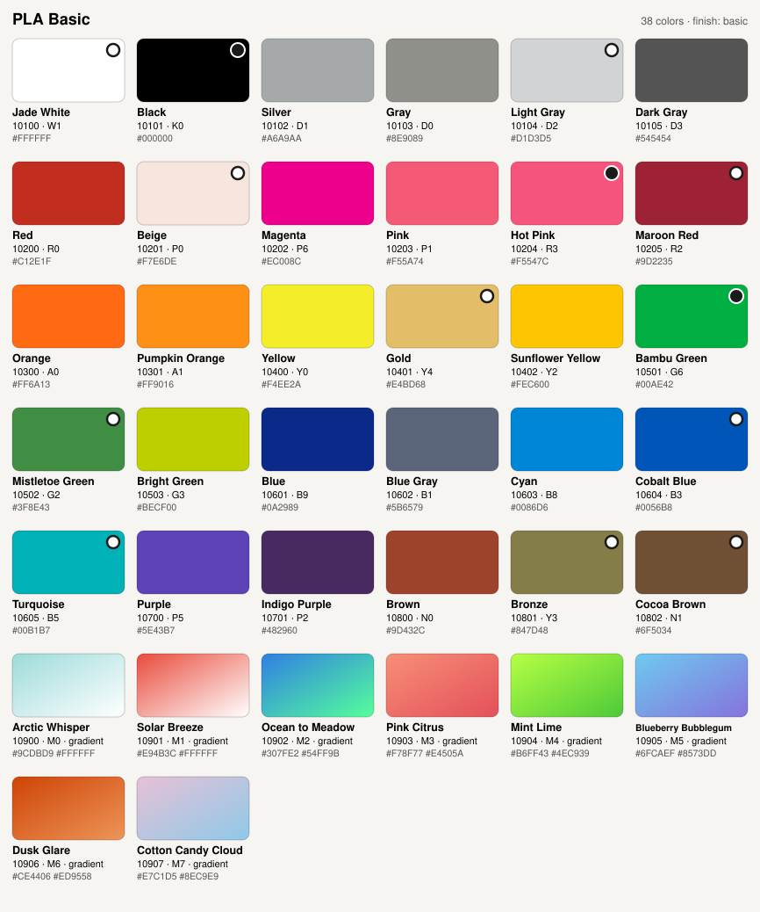

### PETG Basic

13 colors.

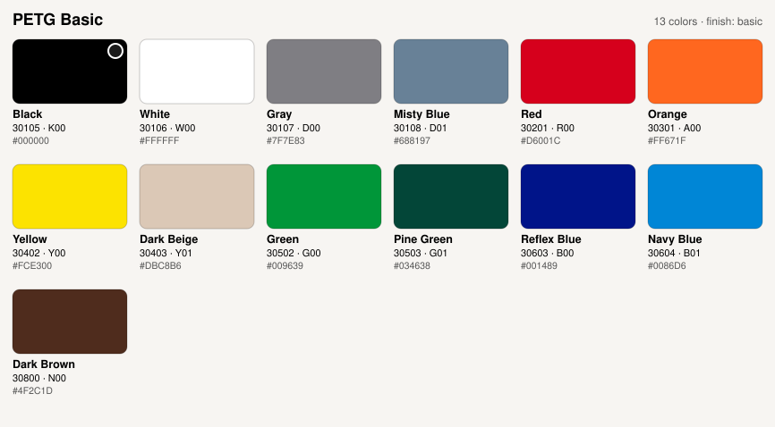

## matte

### PLA Matte

25 colors.

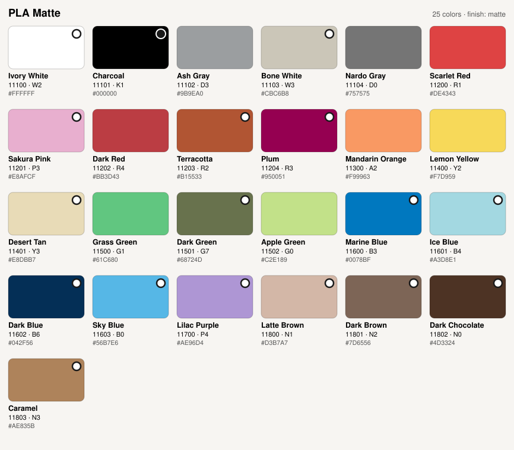

### PETG Matte

8 colors.

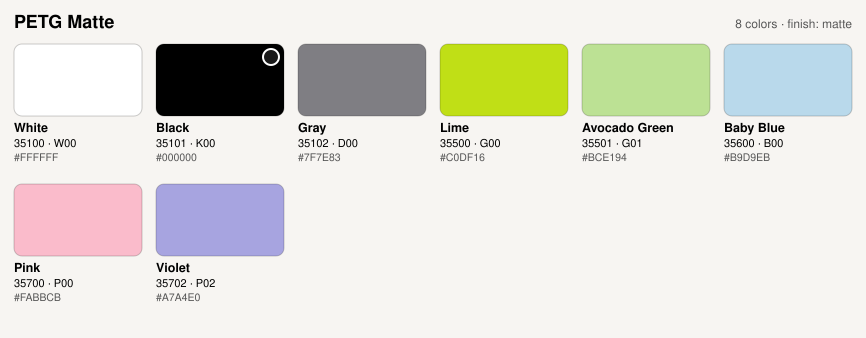

## silk

### PLA Silk

18 colors (3 gradient, 7 multi).

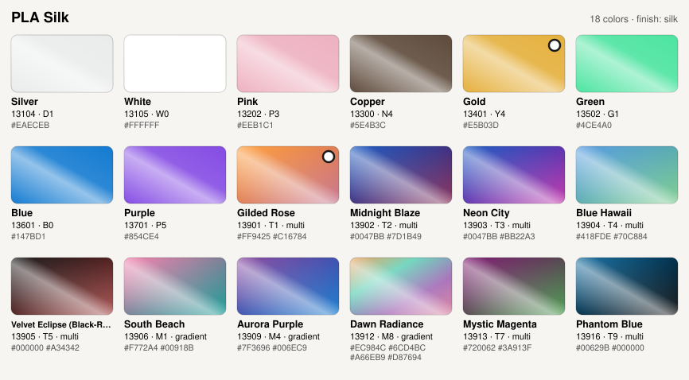

## silk plus

### PLA Silk+

13 colors.

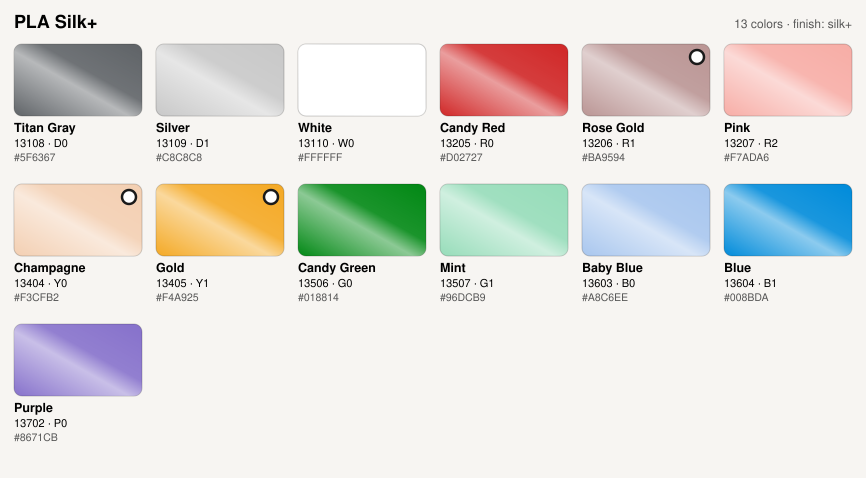

## sparkle

### PLA Sparkle

6 colors.

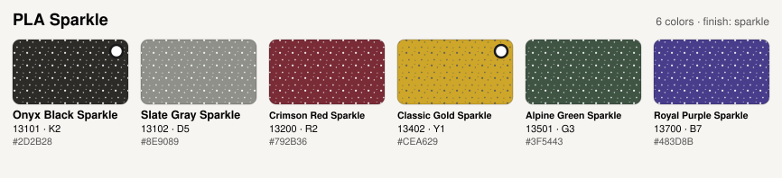

## galaxy

### PLA Galaxy

4 colors.

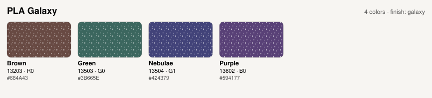

## marble

### PLA Marble

2 colors.

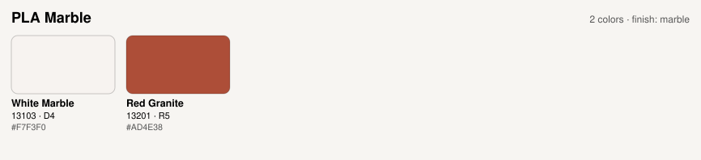

## metal

### PLA Metal

5 colors.

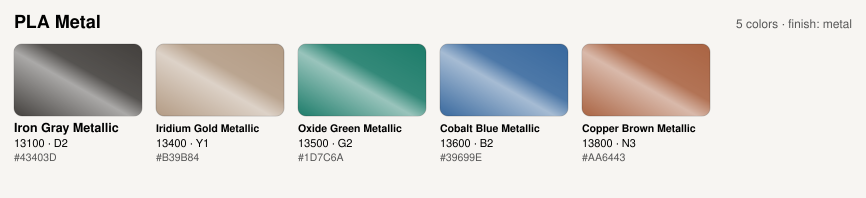

## translucent

### PLA Translucent

10 colors.

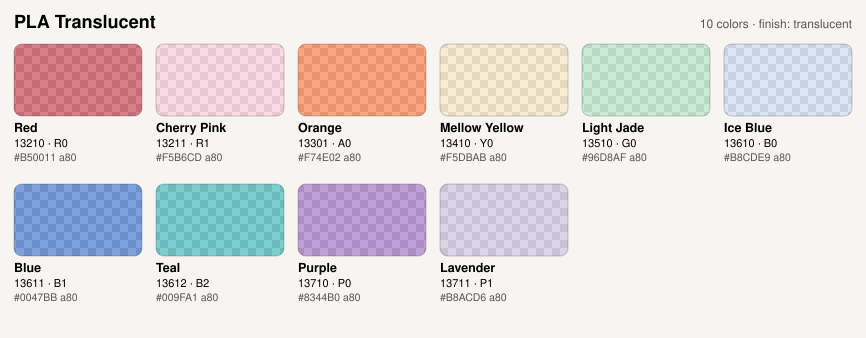

### PETG Translucent

9 colors.

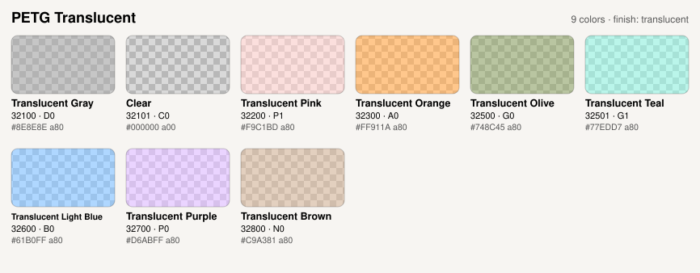

## glow

### PLA Glow

5 colors.

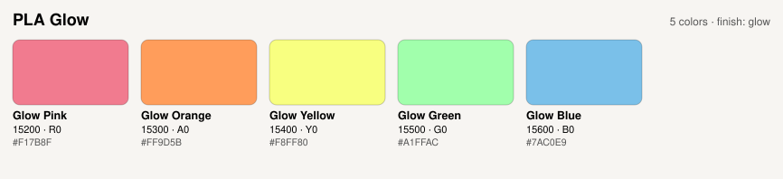

## wood

### PLA Wood

6 colors.

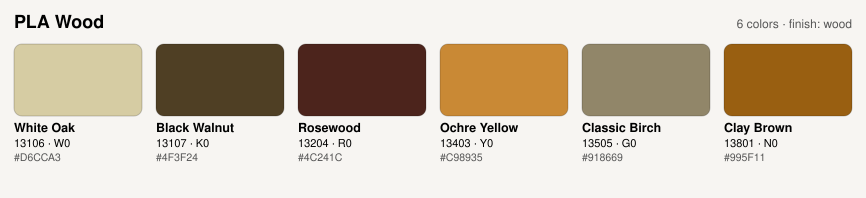

## uv color change

### PLA Dynamic

1 colors.

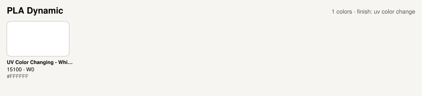

## carbon fiber

### PLA-CF

7 colors.

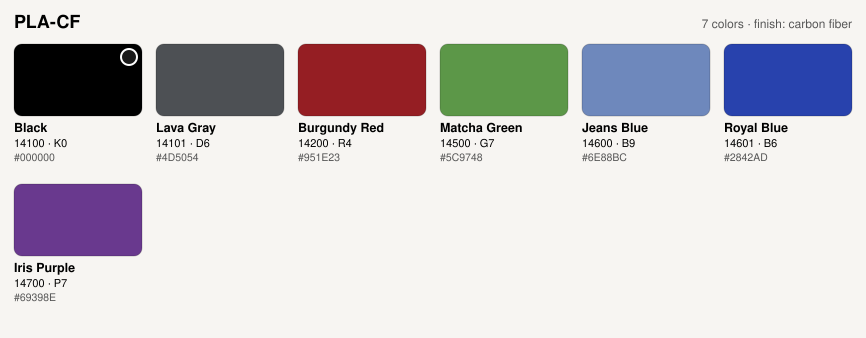

## plain

### PLA Lite

13 colors.

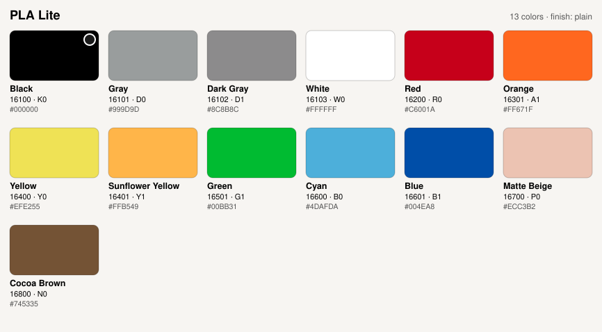

### PLA Pure

5 colors.

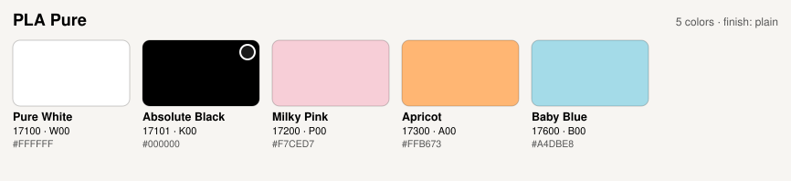

### PLA Tough

10 colors.

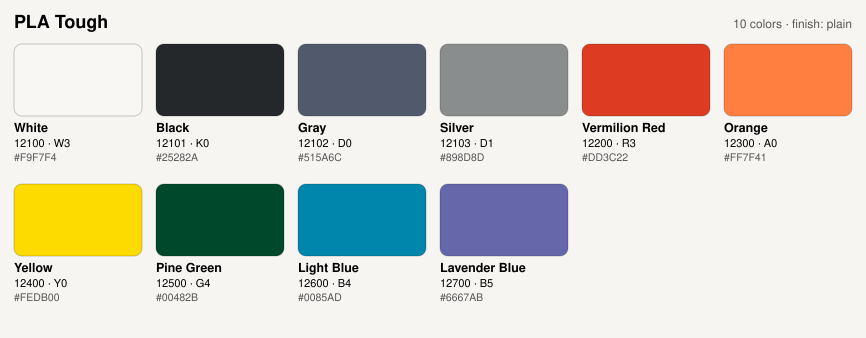

### PLA Tough+

7 colors.

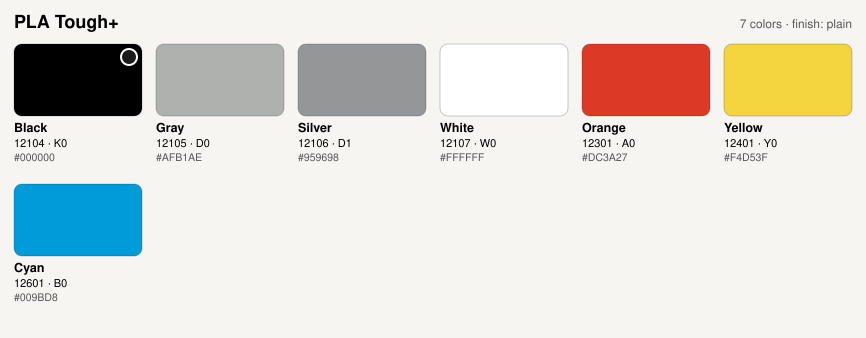

### PLA Aero

3 colors.

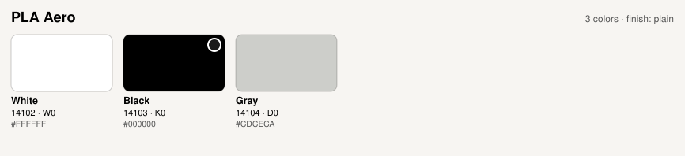

### PETG HF

14 colors.

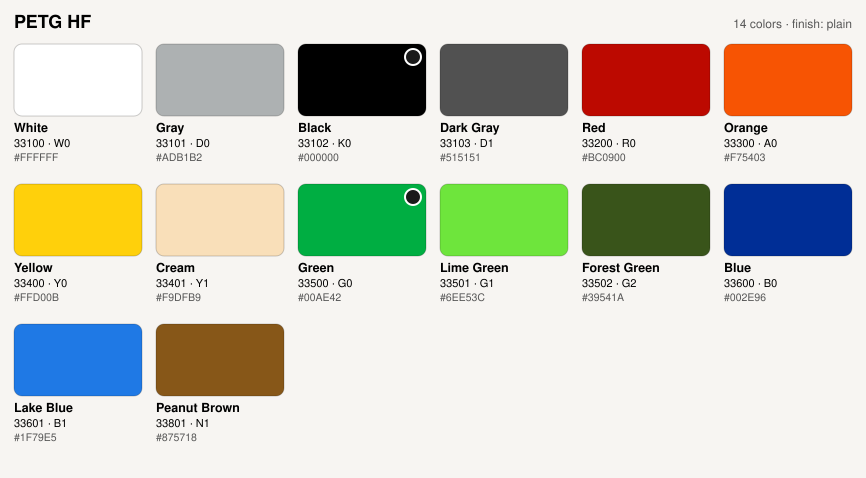

## Lines left out

These are in the catalog file but not drawn: other plastics that need another nozzle, temperature or profile than the coasters print with, and support materials.

| Line | Colors |
|---|---|
| ABS | 16 |
| ABS-GF | 8 |
| PA6-GF | 8 |
| TPU 90A | 8 |
| TPU for AMS | 7 |
| ASA | 6 |
| PETG-CF | 6 |
| TPU 95A HF | 6 |
| TPU 85A | 5 |
| PC | 4 |
| PC FR | 3 |
| Support for PLA/PETG | 2 |
| TPU 95A | 2 |
| ASA Aero | 1 |
| ASA-CF | 1 |
| PA6-CF | 1 |
| PAHT-CF | 1 |
| PET-CF | 1 |
| PPA-CF | 1 |
| PPS-CF | 1 |
| PVA | 1 |
| Support for ABS | 1 |
| Support for PA/PET | 1 |
| Support for PLA | 1 |

## Keeping it current

`catalog.py refresh` fetches the same file from Bambu's public repository on GitHub and lists the colors added, removed or changed since this catalog was built. It writes nothing. `catalog.py build` rebuilds the catalog from the Bambu Studio on this Mac, so update the app first.
