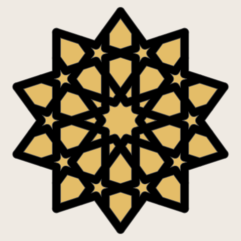
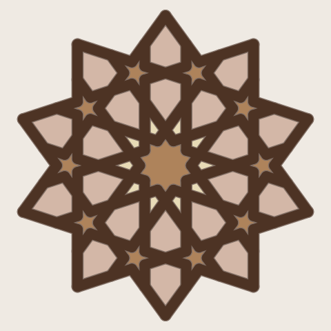
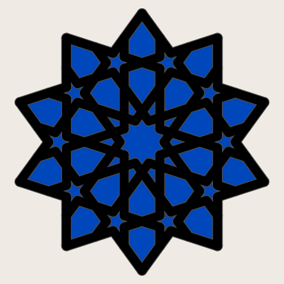
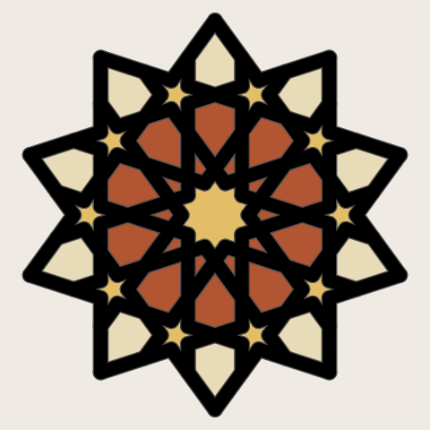
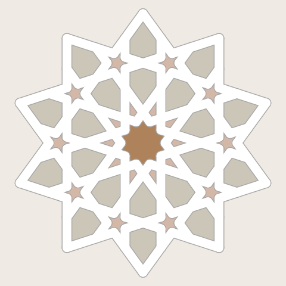
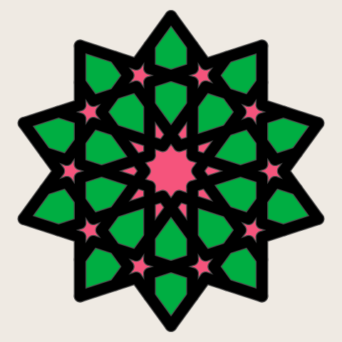
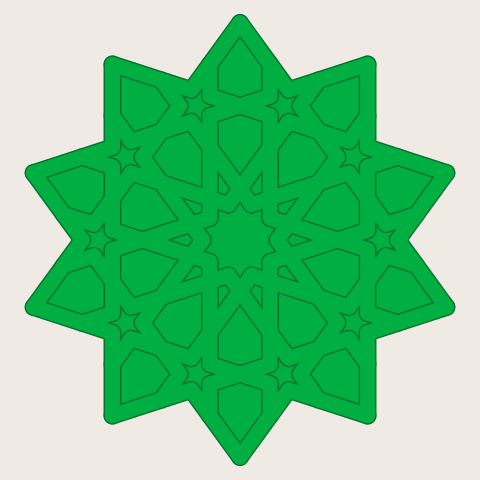
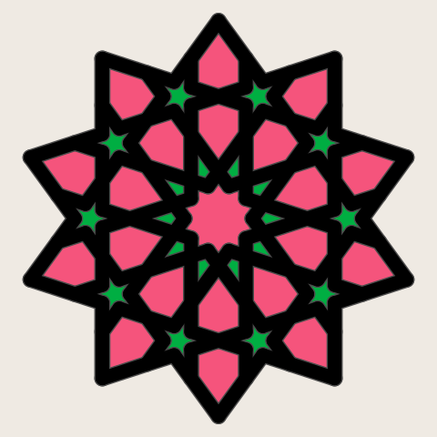
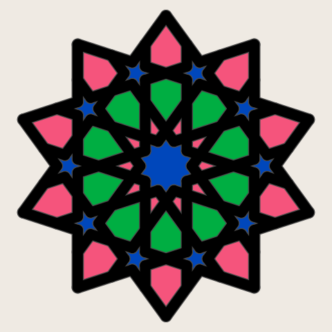

# gBV: color themes to mix and match

> Generated from [gbv/themes.yaml](gbv/themes.yaml) and [gbv/reviews.yaml](gbv/reviews.yaml) by `themes.py gallery gbv`. Edit the data, not this page.

The gBV minimal coaster is a ten-fold star: a strap network (the frame) with 41 loose pieces that sit in its holes. It is the coaster [sheets-04g](../../plates/sheets-04g.md) prints, at size 112.5. The pieces come in five groups, one per ring out from the middle, and each group can take its own color. These are ideas to mix and match, drawn flat from above.

**How to read a theme.**

- **Colors.** *Owned* means it is on a tray today; *buy* means a Bambu filament we do not have. Every buy hex is Bambu Studio's own ([research](../../../research/2026-10-04-bambu-pla-color-hexes.md)). It is the maker's label for the color, not a measurement, and a flat picture shows no matte or glossy finish.
- **Plates.** Each color prints as its own one-color plate, and the frame rides on the plate of its color. Minutes and grams split [sheets-04g](../../plates/sheets-04g.md)'s one-bed slice (86 min, 27 g, everything on one bed) by each group's share of the plastic. So they are estimates: minutes do not follow volume exactly, and each extra plate adds a start-up that has not been measured. A plate of only a few minutes' plastic will take longer than its share says, by that unmeasured start-up.
- **Scores.** Simulated opinions from the review-theme skill's personas, out of 5, not customer research. They are one model's reading of the picture through each persona's eyes, useful for ranking ideas, not for deciding what sells.

| Theme | Score | Plates | Buy |
|---|---|---|---|
| [Black and gold](#black-and-gold) | 3.8 | 2 | Gold |
| [Espresso and crema](#espresso-and-crema) | 3.7 | 4 | Caramel, Desert Tan, Latte Brown, Dark Chocolate |
| [Midnight blue](#midnight-blue) | 3.3 | 2 | nothing |
| [Terracotta souk](#terracotta-souk) | 3.3 | 4 | Gold, Terracotta, Desert Tan |
| [Iznik tile](#iznik-tile) | 3.2 | 4 | Maroon Red, Turquoise, Cobalt Blue, Jade White |
| [Flat white](#flat-white) | 3.0 | 4 | Caramel, Latte Brown, Bone White, Ivory White |
| [Pink heart](#pink-heart) | 2.5 | 3 | nothing |
| [All Bambu Green](#all-bambu-green) | 2.2 | 1 | nothing |
| [Pink and green rings](#pink-and-green-rings) | 1.7 | 3 | nothing |
| [All four trays](#all-four-trays) | 1.5 | 4 | nothing |

## Black and gold

*Every piece gold in a black frame; the gift-box look, and only one color to buy.*

| Group | Color | |
|---|---|---|
| the middle (one 20-sided piece) | Gold `#E4BD68` | buy |
| the kites (10) | Gold `#E4BD68` | buy |
| the inner six-sided ring (10) | Gold `#E4BD68` | buy |
| the stars (10) | Gold `#E4BD68` | buy |
| the outer six-sided ring (10) | Gold `#E4BD68` | buy |
| the frame (the straps) | Black `#000000` | owned |

**Plates:** 2, about 86 min and 27 g in all, plus 1 start-up not measured.

- Black: frame (about 50 min, 15.6 g)
- Gold: middle, kites, inner six-sided ring, stars and outer six-sided ring (about 36 min, 11.4 g)

**Scores:** 3.8 of 5. The strongest all-rounder and the cheapest to add to the range; only the specialty fan finds it generic.

| Persona | Score | Why |
|---|---|---|
| Espresso purist | 4 | Two colors and dark; the gold is a little showy for them. |
| Latte-and-pastry café regular | 3 | Smart, but the black is harsher than the soft look they like. |
| Cold-brew minimalist | 4 | Two colors with clean contrast; they would swap the warm gold for gray. |
| Third-wave specialty fan | 2 | Handsome but the gift-box look is the generic one. |
| Gift buyer | 5 | Looks like it came in a box; safe for any kitchen and still special. |
| Café owner buying sets | 5 | Two plates, one color to buy, black hides rings, and it suits most rooms. |

## Espresso and crema

*A dark chocolate frame around caramel and latte pieces, the colors of a shot with its crema.*

| Group | Color | |
|---|---|---|
| the middle (one 20-sided piece) | Caramel `#AE835B` | buy |
| the kites (10) | Desert Tan `#E8DBB7` | buy |
| the inner six-sided ring (10) | Latte Brown `#D3B7A7` | buy |
| the stars (10) | Caramel `#AE835B` | buy |
| the outer six-sided ring (10) | Latte Brown `#D3B7A7` | buy |
| the frame (the straps) | Dark Chocolate `#4D3324` | buy |

**Heads-up:** hex and kite are close (Latte Brown / Desert Tan, delta E 16), and may blur together.

**Plates:** 4, about 86 min and 27 g in all, plus 3 start-ups not measured.

- Dark Chocolate: frame (about 50 min, 15.6 g)
- Latte Brown: inner six-sided ring and outer six-sided ring (about 29 min, 9.1 g)
- Caramel: middle and stars (about 6 min, 1.8 g)
- Desert Tan: kites (about 1 min, 0.4 g)

**Scores:** 3.7 of 5. The coffee people's favorite; it costs four colors to buy and four plates, and the pale rings blur a little.

| Persona | Score | Why |
|---|---|---|
| Espresso purist | 5 | Dark chocolate around crema tones; it looks like the drink they care about. |
| Latte-and-pastry café regular | 4 | Warm milk and caramel feel cozy, though the dark frame is heavier than they would choose. |
| Cold-brew minimalist | 2 | Warm, and the pale pieces sit close to each other, so the inner rings soften. |
| Third-wave specialty fan | 4 | A palette with a reason, if a little on the nose for a coffee coaster. |
| Gift buyer | 4 | An easy gift for any coffee drinker; it explains itself. |
| Café owner buying sets | 3 | Fits a coffee bar and the dark frame hides rings, but four colors to buy and four plates. |

## Midnight blue

*Black straps and blue glass, like a night window; quiet, two plates.*

| Group | Color | |
|---|---|---|
| the middle (one 20-sided piece) | Blue `#0047BB` | owned |
| the kites (10) | Blue `#0047BB` | owned |
| the inner six-sided ring (10) | Blue `#0047BB` | owned |
| the stars (10) | Blue `#0047BB` | owned |
| the outer six-sided ring (10) | Blue `#0047BB` | owned |
| the frame (the straps) | Black `#000000` | owned |

**Plates:** 2, about 86 min and 27 g in all, plus 1 start-up not measured.

- Black: frame (about 50 min, 15.6 g)
- Blue: middle, kites, inner six-sided ring, stars and outer six-sided ring (about 36 min, 11.4 g)

**Scores:** 3.3 of 5. The best calm theme we can print today; it pleases the cool, clean crowd and leaves the warm ones cold.

| Persona | Score | Why |
|---|---|---|
| Espresso purist | 3 | Two dark colors and real restraint, though blue is not a roasted tone. |
| Latte-and-pastry café regular | 2 | Cool and a bit stark next to a warm drink and a pastry. |
| Cold-brew minimalist | 5 | Two colors, cool, and the black straps make the star read cleanly at a glance. |
| Third-wave specialty fan | 2 | Handsome but it is the stock blue tray; the night window story is thin. |
| Gift buyer | 4 | Looks finished and safe; blue and black suits most kitchens. |
| Café owner buying sets | 4 | Two plates, nothing to buy, and dark colors hide coffee rings. |

## Terracotta souk

*Fired clay, brass and sand in a black frame, like a market stall of pots and lamps.*

| Group | Color | |
|---|---|---|
| the middle (one 20-sided piece) | Gold `#E4BD68` | buy |
| the kites (10) | Terracotta `#B15533` | buy |
| the inner six-sided ring (10) | Terracotta `#B15533` | buy |
| the stars (10) | Gold `#E4BD68` | buy |
| the outer six-sided ring (10) | Desert Tan `#E8DBB7` | buy |
| the frame (the straps) | Black `#000000` | owned |

**Plates:** 4, about 86 min and 27 g in all, plus 3 start-ups not measured.

- Black: frame (about 50 min, 15.6 g)
- Terracotta: kites and inner six-sided ring (about 16 min, 5.0 g)
- Desert Tan: outer six-sided ring (about 15 min, 4.6 g)
- Gold: middle and stars (about 6 min, 1.8 g)

**Scores:** 3.3 of 5. A warm, storied theme the specialty and gift crowds like; four plates and three colors to buy.

| Persona | Score | Why |
|---|---|---|
| Espresso purist | 3 | Earthy, warm tones they like, but four colors is busier than they would pick. |
| Latte-and-pastry café regular | 4 | Warm clay and sand feel welcoming and cozy. |
| Cold-brew minimalist | 1 | Warm, four colors, and the black lines make it busier still. |
| Third-wave specialty fan | 5 | Clay and brass have an origin story, and none of it is a stock color. |
| Gift buyer | 4 | Looks handmade and special; the black frame keeps it smart. |
| Café owner buying sets | 3 | Suits wood and plant-filled cafés and the black hides rings, but three to buy, four plates. |

## Iznik tile

*White ground, cobalt and turquoise with a red accent, after the glazed tiles of Ottoman Iznik.*

| Group | Color | |
|---|---|---|
| the middle (one 20-sided piece) | Maroon Red `#9D2235` | buy |
| the kites (10) | Turquoise `#00B1B7` | buy |
| the inner six-sided ring (10) | Cobalt Blue `#0056B8` | buy |
| the stars (10) | Maroon Red `#9D2235` | buy |
| the outer six-sided ring (10) | Turquoise `#00B1B7` | buy |
| the frame (the straps) | Jade White `#FFFFFF` | buy |

**Plates:** 4, about 86 min and 27 g in all, plus 3 start-ups not measured.

- Jade White: frame (about 50 min, 15.6 g)
- Turquoise: kites and outer six-sided ring (about 16 min, 5.0 g)
- Cobalt Blue: inner six-sided ring (about 15 min, 4.6 g)
- Maroon Red: middle and stars (about 6 min, 1.8 g)

**Scores:** 3.2 of 5. The most striking theme and the gift pick; it is the most to buy and print, and white shows coffee.

| Persona | Score | Why |
|---|---|---|
| Espresso purist | 2 | Beautiful, but four bright colors is more than they want under a cup. |
| Latte-and-pastry café regular | 3 | Fresh and pretty, though cool blues feel less cozy than they like. |
| Cold-brew minimalist | 2 | The contrast is crisp, but four colors is too many. |
| Third-wave specialty fan | 5 | Real craft behind the palette, and the pattern suits it; it feels chosen. |
| Gift buyer | 5 | Reads as tile art at first glance; special without needing an explanation. |
| Café owner buying sets | 2 | Lovely, but four colors to buy, four plates, and a white frame that shows stains. |

## Flat white

*Milk and foam; an ivory frame with pale latte and bone pieces, soft and low in contrast.*

| Group | Color | |
|---|---|---|
| the middle (one 20-sided piece) | Caramel `#AE835B` | buy |
| the kites (10) | Latte Brown `#D3B7A7` | buy |
| the inner six-sided ring (10) | Bone White `#CBC6B8` | buy |
| the stars (10) | Latte Brown `#D3B7A7` | buy |
| the outer six-sided ring (10) | Bone White `#CBC6B8` | buy |
| the frame (the straps) | Ivory White `#FFFFFF` | buy |

**Heads-up:** hex and kite are close (Bone White / Latte Brown, delta E 10), and may blur together; hex and star are close (Bone White / Latte Brown, delta E 10), and may blur together; outer and star are close (Bone White / Latte Brown, delta E 10), and may blur together.

**Plates:** 4, about 86 min and 27 g in all, plus 3 start-ups not measured.

- Ivory White: frame (about 50 min, 15.6 g)
- Bone White: inner six-sided ring and outer six-sided ring (about 29 min, 9.1 g)
- Latte Brown: kites and stars (about 5 min, 1.4 g)
- Caramel: middle (about 2 min, 0.8 g)

**Scores:** 3.0 of 5. The softest theme and the latte crowd's pick; pale enough that coffee stains and a faint pattern are the risk.

| Persona | Score | Why |
|---|---|---|
| Espresso purist | 2 | Restrained, but pale all over; nothing roasted about it. |
| Latte-and-pastry café regular | 5 | Milk and foam with a caramel heart; soft, warm and lovely in a photo. |
| Cold-brew minimalist | 3 | Few, neutral tones, but the low contrast makes the pattern faint. |
| Third-wave specialty fan | 3 | A gentle story, though pale beige pieces could be any home-goods coaster. |
| Gift buyer | 4 | Soft and safe for almost any kitchen. |
| Café owner buying sets | 1 | A white frame and pale pieces will show every coffee ring, and four colors to buy. |

## Pink heart

*A pink flower in a green garden, outlined in black; the colors the Piece colors mockup used.*

| Group | Color | |
|---|---|---|
| the middle (one 20-sided piece) | Hot Pink `#F5547C` | owned |
| the kites (10) | Hot Pink `#F5547C` | owned |
| the inner six-sided ring (10) | Bambu Green `#00AE42` | owned |
| the stars (10) | Hot Pink `#F5547C` | owned |
| the outer six-sided ring (10) | Bambu Green `#00AE42` | owned |
| the frame (the straps) | Black `#000000` | owned |

**Plates:** 3, about 86 min and 27 g in all, plus 2 start-ups not measured.

- Black: frame (about 50 min, 15.6 g)
- Bambu Green: inner six-sided ring and outer six-sided ring (about 29 min, 9.1 g)
- Hot Pink: middle, kites and stars (about 7 min, 2.2 g)

**Scores:** 2.5 of 5. The best of the owned-color themes for a sweet, playful café; too loud for anyone after a calm coaster.

| Persona | Score | Why |
|---|---|---|
| Espresso purist | 1 | Hot pink and bright green together is exactly the novelty look they avoid. |
| Latte-and-pastry café regular | 4 | A pink flower in the middle is cheerful and photographs well next to a pastry. |
| Cold-brew minimalist | 2 | The black frame gives clean edges, but pink on green is warm and busy. |
| Third-wave specialty fan | 2 | Three stock colors; the flower idea is sweet but generic. |
| Gift buyer | 3 | Fun for the right friend, but a loud pair of colors a recipient might not want. |
| Café owner buying sets | 3 | All owned and three plates, but pink and green fits only a playful café. |

## All Bambu Green

*The plate as it went out on 2026-10-04, one color for everything.*

| Group | Color | |
|---|---|---|
| the middle (one 20-sided piece) | Bambu Green `#00AE42` | owned |
| the kites (10) | Bambu Green `#00AE42` | owned |
| the inner six-sided ring (10) | Bambu Green `#00AE42` | owned |
| the stars (10) | Bambu Green `#00AE42` | owned |
| the outer six-sided ring (10) | Bambu Green `#00AE42` | owned |
| the frame (the straps) | Bambu Green `#00AE42` | owned |

**Heads-up:** every piece is the frame's color (Bambu Green), so they melt into the straps and only the seams show the pattern there.

**Plates:** 1, about 86 min and 27 g in all.

- Bambu Green: middle, kites, inner six-sided ring, stars, outer six-sided ring and frame (about 86 min, 27.0 g)

**Scores:** 2.2 of 5. The cheapest to make and the honest baseline; one color hides the pattern that is the whole point.

| Persona | Score | Why |
|---|---|---|
| Espresso purist | 2 | One color is the right instinct, but a bright stock green under a small cup looks like a toy. |
| Latte-and-pastry café regular | 2 | Cheerful enough, but flat; the star shape is there and the pattern inside it is gone. |
| Cold-brew minimalist | 3 | As few colors as it gets, but with no contrast the pattern only shows as seams. |
| Third-wave specialty fan | 1 | The color that happened to be loaded; nothing about it feels chosen. |
| Gift buyer | 2 | Reads as a test print of the shape rather than a finished coaster. |
| Café owner buying sets | 3 | One plate and nothing to buy is ideal to remake, but bright green suits few cafés. |

## Pink and green rings

*Rings that take turns in pink and green out from the middle, held in a black frame; loud and cheerful.*

| Group | Color | |
|---|---|---|
| the middle (one 20-sided piece) | Hot Pink `#F5547C` | owned |
| the kites (10) | Bambu Green `#00AE42` | owned |
| the inner six-sided ring (10) | Hot Pink `#F5547C` | owned |
| the stars (10) | Bambu Green `#00AE42` | owned |
| the outer six-sided ring (10) | Hot Pink `#F5547C` | owned |
| the frame (the straps) | Black `#000000` | owned |

**Plates:** 3, about 86 min and 27 g in all, plus 2 start-ups not measured.

- Black: frame (about 50 min, 15.6 g)
- Hot Pink: middle, inner six-sided ring and outer six-sided ring (about 32 min, 9.9 g)
- Bambu Green: kites and stars (about 5 min, 1.4 g)

**Scores:** 1.7 of 5. The alternate helper works, but the small green rings vanish and it reads as a pink star.

| Persona | Score | Why |
|---|---|---|
| Espresso purist | 1 | Mostly hot pink with green flecks; nothing quiet about it. |
| Latte-and-pastry café regular | 3 | The pink is fun, but the rings blur into one pink mass with green dots. |
| Cold-brew minimalist | 1 | Loud, warm, and the alternating rings do not read as rings in the picture. |
| Third-wave specialty fan | 1 | Stock colors in a rule-based pattern; it feels made by a helper, which it was. |
| Gift buyer | 2 | Too loud to give without knowing the person loves pink. |
| Café owner buying sets | 2 | Owned and three plates, but it suits one kind of café at most. |

## All four trays

*Every color on the printer today, the darkest one on the frame, the rest taking turns round the rings.*

| Group | Color | |
|---|---|---|
| the middle (one 20-sided piece) | Blue `#0047BB` | owned |
| the kites (10) | Hot Pink `#F5547C` | owned |
| the inner six-sided ring (10) | Bambu Green `#00AE42` | owned |
| the stars (10) | Blue `#0047BB` | owned |
| the outer six-sided ring (10) | Hot Pink `#F5547C` | owned |
| the frame (the straps) | Black `#000000` | owned |

**Plates:** 4, about 86 min and 27 g in all, plus 3 start-ups not measured.

- Black: frame (about 50 min, 15.6 g)
- Hot Pink: kites and outer six-sided ring (about 16 min, 5.0 g)
- Bambu Green: inner six-sided ring (about 15 min, 4.6 g)
- Blue: middle and stars (about 6 min, 1.8 g)

**Scores:** 1.5 of 5. Useful as a test of what the trays can do, not as a theme anyone would pick.

| Persona | Score | Why |
|---|---|---|
| Espresso purist | 1 | Four bright colors at once; the opposite of restraint. |
| Latte-and-pastry café regular | 2 | Bright and happy, but so busy the star turns into confetti. |
| Cold-brew minimalist | 1 | Four colors and no single one leads; it reads as noise from across the table. |
| Third-wave specialty fan | 1 | Literally whatever was on the printer, and it looks it. |
| Gift buyer | 2 | Could pass for a child's toy; hard to give to an adult's kitchen. |
| Café owner buying sets | 2 | Nothing to buy, but four plates per coaster and a look that suits almost no room. |
