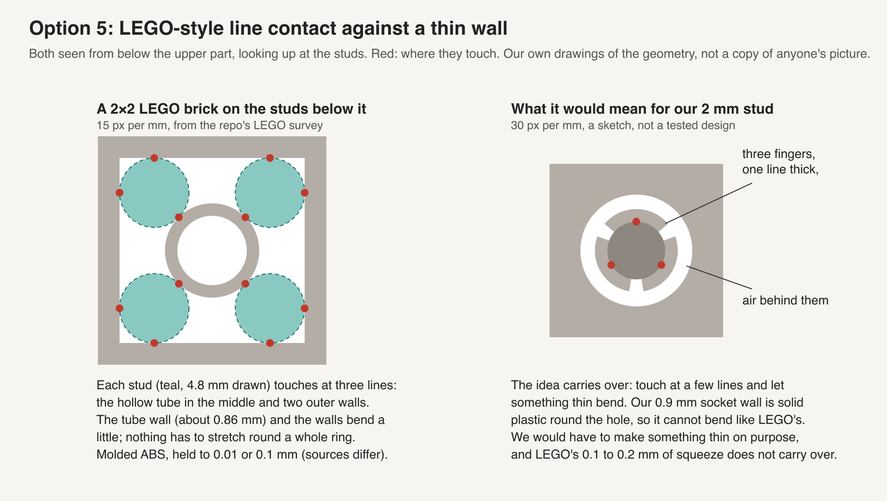
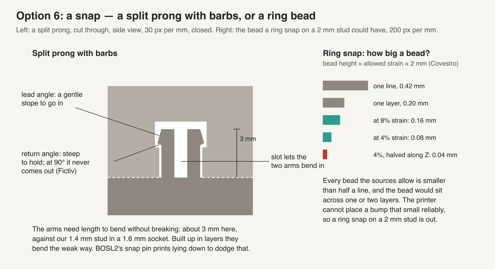
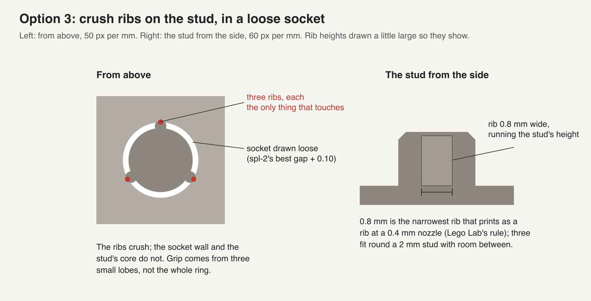
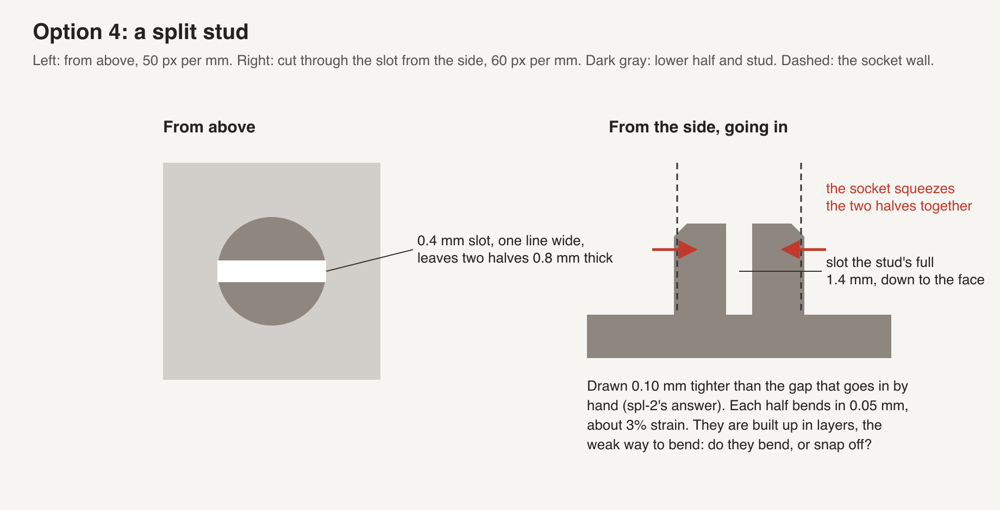
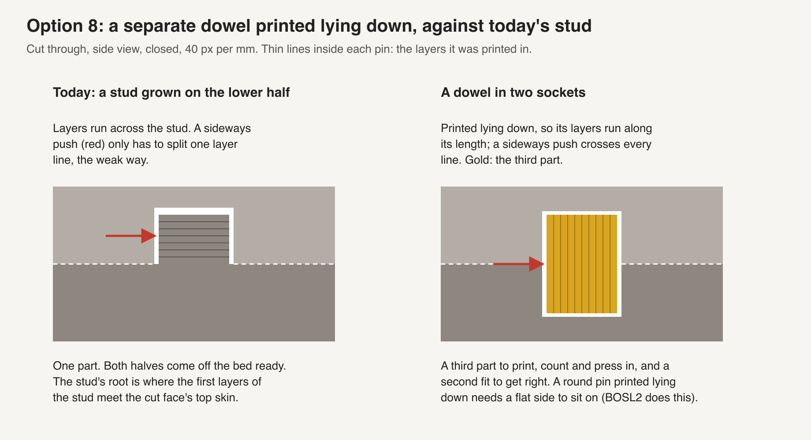
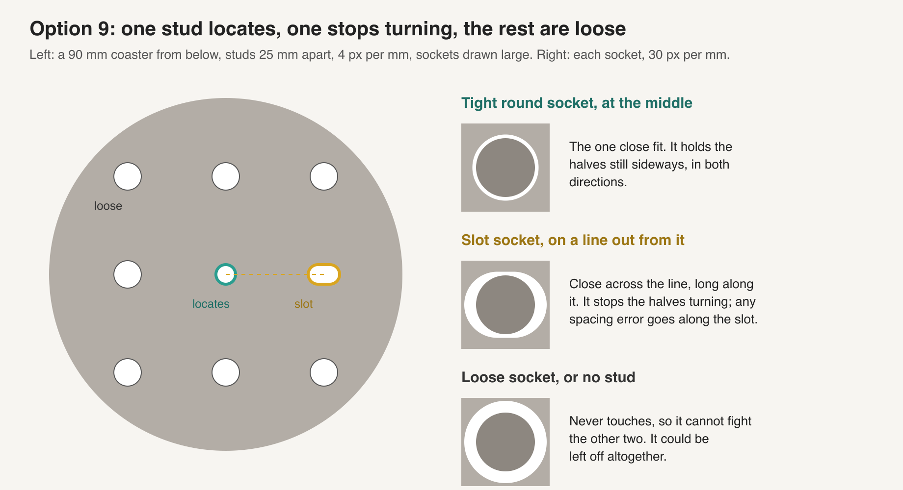
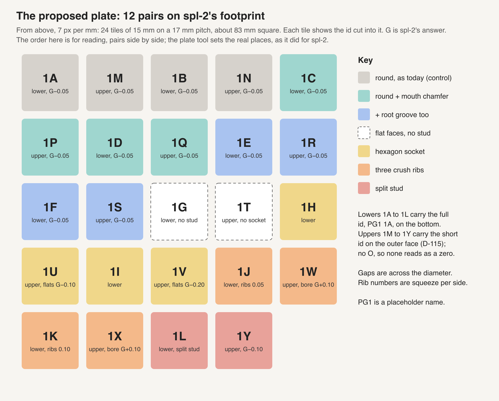

# Peg design: how a printed stud and socket should join two printed halves

> Status: draft 2026-10-09, researcher A of two. A checker compares this with the other
> researcher's doc and writes the one to act on; nothing here is decided. Asked by Omar on
> 2026-10-09: "websearch 3d printed peg design, prepare a design doc with images, etc in this
> regards and options with links", then "it should include how to get good fit, snap, etc ... lego
> solved this problem" and "we should design a plate around the findings".

**In short.** Our studs need a hammer because a small round stud in a small round hole is the
hardest fit a printer makes: the hole prints small, the stud prints big, the two errors add, and a
solid ring of plastic has nowhere to give. spl-2, printed and waiting to be judged, will find the gap at which a plain stud goes in
by hand. This doc is about what to change besides the gap. The one-line recommendation: **keep
the round 2 mm stud, give the socket mouth a 0.3 mm chamfer and the stud's foot a small groove,
and print a 12-pair plate around spl-2's answer that tests those against a hexagon socket, crush
ribs, a split stud and a no-stud control.** A printed snap does not fit a 2 mm stud in a 2.2 mm
half (§4), and LEGO's grip comes from thin walls that bend, which our solid socket wall does not
have (§3).

All the sources, with what each said and whether it was read in full or only seen as a search
excerpt, are in the [research file](../../research/2026-10-09-peg-design-a.md#sources). Every gap
here is **diametral** (socket width less stud width) unless it says "per side". Every picture is
drawn for this doc; external pictures are linked, never copied.

## 1. The problem: every stud needed a hammer

The joint is the one in [split-with-studs §4.1](split-with-studs-design.md#41-the-stud-and-socket):
a round stud 2.0 mm across and 1.4 mm tall, with a 0.2 mm chamfer on its top, on the lower half's
cut face; a socket 1.6 mm deep over a 0.6 mm floor in the upper half, with a 0.9 mm wall around it
and no chamfer at its mouth. Both halves print outer face down, so the stud is built up in layers
standing off the cut face and the socket opens upward. The stud is 0.2 mm shorter than the socket,
so it never bottoms out.

On [spl-1](../plates/spl-1.md) every pair from −0.10 to 0.15 mm needed a hammer, at 1.5, 2 and
3 mm alike. `SL1 4F` (2 mm, 0.15) was the only one that went in by hand, and it still needed a
hammer to sit flush ([spl-1's record](../../prints/2026-10-09-spl-1/index.md)). The record also
rules one cause out: `tools/fit_gap.py` read the sliced wall paths and found every gap as drawn to
within 0.005 mm. So the slicer drew the right gap and the printer made it tighter. Nobody has put
calipers on the pieces, so how much of that is the hole and how much the stud is not known.

[spl-2](../plates/spl-2.md) printed on 2026-10-09 and has not been judged as this is written. It runs the same stud at 0.15 to
0.40 mm, two pairs per gap. This doc calls its answer **G**: the tightest gap whose two pairs both
close flush by hand and do not rattle (spl-2's own rule). G is a gap, not the carved id `1G`.

`SL1 4F` going in by hand but needing a hammer for the last bit points at the end of the travel,
where four things can bind. The picture marks them:

- **a, a ridge at the socket mouth.** The mouth is the last layers of the upper's cut face, a top
  skin; any lip the top skin leaves around the hole meets the stud's root last.
- **b, a flare at the stud's foot.** The stud's first layers sit on the lower's top skin and can
  spread wider than the stud above.
- **c, the seam.** Our preset puts the seam "aligned", so every layer's start-and-stop bump sits
  on one line up the stud and one line down the socket. On a 2 mm circle that bump is a large
  share of the room.
- **d, cut faces that are not flat.** If either face bows or has a raised edge, the pair cannot
  close flush whatever the stud does. Nothing has tested this yet; the plate in §8 does.

Why holes print small and studs big, from the sources ([research
§2](../../research/2026-10-09-peg-design-a.md#2-why-round-holes-print-small-and-pegs-print-big)):
plastic piles up on the inside of a tight curve and the nozzle cuts corners, which hurts small
holes most ([Nop Head](https://hydraraptor.blogspot.com/2011/02/polyholes.html),
[rigcad](https://rigcad.com/articles/p12/clearances-for-3d-printed-moving-parts)); "Printed holes
come out undersized and printed pegs come out oversized, and those two errors add rather than
cancel" (rigcad); and Bambu lists the seam and the "Lack of chamfers or lead-in features on holes"
among the causes of tight holes ([Bambu wiki, XY hole
compensation](https://wiki.bambulab.com/en/software/bambu-studio/xy-hole-contour-compensation)).
None of the 36 sources measures a printed locating stud as small as ours; rigcad's fit table is
for "features in the 3 to 20 mm range", and our 2 mm stud sits below it.

## 2. How to get a good fit

### 2.1 Which fit a coaster half wants

The sources use five or six names for how tight a joint is. Their numbers differ, and most do not
say whether a gap is per side or across the diameter. rigcad's table, for a 0.4 mm nozzle and
features 3 to 20 mm, is the clearest ([research
§1](../../research/2026-10-09-peg-design-a.md#1-fit-types-and-which-one-a-coaster-half-wants)):

| Fit | What it feels like | rigcad's diametral gap |
|---|---|---|
| Free / running | turns with play | 0.5–0.8 mm |
| Sliding | moves smoothly, little slop | 0.3–0.5 mm |
| **Close / locating** | "Assembles by hand, no movement in use"; typical use "Alignment pins" | **0.2–0.3 mm** |
| Press | needs force | 0.0 to −0.1 mm |
| Snap | goes in with a click, held by a hook | a shape, not a gap (§4) |

**A coaster half wants close / locating.** The studs line the halves up and hold them lightly; the
lips and the pieces carry the rest. A press fit is what spl-1 got, and a hammer can crack a whole
coaster. A sliding fit lets the halves fall apart when the coaster is turned over.

*Does rigcad's 0.2–0.3 transfer to our stud?* Only as a floor. It transfers in kind, because it is
for our nozzle size and a printer of our type. It does not transfer as a number, because rigcad
says its table is for 3 to 20 mm and "Small holes suffer far more than large ones". spl-1 agrees:
0.15 needed a hammer. So G is likely at or above 0.3, and spl-2's ladder up to 0.40 covers that.

### 2.2 The four things that make a fit good

Read across the sources, a good printed fit comes from four separate things. A gap ladder only
reaches the first.

1. **The right gap for this printer, found by printing.** Every source that gives numbers says
   to print a ladder and pick from it: rigcad steps holes "from 0.1 mm to 0.8 mm"; MachineBlocks
   tunes each of its four knobs with a printed ladder
   ([MachineBlocks calibration](https://machineblocks.com/docs/calibration)); Bambu prints a hole
   ladder and sets half the shortfall as hole compensation. spl-1 and spl-2 are this step.
2. **A lead-in at both ends of the travel.** "A 45 degree chamfer on the mouth of a hole and the
   end of a pin turns an interference into a guided entry. This single change rescues more
   marginal fits than any clearance adjustment" (rigcad). That is a rule of thumb from a guide,
   not a measurement, and it gives no size. Our stud has a chamfer on its top; the socket mouth
   has none (§5, option 1).
3. **Put the give in something that can bend.** "Circular holes can only expand by stretching
   along their circumference, which often leads to material cracking or delamination"; square or
   hexagonal holes "reduce the amount of stretching needed"
   ([AON3D](https://www.aon3d.com/applications/engineering-fits-how-to-design-for-3d-printed-assemblies/)).
   Crush ribs, slots and LEGO's thin walls are the same idea in other shapes: make a small part
   that gives, so the rest does not have to (options 2 to 5).
4. **Only one tight fit per direction.** In machined fixtures one round pin locates, a second
   relieved ("diamond") pin stops turning, and a second full round pin "would fight for
   constraint" ([Eng-Tips thread](https://www.eng-tips.com/threads/can-anyone-explain-how-diamond-locating-pins-work-like-a-pin-and-slot.489173/),
   search excerpt only). A coaster with many studs, each a tight round fit, forces every spacing
   error out at once. That is option 9; a one-stud coupon cannot show it.

## 3. How LEGO gets its grip, and what of it we can use

[Lego Lab §3.8](lego-lab-design.md#38-clutch-is-a-feature-not-a-surface--the-architectural-finding)
and [the LEGO survey §2](../../research/lego-brick-system-survey.md#2-the-clutch-is-tangency--and-it-is-patented-as-such)
already hold the numbers. What they mean here:

- **The stud does not sit in a round socket.** It touches a tube and the outer wall, each along
  one line. On a 2×2 brick, four studs make twelve contact lines in all (the left of the picture).
- **What gives is a thin wall that bends, not a ring that stretches.** The tube wall is 0.857 mm by
  the tangency geometry (derived in the survey, not measured), and it spans the space between
  studs, so it can flex. The Brighton Toy Museum's micrometer survey found the studs
  "deliberately oversized … to force the mating brick's walls to flex" (quoted through the survey,
  which fetched it; this run could not reach it).
- **The interference is about 0.1–0.2 mm, held to about 0.01 mm.** thewave.engineer gives
  "roughly 0.1–0.2 mm" of interference and a 10 µm mold tolerance (again through the survey).
  MachineBlocks says the bricks are "cast from relatively soft ABS plastic to an accuracy of a
  tenth of a millimeter". The two disagree by ten times; both are far tighter than our printer
  holds a 2 mm circle.
- **Printed copies do not match it.** Brickset printed the same brick on a 0.2 mm and a 0.4 mm
  nozzle: the grip "is nowhere near as good as that of real bricks"
  ([Brickset](https://brickset.com/article/128767/can-you-make-compatible-bricks-with-consumer-3d-printers)).
  Brick Architect, in PLA: "even when on the best settings the 3D printed parts fail to reach the
  clutch power of LEGO bricks"
  ([Brick Architect](https://brickarchitect.com/2023/enhancing-your-lego-hobby-with-3d-plastic-printing/)).
  Both are one person's test.

**What transfers (K10).** The idea transfers: touch along a few lines, and put the give in a thin
part that bends. That holds in any material that bends before it cracks, and PLA does at small
strain (§4). **The number does not transfer.** LEGO's 0.1–0.2 mm is set by a mold that holds its
size ten to a hundred times closer than our printer, in a softer plastic than PLA ("3D printed
bricks, on the other hand, are generally harder", MachineBlocks). And our 0.9 mm socket wall is
solid plastic around a 2 mm hole in a 15 mm tile, so it cannot bend the way a LEGO wall does.

**So LEGO did not solve our problem; it solved a nearby one with a tool we do not have.** To use its
idea, we have to make something thin on purpose: ribs (option 3), a socket of thin fingers (option
5), or a stud that is itself split (option 4). Lego Lab reached the same place for printed bricks:
its clutch is a rib, a separate feature, sized by a printed ladder
([Lego Lab §7.6](lego-lab-design.md#76-the-clutch-rib--a-first-class-feature)).

## 4. Snap fits, and why not at 2 mm

**The kinds.** A cantilever snap is a bending arm with a hook, like a battery-cover latch. An
annular snap is a ring that stretches over a bead, like a pen cap; a ball-and-socket is an annular
snap on a sphere. A split-prong pin is two cantilevers back to back
([Hubs](https://www.hubs.com/knowledge-base/how-design-snap-fit-joints-3d-printing/)).

**How far printed PLA may bend.** The sources disagree by four times
([research §5](../../research/2026-10-09-peg-design-a.md#5-snap-fits)): Fictiv allows "4-8%" for
printed PLA snap arms and says to halve it for an arm built along Z
([Fictiv](https://www.fictiv.com/articles/how-to-design-snap-fit-components)); a generic PLA data
sheet gives yield at 2% and break at 4% (search excerpt only); Bambu's own PLA Basic sheet gives
elongation at break of 12.2% along the bed and 7.5% along Z, on annealed test bars, "for design
reference and comparison only"
([Bambu PLA Basic data sheet](https://wiki.bambulab.com/filament-acc/abs-asa-pc/bambu_pla_basic_technical_data_sheet.pdf)).
Hubs calls PLA "less suitable" for snaps and says to "avoid snap-fit cantilevers built vertically
in the Z direction". Our studs are built along Z.

**The hook.** Fictiv: "a return angle of 90° can never be disassembled". Covestro's worked example
uses a 30° lead angle
([Covestro snap-fit guide, PDF](https://solutions.covestro.com/-/media/covestro/solution-center/brands/downloads/imported/1556891135.pdf)).
A coaster half that has to come apart for a piece swap would want a return angle well under 90°.

**Worked through for our stud.**

- **Annular snap on the 2 mm stud: out.** By Covestro's rough rule for molded parts, the bead a
  ring can take is about strain × diameter. At 4–8% that is 0.08–0.16 mm on 2 mm, and half that,
  0.04–0.08 mm, for a part built along Z. Every value is under half a 0.42 mm printed line, and a
  0.20 mm layer cannot place a bead that small reliably. The slicers' own Snap connector uses a
  bulge of 0.15 of the connector's size, 0.3 mm on a 2 mm pin
  ([split-with-studs §4.2](split-with-studs-design.md#42-the-other-joints-considered)); by the same
  rule that asks 15% strain with a stiff socket, or about 7.5% if the socket gives as much as the
  stud, which is at Bambu's own break figure along Z. This is a molded-part rule of thumb applied
  to a printed part, so it says "likely to break or not go in", not "will".
- **Cantilever on a split stud: only a hold by squeeze, not a hook.** A prong's bending strain is
  1.5 × thickness × deflection / length² (Fictiv and Covestro agree on it). A 0.8 mm prong 1.4 mm
  long bent 0.05 mm is at about 3%, inside the halved Z budget; the same prong bent 0.10 mm to
  clear a hook is at about 6%, past it. A hook needs a longer prong, and the prong can be no longer
  than the stud, which can be no taller than the 1.6 mm socket in a 2.2 mm half allows. So in our
  halves a split stud can grip by squeeze (option 4), but not hook.
- **BOSL2's snap pin, the one printed snap with numbers, does not fit either.** Its smallest preset
  is 4 mm long and 2.5 mm across and prints lying flat, "flat side down", so its arms bend the
  strong way ([BOSL2 joiners.scad](https://github.com/BelfrySCAD/BOSL2/wiki/joiners.scad)). It
  needs a socket 2 mm or more deep in each half; ours are 1.6 mm.

[join-halves §3](join-halves-design.md#3-clip-a-stud-with-a-bulge) proposed snap pairs on spl-1
as "worth one coupon row", with a 0.3 mm bulge; they were not on the plate as printed. The numbers
above say why not to add them now: they would test a strain the sources put at or past PLA's
break. If the split stud on the plate in §8 bends without cracking, a hooked version becomes worth
drawing, on a taller half.

## 5. The options

Ten options, each a change to the stud, the socket, the layout or the slicer. The lead-ins and
option 9 go with any of the others; options 2 to 8 are alternatives to each other. "bikar needs" names what the coupon model would have to
learn to print it.

### 5.1 Option 1: lead-ins, a chamfer in the socket mouth and a groove at the stud's foot

**How it works.** A 0.3 mm 45° chamfer around the socket mouth gives a ridge at the mouth (place a
in §1) and the stud's foot room, and guides the stud in. A ring groove 0.2 mm wide and one layer
(0.2 mm) deep cut into the lower's face around the stud's foot takes any flare at the stud's root
(place b) out of contact, so the last bit of travel meets nothing.

**Pros.** It aims at where `SL1 4F` stuck: in by hand, but not flush. rigcad: this "single change
rescues more marginal fits than any clearance adjustment". It keeps the round stud and every number
spl-2 finds. It costs no print time and no extra part.

**Cons.** No source here measured a mouth chamfer or a root groove at our size; the chamfer is a
rule of thumb and the groove is a machinist's trick for a pin seating past a burr, with no 3D
printing source found. A groove 0.2 mm wide is under half a 0.42 mm line, and by the same rule
Lego Lab uses for ribs (§5.3) the slicer may not draw it at all; if the slice shows no groove, it
is widened to one line, about 0.45 mm, before the plate is built. [split-with-studs §4.1](split-with-studs-design.md#41-the-stud-and-socket)
left the mouth square because "a chamfer there would open a gap visible from the side". Read against
the geometry, the chamfer is on the cut face, inside the closed pair, and stops 0.6 mm or more
short of the side through the 0.9 mm wall. So it shows only where a socket sits within a chamfer's
width of the coaster's edge. That is my reading of the drawing, not a printed check.

**Implications.** Commits to nothing beyond two small cuts. It rules out a socket at the very edge
of a strap, which would need its chamfer dropped. bikar needs a mouth-chamfer size and a
root-groove size on the stud joint, each zero to turn it off.

**Sources.** [rigcad](https://rigcad.com/articles/p12/clearances-for-3d-printed-moving-parts),
[Bambu XY hole compensation](https://wiki.bambulab.com/en/software/bambu-studio/xy-hole-contour-compensation),
[research §3](../../research/2026-10-09-peg-design-a.md#3-lead-ins-chamfers-on-the-stud-and-in-the-socket-mouth).

### 5.2 Option 2: a hexagon socket for the round stud

**How it works.** The socket is a hexagon whose flat-to-flat size is the stud plus a gap. The round
stud touches the six flats along six lines. The six corners are air, and if the slicer puts the
seam in a corner, it never touches the stud.

**Pros.** AON3D: "circular holes can only expand by stretching along their circumference";
hexagons "reduce the amount of stretching needed", and "Z-seams can be hidden within a corner".
It deals with the seam (place c) and with plastic piling up on a tight curve, since a flat is not
a curve. The idea is geometry, so it transfers to any printer. Our setup already prints
hexagons: spl-1's hexagon pieces dropped into their hexagon pockets by their own weight at room 0
([spl-1's record](../../prints/2026-10-09-spl-1/index.md)). That is a bigger piece in a different
joint, so it shows only that our printer makes a flat-sided hole well, not what a hexagon socket
does for a 2 mm stud.

**Cons.** No source gives the flat-to-flat size; it has to be found by printing. Six lines hold
less than a full circle, and the stud can turn in it. Whether the 0.9 mm wall still feels solid
at the corners, where the hexagon reaches about 1.15 times the flat size, is untested.

**Implications.** A new size to tune, flat-to-flat, separate from the round gap. It could replace
the round socket on every coaster, so it would be its own ladder before any coaster used it.
bikar needs a socket shape (round or hexagon) and a seam corner it can name.

**Sources.** [AON3D](https://www.aon3d.com/applications/engineering-fits-how-to-design-for-3d-printed-assemblies/),
[research §4](../../research/2026-10-09-peg-design-a.md#4-shapes-that-give-way-hexagon-holes-crush-ribs-slots-d-flats).

### 5.3 Option 3: crush ribs in a loose socket

**How it works.** The socket is drawn loose, spl-2's G plus 0.10, so its round wall never touches.
Three vertical ribs, 0.8 mm wide at 120°, reach in past the stud's edge. Only the ribs touch, and
they squash a little as the stud goes in.

**Pros.** The force comes from a small, known amount of plastic. "Easier for a bearing to crush
small ribs than to reshape the entire cylinder"
([New Screwdriver](https://newscrewdriver.com/2020/12/31/accommodate-3d-printer-variation-with-crush-ribs/)).
"A 0.1 mm difference can have a noticeable effect"
([Hackaday on Dan Royer](https://hackaday.com/2020/10/15/adding-crush-ribs-to-3d-printed-parts-for-a-better-press-fit/)).
It is LEGO's line contact in printable form, and Lego Lab already sizes a rib the same way:
0.8 mm wide, since a rib narrower than "2 × nozzle" is "absorbed into the perimeter path"
([Lego Lab §7.6](lego-lab-design.md#76-the-clutch-rib--a-first-class-feature)).

**Cons.** The stud sits where the ribs put it, and "the center … will end up in an unpredictable
location" (New Screwdriver). AON3D says press ribs "should only be used for one-time assembly". The
rib sizes in the sources are on 8 to 15 mm parts and other printers, so none transfers as a number.
On a 2 mm stud, three 0.8 mm ribs take up more than a third of the circle, so three is the most
that fit with air between them.

**Implications.** Two new sizes, the bore and the rib's reach, and a squeeze to find by printing.
bikar needs a rib count, width and reach on the socket, as Lego Lab's rib has on a brick.

**Sources.** [Hackaday](https://hackaday.com/2020/10/15/adding-crush-ribs-to-3d-printed-parts-for-a-better-press-fit/),
[New Screwdriver](https://newscrewdriver.com/2020/12/31/accommodate-3d-printer-variation-with-crush-ribs/),
[AON3D](https://www.aon3d.com/applications/engineering-fits-how-to-design-for-3d-printed-assemblies/),
[Printables crush-rib test prints](https://www.printables.com/model/43586-test-print-crush-ribs-version-01)
(search excerpt only),
[research §4](../../research/2026-10-09-peg-design-a.md#4-shapes-that-give-way-hexagon-holes-crush-ribs-slots-d-flats).

### 5.4 Option 4: a split stud

**How it works.** A 0.4 mm slot, one line wide, runs across the stud and the stud's full 1.4 mm
height, leaving two halves 0.8 mm thick. The stud is drawn 0.10 mm tighter than G, so the socket
squeezes the halves in by about 0.05 mm each, about 3% strain by the beam formula in §4.

**Pros.** Of the options here it is the one that puts the give in the stud rather than the socket, and the stud is
what we can change most freely. AON3D: "thin radial cuts or split sections … so the walls can
flex", giving "a secure hold with moderate force while allowing reassembly". If it works, the fit
forgives the printer's error by bending instead of needing an exact gap.

**Cons.** Each half is two lines wide, built up along Z, and bends the weak way; Fictiv halves the
allowed strain for that. So the question is whether it bends or snaps off, and only a print
answers it. The 3% figure assumes G itself is a zero-squeeze fit, which spl-2 will only roughly
show. A slot in a 2 mm stud is fine work for the nozzle.

**Implications.** If the halves crack, split studs are out at 2 mm and so is any snap built on
them (§4). If they bend, it opens a hooked snap on a taller half. bikar needs a slot width and
depth on the stud.

**Sources.** [AON3D](https://www.aon3d.com/applications/engineering-fits-how-to-design-for-3d-printed-assemblies/),
[Fictiv](https://www.fictiv.com/articles/how-to-design-snap-fit-components),
[research §4](../../research/2026-10-09-peg-design-a.md#4-shapes-that-give-way-hexagon-holes-crush-ribs-slots-d-flats).

### 5.5 Option 5: LEGO-style line contact, a socket of thin fingers

Picture: the right side of the LEGO picture in §3.

**How it works.** The socket is not a hole in solid plastic but three thin fingers standing round
the stud, each touching it along one line, with air behind each finger so it can bend outward.
It is LEGO's tube-and-wall contact, scaled to our stud.

**Pros.** Of the ten here, it is the only option that copies what makes LEGO's grip work, the thin wall that bends.
It could hold more evenly over many assemblies than ribs, which squash.

**Cons.** A finger thin enough to bend at our scale is one or two lines wide and about 1.6 mm tall,
standing in the upper half's top skin along Z; the same weak-way bending as option 4, on the
socket side. It needs room around the socket for the air, which a 3.75 mm strap may not have. No
source here prints a fingered socket at this size. LEGO's 0.1–0.2 mm squeeze does not carry over
(§3).

**Implications.** A new socket shape, larger than today's. It would follow option 4: if a 0.8 mm
split stud cracks, a thinner finger will too. bikar needs a fingered socket shape. Not on the plate
in §8.

**Sources.** [LEGO survey §2](../../research/lego-brick-system-survey.md#2-the-clutch-is-tangency--and-it-is-patented-as-such),
[MachineBlocks](https://machineblocks.com/docs/calibration),
[research §6](../../research/2026-10-09-peg-design-a.md#6-how-lego-gets-its-fit-clutch).

### 5.6 Option 6: a snap

Picture: §4.

**How it works.** A hook on a bending prong, or a bead on a ring, that clicks past a lip and holds
without squeeze.

**Pros.** A snap that has clicked sits without steady stress, so it does not loosen over months
the way a squeezed fit can ([join-halves §3](join-halves-design.md#3-clip-a-stud-with-a-bulge)).
It gives a clear "closed" click.

**Cons.** §4: an annular bead on 2 mm is under one printed line; a hook on a 1.4 mm prong asks
about 6% strain along Z, past the halved budget; BOSL2's smallest pin needs deeper sockets than we
have. Hubs calls PLA "less suitable" for snaps.

**Implications.** A snap means a taller half or a separate pin printed lying flat (option 8), and
either changes the coaster's thickness or adds a part. Ruled out at today's 2.2 mm half; it comes
back only if option 4 shows a prong bends.

**Sources.** [Fictiv](https://www.fictiv.com/articles/how-to-design-snap-fit-components),
[Covestro](https://solutions.covestro.com/-/media/covestro/solution-center/brands/downloads/imported/1556891135.pdf),
[Hubs](https://www.hubs.com/knowledge-base/how-design-snap-fit-joints-3d-printing/),
[BOSL2](https://github.com/BelfrySCAD/BOSL2/wiki/joiners.scad), [research
§5](../../research/2026-10-09-peg-design-a.md#5-snap-fits).

### 5.7 Option 7: a tapered stud in a tapered socket

**How it works.** Stud and socket both narrow toward the top, so the stud is loose for most of the
travel and the two only meet as the faces close.

**Pros.** Printpal says pegs of 2–5° "self-center and tolerate slight first-layer squish"
([Printpal splitter](https://printpal.io/tools/3d-model-splitter), search excerpt only, per side or
diametral not seen). AON3D slopes a ribbed bore by "~2°". It would take the stud's flared foot out
of play.

**Cons.** A 2° taper over a 1.4 mm stud moves each side about 0.05 mm, an eighth of a line; the
slicer prints it as a step or two and the printer may not show it at all. 5° moves 0.12 mm, the
least likely to show as a shape, and whether it does is untested. A taper only touches at the end,
so a small height error turns into a gap at the seam. Printpal's numbers are for its own tool and
are not stated per side, so they do not transfer as numbers.

**Implications.** A taper changes how the gap is defined (it depends on height). Not on the plate:
the lead-ins in option 1 aim at the same end-of-travel binding with less to tune. bikar needs a
taper angle on the stud and socket.

**Sources.** [Printpal](https://printpal.io/tools/3d-model-splitter),
[AON3D](https://www.aon3d.com/applications/engineering-fits-how-to-design-for-3d-printed-assemblies/),
[research §10](../../research/2026-10-09-peg-design-a.md#10-tapered-pegs).

### 5.8 Option 8: a separate dowel printed lying down

**How it works.** Both halves get a socket, and a third part, a pin printed lying flat, joins them.

**Pros.** Lying down, the pin's layers run along it, so a sideways push crosses every line. Hubs:
"Tensile strength in the XY plane is typically 4 to 5 times higher than in the Z direction"
([Hubs, orientation](https://www.hubs.com/knowledge-base/how-does-part-orientation-affect-3d-print/)).
Bambu's own sheet shows a much smaller gap for its PLA (35 against 31 MPa, though 12.2% against 7.5%
stretch before break); the two disagree, and the safe reading is that a Z-built stud breaks at a
smaller bend. A flat-printed pin is also what makes BOSL2's snap pin possible.

**Cons.** A third part to print, count and press in, and two fits to get right instead of one. A
round pin lying down needs a flat side to sit on ("flat sides so they can be printed", BOSL2). The
split design already kept loose dowels "for the general case"
([split-with-studs §4.2](split-with-studs-design.md#42-the-other-joints-considered)), not for the
coaster. No stud on spl-1 snapped while being hammered home, so strength is not today's problem.

**Implications.** Worth it only if studs start breaking, or if a snap pin is wanted (option 6).
Not on the plate.

**Sources.** [Hubs, orientation](https://www.hubs.com/knowledge-base/how-does-part-orientation-affect-3d-print/),
[Bambu PLA Basic data sheet](https://wiki.bambulab.com/filament-acc/abs-asa-pc/bambu_pla_basic_technical_data_sheet.pdf),
[BOSL2](https://github.com/BelfrySCAD/BOSL2/wiki/joiners.scad),
[research §7](../../research/2026-10-09-peg-design-a.md#7-integral-studs-against-separate-dowels-and-print-direction).

### 5.9 Option 9: one stud locates, one stops turning, the rest are loose

**How it works.** On a coaster with many studs, only the middle one is a close round fit. One stud
on a line out from it sits in a slot, close across the line and long along it, so it stops the
halves turning but takes any spacing error along the slot. Every other socket is loose and never
touches.

**Pros.** It removes a cause no one-stud coupon can show: with every stud a tight round fit, any
spacing error between two halves that shrank or bowed a little has to be forced out at every stud
at once. Machine-design sources describe the same layout for fixtures (a round pin and a "diamond" pin; second
round pin "would fight for constraint"). The geometry argument holds in any material.

**Cons.** The fixture sources are about steel and were seen only as search excerpts
([Mechanical Design Handbook](https://mechanical-design-handbook.blogspot.com/2009/08/dowel-pins-and-locating-pins.html),
[Eng-Tips](https://www.eng-tips.com/threads/can-anyone-explain-how-diamond-locating-pins-work-like-a-pin-and-slot.489173/));
their tolerances do not transfer. Loose studs hold nothing, so all the hold is in one or two studs.

**Implications.** It changes the coaster layout, not the coupon. It is tested on a two-stud pair
25 mm apart after this plate (§8.4). bikar needs a per-stud fit (tight, slot, loose) and a slot
direction.

**Sources.** As above, and [research §9](../../research/2026-10-09-peg-design-a.md#9-how-many-studs-and-where).

### 5.10 Option 10: let the slicer fix the size

**How it works.** Bambu Studio can open every hole and trim every outside edge by a set amount
(XY hole and contour compensation; "The hole diameter will increase by twice the compensation
value"), or correct full circles under 50 mm with a value tuned per filament (auto circle
compensation, "a step value of 0.02mm")
([Bambu wiki, circle compensation](https://wiki.bambulab.com/en/software/bambu-studio/manual/auto-circle-contour-compensation)).
All are off in our preset.

**Pros.** It is Bambu's own feature for Bambu printers, so the mechanism transfers. It fixes the
size where the error is made, and the model stays as drawn.

**Cons.** It acts on every hole and edge it reaches, including the pockets that hold the loose
pieces, which spl-1 found right at room 0. Bambu warns that "dry filament results in a looser fit,
and moist filament results in a tighter fit", and that "holes below 1 mm can be challenging to
tune"; no lower size is given for the circle setting. The circle setting uses a scarf seam, and a
forum thread reports under-extrusion on small holes with one (search excerpt only). It does
nothing for places a, b and d.

**Implications.** The fit would then live in a slicer preset, not in the model, so every plate's
slice would have to carry it. Deferred: a slicer change on a plate that also changes the model
would mix two causes.

**Sources.** [Bambu XY hole compensation](https://wiki.bambulab.com/en/software/bambu-studio/xy-hole-contour-compensation),
[Bambu circle compensation](https://wiki.bambulab.com/en/software/bambu-studio/manual/auto-circle-contour-compensation),
[Bambu seam](https://wiki.bambulab.com/en/software/bambu-studio/Seam),
[research §2](../../research/2026-10-09-peg-design-a.md#2-why-round-holes-print-small-and-pegs-print-big).

## 6. Side by side

| Option | Binding place it aims at (§1) | Fits a 2 mm stud in a 2.2 mm half? | Shows on the finished coaster? | What printing it would tell us | On the plate (§8)? |
|---|---|---|---|---|---|
| 1. Lead-ins | a, b | yes | no, except a socket at an edge | whether the end of travel is the problem | yes, pairs 3 to 6 |
| 2. Hexagon socket | c, and small-curve buildup | yes | no | whether flats beat a circle at 2 mm | yes, pairs 8, 9 |
| 3. Crush ribs | c, and the whole-ring squeeze | yes, three ribs at most | no | whether a squashing rib holds by hand | yes, pairs 10, 11 |
| 4. Split stud | the whole-ring squeeze | yes | no | whether a Z-built prong bends or cracks | yes, pair 12 |
| 5. Thin fingers | the whole-ring squeeze | needs more room round the socket | no | as option 4, on the socket side | no, after option 4 |
| 6. Snap | holding without squeeze | no (§4) | no | nothing until a prong is shown to bend | no |
| 7. Taper | a, b | maybe at 5°, not at 2° | no | whether a 5° taper prints as a shape | no |
| 8. Dowel lying down | strength, not fit | needs deeper sockets for a snap pin | no | a second fit, a third part | no |
| 9. One locates | many tight studs fighting | yes, on a coaster | no | whether a whole coaster closes by hand | later, a two-stud pair |
| 10. Slicer settings | the printer's size error | yes | no | whether one setting fixes every hole | later, on its own |
| Control: no stud | d | n/a | n/a | whether the cut faces close flush at all | yes, pair 7 |

## 7. Recommendation

**Keep the round 2 mm stud, add the 0.3 mm mouth chamfer and the 0.2 mm root groove, and print
the plate in §8 around spl-2's answer, because the lead-ins are the only change that aims at
where `SL1 4F` stuck (the last bit of travel), keeps everything spl-2 finds, and costs nothing to
print, while the hexagon, ribs and split stud on the same plate say which way to go if they are
not enough.**

## 8. What to print: a plate built on these findings

### 8.1 The plate

Twelve pairs on spl-2's footprint, after spl-2 has printed and been judged. **PG1 is a
placeholder name**; Omar names the plate (for example spl-3 or peg-1). Every pair is bikar's
`Split-Fit-Coupon` tile, 15 mm square, as on spl-2, with one stud (none on pair 7) and the 0.6 mm floor. Every
value below is drawn, and the printer's own error comes on top, which is why most styles have two
pairs.

| No. | Lower, upper | Style | What is varied | Value |
|---|---|---|---|---|
| 1 | `PG1 1A`, `1M` | round, as today: the control | gap | G − 0.05 |
| 2 | `PG1 1B`, `1N` | round, as today: the control | gap | G − 0.05 |
| 3 | `PG1 1C`, `1P` | 0.3 mm 45° mouth chamfer | gap | G − 0.05 |
| 4 | `PG1 1D`, `1Q` | 0.3 mm 45° mouth chamfer | gap | G − 0.05 |
| 5 | `PG1 1E`, `1R` | mouth chamfer and a 0.2 × 0.2 mm root groove | gap | G − 0.05 |
| 6 | `PG1 1F`, `1S` | mouth chamfer and a 0.2 × 0.2 mm root groove | gap | G − 0.05 |
| 7 | `PG1 1G`, `1T` | no stud and no socket: flat cut faces | nothing | the control for place d |
| 8 | `PG1 1H`, `1U` | hexagon socket | flat-to-flat less stud | G − 0.10 |
| 9 | `PG1 1I`, `1V` | hexagon socket | flat-to-flat less stud | G − 0.20 |
| 10 | `PG1 1J`, `1W` | three ribs 0.8 mm wide at 120°, bore G + 0.10 | squeeze per side | 0.05 mm |
| 11 | `PG1 1K`, `1X` | three ribs 0.8 mm wide at 120°, bore G + 0.10 | squeeze per side | 0.10 mm |
| 12 | `PG1 1L`, `1Y` | split stud, 0.4 mm slot the full 1.4 mm | gap | G − 0.10 |

**Why these values.** G − 0.05 is one rung tighter than spl-2's answer, a gap that by definition
did not close flush by hand on spl-2. If the lead-in pairs close flush there and the plain pairs
next to them do not, the lead-ins are worth 0.05 mm of fit, measured side by side on one bed. The
0.2 mm groove is under one line wide, so the slice is checked for it first and the groove widened
to one line if it is missing (§5.1). The plain pairs also re-check spl-2, as spl-2's 0.15 pairs re-checked spl-1. The hexagon is drawn
tighter than the round because its corners take the seam and the extra plastic. The ribs sit in a
bore loose enough that only they touch; their reach is the bore's room per side plus the squeeze.
The split stud is drawn 0.10 mm tighter than G so its halves bend in, about 3% strain if G is a
zero-squeeze fit (§5.4).

**If spl-2 finds no gap that closes flush by hand up to 0.40**, G is taken as 0.45, and pairs 1
and 2 become plain round pairs at 0.45 and 0.50, so the plate still finds a hand fit for today's
stud.

**Footprint, ids and time.** The layout above is for reading, pairs side by side; the plate tool
sets the real places, as it did for spl-2. 24 tiles of 15 mm on spl-2's 5×5 grid, one cell empty.
Each lower carries the full id, `PG1/1 A`, on its bottom. Each upper carries the short id, `1M`
and so on, on its outer face, as [D-115](../../working-model/decisions-log.md) set for coupons; no
id uses O, so none reads as a zero. The cut faces carry the pair letter, as on spl-2. The time is
about spl-2's (45 minutes sliced, about 50 printed) and 13 g; this plate is not sliced.

### 8.2 After the print

Judged by hand, each piece named by the id cut into it.

| Pieces | The question | What we expect, and why | What each answer changes |
|---|---|---|---|
| `PG1 1G` with `1T` | **Do:** Put the two flat cut faces together. Press with your thumbs. Then lay each face down on a flat table. **Look for:** Do the faces meet flush all round, with no light at the seam? Does either tile rock on the table? | They meet flush; nothing so far says otherwise, but no cut face has been checked on its own. | Flush: place d is ruled out and the binding is at the stud. Not flush: the cut faces are the problem, and no stud change can fix it; the top skin or the cut height is looked at first. |
| `PG1 1A` with `1M`, `PG1 1B` with `1N` | **Do:** Press each stud into its socket, thumbs only. **Look for:** For each, one of: won't go in by hand; goes in but leaves a gap at the seam; closes flush by hand; closes flush and rattles. | Does not close flush by hand, as at this gap on spl-2. | Closes flush: the printer varies from print to print by at least 0.05 mm, and every pair below is read against these two. |
| `PG1 1C` with `1P`, `PG1 1D` with `1Q` (mouth chamfer) and `PG1 1E` with `1R`, `PG1 1F` with `1S` (chamfer and groove) | **Do:** As above. **Look for:** The same four answers. | At least the chamfer-and-groove pairs close flush by hand where 1A and 1B do not, if the end of travel is where it binds (rigcad's lead-in rule; `SL1 4F`). | Flush where the control is not: the lead-ins go on the stud joint, and every coaster gets them. Same as the control: the end of travel is not the problem, and the gap or the shape is. |
| `PG1 1H` with `1U`, `PG1 1I` with `1V` (hexagon) | **Do:** As above; then shake the closed pair. **Look for:** The four answers; any wiggle. | One of the two closes flush by hand without rattling, at a flat-to-flat tighter than the round gap (AON3D). | Flush and still: a hexagon socket is a candidate for the coaster, with its own ladder. Neither goes in: the hexagon brings nothing at 2 mm. |
| `PG1 1J` with `1W`, `PG1 1K` with `1X` (ribs) | **Do:** As above; close, pull apart and close again three times. **Look for:** The four answers; does it get looser each time? | 1J closes flush and holds; 1K needs more force. Each closing squashes the ribs a little (AON3D: one-time). | Holds over three closings: ribs are a candidate. Loose by the third: ribs only for a pair that closes once. |
| `PG1 1L` with `1Y` (split stud) | **Do:** Close it, then pull it apart, three times. Look at the stud each time. **Look for:** Does it close flush by hand? Does either half crack or break off? | It closes by hand; whether a half cracks is the open question (Fictiv halves the bend allowed along Z). | Bends and holds: split studs are a candidate, and a hooked snap on a taller half becomes worth drawing (§4). Cracks: split studs and stud snaps are out at 2 mm. |

### 8.3 What to print first, if the plate cannot hold all of it

1. The lead-in pairs 3 to 6 and the controls 1 and 2: they test the recommendation.
2. The flat-face pair 7: it tests the one cause no stud change can fix.
3. The hexagon pairs 8 and 9.
4. The rib pairs 10 and 11.
5. The split stud, pair 12.

### 8.4 Left for later plates

- **A split-stud ladder**, if pair 12 bends without cracking.
- **Two studs 25 mm apart on one pair**, at the winning style: the test for option 9. A single
  stud cannot show studs fighting each other, and a whole coaster should not be the first place
  that shows up.
- **The slicer settings** (option 10), on a plate of plain pairs only, so the setting is the one
  thing that changed.

## 9. Open questions

1. **spl-2's G.** Everything in §8 is set from it. If the two pairs at one gap disagree, spl-2's
   rule takes the looser gap around it.
2. **Is a mouth chamfer visible from the side** on a real coaster, where some sockets sit near a
   strap's edge? The reading in §5.1 is from the drawing.
3. **How much of the tightness is the hole and how much the stud?** Calipers on a spl-2 stud and a
   pin gauge or drill bit in a socket would split the two; nothing here has measured either.
4. **Can bikar's coupon draw a hexagon socket, ribs and a split stud?** Each option says what it
   would need; none of it exists yet.
5. **Which way should a stud's seam face?** Option 2 hides it in a corner; for a round stud the
   seam setting might go in the plate after this one.

## 10. What this doc did not cover

The research did not read Formlabs, Xometry, Fusion, Onshape or BASF pages; it found Formlabs and
Xometry snap-fit pages and did not open them. Prusa's guides are in the earlier
[split-with-studs research](../../research/split-with-studs-research.md#q6-pin-and-dowel-clearance-press-slip-loose)
and were not read again. Of the 36 sources, 17 were read in full in this run and 19 were seen only
as search excerpts or quoted through this repo's earlier surveys; the
[research file](../../research/2026-10-09-peg-design-a.md#13-what-i-looked-for-and-did-not-find)
lists which. Reddit and forum threads are anecdote only and decide nothing here.
