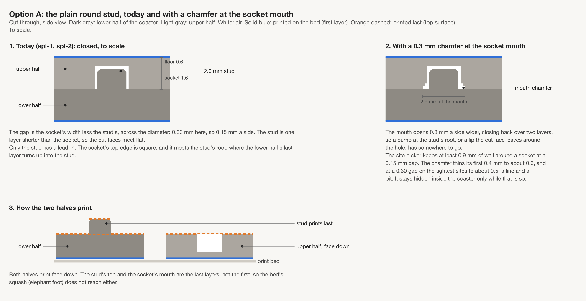
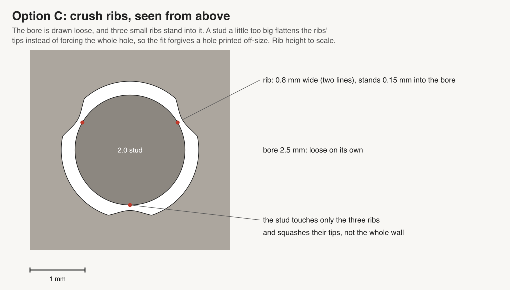
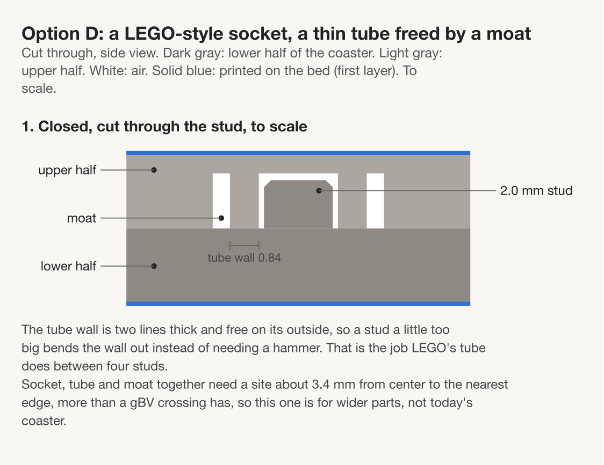
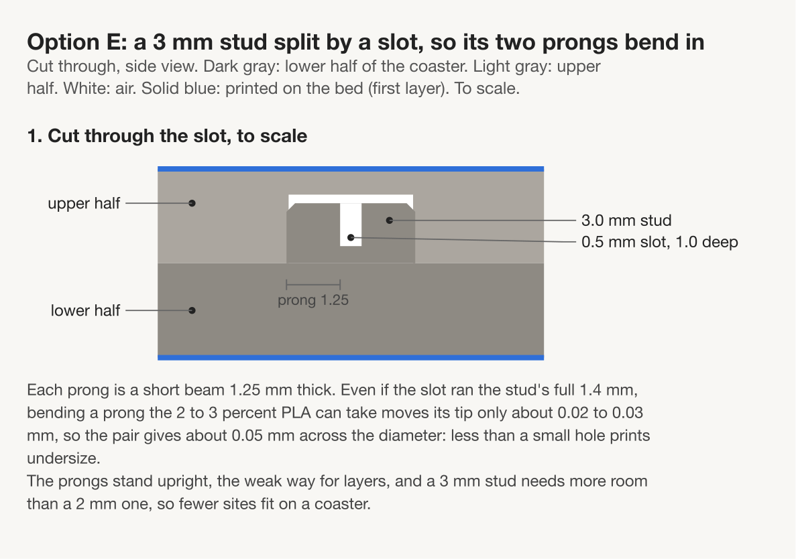
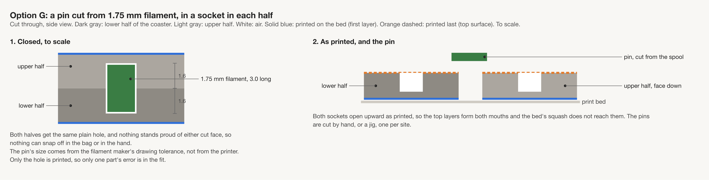
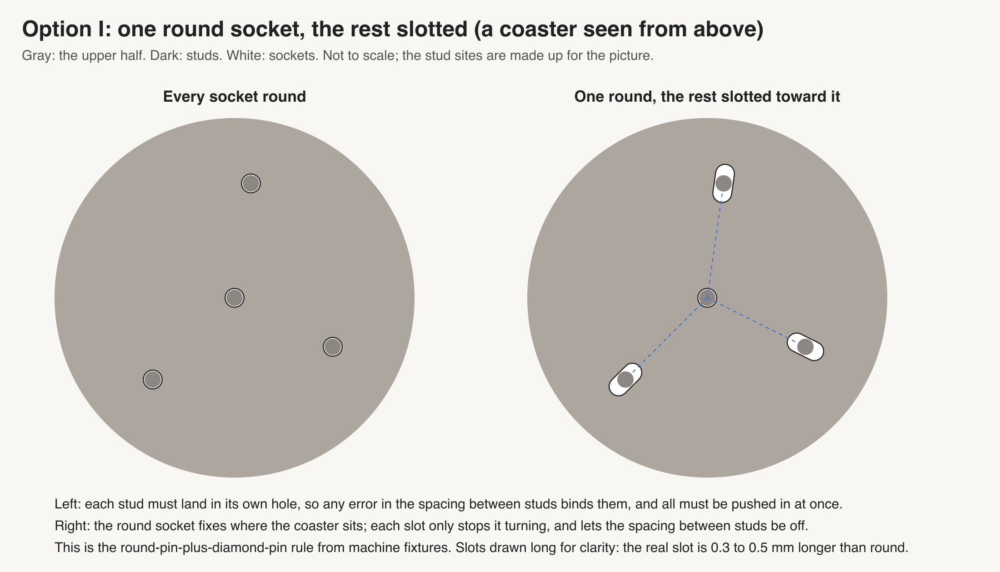

# Peg design: how to make printed studs and sockets join well (design B)

> Status: draft 2026-10-09, one of two independent passes on the same question; a checker will
> compare the two. Asked by Omar: "websearch 3d printed peg design, prepare a design doc with
> images, etc in this regards and options with links", then "it should include how to get good
> fit, snap, etc ... lego solved this problem", then "we should design a plate around the
> findings". Nothing here is decided. The sources are in
> [the research file](../../research/2026-10-09-peg-design-b.md).

**In short.** Our printer is steady but biased: round holes print small and round studs print
large, together about 0.2 to 0.5 mm across the diameter by the one source with a table. That is
why spl-1 needed a hammer at every gap up to 0.15, and it means the right gap may sit at or past
the top of spl-2's ladder. Three cheap changes go after that bias directly: a hex socket (flat
sides print true where circles shrink), a small chamfer at the socket mouth (so a lip or bump
has somewhere to go), and the slicer's own circle compensation (free, off by default). LEGO's
lesson is that a thin wall that bends forgives an oversize stud; its numbers do not port. Snap
fits do not work at our size. A three-bed plate below tests the cheap changes against today's
round socket.

**Candidate recommendation, in one line:** keep the 2 mm stud and fix the fit at the socket — a
hex socket at the gap spl-2 measures, plus a mouth chamfer where the wall allows — still a press
fit with glue optional, because those are the changes that act on the measured cause and cost
bikar only a socket shape and an edge.

## The problem

Our split coasters cut a model through its height and print both halves face down. The lower
half grows round studs on its cut face; the upper half has round sockets. Today's joint
(from [the split design §4.1](split-with-studs-design.md#41-the-stud-and-socket)):

- stud 2.0 mm wide and 1.4 tall, with a 0.2 mm top chamfer;
- socket = stud + gap, where the **gap** is across the diameter (socket width less stud width);
- socket 1.6 deep on a 0.6 mm floor, each half 2.2 thick;
- no chamfer at the socket mouth, because the split design worried one would show from the side.

What has been printed:

- **spl-1** ([record](../../prints/2026-10-09-spl-1/index.md)) drew gaps from −0.10 to 0.15. Every
  2 mm pair from −0.10 to 0.10 needed a hammer. At 0.15 (pair 4F) the stud went in by hand but
  needed a hammer to sit flush. The 1.5 and 3 mm studs were no better. Running
  `tools/fit_gap.py studs` on the slice showed the slicer kept every gap within 0.005 mm of the
  drawing, so the tightness comes from the printer, not the file.
- **spl-2** ([page](../plates/spl-2.md)) runs 0.15 to 0.40 in 0.05 steps. It was approved and
  sent to the printer on 2026-10-09 and has not been judged yet.

Why it is tight: the one source with a hole-and-shaft table, Creative3DP, says holes print 0.1 to
0.3 mm small and shafts 0.1 to 0.2 mm large (research §1, C1). A Bambu H2D owner found round
sections small while square sections were true (S2). Repeatability is good (σ about 0.02 mm, C9),
so this is a steady bias, not scatter. Stacking C1's ranges, a gap drawn at 0.15 nets −0.35 to
−0.05, which matches 4F; drawn at 0.40 it nets −0.10 to +0.20. **This transfers only loosely
(K10):** C1's table is for 5 to 25 mm parts on printers it does not name, and S3 says small holes
get tighter still, so at 2 mm the bias may be at the top of C1's range or past it. Treat the
arithmetic as a reason to expect the hand fit near or above 0.40, not as a prediction.

## Getting a good fit, in general

What the sources here agree on, with how far each transfers to us:

1. **Tune on the printer, not on paper.** Every source that gives a number gives a different one
   (research §14), and none of them measured a 2 mm stud on an X2D. MachineBlocks ships a
   calibration ladder and says to "Start with the smallest setting in each row" (S19). Our spl
   coupons are exactly that.
2. **Put the slack in the hole.** Holes print small (S1, S2, S3, S6, C1). Draw the hole larger,
   or let the slicer do it (S1), rather than drawing the stud smaller.
3. **Flats print true; small circles do not.** A square section printed true while the round one
   did not (S2). nophead's polyhole rule says a 2 mm hole should be drawn with only 4 sides
   (S6). A hex or square socket puts the contact on straight walls.
4. **Give it a lead-in.** Chamfer the stud's end and the hole's edge (S14). Our stud has one; our
   socket does not.
5. **Give the bottom somewhere to go.** Leave extra depth below the stud (S16: 2 mm). Ours has
   0.2 (the stud is 1.4, the socket 1.6).
6. **Let something thin give, not the whole wall.** Crush ribs (S17, S18), LEGO's thin walls (C3,
   C4), a slotted pin (S14). The squeeze goes into a part that can bend or crush.
7. **Keep pegs stubby, and mind the layers.** Height no more than width (S15). Layers hold about
   half the strength along them (S13). Ours is 1.4 tall by 2.0 wide and stands upright; spl-1
   broke none.
8. **Locate with one, not all.** Two tight round pins over-constrain a part; one round pin plus a
   slotted one stops binding (S12). This matters more as stud count grows.

## The LEGO clutch

**How it works.** A LEGO stud does not sit in a round hole. It is wedged between the brick's
outer wall and a hollow tube, touching each along a line (the patent states it as tangency, C3;
LEGO says studs are "wedged in between the tubes and the sides"). The walls carry half to
two-thirds of the contacts ([clutch survey §3](../../research/pattern-outline-body-clutch-survey.md#3-counter-evidence-the-case-that-the-wall-is-load-bearing)).
Studs measure 4.88 to 4.89 mm against a nominal 4.8, "deliberately oversized" so the walls flex
(C4). Sizes: stud 4.8, tube outside 6.514, tube wall about 0.86, outer wall 1.5 (C5; all
diameters or thicknesses, molded ABS).

**Why it works in molded ABS.** LEGO's molds hold about 0.004 mm (a LEGO press release carried
in [the baseplate survey §1.2](../../research/lego-baseplate-seam-survey.md#12-patent-and-official-lego-tolerance-statements)).
At that accuracy a few hundredths of interference can be set on purpose and every brick gets it.
A thin wall turns that interference into a small, even bend, so the force is steady.

**What people do when printing LEGO.** MachineBlocks prints a calibration tool with separate
settings for stud diameter, wall thickness, tube and pin, and says not to force real LEGO onto
it (S19). Its bricks run about 0.1 mm per side under, plus 0.1 mm clamp ribs (C6). This repo's
[lego-lab §7.6](lego-lab-design.md#76-the-clutch-rib--a-first-class-feature) planned a 0.10 mm
clutch rib on at least a 0.8 mm arc; those LG coupons were never printed (C7). Reviewers find
printed bricks clutch weakly against real ones (C8).

**What transfers (K10).** The **idea** transfers: line contact against a thin wall that bends.
That is about stiffness, so it holds for printed PLA as for molded ABS. The **number** does not:
the interference LEGO sets is tuned for 0.004 mm molds, while a printed 2 mm hole is off by
tenths (research §1). Any printed clutch has to be tuned on the printer.

**Why we cannot just copy it.** A LEGO-size stud needs 3.38 mm of room from its center to the
nearest edge; gBV's widest spot has 2.85, so it fits nowhere
([split design §3](split-with-studs-design.md#3-where-the-studs-can-go-on-gbv)). A
scaled-down tube with a moat (option D) needs about 3.4 mm of room and also fits nowhere on gBV.
What we can borrow at 2 mm is the thin-part-that-gives idea: crush ribs (C), a slotted stud (E),
or a hex socket whose flats meet the stud along lines (B).

## Snap fits

**The kinds.** A cantilever snap is a bendy arm with a hook (barb) at its end. An annular snap is
a ring bead that pops past a narrower throat into a groove. A split prong with a barb is two
cantilevers back to back. A ball and socket is an annular snap on a sphere.

**What the guides say.**

- Allowable strain: PC/ABS 2.5%, PC 4% (Bayer, S7, molded); PLA "4-8%" (Fictiv, S8, process not
  stated). Use about 60% of that if it will be snapped apart often (S7).
- Printed snaps loaded across layers: halve the strain (S8). Avoid upright cantilevers (S11).
- Cantilever strain ε = 3·Y·h / (2·L²) (S9), valid when length is over 10 times thickness (S10).
- Barb angles: about 30° to snap in, 80° to be serviceable, 90° permanent (S9); snippets give
  20 to 30° lead-ins (S28).
- Clearances: Fictiv 0.1 to 0.3 for printed snaps (S8), Hubs 0.5 for FDM (S11); neither says
  per side or across.

**At our size, a snap does not work.** Two cases, worked from the guides:

- **Ring snap** on the 2 mm stud: bead 2.3, throat 2.1. Passing the throat means 0.2 mm on a 2 mm
  ring, about 10% strain. Bayer's annular rule (undercut = strain × diameter, S7) at 2 to 4%
  allows 0.04 to 0.17 mm, before S8 halves it for printing. An undercut the printer can form is
  a few tenths, so the ring cracks or never clicks.
- **Barbed split prong**: L = sqrt(1.5·y·t/ε), from S9's formula. With a 0.2 mm barb (about half a
  line), a 0.8 mm prong (two lines) and 2 to 4%, L is 2.5 to 3.5 mm. Our socket is 1.6 deep and
  the whole upper half 2.2 thick, so the prong comes out through the face, and S10's 10:1 rule
  would want 8 mm.

**Transfer (K10).** S7, S9 and S10 are molding guides. S8 is the only one with a PLA number, and
it halves it for upright printed parts. None of the snap sources here was written for parts
under 3 mm. A snap could work on a thicker coaster or a sideways-printed clip, which is outside
this question.

## Options

Each option keeps the two-halves, face-down printing of the split design. "Room" is the distance
the stud's center needs to the nearest edge of the cut face; "sites on gBV" counts where it fits
on the gBV minimal coaster at 1.25×, from the split design's site picker
([§3](split-with-studs-design.md#3-where-the-studs-can-go-on-gbv)): room 1.98 gives 56 sites,
2.23 gives about 54, 2.48 gives 25, and 3.38 gives none.

### A. Plain round stud, a tuned gap, and a mouth chamfer

**How it works.** Keep today's stud and socket. Set the gap from spl-2's result. Add a 0.3 mm
chamfer at the socket mouth, two layers deep, so a bump at the stud's root or a lip around the
hole has room.

**Pros.**

- No new shape; bikar's Split-Fit-Coupon already has the gap knob.
- The chamfer goes straight at 4F's failure (in by hand, not flush).
- Both ends are last layers, so elephant foot does not touch them.

**Cons.**

- Fights the bias with one number; any change of filament or speed moves it (S1: moisture moves
  the fit).
- The chamfer thins the wall. The site picker keeps 0.9 mm of wall at a 0.15 gap; the chamfer
  thins its top 0.4 mm to about 0.6, and at a 0.30 gap on the tightest sites to about 0.5, a
  line and a bit. It stays hidden inside the coaster only while that holds. The split design's
  worry (a chamfer showing from the side) is real on the tightest sites.

**Implications.** bikar needs a mouth-chamfer size on the socket and a wall check in the site
picker that counts it. This is the control every other option is measured against.

**Sources.** S14 (chamfers), S16 (extra depth), C1, S2.

### B. Hex or square socket

**How it works.** The stud stays round; the socket gets flat sides. The stud touches each flat
along a line, and the corners give the bump and the seam somewhere to go. nophead's rule for a 2
mm hole gives 4 sides (S6).

**Pros.**

- Goes after the cause: flat sections printed true while circles shrank (S2).
- Line contact, as in LEGO (C3), with the corners as relief.
- Hex needs room 2.23, about 54 sites on gBV, nearly today's 56.

**Cons.**

- Square needs room 2.53 (its corners reach further), so only 25 sites.
- One H2D thread (S2) and one 2011 RepRap blog (S6) are the evidence; S25 (snippet) says
  polyholes did poorly for small holes. Untested on our printer.
- The stud can turn in the socket, but with three or more studs per coaster that does not matter.

**Implications.** bikar needs a sides setting on the socket (round, 4, 6) and the site picker to
use the socket's corner radius for room. The gap is measured across the flats.

**Sources.** S2, S6, S14, S25, C3.

### C. Crush ribs

**How it works.** Draw the socket a little loose, then add three thin ribs inside it that stand
proud and crush or bend as the stud goes in.

**Pros.**

- "far easier (and more forgiving)" than tuning a round hole (S17); the stud crushes small ribs
  instead of reshaping the whole wall (S18).
- The rest of the bore is loose, so the bias on the bore matters less.

**Cons.**

- A rib 0.15 proud and 0.8 wide is one or two lines; the printer, not the drawing, sets its true
  height. The molding number (about 0.25 interference, S21, snippet) does not port.
- S20 (snippet) found the walls flexing mattered more than the ribs crushing.
- Room about 2.2, close to today.

**Implications.** bikar needs a rib count and height on the socket. Rib height becomes the knob
instead of the gap.

**Sources.** S17, S18, S20, S21, C6, C7.

### D. LEGO-style tube with a moat

**How it works.** The upper half grows a thin tube (wall about 0.84) inside a moat; the stud sits
between the tube and the outer wall, touching both along lines, as LEGO does.

**Pros.**

- The one shape here proven at scale, in molded ABS (C3, C4).
- A thin tube bends, so it forgives an oversize stud.

**Cons.**

- Needs room about 3.4; fits nowhere on gBV.
- A 0.84 wall is two lines; how it bends in printed PLA is unmeasured.
- The most new geometry of any option.

**Implications.** A new socket feature in bikar. Only worth it for a coaster with wide flat
areas; not for gBV.

**Sources.** C3, C4, C5, C6, C7, S19.

### E. Split stud

**How it works.** A slot down the stud lets its two halves bend toward each other as it goes in.

**Pros.**

- The thin-part-that-gives idea, on the stud instead of the socket.
- Make suggests a center hole for the same reason (S14).

**Cons.**

- A 1.25 mm prong bent 2 to 3% moves about 0.02 to 0.03 mm, so the pair gives about 0.05 across
  the diameter: less than a small hole prints undersize (research §1). It does not absorb the
  bias.
- Needs a 3 mm stud for a usable slot: room 2.48, 25 sites.
- Prongs stand upright, the weak way for layers (S13).

**Implications.** A slot setting on the stud in bikar. Low payoff for the room it costs.

**Sources.** S13, S14, S8.

### F. Snap peg

See [Snap fits](#snap-fits) for the picture and arithmetic.

**How it works.** A bead or barb that clicks past a throat.

**Pros.** A click you can feel; no glue.

**Cons.** About 10% strain for a ring on a 2 mm stud; a barbed prong needs 2.5 to 3.5 mm, longer
than the half is thick (S7, S8, S9, S10, S11).

**Implications.** None for bikar now. Rejected at this size; would come back only for a thicker
part or a sideways clip.

**Sources.** S7, S8, S9, S10, S11, S28.

### G. Filament dowel

**How it works.** No printed stud. Both halves get a socket; a 3 mm length of 1.75 mm filament
goes in as the pin.

**Pros.**

- Extruded filament is round and true to a few hundredths, so only the holes vary.
- The pin lies along its own length, the strong way, unlike an upright printed stud (S13).
- Same room as a 2 mm stud.

**Cons.**

- Cutting and placing many short pins by hand per coaster.
- Holes still print small; one gauge (S23, snippet) found "one size doesn't work for both
  orientations", and a remixer went to 2.1 for 1.75 filament (S24, snippet).
- A loose pin can fall out before the halves close; often glued (S24).

**Implications.** bikar needs a "socket on both sides" mode. Assembly time per coaster goes up.

**Sources.** S23, S24, S13.

### H. Slicer circle compensation

**How it works.** Bambu Studio can grow every complete horizontal circle under 50 mm by a
per-filament amount, tuned in 0.02 mm steps (S1). It is off by default.

**Pros.**

- No change to the model or to bikar; a reslice of spl-2 tests it.
- Our sockets are the shape it is built for.

**Cons.**

- "only compatible with some Bambu Official filaments" (S1). spl-1 was sliced for Bambu PLA
  Basic, a Bambu filament; whether it is on that list is not checked.
- One H2D owner found it made little difference (S2).
- S1 speaks of the assembly as a whole ("positive values make the assembly looser"); whether it
  shrinks studs as well as growing holes is not stated, so both may move.
- Moisture moves the fit either way (S1).

**Implications.** A slicer setting kept in the plate's print settings, not in the model. If it
works, the drawn gap can stay small and stable across filaments only if each filament is tuned.

**Sources.** S1, S2, C2.

### I. One round socket, the rest slotted

**How it works.** On a coaster with many studs, such as stud-1, one socket is round and the
rest are slots pointing at it. The round one fixes position; the slots fix rotation only, so a
spacing error between studs cannot bind.

**Pros.**

- Removes over-constraint, a cause of binding the bias work does not touch (S12).
- Works with any socket shape above.

**Cons.**

- Fixture practice, not printed-part evidence (S12).
- Slots take more room along one direction.

**Implications.** bikar's site picker would need to mark one site as the locator and orient the
rest. Only matters once stud count is high; not tested by the plate below.

**Sources.** S12.

## Comparison

| Option | Acts on | Room / sites on gBV | bikar work | Evidence | Candidate verdict |
|---|---|---|---|---|---|
| A. Plain + mouth chamfer | the seat (flush) | 1.98 / 56 (chamfer thins the wall) | chamfer size, wall check | S14, S16 | Control; add the chamfer |
| B. Hex socket | the bias on circles | 2.23 / about 54 | socket sides | S2, S6 | **Test first** |
| B. Square socket | the bias on circles | 2.53 / 25 | socket sides | S2, S6 | Test beside hex |
| C. Crush ribs | the bias, via ribs | about 2.2 / about 54 | rib count, height | S17, S18 (no numbers) | Test second |
| D. Tube and moat | the bias, via a thin tube | about 3.4 / 0 | new feature | C3, C4 | Not for gBV |
| E. Split stud | the bias, via prongs | 2.48 / 25 | slot | arithmetic: about 0.05 | Weak; test once |
| F. Snap | holding | does not fit the half | none | S7 to S11 | Rejected at this size |
| G. Filament dowel | stud roundness | 1.98 / 56 | both-side sockets | S23, S24 (snippets) | Test third |
| H. Slicer compensation | the bias on circles | no change | none | S1; S2 against | Try now on spl-2 |
| I. Locator + slots | binding on many studs | per layout | locator marking | S12 | Later, for stud-1 |

**Candidate recommendation:** keep the 2 mm stud and fix the fit at the socket — a hex socket
at the gap spl-2 measures, plus a mouth chamfer where the wall allows — press fit, glue optional,
because the evidence points at round holes printing small and these changes act on that while
keeping nearly all of gBV's sites. This assumes Omar's glue call (call 3 in
[the split design](split-with-studs-design.md#10-open-calls-for-omar)) stays "press fit, glue
optional".

## What to print: a peg-fit plate

A plate proposal, not plate YAML. Codes PG1, PG2 and PG3 are placeholders; the main session
assigns the real ones.

**Footprint.** Coupon tiles like spl-2's: 15 mm square, 4.4 tall, cut at 2.2, one stud per pair,
up to 12 pairs a bed.

**Ids** (D-109, D-114, D-115 in [the decisions log](../../working-model/decisions-log.md)):

- lowers carry `PG1/1 A` to `PG1/1 L` on the bottom (the tables write `PG1 1A`), and the gauge
  tile `PG1/1 Z`; beds 2 and 3 the same with PG2 and PG3;
- uppers carry `1M` to `1Y`, skipping O, on their outer face;
- cut-face letters as on spl-2.

**G** is the gap spl-2 picks by its rule (the tightest gap whose two pairs both close flush by
hand and do not rattle). If no spl-2 gap closes by hand, G = 0.40 and every ladder below moves up
with it. All gaps are across the diameter; for a hex or square socket, across the flats.

**First, free: reslice spl-2 with circle compensation on (option H).** If the same gaps close
looser, that is the cheapest fix and the beds below run with it on.

### Bed 1 (PG1): socket shape

| Socket | Gap | Pair 1: lower, upper | Pair 2: lower, upper |
|---|---|---|---|
| Round (control) | G | `PG1 1A`, `1M` | `PG1 1B`, `1N` |
| Round, 0.3 mouth chamfer | G | `PG1 1C`, `1P` | `PG1 1D`, `1Q` |
| Hex | G − 0.10 | `PG1 1E`, `1R` | `PG1 1F`, `1S` |
| Hex | G | `PG1 1G`, `1T` | `PG1 1H`, `1U` |
| Square | G − 0.10 | `PG1 1I`, `1V` | `PG1 1J`, `1W` |
| Square | G | `PG1 1K`, `1X` | `PG1 1L`, `1Y` |

Plus a **gauge tile** `PG1 1Z`: one 15 mm tile with round holes drawn at 1.8, 1.9, 2.0, 2.1 and
2.2 mm, the same depth as a socket. Push a straight piece of 1.75 mm filament into each; the
smallest hole it enters tells how small a 2 mm circle really prints, without calipers.

### Bed 2 (PG2): things that give

| Socket | Gap | Pair 1 | Pair 2 |
|---|---|---|---|
| Round (control) | G | `PG2 1A`, `1M` | `PG2 1B`, `1N` |
| Hex + 0.3 mouth chamfer | G | `PG2 1C`, `1P` | `PG2 1D`, `1Q` |
| Crush ribs: bore at stud + G + 0.10, three ribs 0.8 wide, 0.15 proud | rib tips 0.20 tighter than G | `PG2 1E`, `1R` | `PG2 1F`, `1S` |
| Crush ribs: bore at stud + G + 0.20, same ribs | rib tips 0.10 tighter than G | `PG2 1G`, `1T` | `PG2 1H`, `1U` |
| Tube and moat (needs a 15 mm tile, room 3.4 fits) | G − 0.10 | `PG2 1I`, `1V` | `PG2 1J`, `1W` |
| Tube and moat | G | `PG2 1K`, `1X` | `PG2 1L`, `1Y` |

### Bed 3 (PG3): other pins

| Joint | Gap | Pair 1 | Pair 2 |
|---|---|---|---|
| Round (control) | G | `PG3 1A`, `1M` | `PG3 1B`, `1N` |
| Filament dowel, both sockets at 1.75 + 0.10 | 0.10 | `PG3 1C`, `1P` | `PG3 1D`, `1Q` |
| Filament dowel, 1.75 + 0.20 | 0.20 | `PG3 1E`, `1R` | `PG3 1F`, `1S` |
| Filament dowel, 1.75 + 0.30 | 0.30 | `PG3 1G`, `1T` | `PG3 1H`, `1U` |
| Split 3 mm stud | G − 0.10 | `PG3 1I`, `1V` | `PG3 1J`, `1W` |
| Split 3 mm stud | G | `PG3 1K`, `1X` | `PG3 1L`, `1Y` |

Every bed carries the round control at G, so a bed that prints tighter or looser overall shows up
in its control and does not get blamed on the shape.

**Time and filament.** Not sliced. Each bed is the same size of job as spl-2 (12 pairs of 15 mm
tiles; spl-2 sliced at 45 minutes and 13 g). spl-1 took about 63 minutes against a 49-minute
slice, so expect each bed to run past its slice.

### After the print

In spl-2's format, one row per question, for every bed.

| Pieces | The question | What we expect, and why | What each answer changes |
|---|---|---|---|
| Every pair | **Do:** press the upper onto the lower with a thumb. **Look for:** won't go in / goes in but leaves a gap at the seam / closes flush by hand / closes flush and rattles. | The control behaves as it did on spl-2 at G. Hex and square close more easily at the same gap (flats print true, S2). | The tightest setting of each kind whose two pairs both close flush by hand and do not rattle. If two pairs disagree, the looser wins. |
| Pairs that closed | **Do:** shake the closed pair, then pull the halves apart by hand. **Look for:** rattles / holds when shaken but pulls apart / will not pull apart by hand. | Crush ribs and the hex hold firmer than round at a gap that still closes by hand. | Between two kinds that both close, the firmer one wins; a tie goes to round, which needs no bikar change. |
| `PG1 1Z` | **Do:** push a straight piece of 1.75 mm filament into each hole. **Look for:** the smallest hole it enters. | It enters 2.0 or 2.1, not 1.8 or 1.9: holes print 0.1 to 0.3 small (C1). | Tells how much of G is hole shrink; if it enters 1.9, the hole bias is small and the stud side matters more. |
| Every upper | **Do:** read the id on the outer face. **Look for:** readable / not. | Readable, as on spl-2. | If not, the id size goes up before the next plate. |

**Decision rule.** A shape replaces the round socket only if, at the same gap, both its pairs
close flush by hand and do not rattle where round's do not, or close with a firmer pull. Otherwise
round stays and only G changes.

**Print order.**

1. Judge spl-2 as printed; it sets G.
2. Print spl-2 again, resliced with circle compensation on (option H), and judge it the same way.
   If it closes at tighter gaps, run the beds below with compensation on.
3. Bed 1, the socket shapes and the mouth chamfer.
4. Bed 2 only if bed 1 leaves the shape question open (no shape beats round, or two tie).
5. Bed 3 only if bed 2 leaves it open too.

## Open questions

- **Glue (call 3 in [the split design](split-with-studs-design.md#10-open-calls-for-omar)).** If
  the answer becomes "always glue", a looser gap is fine and most of this matters less; the
  glue then wants a gutter (S25, snippet).
- **Calipers.** None of the coupons so far were measured; the gauge tile is a stand-in. A pair of
  calipers would split the bias into hole and stud directly.
- **The plate codes.** PG1 to PG3 are placeholders.
- **Many-stud layouts.** Whether stud-1 binds from over-constraint (option I) is untested; a coaster
  with dozens of studs is where it would show.
- **bikar's hole compensation.** bikar's fit profile carries a hole compensation of 0.20 for
  calibrated PLA (per
  [lego-lab §3.5](lego-lab-design.md#35-our-existing-fit-vocabulary-cannot-express-a-lego-clutch--but-not-for-the-reason-v1-gave));
  whether the split coupon applies it is not checked. If it does, the drawn gap already holds
  some allowance and the ladders here shift.
- **Filament compatibility of option H.** Whether Bambu PLA Basic, the filament spl-1 was sliced
  for, is on Bambu's list for circle compensation (S1).
