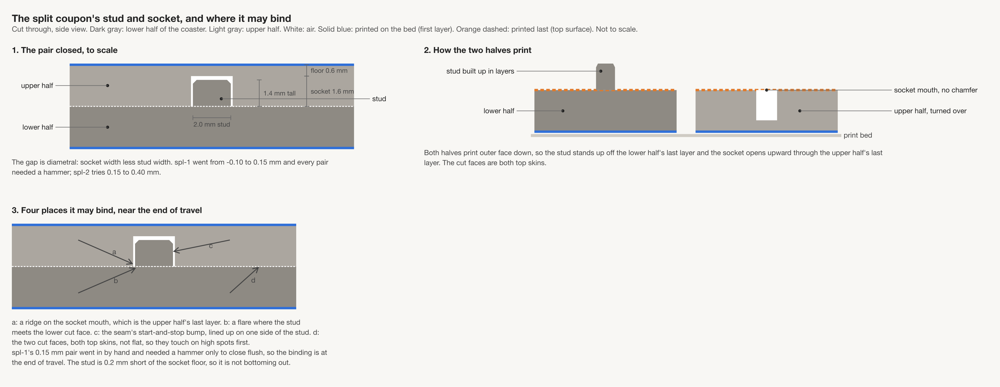
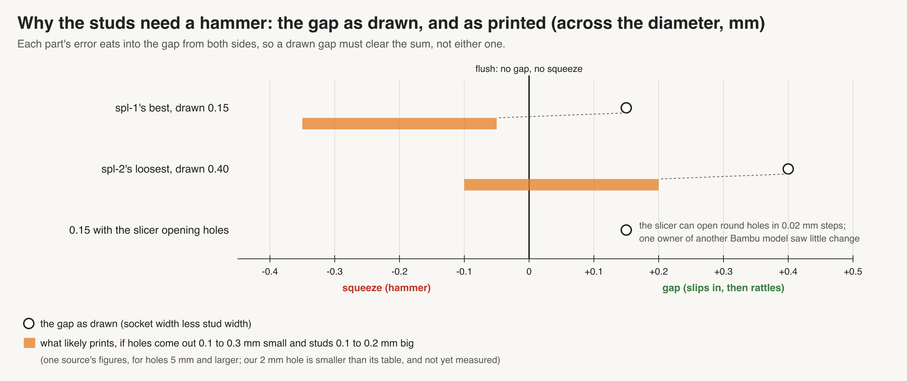
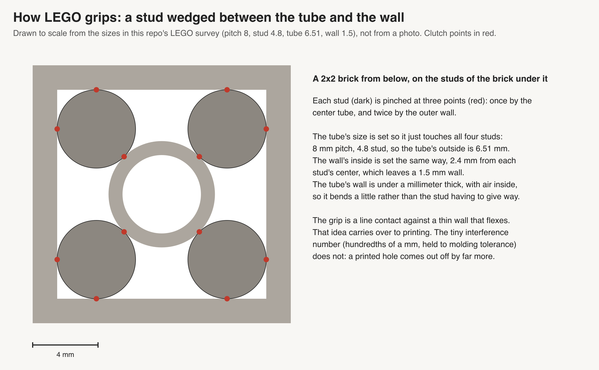
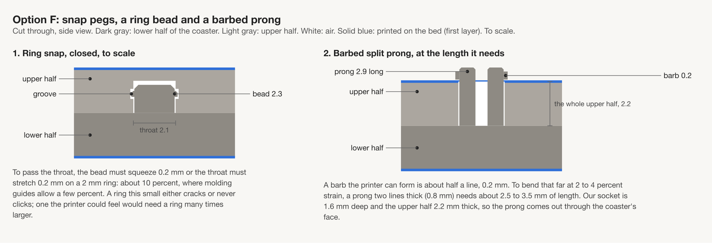
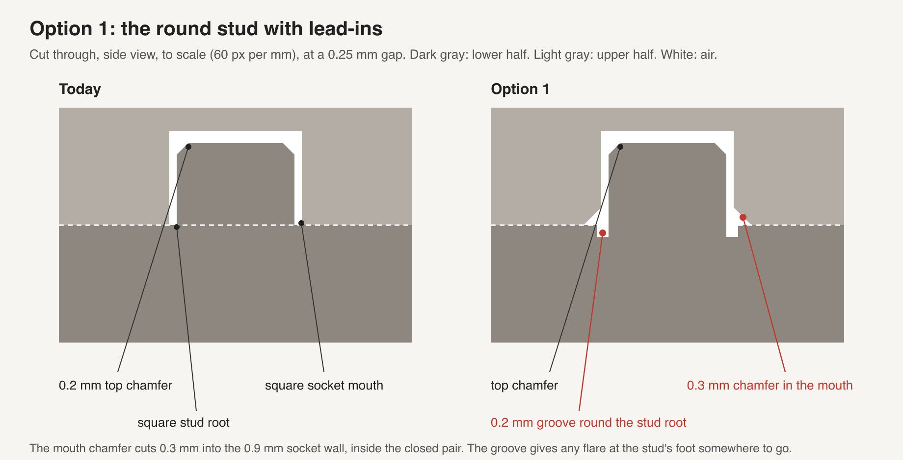
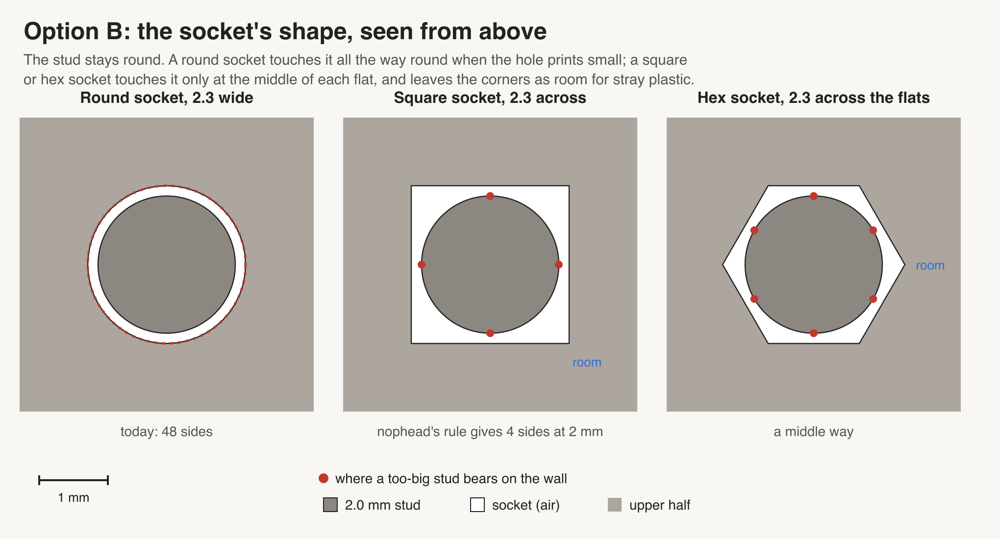
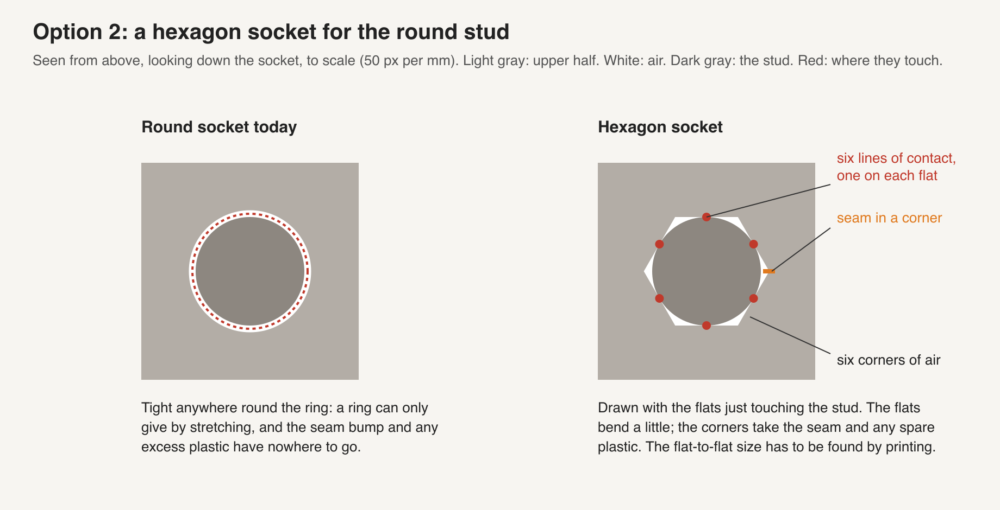
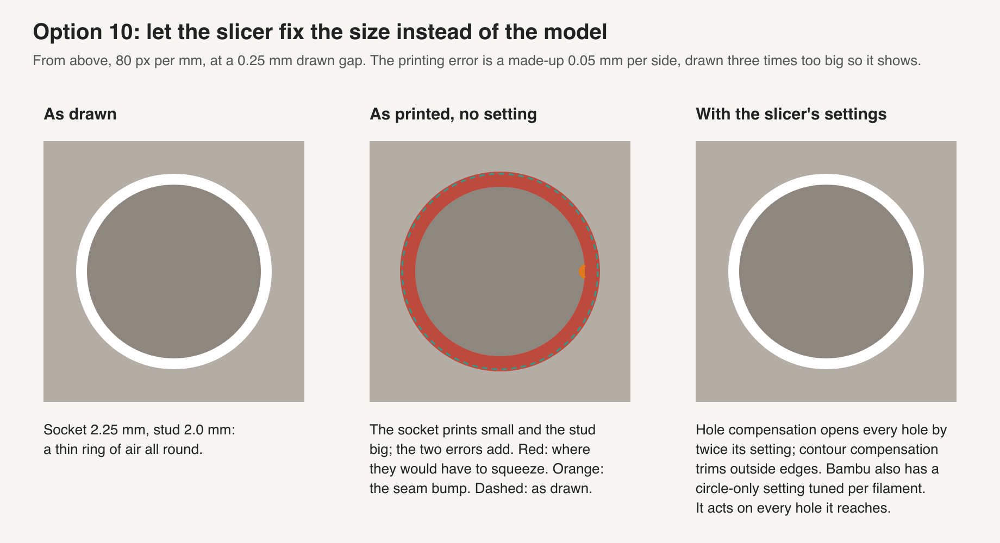

# Peg design: how the coaster halves' studs and sockets should join

> Status: draft 2026-10-09. **This is the doc to act on.** It was built from two independent
> passes on the same question, [design A](peg-design-a.md) and [design B](peg-design-b.md), with
> their research in [research A](../../research/2026-10-09-peg-design-a.md) and
> [research B](../../research/2026-10-09-peg-design-b.md); those four files stay as the record.
> Omar asked: "websearch 3d printed peg design, prepare a design doc with images, etc in this
> regards and options with links", then "it should include how to get good fit, snap, etc ...
> lego solved this problem", then "we should design a plate around the findings". Nothing here
> is decided until Omar says so; the plate below is a proposal, not a plate file.

**In short.** spl-2 found a fit both researchers missed on the tight side: every gap from 0.15 to
0.40 mm closed by hand, the pairs at 0.15 to 0.20 and one of the two at 0.25 held when shaken,
and Omar picked 0.25. The bigger lesson is that the same 0.15 gap that needed a hammer on spl-1
went in by hand on spl-2, so **the fit moves from print to print**, by roughly as much as the
width of the window that holds. A gap chosen from one print is not yet a gap we can sell on. The
next plate repeats spl-2's round ladder as a yardstick and puts the two cheap fixes both
researchers backed beside it: a small chamfer at the socket mouth and a hex-shaped socket. The
slicer's own circle setting gets its own test after that. Snap fits are out at this size.

**Recommendation, in three lines.**

1. Keep the round 2 mm stud as a press fit. Take Omar's 0.25 as the working gap, knowing it sat
   at the loose edge on spl-2 and that 0.20 was the middle of what held.
2. Print PG1 (below): round, round with a 0.3 mm mouth chamfer, and hex, each at three gaps with
   two pairs per gap, to see which shape holds over the widest range of gaps.
3. If no shape's window is wider than the print-to-print shift, a fixed gap cannot be trusted,
   and the next plate tries a part that gives: crush ribs or a split stud.

## The problem

A split coaster is cut flat into two halves, each 2.2 mm thick and each printed face-down. The
lower half carries round 2 mm studs, 1.4 mm tall with a 0.2 mm chamfer on top; the upper half
carries sockets 1.6 mm deep, with a 0.6 mm floor over them and a 0.9 mm wall around them, and no
chamfer at the mouth ([split-with-studs §4.1](split-with-studs-design.md#41-the-stud-and-socket)).
They print in Bambu PLA on an X2D with a 0.4 mm nozzle and 0.20 mm layers. The **gap** is the
socket's width less the stud's, across the diameter.

The picture (from design A) marks where a pair can bind: a ridge at the socket mouth (a), a flare
at the stud's foot (b), the seam bump where each layer starts (c), and cut faces that are not
quite flat (d).

The cause both researchers found, and the sources hold: printed holes come out smaller than
drawn and printed pegs come out bigger, and "those two errors add rather than cancel"
([rigcad](https://rigcad.com/articles/p12/clearances-for-3d-printed-moving-parts)). Small holes
suffer more: "a 3 mm hole loses much more of its diameter than a 30 mm one" (same source).
spl-1 agrees in kind: its 3 mm stud went most of the way in by hand at a 0.05 gap where the 2 mm
stud needed a hammer ([spl-1's record](../../prints/2026-10-09-spl-1/index.md)).

That picture is design B's budget, from [Creative3DP](https://tools.creative3dp.com/blog/press-fit-tolerances-3d-printing/)'s
ranges for parts 5 to 25 mm: holes 0.1 to 0.3 mm small, studs 0.1 to 0.2 mm big. It explains
spl-1. Its spl-2 bar is wrong in the way that matters: B read it as "the hand fit is near or
above 0.40", and spl-2 found it well below. The low end of the budget fits spl-2 better than the
high end; that is our reading of one print, not a measurement (no calipers have touched the
pieces).

## What spl-1 and spl-2 showed

**spl-1** ([plate](../plates/spl-1.md), [record](../../prints/2026-10-09-spl-1/index.md)) ran the
2 mm stud from −0.10 to 0.15 mm. Every pair needed a hammer. `SL1 4F` at 0.15 went in by hand
but needed a hammer to sit flush. Nothing snapped. The slice was checked: every gap came out of
the slicer as drawn, to within 0.005 mm, so the tightness is the printer, not the file.

**spl-2** ([plate](../plates/spl-2.md)) ran 15 mm coupon tiles, one 2 mm stud each, gaps 0.15 to
0.40 in 0.05 steps, two pairs per gap. Omar judged it by hand on 2026-10-09:

| Gap (mm) | Pairs | By hand? | Held when shaken? |
|---|---|---|---|
| 0.15 | `1A`, `1B` | yes | yes, both |
| 0.20 | `1C`, `1D` | yes; `1D` "might have had a click" | yes, both |
| 0.25 | `1E`, `1F` | yes | `1E` yes; `1F` no, "very loose" |
| 0.30 | `1G`, `1H` | yes | no, both "not stuck together" |
| 0.35 | `1I`, `1J` | yes | no, both |
| 0.40 | `1K`, `1L` | yes | no, both |

No stud broke when a pair was pulled apart, so a press fit at these gaps is safe for the stud.
Omar picked "it should be 1e": **G = 0.25** in this doc. G is a gap, not the carved id `1G`.

What this changes, read plainly:

- **Both predictions were too loose.** Design A said G was "likely at or above 0.3"; design B
  said "near or above 0.40" and planned for "If no spl-2 gap closes by hand, G = 0.40". All
  twelve pairs closed by hand, and nothing above 0.25 held. Both leaned on published ranges for
  larger parts and pushed them looser for a 2 mm hole; spl-2 says that push was not needed this
  time.
- **0.25 is the loose edge, not the middle.** The two pairs at 0.25 disagreed, one held and one
  fell apart. The pairs that both held were 0.15 and 0.20, so 0.20 is the middle of what held on
  this print. spl-2's own written rule ("the tightest gap whose two pairs both close flush by
  hand and do not rattle") would have picked 0.15 if `1A` and `1B` sat flush, and 0.20 if they
  did not; the notes we have say they closed by hand, not whether they sat flush, and spl-2's
  judged record will say. Omar's pick is the loosest that still held,
  which is the easiest to assemble; which of the three readings becomes the coaster's gap is his
  call (see [open questions](#open-questions)).
- **The fit moves from print to print.** At 0.15, spl-1 needed a hammer to sit flush and spl-2
  closed by hand and held. Judged by feel, that is a move of something like 0.05 to 0.10 mm in
  the gap, and nothing in the record explains it yet (same stud, same gap, same slicer check).
  The window that held on spl-2 is about 0.10 wide (0.15 to 0.20 sure, 0.25 split). A shift as
  big as the window means a gap that holds on one print can fall apart, or need a hammer, on the
  next.
- **Two pairs at one gap can disagree on the same print.** `1E` and `1F` were drawn the same and
  printed side by side. That is scatter inside one print, on top of the shift between prints.
  Design B's model, a printer that is "steady but biased" with a spread of about 0.02 mm, does
  not hold for our fit: its 0.02 is a within-run figure for repeated parts, and spl-1 against
  spl-2 is a between-print shift several times that. It is why the next plate keeps two pairs
  per gap.

## How to get a good fit

What the sources agree on, and what carries over to a 2 mm stud on our printer:

1. **Measure your own printer; published gaps are a starting point.** rigcad says plainly that
   the bands that circulate "come from printer manufacturers, service bureaux and accumulated
   forum practice", that "there is no peer-reviewed table", and that "the tolerance a given
   desktop printer can hold varies more between machines than most published figures admit".
   Its table, for features 3 to 20 mm at a 0.4 nozzle, puts "close / locating" ("assembles by
   hand, no movement in use") at 0.2 to 0.3 mm across the diameter. Our 0.15 to 0.25 sits a
   little under that, for a feature smaller than its range. That is as close as a guide gets.
2. **Chamfer the way in.** rigcad: "A 45 degree chamfer on the mouth of a hole and the end of a
   pin turns an interference into a guided entry. This single change rescues more marginal fits
   than any clearance adjustment." Bambu's own page on hole sizes lists "Lack of chamfers or
   lead-in features on holes" among the causes of a tight fit
   ([Bambu XY hole page](https://wiki.bambulab.com/en/software/bambu-studio/xy-hole-contour-compensation)).
   Our stud already has a 0.2 mm chamfer on top; the socket mouth has none.
3. **Touch on lines, not all round.** rigcad: "A pin in a round hole must match all the way
   round. A pin in a slot, or a shaft on three pads, only has to match where the pads are."
   [AON3D](https://www.aon3d.com/applications/engineering-fits-how-to-design-for-3d-printed-assemblies/):
   "circular holes can only expand by stretching along their circumference", while "square or
   hexagonal geometries reduce the amount of stretching needed", and "Z-seams can be hidden
   within a corner". This is the case for a hex socket.
4. **Let something give.** rigcad: "A short cantilever or a thin web absorbs a tenth of a
   millimetre without complaint." This is the case for crush ribs and a split stud, and it is the
   only fix aimed straight at a fit that moves between prints ([New Screwdriver](https://newscrewdriver.com/2020/12/31/accommodate-3d-printer-variation-with-crush-ribs/):
   "easier for a bearing to crush small ribs than to reshape the entire cylinder").
5. **Let the slicer size the circles.** Bambu Studio has an "Auto Circle Holes-contour
   Compensation" that resizes "circular hole/shaft features" by a model built into each
   filament ([Bambu circle page](https://wiki.bambulab.com/en/software/bambu-studio/manual/auto-circle-contour-compensation)).
   It is off by default, and off in the coupon process file this repo keeps for its tests;
   spl-2's own slice has not been checked for it. More under [the options](#the-options).

What does not carry over without a test: any published gap number. Every source here measured
bigger features, other printers, or did not say. That is the K10 condition for the whole doc: a
number transfers only after our printer prints it.

## What LEGO does, and what carries over

LEGO studs are molded slightly oversize and grip by pressing on thin walls and tubes that bend:
the stud touches along lines, not all round, and the bending wall forgives a small error. The
plastic is ABS molded to about a tenth of a millimeter or better, and "3D printed bricks, on the
other hand, are generally harder" ([MachineBlocks](https://machineblocks.com/docs/calibration)).
Printed LEGO-compatible parts tend to fail on clutch: one hobby test found it "nowhere near as
good as that of real bricks" ([Brickset](https://brickset.com/article/128767/can-you-make-compatible-bricks-with-consumer-3d-printers)),
and MachineBlocks' answer is a calibration print with an amount "added to the diameter", tuned
per printer. That last part is our spl-2 ladder by another name.

**What transfers, and why.** Line contact and a lead-in are geometry, so they carry to any
printer and any plastic: they are why the hex socket and the mouth chamfer are on the plate.
**What does not transfer.** LEGO's grip numbers (molded ABS, studs about 4.8 mm, mold accuracy in
microns) and its bending wall: our socket wall is 0.9 mm of stiffer printed PLA around a 2 mm
stud, and making it thin enough to bend would need room the coaster's cut face does not have
(design B's tube with a moat needs room for its center 3.38 mm from any edge, and gBV has no
such site). More in [design A §3](peg-design-a.md#3-how-lego-gets-its-grip-and-what-of-it-we-can-use),
[design B](peg-design-b.md#the-lego-clutch) and this repo's
[LEGO survey](../../research/lego-brick-system-survey.md).

## Snap fits

Both researchers ruled snaps out at this size, and the sources hold up:

- A snap has to bend. Printed PLA bends least across its layers: Bambu's own data sheet gives
  elongation at break of 12.2% along the layers and 7.5% across them
  ([PLA Basic data sheet](https://wiki.bambulab.com/filament-acc/abs-asa-pc/bambu_pla_basic_technical_data_sheet.pdf)),
  and [Fictiv](https://www.fictiv.com/articles/how-to-design-snap-fit-components) says to cut
  the allowed strain by half for arms that bend across the layers. Our stud prints standing up,
  so any snap on it bends across its layers.
- [Hubs](https://www.hubs.com/knowledge-base/how-design-snap-fit-joints-3d-printing/) says to
  "avoid snap-fit cantilevers built vertically in the Z direction", asks for "a minimum width of
  5 mm", and calls brittle grades "like PLA" "less suitable".
- The smallest snap pin in [BOSL2](https://github.com/BelfrySCAD/BOSL2/wiki/joiners.scad) is
  2.5 mm wide, wider than our stud, and design A works out that it needs a socket at least 2 mm
  deep; ours is 1.6.
- The [Covestro guide](https://solutions.covestro.com/-/media/covestro/solution-center/brands/downloads/imported/1556891135.pdf)
  is for molded parts; its round-snap rule (the strain halves, so the bump can be twice as large)
  is useful in kind but its strain limits are for other plastics.

spl-2's `1D` "might have had a click" at 0.20. Most likely that is a plain press fit seating past the
stud's chamfer, not a snap, and it is worth listening for again on PG1.

## The options

Both researchers found most of these; where only one did, the table says so. Each option keeps
the two halves printed face-down and pinned together.

### Side by side

| Option | Found by | What it buys | What it costs or risks | What it commits us to | On PG1? |
|---|---|---|---|---|---|
| **1. Plain round, tuned gap** (today) | both | Nothing new to build; spl-2 already found a working gap | One number against a fit that moves between prints; 0.25 sat at the loose edge | The yardstick every other option is read against | yes, the control |
| **2. 0.3 mm 45° mouth chamfer** | both | The one change rigcad says rescues the most marginal fits; aims at spl-1's "in by hand, hammer to flush" | Shortens the socket's grip by about 0.3 mm of its 1.6 depth, so it may hold a little less; thins the top of the wall to about 0.5 to 0.6 mm on gBV's tightest sites (B's figure) | A chamfer size on bikar's socket, zero to turn off; the site picker must count the thinner wall | yes |
| **3. Hex socket** (gap across the flats) | both | Flat sides print truer than circles; six lines of contact; the seam can sit in a corner | No source gives the size; the two researchers disagree on it by up to 0.20 mm; the stud can turn (no matter with three or more studs) | A socket-shape setting in bikar; hex needs room 2.23 mm, about 54 of gBV's 56 sites (B's count) | yes |
| **4. Slicer circle compensation** | both | Free; tuned by Bambu per filament; acts on holes and studs alike | Only for "complete circles on the horizontal plane", so it skips a hex socket; one forum owner saw little change; forces a scarf seam and 200 mm/s on the circles | A process setting on every studded plate, and a re-check after any filament change | no, its own send |
| **5. Crush ribs** in a looser socket | both | Built to absorb printer variation, our actual problem | At 2 mm the ribs are thinner than one 0.42 mm line, so the slicer may not draw them; press ribs are for "one-time assembly" (AON3D) | A rib count and size in bikar, and a slice check that they print | next, if PG1 says so |
| **6. Split stud** (a slot down the stud) | both | The two prongs bend, so they forgive variation | A 2 mm stud split in two is two 0.8 mm prongs standing on the layers, the weak way; both researchers doubt it at 2 mm; B tried a 3 mm one | A larger stud, so fewer sites | next, if PG1 says so |
| **7. LEGO-style giving socket** (B: tube with a moat; A: thin fingers) | both, in different forms | Grip from a bending wall, like LEGO | B's tube needs room 3.38 mm: no site on gBV; A's fingers are thinner than a line | A new socket and far fewer sites | no |
| **8. Snap** | both | Holds without glue | See [snap fits](#snap-fits): too small, bends the weak way | — | no |
| **9. Tapered stud and socket** | A only | Self-centering, seats deeper as it goes | Rests on one snippet-only source (Printpal); a taper on a 1.4 mm stud is a few layers of steps | A new stud shape | no |
| **10. Separate dowel** (A: printed lying down; B: a cut length of 1.75 mm filament) | both | Strong along its length; filament is round and cheap | A third part per stud, and a hole on both halves to size | Assembly work per coaster | no |
| **11. One stud locates, the rest are loose** | both | Only one fit has to be right; the rest only stop turning (the machinist's "diamond pin" idea, [Carr Lane](https://carrlane.com/engineering-resources/technical-information/manual-workholding/locating-devices/locating-pins)) | Fewer studs hold; a loose stud still needs glue to hold the halves together | A per-stud role in the site picker | no |
| **12. Groove round the stud's foot** | A only | Takes a flare at the stud's root out of the way | No 3D printing source; at 0.2 mm wide it is under one line and may not print; spl-2 closed flush without it | A groove size in bikar | no |

Pictures for the options not shown above, each from the researcher that drew it:
[crush ribs](peg-design-a-media/opt3-crush-ribs.png),
[split stud](peg-design-b-media/split-stud.png),
[tube with a moat](peg-design-b-media/tube-socket.png),
[thin fingers](peg-design-a-media/opt5-lego-line-contact.png),
[taper](peg-design-a-media/opt7-taper.png),
[filament dowel](peg-design-b-media/filament-dowel.png),
[one stud locates](peg-design-a-media/opt9-locate-relief.png).
The longer write-ups are in [design A §5](peg-design-a.md#5-the-options) and
[design B's options](peg-design-b.md#options).

### Notes on the four that matter

**Chamfer (2).** Both researchers chose the same size, 0.3 mm at 45°, and both sources behind it
hold up (rigcad's "single change" line is on the page as quoted). What no source measured is a
chamfer at our size. The open risk is that it trades grip for ease: on a 1.6 mm socket, 0.3 mm of
chamfer is about a fifth of the depth. **Transfer (K10):** a coupon tile has plenty of wall, so
PG1 tests the fit only; whether a 0.5 mm wall top survives on gBV's tightest sites is a separate
check on a real coaster.

**Hex (3).** The gap for a hex socket is measured **across the flats**, less the stud's diameter.
The corners reach about 1.15 times the flat size, so a hex at the same gap as a round socket has
more air: the stud touches only the six flats. That is why design A put hex tighter than round
(G−0.10 and G−0.20) and design B put it at G. No source gives the number; PG1 covers both
guesses. nophead's polyhole rule (B) gives a square for a 2 mm hole, but a square needs room 2.53
mm and keeps only 25 of gBV's sites, so both researchers settled on hex.

**Slicer compensation (4).** Re-opened and read in full:

- It acts on both sides of the fit. The page says it identifies "circular hole/shaft features",
  so design B's "whether it shrinks studs is not stated" is corrected: it does both.
- Both researchers left open whether Bambu PLA Basic on the X2D is covered. It is: the Bambu
  Studio app's own profile for PLA Basic on the X2D with a 0.4 nozzle carries the compensation's
  per-filament numbers for holes and for outer edges. The profile does not state their units.
- It only touches "complete circles on the horizontal plane", so a hex socket is not resized,
  though the round stud going into it is.
- It switches the circles to a scarf seam and a uniform 200 mm/s with full cooling, so it changes
  more than the size; a test of it is a test of all of that together.
- "dry filament results in a looser fit, and moist filament results in a tighter fit". That is
  one candidate cause for spl-1 against spl-2, not shown.
- A manual offset can fine-tune it in "0.02mm" steps, "positive values make the assembly looser".
  Separately, the general XY hole setting widens a hole by "twice the compensation value".

**Crush ribs (5).** The fix aimed most squarely at a moving fit, and the hardest to print at 2
mm. It waits on PG1: if one of the three shapes holds over a window wider than the shift, ribs
are not needed.

## Recommendation

**Keep the round 2 mm press-fit stud, add the mouth chamfer if PG1 shows it costs no grip, and
switch to a hex socket only if PG1 shows its window is clearly wider than round's.** Use 0.25 as
the working gap for now, as Omar picked, and do not lock a gap into a sold coaster until a second
print agrees with spl-2. Test the slicer's circle compensation on its own send after PG1.

Why: the chamfer and the hex are the two changes both researchers backed independently and that
re-opened sources support (rigcad for the chamfer, AON3D and rigcad for line contact); each costs
bikar one setting and no extra part. The thing spl-2 taught us, a fit that moves between prints,
is best answered by whichever shape keeps holding across the most gaps, and that is a printed
question. The next step past that, a part that gives, is costlier and harder to print at 2 mm, so
it waits for evidence it is needed.

## The next plate: PG1

**What it asks:** across round, round with a mouth chamfer, and hex, which shape holds by hand
over the widest range of gaps, and has this print shifted from spl-2?

**The pieces.** spl-2's 15 mm coupon tiles, unchanged except the socket: a lower tile with one
2 mm stud, an upper tile with one socket. Eighteen pairs, three shapes, three gaps each, two
pairs per gap:

| Shape | Gap (mm) | Pairs (carved ids) | Why this gap |
|---|---|---|---|
| Round, as today | 0.20 | `1A`, `1C` | spl-2's middle of what held |
| Round, as today | 0.25 | `1E`, `1F` | G, Omar's pick; split on spl-2 |
| Round, as today | 0.30 | `1G`, `1H` | loose on spl-2; holds only if this print runs tight |
| Round, 0.3 mm 45° mouth chamfer | 0.20 | `1J`, `1K` | same gaps as round, so the chamfer is the only change |
| Round, 0.3 mm 45° mouth chamfer | 0.25 | `1L`, `1P` | |
| Round, 0.3 mm 45° mouth chamfer | 0.30 | `1Q`, `1R` | |
| Hex, gap across the flats | 0.15 | `1T`, `1U` | design A's G−0.10 |
| Hex, gap across the flats | 0.20 | `1V`, `1W` | between the two guesses |
| Hex, gap across the flats | 0.25 | `1X`, `1Y` | design B's G |

The round pairs repeat spl-2's `1C` to `1H` gap for gap, so they are the yardstick: comparing
them with spl-2 says how far this print moved, and every chamfer and hex result is read against
the round pairs on the same bed, not against spl-2.

**Ids.** The ids skip B, D, M, N and O, which read alike or as a zero when cut 2.5 mm tall, and
also I, S and Z (1, 5, 2). That leaves eighteen letters, one per pair, so **both halves of a pair
carry the same id**: the lower `PG1 1A` on its bottom, as on spl-1 and spl-2, and the upper `1A`
on its outer face (D-115). The stud and the socket tell the halves apart. This departs from
spl-2, which gave uppers their own letters, and from D-115's cut-face pair letters, whose `AB`
for the lower half uses a B. Proposed: no cut-face letters on PG1, since each half's id shows
open or closed. Where bikar hands out letters from a number, the skip list belongs in that
generator, not in each plate. PG1's round `1E` and `1F` are at the same 0.25 as spl-2's `1E` and
`1F`; keep spl-2's pieces bagged apart so the uppers do not mix.

**Layout.** Spread each gap's two pairs apart on the bed, and mix the shapes, so a corner of the
bed that runs tight or loose does not land on one shape. Lower and upper of a pair sit side by
side.

**Print settings.** spl-2's process exactly, seam and circle compensation included, so the round
pairs compare with spl-2. Check spl-2's slice for the circle setting before slicing PG1; we
expect it off (the default) but have not read it from spl-2's file. The hex sockets' seam goes wherever the slicer
puts it; whether it lands in a corner is something to look at in the slice before sending, not
an assumption.

**Size.** Scaled from spl-2 (twelve pairs, 45 minutes, 13 g): about 65 to 70 minutes and 20 g.
Not sliced.

**Not on PG1, and why:** a flat-faced pair with no stud (spl-2 closed flush, so the cut faces are
not the problem); A's root groove (under one line wide, and spl-2 closed flush without it); B's
filament gauge tile (a dowel is not a front runner); ribs, split studs and the LEGO-style sockets
(they wait on PG1's answer).

**After PG1: the slicer test.** Print spl-2's round ladder twice on one bed, one copy with circle
compensation on and one off, if Bambu Studio lets that setting differ per object (not checked).
If it does not, print the compensated ladder alone and read it against PG1's round pairs, knowing
a print-to-print shift sits between them.

### After the print

Judged by hand, as spl-2 was. Each check is short steps, done pair by pair.

| Pieces | The question | What we expect, and why | What each answer changes |
|---|---|---|---|
| Round: `PG1 1A`, `1C` (0.20), `1E`, `1F` (0.25), `1G`, `1H` (0.30) | **Do the round pairs hold?** 1. Put the stud of the lower with `PG1 1A` on its bottom into the socket of the upper with `1A` on top. 2. Press with your thumbs. 3. Shake the closed pair hard. 4. Pull it apart. 5. Do the same for each pair. **Results:** tight (needs a hammer or does not sit flush); holds (closes by thumb, stays closed shaken); loose (closes, falls apart shaken). | If this print matches spl-2: 0.20 holds, 0.25 splits, 0.30 is loose. spl-1 against spl-2 says it may not match. | This is the yardstick. If 0.30 now holds, this print ran tight; if 0.20 falls apart, it ran loose. Either way the size of the move, set beside spl-2, is our first measure of the shift. |
| Chamfer: `PG1 1J`, `1K` (0.20), `1L`, `1P` (0.25), `1Q`, `1R` (0.30) | **Does the chamfer change the hold?** Same steps and results as the round row. | It closes at least as easily as round at the same gap, and may hold a little less, since 0.3 mm of the socket's grip is gone. | Holds as well as round at each gap: the chamfer goes on every socket, as cheap insurance against a tight print. Holds a gap less: it is kept only if tight prints keep happening. |
| Hex: `PG1 1T`, `1U` (0.15), `1V`, `1W` (0.20), `1X`, `1Y` (0.25) | **Where does hex hold?** Same steps and results as the round row. | Design A expects hex to hold at tighter gaps than round; design B expects about the same. | Count the gaps where both pairs hold, for hex and for round. Hex holds at more gaps: hex becomes the socket, at the middle of its window. The same or fewer: round stays. |
| Every pair, after pulling apart | **Did anything break?** 1. Look at each stud. 2. Look at each socket's rim. **Results:** whole; a stud snapped or cracked; a socket rim split. | Nothing breaks, as on spl-2. | Anything breaking at a gap that held: that gap is too tight to sell, whatever the hold. |
| All 36 pieces (18 ids, each on both halves) | **Can you tell every id apart?** 1. Lay the uppers out. 2. Read each id aloud. 3. Check it against this table. **Results:** all read; two looked alike (name them). | All read, with B, D, M, N and O gone. | Two alike: those letters join the skip list in the generator. |

**What decides it.** The shape with the widest window, counted as gaps where both pairs held,
wins, and its gap is the middle of that window. If no shape holds at more than two neighboring
gaps, the window is no wider than the shift between spl-1 and spl-2, and the next plate tries
ribs or a split stud.

## Where A and B agreed, disagreed, and what only one found

Each source behind a load-bearing claim was re-opened on 2026-10-09; "holds" means the page says
what the docs claim. Snippet-only means neither the researcher nor this check read the page.

**Agreed (10):**

| Claim | Source checked | Verdict |
|---|---|---|
| Holes print small, studs big, the errors add; small holes worse | rigcad; Creative3DP | holds |
| A 0.3 mm 45° mouth chamfer is the cheapest fix | rigcad ("single change rescues more marginal fits"); Bambu XY hole page | holds |
| A hex socket: line contact, the seam in a corner | AON3D | holds; no source gives a size |
| Snap fits do not work at 2 mm in PLA | Fictiv; Hubs; BOSL2; Covestro; PLA Basic data sheet | holds |
| LEGO's line contact and lead-in carry over, its numbers and bending ABS wall do not | MachineBlocks; Brickset | holds |
| Crush ribs absorb variation, but are smaller than a line at 2 mm | Hackaday; New Screwdriver | holds for the first half; the second is both researchers' arithmetic |
| Slicer circle compensation is off in our settings and worth a test | Bambu circle page; the coupon process file this repo keeps | holds; spl-2's own slice not read |
| A split stud is weak at 2 mm | Fictiv (strain across the layers) | holds in kind |
| One locating stud, the rest relieved | Carr Lane | holds |
| A separate dowel is an option | A: printed lying down (Hubs orientation page); B: filament | holds in kind; neither is a front runner |

**Disagreed (5):**

| Where | A said | B said | What the evidence supports |
|---|---|---|---|
| The gap for hex | G−0.10 and G−0.20 | G | No source gives it; PG1 covers 0.15 to 0.25 |
| The lead fix | Chamfer plus root groove on round | Hex plus chamfer | Both are sourced in kind; spl-2 closed flush, which weakens the groove's case; PG1 decides chamfer against hex |
| Steady printer or moving fit | (no model of its own) | "steady but biased", spread about 0.02 mm | Our own prints: spl-1 and spl-2 differ by far more than 0.02 at the same gap |
| Does circle compensation resize studs | yes, "circles" | "not stated" | The page says "hole/shaft": yes |
| How to test | One bed, twelve pairs at G−0.05 | Three beds, including a gauge tile and other pins | spl-2 moved G and showed scatter; PG1 takes three gaps per shape, two pairs each |

Both also predicted G too loose (A at or above 0.3, B near or above 0.40); spl-2 gave 0.25. Both
left PLA Basic's coverage by circle compensation open; the slicer's own profile settles it.

**Only one found (flagged, not trusted on its own):**

- *A only:* the root groove (no 3D printing source); the tapered stud (Printpal, snippet only);
  thin LEGO-style fingers; BOSL2's smallest snap pin needing a socket at least 2 mm deep; a
  maker's press-fit notes where a zero gap needs a hammer (val.town, one printer).
- *B only:* the room and site counts on gBV per socket shape (from the split design's site
  picker, not re-run here); the chamfer thinning the wall to about 0.5 to 0.6 mm; the tube with a
  moat; nophead's square for a 2 mm hole; the filament gauge tile; a Bambu forum thread where
  round sections printed small and square ones true.

**Sources that did not fully hold:**

- The Bambu forum thread B leans on for "round small, square true" ([168189](https://forum.bambulab.com/t/square-section-is-good-but-round-section-is-small/168189))
  is real but thinner than B's write-up: the opening post does not name the printer in what we
  read, its main material is ABS, its numbers are mostly percentages, and "up to 0.7 mm" is one
  reply.
- Snippet only, never read in full by either side or this check: Printpal (taper), the
  Printables crush-rib test models, MakerWorld's tolerance test, the Seas3D PLA sheet, and the
  sources behind B's filament gauge. thewave.engineer and the Brighton Toy Museum LEGO
  measurements could not be re-opened (blocked and rate-limited); their numbers reach this doc
  only through the repo's [LEGO survey](../../research/lego-brick-system-survey.md), and none of
  them is load-bearing here.
- Eng-Tips and the Mechanical Design Handbook (A's sources for the diamond pin) were snippets;
  Carr Lane, which B read, covers the same idea in full.

## Open questions

- **Which reading of spl-2 becomes the gap**: Omar's 0.25 (loosest that held, easiest to put
  together), 0.20 (the middle of what held), or what spl-2's own written rule gives (0.15 if
  `1A` and `1B` sat flush, else 0.20). PG1 holds all
  three in view; the call is his, and it should wait for PG1's round pairs.
- **Cut-face letters on coupons.** D-115 keeps them, and their `AB` uses a B; PG1 proposes
  dropping them. Omar's call on the plate page.
- **Glue.** [split-with-studs §10](split-with-studs-design.md#10-open-calls-for-omar) leaves glue
  as an open call; a press fit that holds by hand on a coupon may still want glue on a coaster
  that gets washed.
- **bikar's hole allowance.** Design B notes the [Lego Lab design](lego-lab-design.md) carries a
  0.20 mm hole allowance in its fit profile. Whether the split coupon applies it is not checked
  here; spl-1's slice check found every gap as drawn, which suggests not.
- **Why spl-1 and spl-2 differ.** Moisture in the filament is one candidate the Bambu page names;
  nothing in either record shows it.
