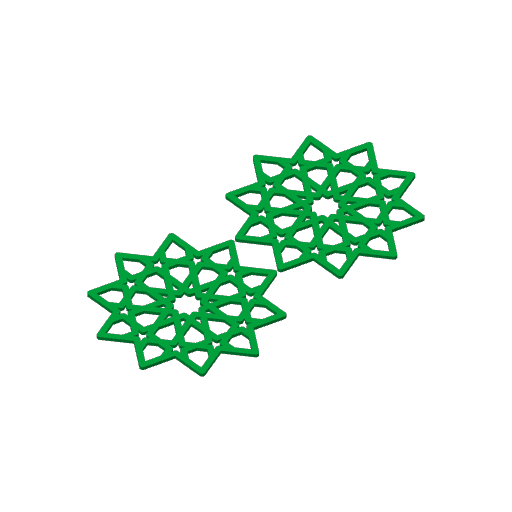

# Split with studs: cut a model flat, print both halves face-down, pin them back together

> Status: draft 2026-10-04, for Omar to decide the six calls in
> [Open calls for Omar](#10-open-calls-for-omar). Call 6 and §11, how loose pieces are trapped
> between the halves, were added the same day. Asked by Omar on 2026-10-04 (typos fixed):
> "how can we have a minimal construction where we slice it in half across the xy plane and have
> it so we can reconstruct with lego-like connectors ... so that we have two glossy sides of the
> construction that print against the plate — this should be a general technique". Nothing has
> been built or printed. The research behind it is
> [split-with-studs-research.md](../../research/split-with-studs-research.md).

**In short.** Cut the coaster in half through its height. Print both halves with their outside
face on the bed, so the face you see from above and the face you see from below both come off
the plate. One half grows small round studs on its cut face, the other has matching sockets, and
they press together.

On the gBV minimal coaster at 1.25× (112.5 mm across, 4.4 mm tall, 3.75 mm straps), a LEGO-size
stud (4.8 mm) fits nowhere. A 2 mm stud does not fit on a plain strap either, missing by
0.05–0.1 mm. It does fit where straps cross: the cut face has 56 such spots at least 10 mm apart
(§3, with a picture).

Both halves fit on one X2D bed. Sliced locally, the pair takes 61 minutes against 57 for the
whole coaster, and 21 g against 16 g (§7.4).

The face you get depends on the plate (§1). The Textured PEI plate the X2D ships with gives a
grained face on both sides, not a glossy one. No Bambu plate is sold as plainly glossy: the
nearest, by the vendor's own words, are the Cool Plate SuperTack ("approaches a smooth, glossy
finish") and the Engineering plate ("nearly glossy"), and either is a purchase.

**Recommendation.** Build the split into bikar's coaster block as one more clause, next to
`loose` and `window`. A coaster is a flat bottom with a height at every point. Each half is one of
those too: the studs are raised spots and the sockets are sunk ones, so no union of two solids is
ever needed (§6). Leave general 3D models (orbs, bricks) to the slicer's cut tool, sized by us,
until [hemisphere-split](../orb/hemisphere-split-design.md)'s own print says otherwise.

Before any code, print the coupon in §9. It settles the stud fit and checks the floor under a
socket, the only two numbers this design has no measurement for.

**Loose pieces get easier too (§11).** Give each half a thin lip round every opening, on its
visible face. Drop the pieces into the lower half, where the lip stops them falling through, then
press the upper half on: its lip closes over them. A piece is trapped, not squeezed, so it can be
cut loose enough to drop in, and no fit has to be tuned for each piece shape.

---

## 1. What "glossy" means here, plate by plate

The face a part shows against the bed is a copy of the bed's surface. The ask, "two glossy sides",
is really two asks:

- **Two sides the same.** Both visible faces come off the bed. Today the top face of a coaster is
  the last layer and the bottom face is the plate's copy, so the two sides never match.
- **Glossy.** The face is shiny.

Splitting delivers the first on any plate. Only the plate delivers the second.

Every row below is Bambu's own description of the plate
([research §5](../../research/split-with-studs-research.md#5-build-plates-and-the-face-they-leave)),
quoted, not measured by us.

| Plate | What Bambu says it leaves on the bottom face | Also from Bambu | On hand? |
|---|---|---|---|
| Textured PEI ([sheets-04g](../plates/sheets-04g.md) sliced for it) | "a unique textured finish" | "the standard plate included with Bambu lab printers" | yes: the X2D ships with it, both sides usable |
| Smooth PEI | "a smooth and matte texture" | for "a level bottom surface" and "tight tolerances"; PLA needs no glue | no, a purchase |
| Cool Plate SuperTack | "a finely textured surface that approaches a smooth, glossy finish" | PLA and PETG only; holds PLA at a 40 °C bed, and the lower bed temperature "helps effectively reduce ... 'elephant foot'" | no, a purchase |
| Engineering plate | "a smoother, nearly glossy bottom finish" | glue before every filament, so glue sits against the visible face | no, a purchase |
| Dual-Texture PEI | "either a matte or smooth finish" | — | no, a purchase |

So on Bambu's own words, Smooth PEI is smooth but **matte**. The two nearest to gloss are
SuperTack and the Engineering plate, and the Engineering plate needs glue on every print. Nobody in
the research measured gloss, and the filament matters too: PLA Basic, the filament on the recent
plates, is not a silk or glossy PLA. Whether any of these reads as "glossy" to Omar is a look at a
print, not a lookup.

**Transfer conditions (K10).** The finish claims are the vendor's, for Bambu plates. They carry to
this print because it is PLA on a Bambu plate with the X2D preset. They do not carry the edge: the
preset's 0.15 mm elephant-foot compensation was set for one plate, and Bambu says "the elephant
foot compensation value can vary between different types of build plates ... After changing the
build plate, measure and calculate the compensation value again"
([research §6](../../research/split-with-studs-research.md#6-elephants-foot)). On a smooth plate a
flared or pinched first layer also shows more than on texture. So the coupon in §9 prints on the
plate Omar picks, and a plate change means one more edge check.

The `bambu slice compose` tool already takes `--plate-type` with `cool_plate`, `eng_plate`,
`hot_plate`, `textured_plate` and `supertack_plate`, so a recipe can be sliced for any of them.
Smooth PEI presumably slices as `hot_plate` (Studio's "High Temp Plate"); the research did not check
that mapping.

## 2. What we already have, and what carries over

| Where | What it lends | What does not carry over, and why |
|---|---|---|
| [hemisphere-split](../orb/hemisphere-split-design.md) (decided, D-022) | The slicers' cut tools ([§3.1](../orb/hemisphere-split-design.md#31-the-slicers-already-ship-this-in-depth)): Planar or Dovetail cuts; Plug, Dowel or Snap connectors. This pass re-read the defaults in source ([research §1](../../research/split-with-studs-research.md#1-slicer-cut-tools)): a connector 2.5 mm across and 3 mm deep in PrusaSlicer, Orca and Bambu Studio; size tolerance 0 in PrusaSlicer and Orca, but 0.1 in Bambu Studio, added to the radius unhalved (about 0.2 on the diameter, read from code, not printed). Cap the cut and keep the mesh check ([§5](../orb/hemisphere-split-design.md#5-the-mesh-contract-cap-the-cut-keep-the-gate)). Glue strength rests on bond area ([§3.4](../orb/hemisphere-split-design.md#34-a-glued-seams-strength-depends-almost-entirely-on-which-plane-you-cut)). | **Its "a pin cannot fit" result does not carry.** There the plane cuts *across* a strut, so a socket goes into the strut's small end face, 3 × 2.4 mm. That leaves 0.6 mm for the socket ([§3.3](../orb/hemisphere-split-design.md#33-pin-in-strut-registration-fails-at-the-default-strut-by-a-factor-of-four)). Here the plane runs *along* the straps, so a socket goes down into the strap from above. Its width is bounded by the strap's 3.75 mm width in plan, and its depth by the half's 2.2 mm height. Different geometry, different ceiling (§3). |
| [c2-assembly](c2-assembly-design.md) | The fit ladder, CAL-FIT-01: press −0.10, snug +0.05, sliding +0.15, free +0.35, across the diameter. A ⌀3 mm floor for printed pins, and the warning that a pin printed standing up has its layers in shear: about half the strength of one printed lying down in one lab's tests ([§6](c2-assembly-design.md#6-pins--engineering-floors-and-the-orientation-question)). | The ladder was never printed (coupon MC-1), and its source scopes it to "the 5–25mm range", above a 2 mm stud ([research §3](../../research/split-with-studs-research.md#3-fdm-pin-and-stud-tolerances)). The ⌀3 floor was set for pins that carry an assembly's load; §4.1 says why these studs go under it. |
| [lego-lab](lego-lab-design.md) §3 | LEGO stud 4.8 mm on an 8.0 mm pitch. Clutch is a small interference, not a clearance. Clearance is set for the whole part; interference is local and springy. | A real stud's springy clutch needs the stud wall's flex and a hollow tube. A 2 mm solid PLA stud has neither. So "LEGO-like" here means the shape, not the clutch numbers. |
| [loose-pieces](../coaster/loose-pieces-design.md) §3.4 | Why a gap read off one joint does not carry to another: closed holes vs outer outlines, per face vs across the diameter, round vs polygon. | — |
| [borderless joins](../coaster/coaster-borderless-joins-design.md) §2, §7 | The coaster is a flat bottom with a height at every point, so nothing can hang under anything. The KEY-1 butterfly key ladder 0.05 / 0.10 / 0.15 ([minis-05](../plates/minis-05.md)). "Our X2D evidence runs the other way: 0.15 felt loose." | The key is a polygon outline, not a small round hole. |
| X2D prints | minis-03: dovetail at 0.15 "a bit loose". [minis-04](../plates/minis-04.md): pegs at 0.10 "too tight", sliced on the wrong preset. [sheets-04](../plates/sheets-04.md): every piece fell through at positive gaps. [sheets-04b](../plates/sheets-04b.md): "the bottom row fit better", the zero and press-fit rows, so [sheets-04g](../plates/sheets-04g.md) uses gap 0. | All are polygon pieces in through-holes 1.2–4 mm deep, or dovetails. None is a 2 mm round stud in a blind socket. Printers shrink small round holes the most (CAL-HOL-01). |
| CAL-CLR-01 (0.4 mm) | — | **It does not carry.** It is the gap at which two surfaces printed *together* come apart. Studs are printed apart and pressed in afterwards. |
| D-090 and bikar #297 | Coaster walls now follow the exact outline, not a 0.4 mm grid. So a round socket wall can be cut true, as the loose-piece pocket walls are. | — |

## 3. Where the studs can go on gBV

`tools/split_sites.py` slices the rendered coaster at the cut height. It then finds every point on
the cut face with room for a socket plus a wall around it. Room is the distance from the point to
the nearest edge of the cut face. A point qualifies when that distance is at least
(stud + gap) ÷ 2 + wall. From those points it picks sites, roomiest first, at least a set spacing
apart.

The coaster is the gBV minimal coaster at size 112.5, strap 3.75, height 4.4, round 1.25, as on
[sheets-04g](../plates/sheets-04g.md). It was rendered by bikar at 6629f24 and passed bikar's own
`--check`: one closed solid, 18.4 cm³. Cut at z = 2.2 mm, the cut face covers 4,368 mm².


Command:
`python3 tools/split_sites.py gbv.stl --z 2.2 --stud 2.0 --gap 0.15 --spacing 10 --sweep 1.5,2,2.5,3,3.5,4.8 --svg out.svg`,
then `rsvg-convert` to PNG. The wall is 0.9 mm, two line widths,
from [Hydra Research's design rules](../../research/split-with-studs-research.md#3-fdm-pin-and-stud-tolerances).

| Stud ⌀ (gap +0.15) | Room needed from the edge | Area with room | Sites 10 mm apart | Sites 25 mm apart |
|---|---|---|---|---|
| 1.5 mm | 1.73 mm | 799 mm² | 57 | 9 |
| 2.0 mm | 1.98 mm | 338 mm² | 56 | 9 |
| 2.5 mm | 2.23 mm | 156 mm² | 54 | — |
| 3.0 mm | 2.48 mm | 54 mm² | 25 | 8 |
| 3.5 mm | 2.73 mm | 7 mm² | 25 | — |
| 4.8 mm (LEGO) | 3.38 mm | 0 | 0 | 0 |

The "25 mm apart" column was measured at gap 0 (the 1.5, 2.0 and 3.0 rows only), so it is a
little generous against the gap +0.15 columns.

**The plain strap, worked by hand.** A strap 3.75 mm wide has 1.875 mm of room at its centre line.
A 2.0 mm stud needs 1.0 + 0.9 = 1.90 at gap 0, and 1.98 at the loosest gap. It misses by 0.025 to
0.1 mm. That is why the straps stay grey in the picture.

**Where straps cross.** The widest circle that fits where two straps of width w cross at angle θ
has diameter w ÷ cos(θ/2): 5.30 mm at 90°, 4.33 mm at 60°. On gBV the widest spot measured is
2.85 mm from every edge. A socket there could be 3.76 mm across with 0.9 mm walls, still short of a
4.8 mm LEGO stud.

**What this means for other models.** Any strap pattern drawn with straps narrower than
stud + gap + 1.8 mm can only take studs where straps cross. The picker finds those spots on its
own, so the rule needs no list of node types. A pattern with no crossing wide enough gets a
refusal that names the widest spot it found, not a guess (§8).

**Why these transfer (K10).** The picture measures one coaster at one size, cut at one height. It
carries to any cut height below where the top fillet starts (4.4 − 1.25 = 3.15 mm), because a
minimal coaster's outline is the same at every height up to there. It does not carry to a coaster
with a raised design on a slab, where the cut face is different at each height (§5).

## 4. The joint

### 4.1 The stud and socket

**Default:** stud ⌀ 2.0 mm, the smallest round hole Hydra Research's rules call printable once a
gap is added (hole "> 2 mm", pin "> ø1.8 mm", [Hydra Research](https://www.hydraresearch3d.com/design-rules),
as read by this repo's earlier research and carried in
[research §3](../../research/split-with-studs-research.md#3-fdm-pin-and-stud-tolerances)),
with 0.9 mm of wall around the socket from the same rules.

That is under two other floors, and on purpose. Hubs says pins "less than 5mm diameter" print as
walls only and are weak, and suggests a bought pin; c2-assembly set ⌀3 mm for its printed pins.
Both are about pins that carry load. These studs only line the halves up and hold them lightly: the
slicer vendors treat their own connectors the same way, "fit all the pieces using the connectors"
and then glue ([research §4](../../research/split-with-studs-research.md#4-glue-or-press-fit)), and
their default connector is itself 2.5 mm, under both floors. So the floors do not transfer, because
the load does not. If a 2 mm stud snaps off when the halves are pulled apart, the coupon's 3.0 mm
row is the fallback: gBV has room for 25 of those 10 mm apart and 8 at 25 mm (§3).

**Default:** socket ⌀ = stud + 0.05 mm, the `snug` rung of CAL-FIT-01, across the diameter. It is a
starting point, not a result, and the rung does not strictly transfer: its source scopes the ladder
to "rigid filaments (PLA, PETG, ABS) in the 5–25mm range", and a 2 mm stud is below that range
([research §3](../../research/split-with-studs-research.md#3-fdm-pin-and-stud-tolerances)). The
sources do not even agree which way to move a printed stud: two LEGO libraries make it bigger
(×1.02–1.05), two others make it smaller (−0.08 to −0.15), each tuned on its own printer, and none
on an X2D. The X2D readings in §2 point both ways too: polygon pieces fit best at 0 and below, and
pegs at 0.10 were too tight on a wrong preset. So the coupon in §9 ladders it from −0.10 to +0.15.

**Default:** floor under each socket = 0.6 mm, three 0.2 mm layers, CAL-CST-03, the coaster's
deboss floor. This carries over because it is the same build: a thin solid printed straight onto
the bed under a pocket that opens upward. One thing is new. Here that floor *is* the visible face,
so if the floor is thin enough to let light through, the socket will show as a spot. That is the
second thing the coupon checks.

A proposed bet, CAL-SPL-02, would cover the floor if it does show through.

- **Stud height** = socket depth − 0.2 mm (one layer at the X2D preset's 0.20 mm layer height,
  [sheets-04g.yaml](../plates/sheets-04g.yaml)). The stud never bottoms out, so the two cut faces
  meet flat. Cut at 2.2 mm with a 0.6 mm floor, the socket is 1.6 mm deep and the stud 1.4 mm tall.
- **A lead-in on the stud.** A one-layer 45° chamfer on the stud's top edge, so it finds the socket
  before it has to fit. The socket mouth gets none: its top edge is the last layer of the cut
  face, and a chamfer there would open a gap visible from the side.
- **Printed standing up, the weak way, because there is no other.** Studs rise from the lower
  half's cut face, along Z, so a sideways push shears them along a layer line, right at the cut
  face. c2-assembly measured that as the weak way to print a pin, about half the strength of one
  printed lying down in one lab's tests
  ([c2-assembly §6](c2-assembly-design.md#6-pins--engineering-floors-and-the-orientation-question)).
  It is acceptable here for the reason c2-assembly accepted its own short upright pins: they are
  short (1.4 mm) and lightly loaded, and nine or more of them share any sideways push. Hubs
  suggests a small fillet at a small pin's base; that is a refinement for after the coupon. Sockets open upward in the upper half, so neither part needs anything printed in mid-air.

A proposed bet, CAL-SPL-01, would hold the stud fit on the X2D. It is not minted here: bets are
registered in bikar's `CAL_BETS`, and this doc only proposes. The coupon in §9 is what it would
point to.

### 4.2 The other joints considered

| Joint | Numbers on gBV | Verdict |
|---|---|---|
| **LEGO stud, 4.8 mm** | needs 3.38 mm of room; gBV's widest spot is 2.85 | does not fit anywhere (§3) |
| **Small round stud at crossings** (the default) | 2.0 mm stud, 56 sites | fits; needs the §9 coupon |
| **Smaller stud on plain straps**, 1.5 mm | fits on every strap (1.73 needed, 1.875 there) | below Hydra's 2 mm smallest-hole rule, so the socket may print closed or ragged. It is the fallback if the crossings prove too few on another pattern, and the coupon's 1.5 mm row says whether it prints. |
| **Rib and groove along every strap** | rib 1.2 mm (CAL-FEA-01's floor), groove walls (3.75 − 1.2) ÷ 2 = 1.27 mm | fits every strap and doubles as a glue channel. But hundreds of millimetres of rib must line up at once on a part that can bow, so one high spot stops it seating. Worth a coupon row only if studs fail. |
| **Dovetail rail** | — | ruled out for this cut. A dovetail slides together in one straight line. The halves of a strap pattern meet face to face, top down, and a rail would have to cross the holes. The slicer's Dovetail mode is for an upright cut. |
| **Snap connectors** (the slicer's Snap) | default bulge 0.15 of the connector size: 0.3 mm on a 2 mm pin | a 1.4 mm stud has no length to flex. Not tried. |
| **Loose dowels** (both halves get sockets, a separate pin) | the same 56 sites | needs no stud on either half, so it is the one that works on a general 3D model with no union. On a coaster it adds a part to print, lose and seat. Kept for the general case (§6). |
| **No pins, glue only** | — | the star outline gives nothing to line up by. Ten-fold symmetry means it can sit one tenth off and still look almost right until the holes disagree. Not recommended. |

## 5. Which models, and which cut heights

**Minimal coasters, cut anywhere in their flat part.** The outline is the same at every height, so
each half is one piece and the picture in §3 holds at any height up to the fillet's start. Each
half must be at least socket depth + floor tall: 1.6 + 0.6 = 2.2 mm with these numbers. A 4.4 mm
coaster therefore has exactly one cut height that works, its middle. A thinner coaster needs a
shallower socket, or no split.

**Coasters with a raised design on a slab** (the `relief` coasters). Cut inside the slab and the
upper half carries all the raised design, which is fine. Cut above the slab and the upper half
falls apart into loose islands. The split must refuse that and say how many pieces it would make,
as `window` already does for the pieces it cuts off.

**Twist coasters** are built as a loft, not as heights over an outline. The split refuses them,
as `twist` already refuses a bottom edge.

**General 3D models** (orbs, bricks). There is no outline to reuse. Cutting them means capping the
cut, which [hemisphere-split §5](../orb/hemisphere-split-design.md#5-the-mesh-contract-cap-the-cut-keep-the-gate)
designs, and its own print (P3) has not yet settled whether that is worth building. Until it is,
the general route is the slicer's cut tool with our sizes, or loose dowels (§4.2).

## 6. Where it lives

| | **A. A clause in bikar's coaster block** (recommended) | **B. The slicer's cut tool** | **C. Post-process the STL in OpenSCAD** |
|---|---|---|---|
| What it is | `split at <mm> [studs <⌀> [gap <mm>] [spacing <mm>]]`, emitting `--piece lower` and `--piece upper`, the upper already flipped and mirrored | Bambu Studio's Cut: a plane, then connectors placed by hand ([research §1](../../research/split-with-studs-research.md#1-slicer-cut-tools)) | import the half-height coaster STL, add cylinders at the §3 sites, subtract sockets from a mirrored copy |
| Pros | exact: the halves are coasters of heights h1 and h2, with studs as raised spots and sockets as sunk ones, which the kernel already makes (relief, deboss, the `loose` pockets). Sites chosen by geometry, the same every time. In the plate recipe, so a send can be repeated. Studs with exact walls (D-090). | free and installed now. Works on any model, including orbs. Previews before slicing. | real unions and differences. Works today. Needs no bikar change. |
| Cons | bikar work: the clause, the site picker, refusals. Coasters only. | **not in a recipe**: `bambu slice compose` cannot repeat a hand cut, so every send is a fresh session of clicks. Bambu's default size tolerance is 0.1 on the radius, and its own guide says to set "0.15–0.3 mm" without saying per side or across ([research §1](../../research/split-with-studs-research.md#1-slicer-cut-tools)), so our gap must be converted by hand each time. Placing connectors at crossings is by hand too. | a second geometry path beside bikar, the two-code-paths defect this repo removes on sight. OpenSCAD 2021.01 on this machine is slow on a 130 k-triangle import. The output is not recorded as a bikar piece. |
| What it checks | the §8 checks run inside the kernel, plus bikar's mesh check on each half | nothing we own; the slicer's own "conflict" warnings only | nothing unless we write it |
| What it commits us to | a new clause in the grammar and the cookbook, with a recipe and picture (the dogfood rule); maintaining it as other coaster clauses change | nothing new, and nothing repeatable | a script to keep in step with bikar's output |

**Recommended: A for coasters, B for one-off general models, C never as the product.** C can still
be a throwaway for printing the coupon in §9 before A exists, since a coupon is not a product.

**Why A needs no union.** The orb kernel has no union. A coaster is not built by union either: it
is a flat bottom and a height at each point. The lower half is height h1 everywhere, and h1 + stud
inside each stud circle. The upper half, built in its print pose, is height h2 everywhere, and
h2 − socket depth inside each socket circle. Both are ordinary coaster height fields with one more
raised or sunk region. That is the same kind of thing `relief`, `deboss` and the `loose` pockets
already produce. The only new geometry is the site picker, a port of `tools/split_sites.py`'s rule.

## 7. Print side

### 7.1 The plate

Both halves go on one bed, the upper one turned over so its outside face is down. Turning it over
mirrors its outline. gBV has mirror symmetry, so that is invisible here, but a pattern without it
would show a wrong mirror at once (§8). In the recipe, the halves are two items of the same `.bkr`
with a `piece`, the way [sheets-04g](../plates/sheets-04g.yaml) asks for `piece: Middle`:

```yaml
items:
  - bkr:    bikar:patterns/Constructions/gBV_JTt3Kxk-minimal-coaster.bkr
    piece:  lower
    params: { size: 112.5, strap: 3.75, height: 4.4 }
    label:  LOWER
  - bkr:    bikar:patterns/Constructions/gBV_JTt3Kxk-minimal-coaster.bkr
    piece:  upper
    params: { size: 112.5, strap: 3.75, height: 4.4 }
    label:  UPPER
```

The `split` clause would sit in the `.bkr` (or in a split variant of it), so the recipe names only
pieces. No rotation field is needed, because bikar emits the upper half already flipped.



### 7.2 What changes at the edges

- **The top round-over goes away.** The coaster today has `edge fillet 1.25 top`. Split, both
  visible faces lie on the bed, and bikar refuses a bottom round-over on a minimal coaster: "a
  bottom round-over on every strap and hole is an overhang the printer cannot bridge". So both
  faces get sharp, crisp bed edges. The alternative is to put the round-over on each half's *cut*
  edge. That prints fine, as a top edge, but the two round-overs meet at the seam as a groove all
  the way round the side. That is open call 2.
- **Elephant's foot.** Both visible faces are first layers. The X2D preset compensates by 0.15 mm
  ([loose-pieces §3.2](../coaster/loose-pieces-design.md#32-the-fit-and-whether-the-piece-sits-flush-proud-or-recessed);
  the profile chain is in [research §6](../../research/split-with-studs-research.md#6-elephants-foot)),
  so both faces get the same edge, which is the point. Hubs recommends a 45° chamfer on every edge
  that touches the bed instead; bikar refuses any bottom edge on a minimal coaster, so the
  compensation is what we have, and it is set per plate (§1). The seam is two last layers meeting, with no
  first-layer flare on either side, so the halves meet flush at the side wall.
- **The seam shows from the side** as a hairline round every strap. Glue fills it. Without glue it
  stays a line.

### 7.3 Sockets and studs print with no overhang

The socket is a blind hole opening upward, and the stud a short post rising up, so neither needs
support. The 0.6 mm floor under each socket is the first three layers of the visible face, and §9
checks whether it shows through.

### 7.4 Time and filament, measured

Two local slices on 2026-10-04, X2D preset, PLA Basic, Textured PEI, using the gBV minimal coaster
at size 112.5 and strap 3.75. The "halves" plate stands in for the split with two coasters 2.2 mm
tall with no round-over: the studs and sockets are not in it, because nothing can make them yet.

| Plate | Slicer time | Filament |
|---|---|---|
| One coaster, 4.4 mm, round 1.25 | 57 min (3,418 s) | 16.0 g |
| Two halves, 2.2 mm each, round 0 | 61 min (3,654 s) | 20.9 g |

The split costs about 4 minutes and 5 g. The grams grow more than the time because a 2.2 mm half
is nearly all solid top and bottom layers, where the whole coaster has sparse infill inside. The
studs add about 56 × π × 1² × 1.4 ≈ 0.25 cm³, about 0.3 g. Slicer times on the X2D have run close
for one-color plates (phones-02: 13 minutes against 12 sliced).

## 8. Checks

**Validator:** every stud site has room for its socket on the actual cut face, measured site by
site. The room is the distance from the site to the nearest edge of the cut face, and it must be at
least (stud + gap) ÷ 2 + wall. Every upper-half socket is the mirror of exactly one lower-half stud,
to within 0.01 mm. Each half passes bikar's mesh check on its own. The sites are picked once and
mirrored, never picked twice.

PASS: gBV at 1.25×, cut at 2.2, stud 2.0, gap 0.15: 56 sites. Each site's own room is at least
1.98 mm, and each socket lands on its stud after mirroring.

FAIL: the same coaster with a site placed on a plain strap's centre line. The strap is 3.75 mm
wide, wider than the 2.15 mm socket, so a check on strap width or on total area would pass it. Its
room is 1.875 mm, under the 1.98 needed, so the per-site check refuses it, naming the site and the
shortfall. A second FAIL: a pattern *without* mirror symmetry whose upper half is built without the
mirror. Its sockets miss their studs, and the correspondence check catches what gBV's symmetry
would hide.

Refusals, each naming what it found:

- a cut height that leaves either half thinner than socket depth + floor;
- a cut above a relief coaster's slab that splits the upper half into pieces;
- a cut on a twist coaster;
- a pattern with no site wide enough, giving the widest room it found.

## 9. The coupon: SPL-1

The smallest print that settles the two unknowns, the stud fit and the floor showing through,
sliced for the plate Omar picks in call 1.

- **Fit pairs.** Six pairs of 15 × 15 mm tiles, each 2.2 mm thick. One tile of each pair has one
  2.0 mm stud, 1.4 mm tall, with the one-layer chamfer. The other has one socket, 1.6 mm deep on a
  0.6 mm floor, printed face down. The socket gaps are −0.10, −0.05, 0, +0.05, +0.10 and +0.15, with
  the gap debossed on the cut face where it will not show. One pair per gap, because on a shared
  card the tightest pin would hide the others.
- **Small stud row.** The same pairs at 1.5 mm, gaps 0 and +0.05 only, to learn whether a
  sub-2 mm socket prints open (§4.2).
- **Large stud row.** The same pairs at 3.0 mm, gaps 0 and +0.05 only, the fallback if 2.0 mm
  studs snap off when the halves are pulled apart (§4.1).
- **Show-through.** Three socket tiles in the lightest loaded color with floors of 0.6, 0.8 and
  1.0 mm. Look at the face from the bed side against a window.
- **One real crossing.** A 30 mm `--window` of the gBV halves, the tool bikar #293 shipped for
  sampler cards, holding three crossing sites. This checks the fit where the straps really meet.
  It needs Phase 1 (below), so it prints second.
- **Trapped pieces (§11).** Three pairs of 25 × 25 mm tiles, each half 2.2 mm thick with one
  hexagonal opening, a lip 0.6 mm thick and 0.8 mm wide round it on the face side, and two studs
  at opposite corners. One piece per pair, cut at gap 0.25: 3.2 mm tall (no room, z = 0), 3.0 mm
  (z = 0.2), and a third pair with a kite opening copied from gBV, to see how blunt its 36° tip
  looks behind the lip. If call 6 picks corner tabs, a fourth pair with tabs and a long-edged
  piece, to check the piece cannot tip out between them.

Judged by hand, like sheets-04b: for each gap, does it press in, hold when shaken, and come apart
without breaking. The gap that presses in and holds becomes the default. If the floors show at
0.6, the floor goes up and the stud gets shorter to match. For the trapped pieces: does the piece
drop in without a push, does the pair close flat over it, does it rattle when shaken, and does
the lip hold when the piece is pushed against it hard with a thumb.

Until bikar can split, the fit pairs and the show-through tiles can be a throwaway OpenSCAD file
(§6, C): they are simple cylinders on squares.

## Plan, in order of what it buys per unit of work

1. **SPL-1 fit pairs, show-through tiles and trapped-piece pairs** (OpenSCAD, minutes to
   print). They settle the two numbers everything else rests on, and show whether a lip traps a
   piece cleanly. If no gap holds, the design changes before any code is written.
2. **bikar `split` clause, coasters only.** The clause, the site picker, the refusals in §8 and
   `--piece lower|upper`, plus a cookbook recipe with a picture. This is the main build.
3. **The window coupon** (the real crossing), from Phase 2's output.
4. **The full gBV split** on one bed, on the plate from call 1. It answers the actual ask: do the
   two faces match and read as one coaster. If call 6 picks a lip, the split clause takes a `lip`
   option for the `loose` openings, and this print carries a set of trapped pieces.
5. **The Lab.** A split toggle on the Coaster Lab, showing the sites as in §3's picture.
6. **General 3D models**, only if hemisphere-split's P3 says building the cut is worth it.
   Otherwise the slicer's cut, with our stud and gap numbers written into the recipe's notes.

## 10. Open calls for Omar

1. **Which plate for the two faces.**

   | Option | Pros | Cons | Implications |
   |---|---|---|---|
   | **Cool Plate SuperTack** (recommended if gloss is the point) | the nearest to gloss in Bambu's words ("approaches a smooth, glossy finish"); made for PLA; its low bed temperature reduces elephant's foot | a purchase; a plate swap per job; first-layer flaws show more than on texture; "approaches" glossy is the vendor's word, not a measurement | slice with `--plate-type supertack_plate`; the elephant-foot value is re-checked on it (§1); the plate page records which plate |
   | **Textured PEI, as now** | no purchase, no swap; hides small first-layer flaws | grained, not glossy, though both sides at least match | the split still makes the two sides match; gloss is dropped |
   | **Smooth PEI** | the flattest face and tight fits, by Bambu's description | a purchase; Bambu calls its face "smooth and matte", so it is not the gloss asked for | slice as `hot_plate` (presumed, §1) |

   The Engineering plate ("nearly glossy") is left out: it needs glue before every print, and the
   glue would sit against the face meant to be seen.

2. **The edge round-over.**

   | Option | Pros | Cons | Implications |
   |---|---|---|---|
   | **Sharp bed edges, no round-over** (recommended) | both faces crisp and the same; nothing new to build | loses today's softened top edge | the `split` clause drops the `edge fillet top` it inherits |
   | **Round-over on each cut edge** | softer to hold | a groove round the whole side wall at the seam | the clause moves the fillet to the cut face, and the seam becomes a design line |

3. **Glue or press fit.**

   | Option | Pros | Cons | Implications |
   |---|---|---|---|
   | **Press fit at the coupon's gap, glue optional** (recommended) | comes apart if a pin is wrong; no glue on a coaster that meets hot mugs and cold glasses | a PLA press fit "relaxes over months" under constant stress (Creative3DP, research §4), so it may loosen | the coupon picks the gap that holds by hand; a loosened coaster can be glued later |
   | **Glue always** | strongest; fills the side hairline; Bambu's own guide lines the parts up with the connectors and then glues them | permanent; squeeze-out on a visible face; Bambu warns super glue on PLA has "poor cold and durability resistance; it will crack and lose bond strength in cold environments or after long-term use", and recommends epoxy where strength matters | studs only line things up, so a looser gap is fine; the glue becomes epoxy, not super glue, for a coaster under cold drinks. Bond area, not pins, sets the strength ([hemisphere-split §3.4](../orb/hemisphere-split-design.md#34-a-glued-seams-strength-depends-almost-entirely-on-which-plane-you-cut)). No measured glue strength on PLA turned up ([research §4](../../research/split-with-studs-research.md#4-glue-or-press-fit)). |

4. **How many studs.**

   | Option | Pros | Cons | Implications |
   |---|---|---|---|
   | **Every crossing 10 mm apart (56)** | holds everywhere, so no strap can lift | 56 pins to press at once; a tight gap may be too stiff to close by hand | the coupon gap matters more |
   | **About 9, 25 mm apart** (recommended to start) | easy to press | straps between pins can lift a little | `spacing 25` in the clause. Raise the count if the halves gap. |

5. **Where it lives.** A, a bikar coaster clause, is recommended (§6). The alternative is B, the
   slicer's cut by hand for every job. B costs nothing now but repeats every click each send.
   Choosing A commits a new grammar clause, its cookbook recipe and its picture. Choosing B means
   no plate recipe can say "split".

6. **How a split coaster holds its loose pieces** (§11, with a picture).

   | Option | Pros | Cons | Implications | What it checks |
   |---|---|---|---|---|
   | **A. A full lip on both halves** (recommended) | the simplest new geometry, one more outline per opening; holds along every edge, so any piece shape; stud sites unchanged; the piece is today's piece, only thinner | straps look wider by 2w from both faces (3.75 → 5.35 mm at w = 0.8 on gBV at 1.25×); sharp tips look blunter; pieces sit t below each face, an inset look; the piece's upper face is a top surface, not a bed face | the coaster reads as a frame of inset panels. If the wider straps look wrong, the pattern can be drawn with straps 2w narrower, which costs stud sites as C does | the coupon's trapped-piece pairs: drop in, close, rattle, lip strength |
   | **B. Corner tabs** | straps keep their width along their length; a corner fill reads as a rounded inside corner | holds only at the corners, so a long-edged piece may bow or tip there; needs a new corner-rounding outline per opening | suits pieces with short edges (hexagons) better than long kites | a fourth coupon pair with a long-edged piece |
   | **C. A flanged piece in an undercut** | looks like today from both faces, with the piece flush | the strap is thinner at the cut face, and gBV's 56 sites have only just the 1.98 mm of room a 2.0 mm stud needs (§8), so any flange removes some; the piece's step is an overhang when printed | fewer or smaller studs (the coupon's 1.5 mm row); a stepped piece, a second outline on the piece too | the site picker's count at the flange width, then a coupon pair |
   | **D. Press fit, as now** | nothing new to build; pieces flush; sheets-04g-fit is already queued | the gap must suit each piece shape; tight pieces go in one push at a time and loose ones fall out | the split stays only about the faces; sheets-04g-fit decides the gaps | sheets-04g-fit, already planned |

   A, because it is the only one that holds every piece shape without a tuned fit and leaves the
   studs alone; what it costs is the look, and the coupon shows that before anything is built.

## 11. Loose pieces in a split coaster: trapped between two lips

Asked by Omar on 2026-10-04 (typos fixed): "how can we have it that it's easier to place infill
pieces and lock them into place when we join the two halves?"


The picture is drawn from [capture.html](split-with-studs-media/capture.html), rendered headless,
and is not to scale.

### 11.1 Why this is easier than a press fit

- **Placing.** Today's frame for loose pieces has no floor (F3 in
  [loose-pieces §3.1](../coaster/loose-pieces-design.md#31-what-the-frame-is)). A piece cut loose
  falls through: on sheets-04 every piece at gaps 0.05 to 0.20 did
  ([the record](../../prints/2026-10-02-sheets-04/index.md)). A piece cut tight has to be pushed
  in, and on [sheets-04g](../plates/sheets-04g.md) the kites and the middle wanted different gaps.
  With a lip under it, a piece cannot fall through at any gap, so it can be cut loose and placing
  it is dropping it in.
- **Locking.** The upper half's lip closes over the piece as the studs go home. Nothing depends on
  friction round the piece, so the gap no longer has to suit each piece shape.
- **One fit, not one per shape.** The studs hold the halves, and the halves hold the pieces. The
  only fit left to settle is the stud's (§4.1).
- **Why it needs the split.** A one-piece coaster can have a ledge under each opening (F2 in
  loose-pieces), which gives the easy placing but nothing over the piece. The second lip only
  exists because the coaster comes apart at the middle.
- **What it costs.** A piece comes out only when the halves come apart. With glue (call 3) the
  pieces are there for good.

### 11.2 How it is built

- **It is loose-pieces' F2 frame on both halves**, the two ledges facing each other. F2 is
  designed there and not yet built in bikar.
- **Each half is still a height field with three levels**: the strap at the half's height, the
  lip at t, and the opening at 0. The lip is the band between the opening's outline and that
  outline moved in by w, the same second outline per opening that F2 needs. No union.
- **No overhang.** Each half prints face down, so its lip is its first layers, on the bed, and is
  part of the visible face.
- **The piece is today's piece, only thinner**: the opening moved in by the gap, and as tall as
  the space between the lips less a little room z. On gBV at 1.25×, 4.4 − 2 × 0.6 = 3.2 mm
  between the lips. Layers are 0.2 mm, so the piece is 3.2 mm (no room) or 3.0 mm (0.2 mm of
  rattle). Which one closes cleanly is the coupon's to say (§9), so z has no default here.
- **The studs are untouched**, because at the cut face each strap keeps its width. That is why A
  is recommended over C.
- **Sharp tips look blunter.** Moving an outline in by w pulls a corner's tip back by
  w ÷ sin(θ/2) ([loose-pieces §3.2](../coaster/loose-pieces-design.md#32-the-fit-and-whether-the-piece-sits-flush-proud-or-recessed)):
  about 2.6 mm at gBV's 36° kite tips with w = 0.8. The lip covers the piece's tip there by more
  than anywhere else, so it holds; it is the look that changes, and the coupon's kite pair shows it.

**Default:** lip thickness t = 0.6 mm, three 0.2 mm layers, CAL-CST-03, the coaster's deboss
floor. It transfers for printing, because it is the same build as the socket floor in §4.1: three
layers laid straight on the bed. It does not transfer as a strength: CAL-CST-03 was set for a floor
joined to a slab on its whole underside, and a lip hangs off the side of a strap, as
loose-pieces §3.1 said of F2. The load is small, since a piece weighs a gram or two and a mug
stands on the straps rather than on the inset piece, but a piece pushed in hard could snap a lip.
The coupon pushes on it (§9).

**Default:** lip width w = 0.8 mm, two 0.4 mm lines, the strap floor CAL-CST-01. It transfers as
the narrowest band the printer lays as one solid line rather than two touching walls, which is
what that bet is about. It does not transfer as a holding width. What holds the piece is the
overlap, w − c on every edge: 0.55 mm at the gap below.

**Default:** piece gap c = 0.25 mm per face, under CAL-LSE-01, the loose-piece gap. That bet asks
for the gap at which a piece "drops in by hand and stays". Here the lips do the staying, so only
"drops in" is asked of the gap, and sheets-04 showed every piece at 0.20 and below dropping
straight through its opening. So 0.25 drops in; whether the halves then close over it is the
coupon's to say.

## Appendix: sources

All web sources, with whether each page was fetched or seen only as a search snippet, are in
[split-with-studs-research.md](../../research/split-with-studs-research.md). In-repo sources are
linked where used. Bikar facts were read at origin/main 6629f24:

- the coaster block's clauses: `packages/core/src/dsl/ast.ts`, `CoasterNode`;
- the refusal of a bottom edge on `outline pattern`: `packages/core/src/kernel3d/coaster.ts`;
- `CAL-CST-03` and `CAL-CST-05`: the same file;
- `FIT_GAP_MM`, CAL-FIT-01: `packages/core/src/kernel3d/fit-profile.ts`.
