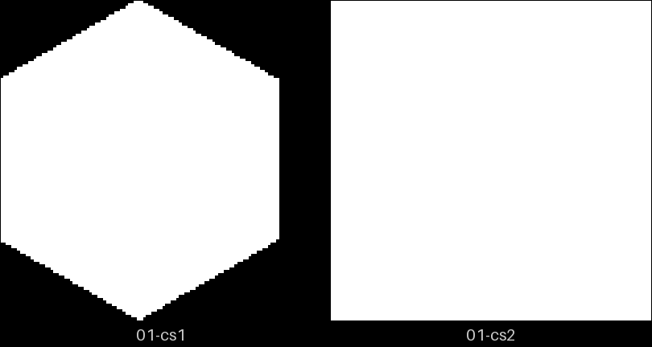
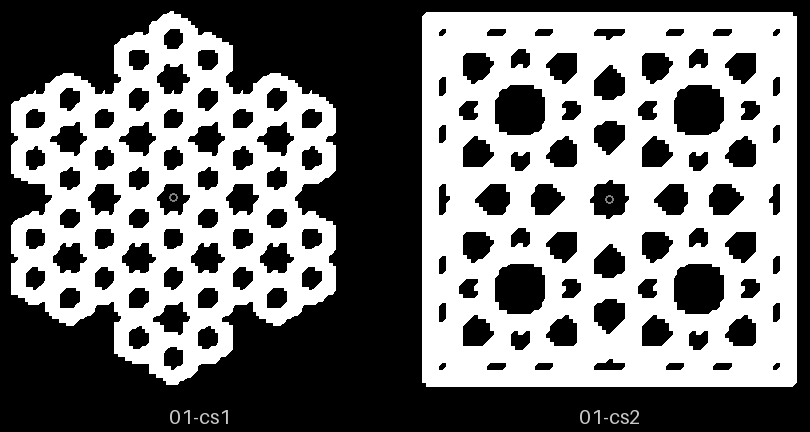
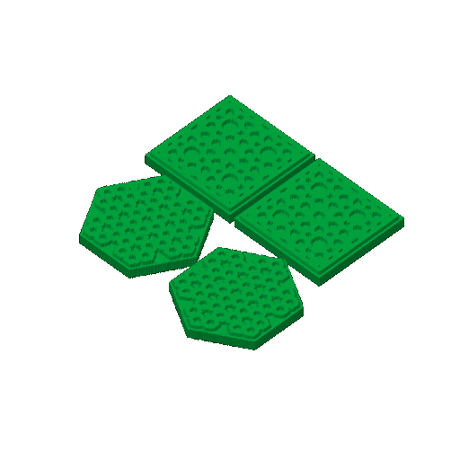

# minis-01 — the first coaster plate

**In short.** Two solid 40 mm coasters each of CS-1 and CS-2, the first coaster plate. It went
to the printer from Bambu Studio on 2026-09-25, but there is no print record, so this page
cannot say whether it printed or what it looked like. That is the one thing to answer below.

## What it is

Recipe: [minis-01.yaml](minis-01.yaml). CS-1 ×2 and CS-2 ×2, the plain solid style (the
pattern raised on a slab), size 40. One bed, about 1 h 13 m and 22 g.

## Why it was printed

It checks how narrow a raised strap can be (CAL-CST-01) and the smallest feature that stays
readable at mini size (CAL-CST-02) ([bets.md](../../../.claude/skills/calibrate/bets.md)).

## After the print

What gets asked when it comes off the bed, one row at a time (the review-print skill asks them).

| Pieces | The question | What we expect, and why | What each answer changes |
|---|---|---|---|
| CS-1 ×2, CS-2 ×2 | Do the straps stand up whole at 40 mm, or do the narrowest break or fail to print? | Whole, if the strap floor CAL-CST-01 bets on holds: the straps are at that floor. | Whole: the floor stands for mini coasters and CAL-CST-01 moves. Broken or missing: the floor goes up and the minis are drawn again. |
| CS-1 ×2, CS-2 ×2 | Is the smallest feature still readable at 40 mm, held at arm's length? | Readable, but close: the smallest features sit near the size CAL-CST-02 bets is the least that reads. | Readable: CAL-CST-02 moves and 40 mm stays the mini size. Lost: minis go up in size, or their smallest features are left out. |
| all four | Do they read as coasters you would set a cup on, or as tokens? | As small coasters: the pattern is the same one the 90 mm coasters carry. | Coasters: 40 mm minis stay the cheap way to try a pattern. Tokens: mini plates move to a bigger size. |

## Pictures

 

## Your call

The send is written down in the
[dispatch notes](../../issues/first-party-dispatch.md#2026-09-26-the-send-picks-the-tray); nothing
says what came off the bed.

- [ ] **It printed** — I write the record, with your verdict per piece if you give one
- [ ] **It did not print, or it failed** — say what happened in the notes
- [x] **I don't remember** — the page stays at sent

Notes: Omar, in chat, 2026-10-08: "I don't remember". So what came off this bed stays unknown. It is not judged from memory: it gets printed again as a new iteration with an id carved into each piece, and that print is the one judged (the reprint set Omar picked the same day, with sheets-04b, sheets-04c, minis-02 and sheets-04g).

## Approvals

Every yes or hold Omar gives this plate, one row each, oldest first (D-096). A tick under Your call, or a yes in chat, becomes a row here through the manage-approvals skill's `plate_approve.py`; a send spends the open approval, and a recipe change resets it.

| Date | Decision | By | Covers | Spent by |
|---|---|---|---|---|

## Timeline

| Date | What happened | Where it is written |
|---|---|---|
| 2026-09-19 | proposed — the first compose plate, plan step P4.2 | 3d-models #280 |
| 2026-09-25 | sent — from Bambu Studio, after `print send` could not pick the tray | [dispatch notes](../../issues/first-party-dispatch.md#2026-09-26-the-send-picks-the-tray) |
| 2026-10-08 | reviewed — Omar does not remember what came off the bed, so the result stays unknown; it is to be printed again with carved ids | [the calls page, call 7](../../working-model/feedback-requests/2026-10-06-open-calls.md) |
