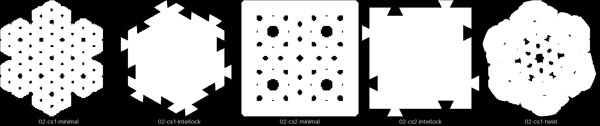
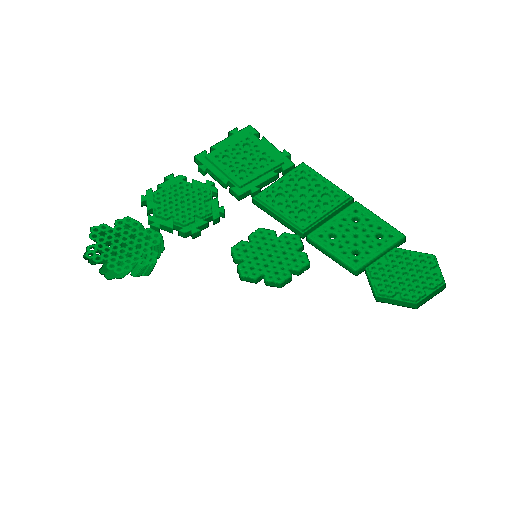

# minis-02 — one mini of each style

**In short.** One 40 mm coaster in each style, for CS-1 and CS-2: solid, minimal, interlock,
and the CS-1 twist. Omar asked for it on 2026-09-25 after minis-01 showed only the solid style.
It went out from Bambu Studio the same day, but there is no print record, so this page cannot
say whether it printed.

## What it is

Recipe: [minis-02.yaml](minis-02.yaml). Seven pieces, size 40: solid, minimal and interlock for
each pattern, plus the CS-1 twist at height 6, twist 15. One bed, about 2 h 36 m and 36 g.

## Why it was printed

To see every style side by side before choosing one. It also touches the strap floors
(CAL-CST-01, CAL-CST-07) and the twist lean ceiling (CAL-CST-08)
([bets.md](../../../.claude/skills/calibrate/bets.md)).

## Pictures

The sheet shows one thing to know: at 40 mm the minimals read almost solid. Openness is 0.05
and 0.07 for the two minimals and 0.03 for the twist. The review-print rubric flags anything at
0.15 or under, and minis-03 moved to minimal-frames for that reason.

## Your call

- [ ] **It printed** — I write the record, with your verdict per piece if you give one
- [ ] **It did not print, or it failed** — say what happened in the notes
- [ ] **I don't remember** — the page stays at sent

Notes:

## Approvals

Every yes or hold Omar gives this plate, one row each, oldest first (D-096). A tick under Your call, or a yes in chat, becomes a row here through `tools/plate_approve.py`; a send spends the open approval.

| Date | Decision | By | Covers | Spent by |
|---|---|---|---|---|

## Timeline

| Date | What happened | Where it is written |
|---|---|---|
| 2026-09-25 | proposed — one mini of each style, at Omar's request | 3d-models #314, #315 |
| 2026-09-25 | sent — from Bambu Studio | [dispatch notes](../../issues/first-party-dispatch.md#2026-09-26-the-send-picks-the-tray) |
