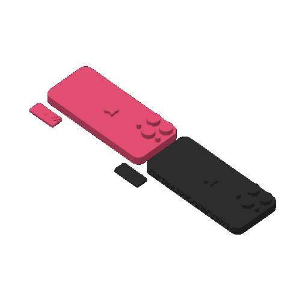

# phones-01 — four mini iPhones, two sizes, pink and black

**In short.** You asked "can we actually just do a plate with 2 phones", then "do current size for
2 and 1/4 size for another 2". This plate is the phone from [sheets-04d](sheets-04d.md) four
times: a pink one and a black one at the size it is on sheets-04d, and a pink one and a black one
at a quarter of that. The plate is [`phones-01.yaml`](phones-01.yaml). One bed, 22 minutes, about
5 g, in two colors.

## What it is

- **The two big phones.** The iPhone 16 Pro cut out of its case by
  [`sheets-04d-phone.scad`](sheets-04d-phone.scad), at its own size, about 16.6 x 40 x 4.6 mm,
  screen down and lenses up, as on sheets-04d.
- **The two quarter phones.** The same file at scale 0.25 on every side: about 4.2 x 10 x 1.2 mm.
  That is six layers at 0.2 mm, so the lens bumps may come out as a blur. The slice raised no
  warning about them.
- **Two colors on one plate.** It is the first plate here sliced in two colors without opening
  the Studio window. Each phone in the recipe names its color slot, and the slicer is told which
  slot each one prints in. The slice shows it worked: the pink phones are on slot 1, the black on
  slot 2, and the slicer's own plate picture shows them in their colors. How this was found to
  work, a day after it seemed to crash, is in
  [the issue](../../issues/headless-two-color-slice.md).

The phone file is not in git, as on sheets-04d: this repo is public and the model's license likely
forbids sharing it. It sits in the gitignored imports folder and the recipe holds it to its hash.

**What I assumed, for you to change:**

- One pink and one black at each size, the two colors the piece sets were going to use.
- A quarter means a quarter on every side, not a quarter of the area.
- The phones and the 04e and 04f piece sets are no longer on one plate. That combined plate is set
  aside, not shipped.

## Why print it

It is the cheapest test of a two-color plate: 22 minutes and 5 g. It shows whether the printer
changes color where the slice says, before a coaster and its colored pieces go on one bed. The
quarter phones show how much detail survives at 10 mm long.

## Pictures

The slice: the big pink phone at the top, the big black phone below it, and a quarter phone of
each color beside them. The prime tower, where the printer wipes the nozzle between colors, is
not drawn in this picture.

| Phone | Color slot | Where on the bed (mm from front left) |
|---|---|---|
| PINK PHONE | 1, pink #F5547C | 141.3, 147.8 |
| BLACK PHONE | 2, black #000000 | 141.3, 108.2 |
| PINK QUARTER | 1, pink #F5547C | 128.9, 161.9 |
| BLACK QUARTER | 2, black #000000 | 129, 128 |

## Cost and risk

One bed, 22 minutes, about 5 g: 2.5 g pink and 2.3 g black (local slice, 2026-10-04, X2D preset
and PLA Basic in both slots, sliced for the Textured PEI plate Bambu Studio has saved, prime tower
on, no slicer warnings, no brim, support or raft, nothing sent).

**Risk: ok.** Four phones lying flat. The quarter phones are small, so one could come loose from
the bed; that costs a phone, not the printer. The X2D needs pink and black loaded before the send.

## Your call

- [ ] **Approve as it stands** — two phones at full size and two at a quarter, pink and black
- [ ] **Hold** — say why in the notes

Notes:

## Approvals

Every yes or hold Omar gives this plate, one row each, oldest first (D-096). A tick under Your call, or a yes in chat, becomes a row here through the manage-approvals skill's `plate_approve.py`; a send spends the open approval, and a recipe change resets it.

| Date | Decision | By | Covers | Spent by |
|---|---|---|---|---|
| 2026-10-04 | approved | Omar, in chat: "approve phones 1 and start print" | iteration 1 @ cd19dfe7e6 | sent 2026-10-04 |

## Timeline

| Date | What happened | Where it is written |
|---|---|---|
| 2026-10-04 | proposed — at Omar's ask: two phones at the sheets-04d size and two at a quarter, pink and black | this page |
| 2026-10-04 | sliced — local two-color slice fits one bed, 22 minutes, 5 g, no slicer warnings | this page |
| 2026-10-04 | sent — by `bambu print send`; spends the approval of 2026-10-04, iteration 1 @ cd19dfe7e6 | this page |
