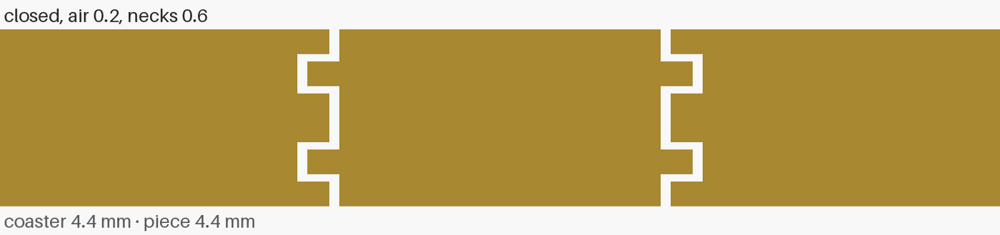
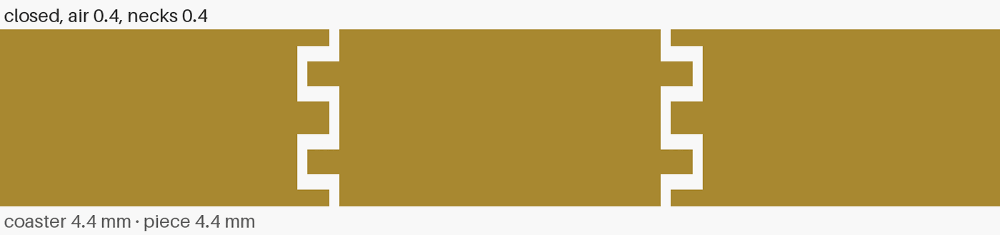
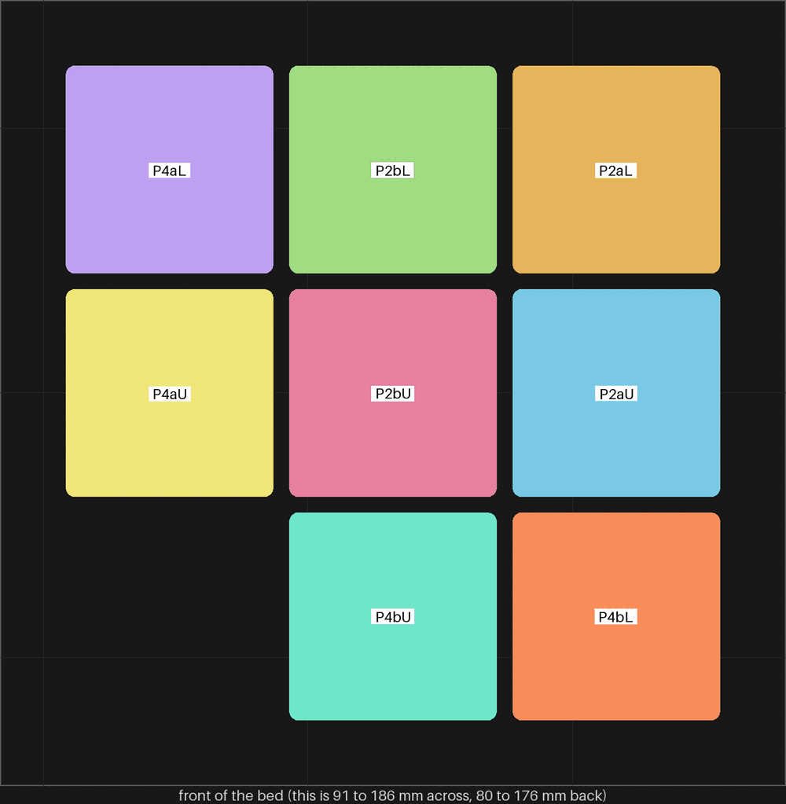
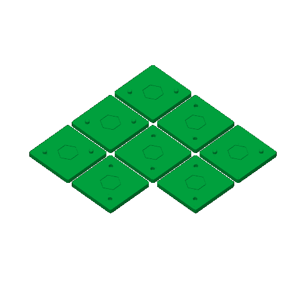
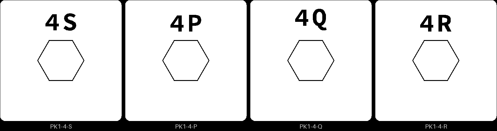

# pkt-1 — the pocket coupon: does a piece printed in its pocket come out loose

**In short.** This is way c from [the finish-techniques brainstorm](../printing/finish-techniques-brainstorm.md#14-way-c-making-the-two-piece-halves-feel-like-one):
the other way a split coaster can keep its loose pieces in. Each piece is cut at the split too,
and each half prints its own piece half inside it, in a closed pocket. Nothing is placed by hand.
Closing the coaster presses each piece half onto its partner, with nothing extra between them.
Before a full coaster prints this way, this plate asks whether the piece half comes out loose
at all, and how much air it needs. The plate is [`pkt-1.yaml`](pkt-1.yaml). One bed, 35 minutes,
about 11.6 g, in the color you pick when you say yes.

## What it is

- **Four pairs** of bikar's `Split-Pocket-Coupon` (bikar #320). It is the spl-1 trap tile: 25 mm
  square, 4.4 mm tall, cut at 2.2 mm, with two studs. Its hexagon sits in a pocket instead of
  between lips. Each pair is an L tile (the stud half) and a U tile (the socket half), and each
  tile has its piece half printed inside it.
- **The pocket** narrows at the face and again at the cut. Between those two necks is a room at
  the hexagon's full size. The piece half is a plug through each neck, plus a band in the room
  with air above and below it. The band is 0.6 mm thick in both rungs.
  - P2a, P2b: one layer of air (0.2 mm), necks 0.6 mm, the deboss floor
  - P4a, P4b: two layers of air (0.4 mm), necks 0.4 mm, thinner than the deboss floor on purpose
- **Two pairs of each.** One fused band could come from one bad layer rather than too little
  air, so a second pair tells the two apart.
- **Each pair carries its letter** (iteration 2, on your comment of 2026-10-06 on spl-1: "can we
  have minimal letters printiend on each AT AB (a top, a bottom), BT, BB, ETC"). The letter is cut
  2.5 mm tall into both cut faces: the lower tile reads `OB`, the upper `OT`. The cut faces meet
  when a pair closes, so the letters show only when it is open. The letters go on from spl-1's A
  to N, so no two coupons on the shelf share one:

  | Letter | Bed name | What the pair is |
  |---|---|---|
  | O | P2aL, P2aU | one layer of air, 0.6 mm necks, first pair |
  | P | P2bL, P2bU | one layer of air, 0.6 mm necks, second pair |
  | Q | P4aL, P4aU | two layers of air, 0.4 mm necks, first pair |
  | R | P4bL, P4bU | two layers of air, 0.4 mm necks, second pair |

**What to try in the hand.** Push each piece half from the face: does it move in its pocket, or
did it print fused? Close each pair: does it close flat, and does the hexagon move or click when
you lift and tip it? Look at the band's underside where it shows through the gap: is it flat, or
did it sag onto the neck below?

**The color is picked at the send.** Say it with the yes.

**What I assumed, for you to change:**

- **The air values** are one and two layers. Neither is a measured clearance yet; that is what
  this print is for.
- **Pressed, not glued.** This follows the brainstorm's pick. Glue comes only if the movement is
  felt.
- **One color.** A pocket's piece half prints in its half's color. A second color for the piece
  waits on per-piece color inside one object.
- **One tile per rung**, not the brainstorm's strip of different piece shapes. A narrow piece or
  a sharp point waits until this shows whether a hexagon comes loose at all.

## Why print it

It is the cheapest print that says whether way c works at all. If the band fuses at one layer of
air, every pocket coaster needs two layers and thinner necks. If it fuses at two, way c is out
and the lip and flange coasters (split-01 and split-02) are the ways left. Each wrong answer here
costs one 25 mm tile, not a coaster.

## After the print

What gets asked when it comes off the bed, one row at a time (the review-print skill asks them).

| Pieces | The question | What we expect, and why | What each answer changes |
|---|---|---|---|
| O and P (P2a, P2b): one layer of air | Does each piece half move in its pocket when pushed from the face, or did it print fused? | Unknown: 0.2 mm is one layer, the least air a printed gap can have, and it may fuse. | Loose in both pairs: way c is built at one layer, and pkt-2 takes 0.2 mm. Fused in one pair only: one bad layer, so one layer still counts. Fused in both: two layers is the least. |
| Q and R (P4a, P4b): two layers of air | Does each piece half move in its pocket, and did the 0.4 mm necks hold? | Loose, at twice the air; the necks are thinner than the deboss floor, so one may tear. | Loose and whole: pkt-2 uses two layers if one fused. Fused at two layers too: way c is out, and split-01 and split-02 are the ways left (call 15b). Torn necks: necks go back to 0.6 mm with two layers of air. |
| all four pairs, closed | Does each pair close flat, and does the hexagon move or click when the closed tile is lifted and tipped? | A click is likely: the band has air above and below it. | Silent: pressing the halves together is enough. A click: way c needs glue or a tighter room, which pkt-2 tries. |
| all four pairs, open | Is the band's underside, printed over air, flat where it shows through the gap? | A small sag: the band is printed over nothing. | Flat: the 0.6 mm band is kept. Sagged onto the neck below: the band fused there, so pkt-2 gets more air under the band or a thicker band. |

## Pictures

A side cut through the middle of one tile, as the lower half prints (one layer of air, 0.6 mm
necks). The hexagon's half is the spool in the middle, with a white gap all round it.

The two halves closed, as the coaster will be, for each rung. The two bands meet at the cut.

Where each tile sits on the bed, with its name on it. Only the part of the bed the tiles take is
drawn.

The slice as Bambu Studio draws it. The hexagon plug shows in the middle of each tile, with its
gap round it, and the two studs or sockets on either side.

The ids cut into the lower halves' bed faces, seen from below (D-109, D-114). The whole id has no
room beside the plug, so each lower carries the short one: the iteration and a letter. The letter
is the pair's, P, Q and R, except P2a, whose O is never cut as an id because it reads as a zero:
its lower reads 4S. No upper half carries an id: it prints face down, so its bed face is the top
you see. Its pair letter on the cut face tells it apart, as [the recipe](pkt-1.yaml) says.

## Cost and risk

One bed, 35 minutes, about 11.6 g (local slice, 2026-10-07, from bikar main after bikar #323,
X2D preset and PLA Basic, sliced for the Textured PEI plate, no slicer warnings, nothing sent).
One color, so no swaps. Without the letters it was 34 minutes and 11.6 g (2026-10-06); the letters
are the only change.

**Risk: watch.** Every failure here is cosmetic, or it is the answer. A 0.4 mm neck is two layers
and may tear when the piece half is pushed. A band printed over air may sag. A band that fuses is
exactly what the plate is asking about. The tiles are 25 mm and flat, so lifting is unlikely.

## Your call

- [ ] **Approve as it stands** — say the color with the yes
- [ ] **Hold** — say why in the notes

Notes:

## Approvals

Every yes or hold Omar gives this plate, one row each, oldest first (D-096). A tick under Your call, or a yes in chat, becomes a row here through the manage-approvals skill's `plate_approve.py`; a send spends the open approval, and a recipe change resets it.

| Date | Decision | By | Covers | Spent by |
|---|---|---|---|---|
| 2026-10-07 | approved | Omar, tick on the 2026-10-06 calls page: "Yes, in pink" | iteration 1 @ 741ced0d16 | reset 2026-10-07 |
| 2026-10-08 | approved | Omar, in chat, in pink | iteration 2 @ fcdbac0237 | reset 2026-10-08 |
| 2026-10-08 | approved | Omar, in chat, in pink | iteration 4 @ d99e8c88b1 in #F5547C | sent 2026-10-08 |

## Timeline

| Date | What happened | Where it is written |
|---|---|---|
| 2026-10-06 | proposed — way c of the finish-techniques brainstorm (§1.4), the coaster-pipeline backlog's first item | this page |
| 2026-10-06 | sliced — local slice from bikar main after bikar #320, fits one bed, 34 minutes, 11.6 g, no slicer warnings | this page |
| 2026-10-07 | changed (iteration 2): a letter on each pair's cut faces, O to R, on Omar's comment on spl-1 on the 2026-10-06 calls page (bikar #323); the yes in pink given before it is reset | [the calls page](../../working-model/feedback-requests/2026-10-06-open-calls.md) |
| 2026-10-07 | sliced — local slice from bikar main after bikar #323, fits one bed, 35 minutes, 11.6 g, no slicer warnings | this page |
| 2026-10-08 | sent — by `bambu print send`; spends the approval of 2026-10-08, iteration 4 @ d99e8c88b1 in #F5547C | this page |
