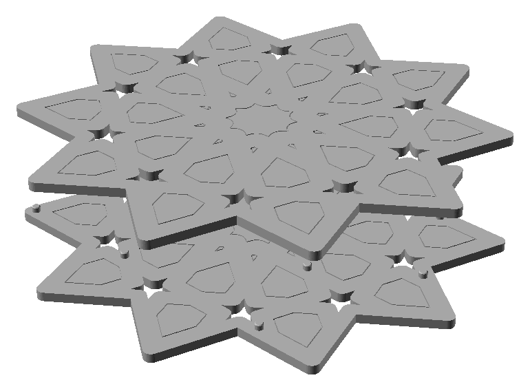
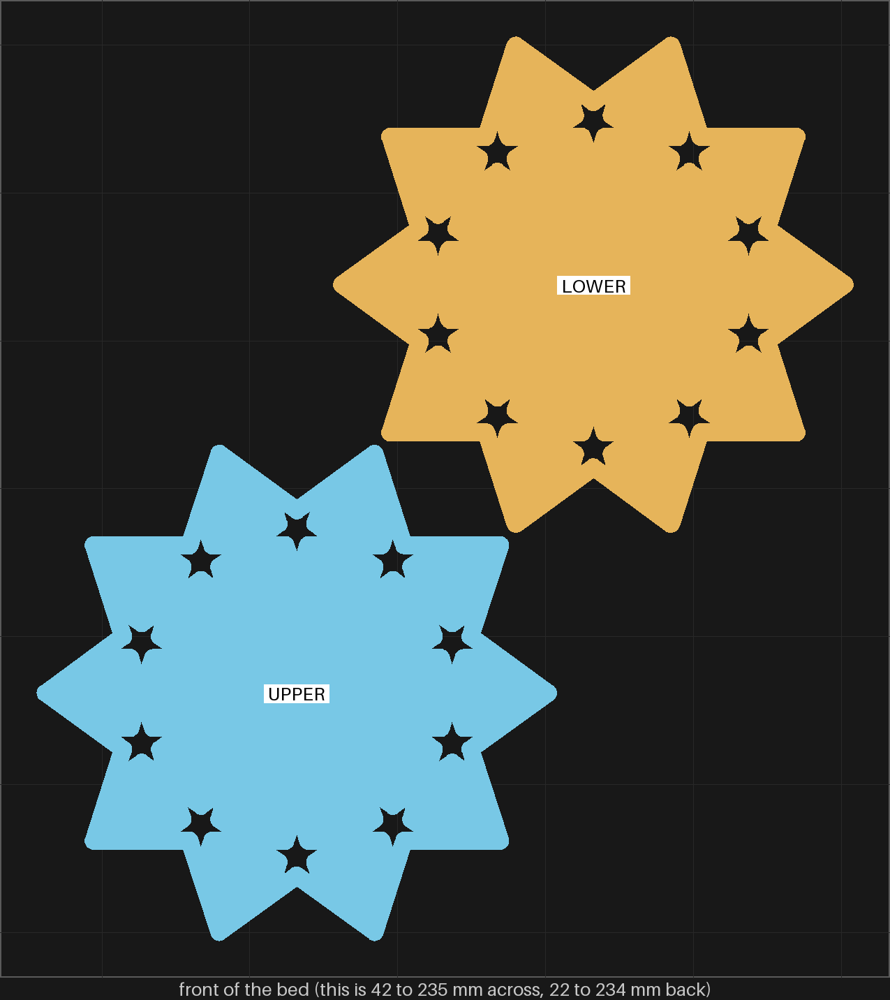
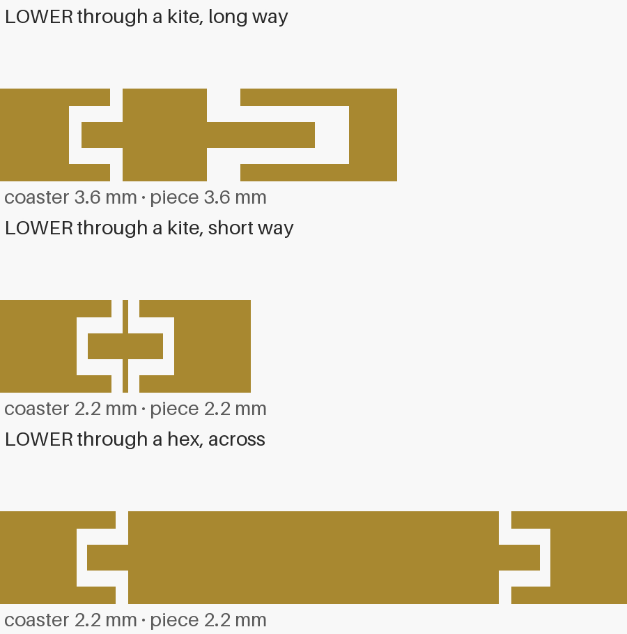
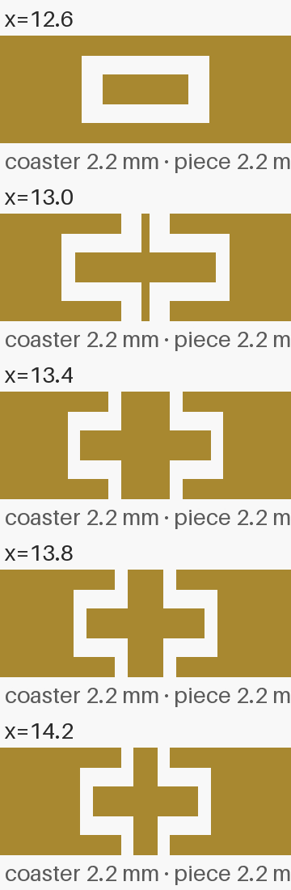
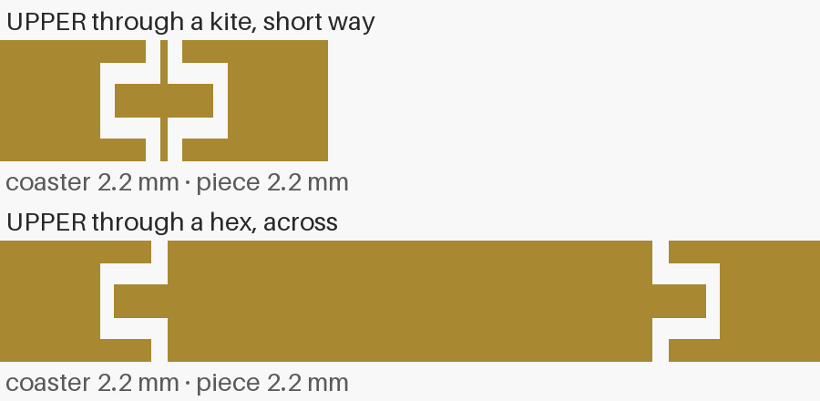
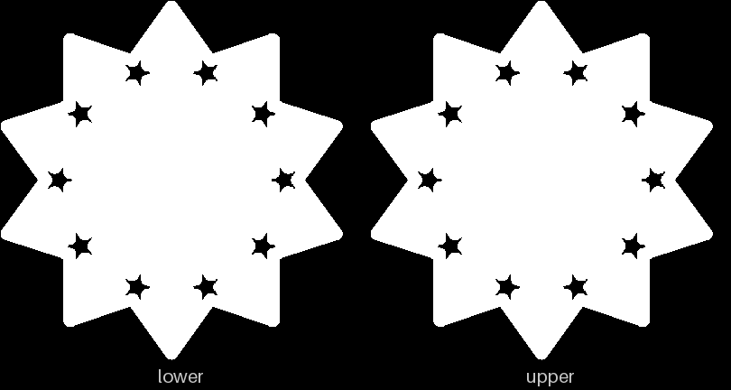

# pkt-2 — the split gBV coaster with its pieces printed in place in pockets

**In short.** You picked pocket only, at coaster size, after pkt-1 (2026-10-08). pkt-1 printed way
c on a 25 mm tile: one layer of air (0.2 mm) fused the band, two layers (0.4 mm) came out loose.
This plate prints a whole coaster that way. The gBV coaster is cut flat through the middle into
two halves, every loose piece is cut there too, and each half prints its own piece halves in place,
in closed pockets, at pkt-1's loose setting. Nothing is placed by hand. Glue, a peg and taller
pieces come back only if a full-size piece rattles. The plate is [`pkt-2.yaml`](pkt-2.yaml). One
bed, about 115 minutes and 33 g in a local slice from the bikar branch, sliced again once the
bikar file is on main.

## What it is

- **The two halves.** bikar's `gBV_JTt3Kxk-split-pocket-coaster`, the gBV minimal coaster, 112.5 mm
  across (split-01's size), 3.75 mm straps, 4.4 mm tall when closed, cut at half its height. Both
  halves print face down, so both faces of the closed coaster are bed faces.
  - LOWER: the lower half, studs standing up on its cut face, its piece halves in place
  - UPPER: the upper half, sockets on its cut face, its piece halves in place
- **Its 31 pieces print inside the halves**, not as loose parts: the middle piece, the ten kites,
  the ten hex pieces and the ten outer pieces. So the plate is two objects, not 33.
- **The pocket**, as on pkt-1. Each hole narrows at the face and again at the cut: those are the
  necks, 0.8 mm in from the hole's edge and 0.4 mm thick. Between them is a room at the hole's full
  size. The piece half is a plug through both necks plus a band in the room, with 0.4 mm of air
  above and below it. The band is 2.2 − 0.8 − 0.8 = 0.6 mm thick, three layers, and reaches 0.55
  mm past each neck.
- **The stars stay open holes**, as in the minimal coaster and split-01.
- **Studs** 2 mm across, at least 25 mm apart, on the lower half, so the halves line up. Their
  socket gap is 0.05 mm, the kernel's default, for now: you set the split coaster's stud gap at
  0.25 mm off spl-2
  ([D-116](../../working-model/decisions-log.md#d-116--a-split-coasters-stud-gap-is-025-mm)), but
  the pocket coaster file has no knob for it yet, so this plate waits on that bikar change.
- **Its id, 3**, after split-01's 1 and split-02's 2. It is cut into the lower half's bottom face,
  the face the coaster stands on, mirrored so it reads the right way round when you turn the
  coaster over. The piece halves carry no id: each is held in its own hole of the coaster marked 3
  and cannot leave it. The upper half carries none: it prints face down, so its bed face is the top
  you see. **The stud-layout plate, being built at the same time, must not take id 3.**

**Which part is which in the hand.** Only one part has an id:

| Part | Id | How to tell it |
|---|---|---|
| The lower half | `3`, on its bottom face | studs on its cut face |
| The upper half | none | sockets on its cut face, a plain top |
| The piece halves | none | each sits in its own hole, in the half it printed in |

**The color is picked at the send.** Say it with the yes.

## What I assumed

These are mine, for you to change:

- **pkt-1's loose setting, not something between.** Necks 0.4 mm thick, 0.4 mm of air. pkt-1 had
  only two settings, and 0.2 mm of air fused. Nothing between 0.2 and 0.4 was tried.
- **Necks 0.8 mm wide.** That is the narrowest a strap may be (CAL-CST-01), the same as split-01's
  lip. pkt-1's hexagon had the same 0.8 mm neck.
- **The kites are the risky ones.** On the hexagon the plug is about 8.9 mm across. On a kite it is
  at most about 1.0 mm across, near its widest point, and it narrows to nothing at the kite's
  sharp ends, where the piece is only band. That is two and a half nozzle widths. The band around
  it is still free in every cut I drew (see [the pictures](#pictures)), but a plug that thin may
  print rough, or break when you press it.
- **One color.** A piece half prints in its half's color, so the face is one color.
- **No glue, peg or taller pieces.** You picked pocket only. They come back only if a full-size
  piece rattles.

## Why print it

pkt-1 showed way c works on one hexagon in a 25 mm tile. A coaster has 31 pieces of four shapes,
and the kites are far narrower than that hexagon. This is the print that says whether way c holds
up at full size: whether every band comes free, kites included, and whether the closed coaster is
quiet. It sits beside split-01 (the lip) and split-02 (the flange), the other two ways a split
coaster can hold its pieces (D-100).

## After the print

What gets asked when it comes off the bed, one row at a time (the review-print skill asks them).
Only the lower half carries an id, `3` on its bottom. The upper half has none: it is the half with
sockets on its cut face. The piece halves have none: each is named by its shape and the half it
is in.

| Pieces | The question | What we expect, and why | What each answer changes |
|---|---|---|---|
| The lower half (`3` on its bottom) and the upper half (no id, sockets on its cut face): the middle piece and the ten hex and ten outer pieces in each | **Do:** Hold each half by its rim. Press each of these pieces in its middle with your thumb, from the outer face: on the lower half, the side with the `3`; on the upper half, the plain top. **Look for:** Does each piece move apart from the coaster round it, or is it one solid part with it? Say which pieces, if any, are stuck, by shape and half. | They move: two layers of air came out loose on every pkt-1 tile (`4Q`/`QT`, `4R`/`RT`), and these pieces are as wide as pkt-1's hexagon or wider. | All move: two layers of air holds at full size, for the wide pieces. Some stuck: the stuck ones need more air, or one bad layer did it; a second print tells which. |
| The ten kites in the lower half (`3`) and the ten in the upper half (no id) | **Do:** Press each kite from the outer face with a fingertip or a toothpick, gently. **Look for:** Does each kite move? Is its thin middle whole, or has it torn, so part of the kite is missing or pushes through? | Unknown: a kite's plug is at most about 1.0 mm across and runs out to nothing at its ends, so it may print rough or tear. | All move, whole: way c holds every gBV piece. Stuck: the kites need more air than the wide pieces. Torn: a kite is too narrow for a plug, and the next coaster keeps its kites some other way (or leaves those holes open). |
| The lower half (`3`) and the upper half (no id) | **Do:** Lay the upper half over the lower, cut faces together, each stud into a socket, and press it down evenly. Lay the coaster on the table, then pick it up by its rim and turn it over. **Look for:** Does it sit flat all round, or rock? Do the rims line up, with no step at the edge? Is there a gap at the cut anywhere? | Flat: each piece half is exactly half the closed height, so the two meet at the cut, as on pkt-1, where every pair closed flat. | Flat, no gap: the pieces close as one. A gap or a rock: the piece halves stand proud of the cut, and they are made a little shorter. |
| The closed coaster (`3` on its bottom) | **Do:** Hold it flat by its rim next to your ear and shake it side to side, then up and down. **Look for:** Silent, a faint rattle, or a loud one? If you can feel which pieces move, say which: the middle, the hex ring, the outer ring or the kites. | Faint or silent: on pkt-1 the closed pairs were silent, but here there are 31 pieces, each with 0.4 mm of air above and below. | Silent or faint: pocket only is the way, no glue. Loud: this is the case that brings back glue, a peg or taller pieces (call 15). |
| The closed coaster, both faces: the bottom with `3`, and the upper half's plain top | **Do:** Look at each face at arm's length, then close up. **Look for:** Each piece shows as a shape outlined by a thin gap, the neck's edge, in the same color as the coaster. Does it read as a pattern of pieces, or as a solid coaster with scratches? Can you read the `3` without tilting the coaster, the right way round? | A pattern, faintly: the gap round each piece is 0.25 mm, narrower than on split-01, and all one color. | A pattern: way c's look is kept. Scratches: the gap is the look to work on next, or a second color. The `3` unreadable: bikar's id size or place changes. |

## Pictures

Opened up: the lower half with its studs, and the upper half above it, turned back over. The
pieces are inside each half, so each shows only as its outline, the thin gap round it. The ten
stars are open. Drawn by bikar and OpenSCAD from the coaster file
(`tools/cookbook_render.py --file`).

The slice: the two halves side by side on the bed, LOWER at the back right, UPPER at the front
left, each a ten-pointed star with its ten star holes. Nothing else is on the bed.

Cuts straight down through the lower half, as it prints: the coaster and the piece in it both gold,
the air white. Through a kite the long way, the plug is the full-height block, and toward the
kite's narrow end the piece is only band, held between the necks above and below. Through a kite
the short way, at its middle, the plug is a sliver. Through a hex piece, the plug is about 8.9 mm
across, with a band on each side reaching past the necks. The kite cut also shows a stud, 3.6 mm
high.

The kite, cut across at five places along it, 0.4 mm apart. The plug is widest, about 1.0 mm, near
the middle (the third and fourth cuts). The band is about 2.7 mm across there and reaches about
0.55 mm past each neck. At the first cut, near the kite's end, there is band and no plug. The gap
is white all round the band in every cut.

The same three cuts through the upper half, which looks the same.

Both halves from above, white on black, as the review sheet draws them: solid stars with ten open
star holes each. The piece outlines are too fine to show at this size. The lower half reads less
even (`sym` 0.14) only because its studs are its top faces; the upper half scores 1.00.

## Cost and risk

One bed, about 115 minutes, about 33 g (local slice, 2026-10-08, X2D preset and PLA Basic,
sliced for the Textured PEI plate Bambu Studio has saved, no slicer warnings, nothing sent). The
slice is from the bikar branch, not main, so the plate is sliced again once the bikar file merges;
the numbers should not move. One color, so no swaps.

**Risk: watch.** Every failure here is cosmetic, or it is the answer. A kite's plug is about 1.0
mm across at its widest and narrows to nothing, so it may print rough or tear when pressed. A band
printed over air may sag. A band that fuses is what the plate asks about. The halves are 112.5 mm
and flat, like split-01's.

## Your call

- [ ] **Approve as it stands** — say the color with the yes
- [ ] **Hold** — say why in the notes

Notes:

## Approvals

Every yes or hold Omar gives this plate, one row each, oldest first (D-096). A tick under Your call, or a yes in chat, becomes a row here through the manage-approvals skill's `plate_approve.py`; a send spends the open approval, and a recipe change resets it.

| Date | Decision | By | Covers | Spent by |
|---|---|---|---|---|

## Timeline

| Date | What happened | Where it is written |
|---|---|---|
| 2026-10-08 | proposed — on Omar's pick after pkt-1, pocket only at coaster size, on the 2026-10-06 calls page's call 15 | [the calls page](../../working-model/feedback-requests/2026-10-06-open-calls.md) |
| 2026-10-08 | sliced — local slice from the bikar branch (not yet on main), fits one bed, 115 minutes, 33 g, no slicer warnings | this page |
