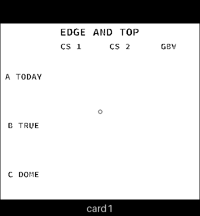
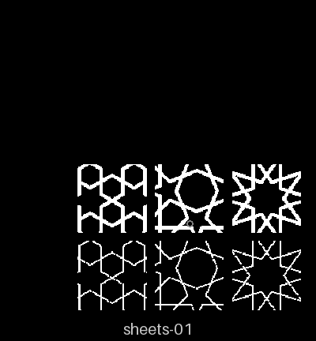
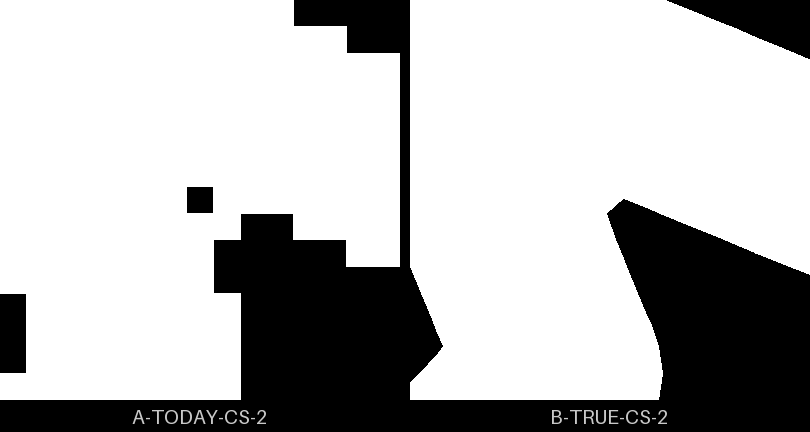
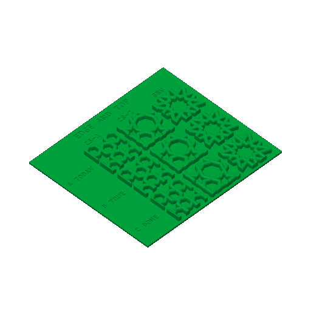
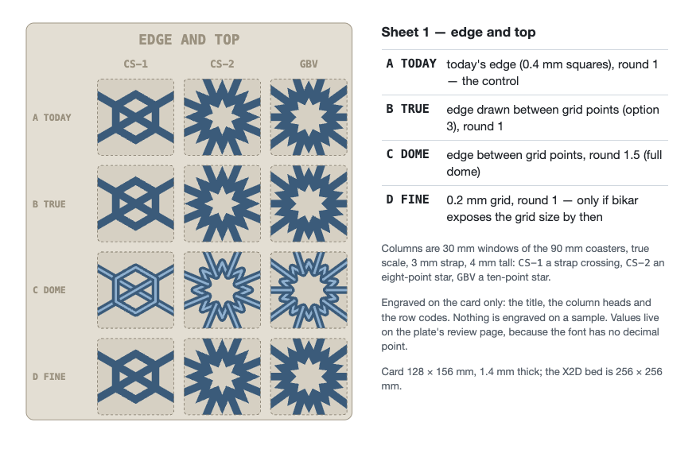

# sheets-01 — edge and top

**In short.** One card, three 30 mm windows cut from real 90 mm coasters (a CS-1 crossing, a CS-2
star, a gBV star), each in four versions: today's edge, the true edge, the true edge with the full
dome, and a finer grid if the language can set it by then. It answers whether the steps on today's
edges show at all, and which top to keep. It is the first sampler sheet worth printing, and all of
it builds: rows B and C from bikar main (the window cut, bikar #293), row A from three windows of the
old edge kept in this repo with their hashes ([how they were made](../../../src/Samplers/sheets-01-row-a/README.md)),
the labeled card (`Sampler-Cards.bkr`, piece Sheet1Card) and the plate
([`sheets-01.yaml`](sheets-01.yaml), assembled by `bambu slice sheet`). One bed, about 1 h 48 m and
46 g.

## What it is

The layout is in the [sampler sheets design](../coaster/sampler-sheets-design.md#3-the-sheets), sheet 1. Rows:

| Code | What it is | Value |
|---|---|---|
| A TODAY | today's edge in 0.4 mm squares, round 1 (the control) | the edge before bikar #291, `round` 1 |
| B TRUE | the edge drawn between grid points, round 1 (the file's default) | `round` 1 |
| C DOME | the same edge, round 1.5 | `round` 1.5 |

Columns: CS-1 crossing (window `30@9.7,1`), CS-2 star (`30@18.5,18.5`), GBV star (`30@0,0`), each
cut from the coaster's own minimal file at 90 mm. The card is 138 × 122 × 1.4 mm with the codes
engraved 0.6 mm deep, one per plate. D FINE, a 0.2 mm grid, is left off the card: no option sets
the grid size, and a labeled empty row would read as a sample that failed. When one lands the card
grows a row.

## Why print it

- **The question:** can you see or feel the difference between A and B? If not, the edge work
  closes.
- **What it lets us decide:** the [smooth-lines calls](../coaster/smooth-lines-design.md#6-open-calls-for-omar) 1 and 4.
- **What to read off it:** A against B for the steps; B against C for the top.

## Pictures

What the plate builds, drawn from the assembled mesh (`bambu slice sheet … --stl`, then
`tools/print_review.py`). On the left are the card's top faces, with its engraved codes. On the
right are the samples' top faces where they stand on the card: row A on top, row B, then row C with
the narrower flat tops the dome leaves. From above, rows A and B look alike: the top faces are
rounded, so their outline is the round, not the wall.

The wall is where the two edges differ, so here is the bottom of CS-2 close up, 6 mm across, A on the
left and B on the right (`print_review.py edge`). A's walls step in 0.4 mm squares, and one square
is left open as a pinhole where B's walls run straight. The old edge leaves three such pinholes in
this window, eight across the whole CS-2 coaster. The new edge leaves none. Telling the two apart in
the hand is the question this sheet asks.

The plate as the slicer sees it, from the local slice:

The layout mockup the design started from:

## Cost and risk

One bed, 1 h 48 m, about 46 g (local slice of the assembled sheet, 2026-10-01, X2D preset and PLA
Basic, no slicer warnings, nothing sent). The card is the safety: every window stands on the card's
footprint, not on its own thin feet.

**Risk: ok.** Flat card, samples fused to it, nothing loose.

## How row A was made

The true edges shipped 2026-10-01 (bikar #291), so bikar main no longer draws the staircase, and
the window cut
([sampler sheets §2](../coaster/sampler-sheets-design.md#2-cutting-a-window-out-of-a-coaster))
shipped after it (bikar #293), so the commit that still draws the staircase had no window. The
window cut was copied onto that commit, the three windows rendered there once, and the STLs kept in
`src/Samplers/sheets-01-row-a/` with the patch and the steps to make them again (a rebuild came out
byte for byte the same). The sheet names each file with its hash, and `bambu slice sheet` refuses
one that has changed. The old edge did not go back onto bikar main as an option: that would be two
edges to keep for one sheet.

Checked 2026-10-01: every window passes the mesh check as one body, the layout check passes (each
sample on the card, none touching another), and the assembled plate slices clean headless and
locally.

## Your call

- [ ] **Approve as it stands**
- [ ] **Hold** — say why in the notes

Notes:

## Approvals

Every yes or hold Omar gives this plate, one row each, oldest first (D-096). A tick under Your call, or a yes in chat, becomes a row here through the manage-approvals skill's `plate_approve.py`; a send spends the open approval, and a recipe change resets it.

| Date | Decision | By | Covers | Spent by |
|---|---|---|---|---|

## Timeline

| Date | What happened | Where it is written |
|---|---|---|
| 2026-10-01 | proposed — designed as a sampler sheet; waited on row A | the [sampler sheets design](../coaster/sampler-sheets-design.md) |
| 2026-10-01 | sliced — row A built from the old edge; local slice fits one bed, 1 h 48 m, 46 g | this page |