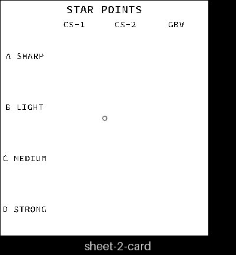
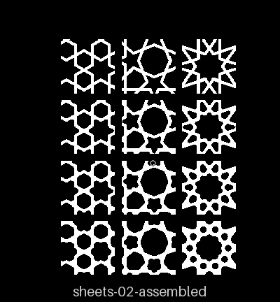
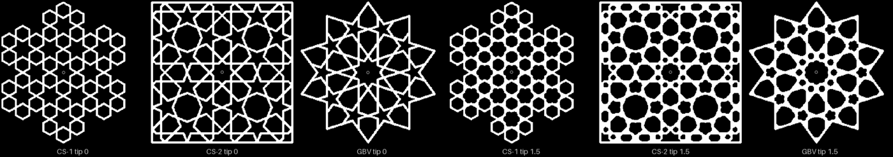
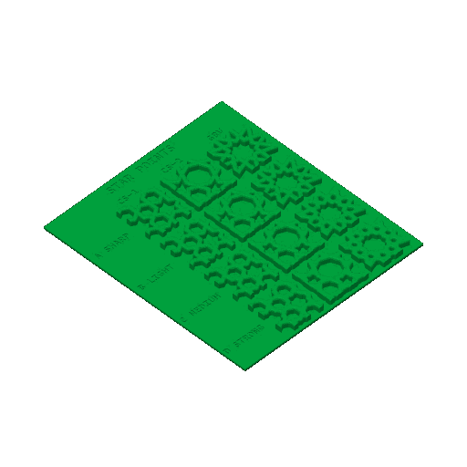

# sheets-02 — star points

**In short.** This is one card holding twelve 30 mm windows. Each window is cut from a real 90 mm
coaster: a CS-1 crossing, a CS-2 star and a gBV star. Each comes in four versions, with the
sharp points of its holes rounded by 0, 0.3, 0.75 and 1.5 mm. The sheet answers whether the
stars should keep their sharp points, and if not, how far to soften them. The bottom row is
where a star turns into a flower, and seeing that is the point.

All of it builds from bikar main:
- the rounding (`holes round`, bikar #325);
- the `tip` knob on every minimal coaster that feeds it, and the labeled card (piece
  Sheet2Card), both from bikar #328;
- the window cut (bikar #293);
- the plate ([`sheets-02.yaml`](sheets-02.yaml), assembled by `bambu slice sheet`).

It fits on one bed and takes about 2 h 8 m and 58 g.

## What it is

The layout is in the [sampler sheets design](../coaster/sampler-sheets-design.md#3-the-sheets),
sheet 2. The card shows only the codes, because its font has no full stop, so the numbers are
here:

| Code | What it is | `tip` |
|---|---|---|
| A SHARP | today's sharp points (the control) | 0 |
| B LIGHT | the points just softened | 0.3 mm |
| C MEDIUM | rounder | 0.75 mm |
| D STRONG | the points turned to curves: a star becomes a flower | 1.5 mm |

Each column is cut from the coaster's own minimal file at 90 mm:
- CS-1 crossing, window `30@12,2`;
- CS-2 star, `30@18.5,18.5`;
- GBV star, `30@0,0`.

The card is 138 × 156 × 1.4 mm, with the codes engraved.

Choices made while building it, not decided by you:
- **Column order:** the same as sheet 1 (CS-1, CS-2, GBV), so the two sheets read across. The
  design listed CS-2, gBV, CS-1.
- **CS-1's window** sits at 12,2 instead of sheet 1's 9.7,1. At 1.5 mm, the old spot leaves a
  0.07 mm sliver of plastic along the window's edge, and the window cut refuses to make it.
  12,2 works at every row.
- **The `tip` knob** now shows on every minimal coaster in the Lab. At 0, its default, each
  coaster comes out exactly the same as before.

## Why print it

- **The question:** sharp or softened? And at which row does softened stop looking like a star?
- **What it lets us decide:** [smooth-lines call 2](../coaster/smooth-lines-design.md#6-open-calls-for-omar).
- **What to read off it:** compare each row against row A, down each column. The gBV column
  changes the most: by row D its star of holes has become a ring of round holes.

## Pictures

Drawn from the assembled mesh (`bambu slice sheet … --stl`, then `tools/print_review.py art`).
First the card's top faces with the engraved codes. Then the samples' top faces where they
stand on the card, rows A to D from top to bottom.

A window shows only a corner of each coaster, so here are the three whole 90 mm coasters, sharp
(tip 0) on the left and at the strongest round (tip 1.5) on the right. The outlines stay sharp;
only the holes change.

The plate as the slicer sees it, from the local slice. The green is only the slicer's default;
the color gets picked when it is sent.

## Cost and risk

Cost: one bed, 2 h 8 m, about 58 g. These numbers come from a local slice of the assembled
sheet on 2026-10-07: X2D preset, PLA Basic, Textured PEI Plate, no slicer warnings, nothing
sent.

The slicer could not load the sheet's own plate file headless, so the slice was made from the
same mesh as a plain STL. That gives the same time and grams, because the sheet prints in one
color.

The card keeps it safe: every window stands on the card, not on its own thin feet.

**Risk: ok.** A flat card with the samples fused to it, nothing loose.

## Your call

- [ ] **Approve as it stands**
- [ ] **Hold** — say why in the notes

Notes:

## Approvals

Every yes or hold Omar gives this plate, one row each, oldest first (D-096). A tick under Your call, or a yes in chat, becomes a row here through the manage-approvals skill's `plate_approve.py`; a send spends the open approval, and a recipe change resets it.

| Date | Decision | By | Covers | Spent by |
|---|---|---|---|---|

## Timeline

| Date | What happened | Where it is written |
|---|---|---|
| 2026-10-01 | proposed — designed as a sampler sheet; waited on the hole-point rounding and its card | the [sampler sheets design](../coaster/sampler-sheets-design.md) |
| 2026-10-07 | sliced — `sheets-02.yaml` written once the tip knob and Sheet2Card landed in bikar (#328); local slice fits one bed, 2 h 8 m, 58 g | this page |
