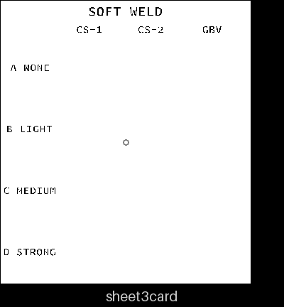
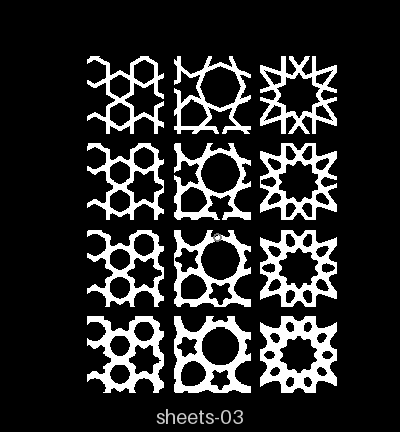
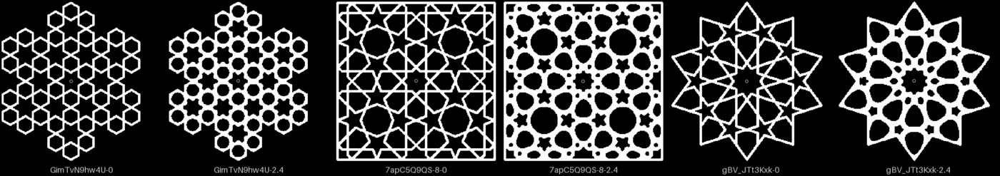
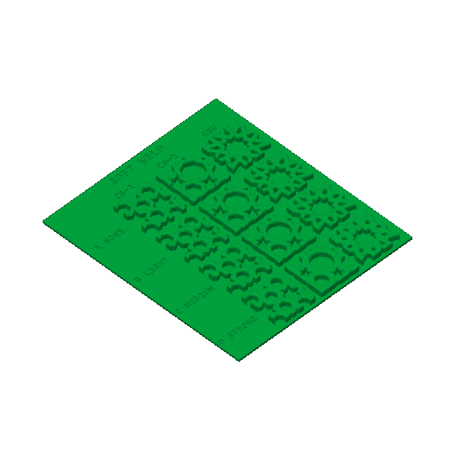

# sheets-03 — soft weld

**In short.** This is one card holding twelve 30 mm windows. Each window is cut from a real 90 mm
coaster: a CS-1 crossing, a CS-2 star and a gBV star. Each comes in four versions, with the
straps welded where they meet by 0, 0.6, 1.2 and 2.4 mm. The weld fills the sharp corners of the
holes in a smooth curve, so two straps that cross read as one welded line. The sheet answers how
much weld, if any, looks right.

All of it builds from bikar main:
- the soft weld (`holes weld`), the `weld` knob on every minimal coaster that feeds it, and the
  labeled card (piece Sheet3Card), all from bikar #329;
- the window cut (bikar #293);
- the plate ([`sheets-03.yaml`](sheets-03.yaml), assembled by `bambu slice sheet`).

It fits on one bed and takes about 2 h 8 m and 58 g.

## What it is

The layout is in the [sampler sheets design](../coaster/sampler-sheets-design.md#3-the-sheets),
sheet 3. The card shows only the codes, because its font has no full stop, so the numbers are
here:

| Code | What it is | `weld` |
|---|---|---|
| A NONE | today's sharp joins (the control) | 0 |
| B LIGHT | one researcher's light weld | 0.6 mm |
| C MEDIUM | the other researcher's light, and the first one's strong | 1.2 mm |
| D STRONG | the other researcher's strong: the holes come out nearly round | 2.4 mm |

Each column is cut from the coaster's own minimal file at 90 mm, in the same windows as
[sheets-02](sheets-02.md), so the two sheets read across:
- CS-1 crossing, window `30@12,2`;
- CS-2 star, `30@18.5,18.5`;
- GBV star, `30@0,0`.

The card is 138 × 156 × 1.4 mm, with the codes engraved.

Choices made while building it, not decided by you:
- **Four rows, not three.** The design asked for none, light and strong, carrying both
  researchers' lights. Their numbers were 0.6 and 1.2, and 1.2 and 2.4, so the sheet has a row
  for each of the three, and 1.2 is named MEDIUM to match sheet 2's words.
- **Points stay sharp** (`tip` 0) in every cell, so the weld is the only thing that changes down
  a column. Weld and point rounding cannot be used together on one coaster yet; bikar refuses it.
- **The `weld` knob** now shows on every minimal coaster in the Lab. At 0, its default, each
  coaster comes out exactly the same as before.

## Why print it

- **The question:** should the crossings stay sharp, and if not, how much weld?
- **What it lets us decide:** [smooth-lines call 3](../coaster/smooth-lines-design.md#6-open-calls-for-omar).
- **What to read off it:** compare each row against row A, down each column. The weld only adds
  plastic: the straps get no thinner, and the holes get smaller and rounder each row down.

## Pictures

Drawn from the assembled mesh (`bambu slice sheet … --stl`, then `tools/print_review.py art`).
First the card's top faces with the engraved codes. Then the samples' top faces where they
stand on the card, rows A to D from top to bottom.

A window shows only a corner of each coaster, so here are the three whole 90 mm coasters with no
weld on the left and the strongest weld (2.4) on the right. The outlines stay sharp; only the
joins between straps change.

The plate as the slicer sees it, from the local slice. The green is only the slicer's default;
the color gets picked when it is sent.

## Cost and risk

Cost: one bed, 2 h 8 m, about 58 g. These numbers come from a local slice of the assembled
sheet on 2026-10-07: X2D preset, PLA Basic, Textured PEI Plate, no slicer warnings, nothing
sent.

The slicer could not load the sheet's own plate file headless, so the slice was made from the
same mesh as a plain STL. That gives the same time and grams, because the sheet prints in one
color.

The card keeps it safe: every window stands on the card, not on its own thin feet.

**Risk: ok.** A flat card with the samples fused to it, nothing loose.

## Your call

- [ ] **Approve as it stands**
- [ ] **Hold** — say why in the notes

Notes:

## Approvals

Every yes or hold Omar gives this plate, one row each, oldest first (D-096). A tick under Your call, or a yes in chat, becomes a row here through the manage-approvals skill's `plate_approve.py`; a send spends the open approval, and a recipe change resets it.

| Date | Decision | By | Covers | Spent by |
|---|---|---|---|---|

## Timeline

| Date | What happened | Where it is written |
|---|---|---|
| 2026-10-01 | proposed — designed as a sampler sheet; waited on the soft weld and its card | the [sampler sheets design](../coaster/sampler-sheets-design.md) |
| 2026-10-07 | sliced — `sheets-03.yaml` written once the soft weld and Sheet3Card landed in bikar (#329); local slice fits one bed, 2 h 8 m, 58 g | this page |
