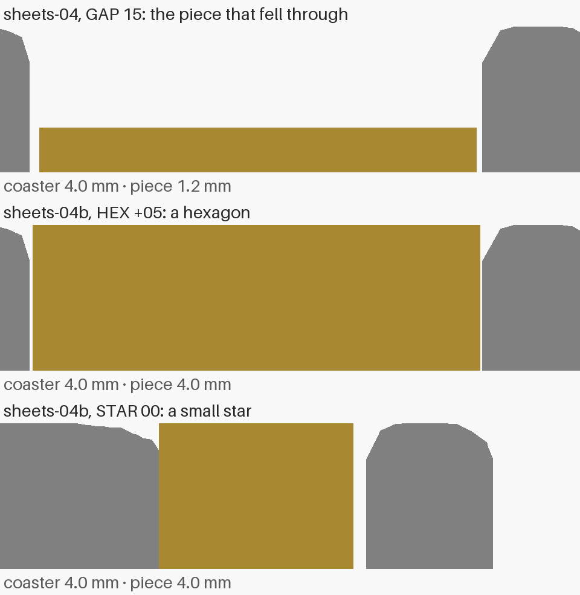
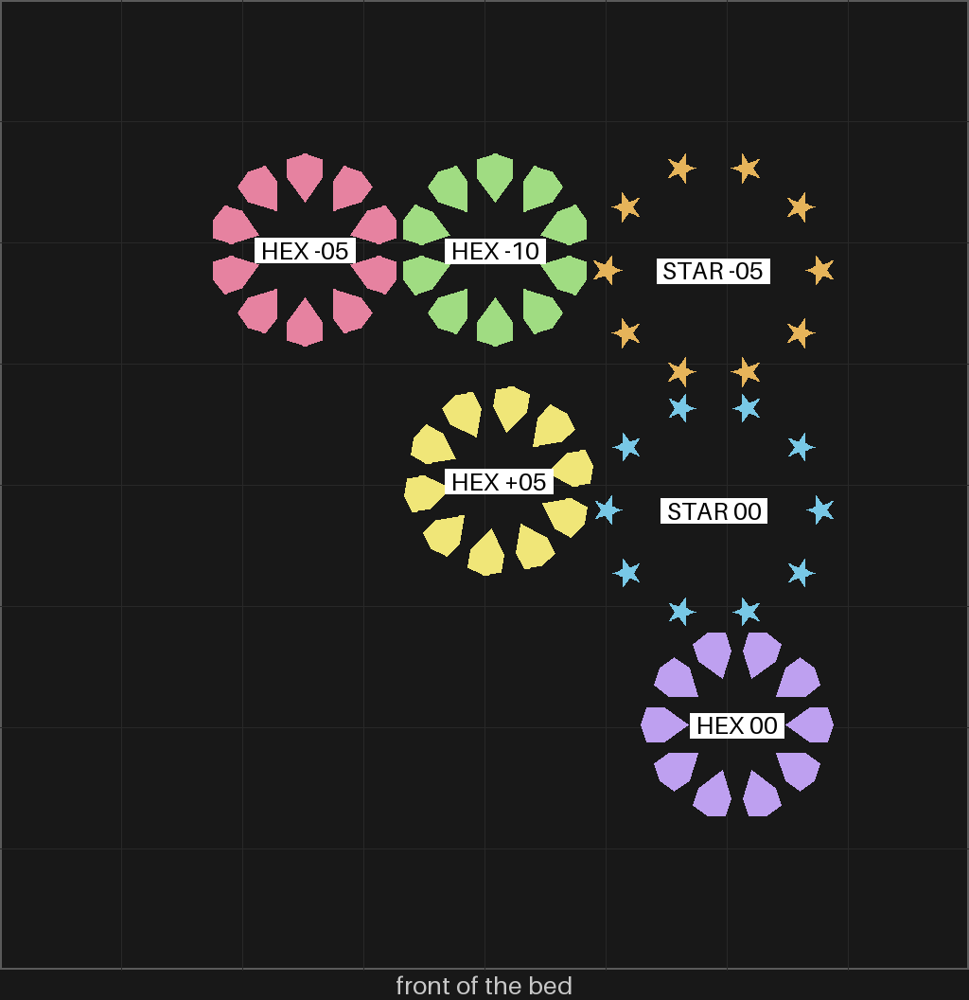

# sheets-04b — the gBV fit again, pieces only

**In short.** On [sheets-04](sheets-04.md) every small piece fell right through the gBV minimal
coaster's holes. This plate is pieces only, for that same coaster, which you already have. The
pieces are 4 mm tall, the coaster's own height, with flat tops flush with its top. The gaps go
from 0.05 mm, the tightest one that fell, down through zero into a press fit, where the piece is
a little larger than its hole. The plate is [`sheets-04b.yaml`](sheets-04b.yaml). One bed, about
41 minutes and 12 g.

## Why the pieces fell through

The minimal coaster has no floor: it is only the straps. So nothing under a piece holds it up,
only the grip of the walls. On sheets-04 every gap was above zero, so every piece was smaller
than its hole, and nothing gripped. The [loose-pieces design](../coaster/loose-pieces-design.md#33-how-the-piece-is-held)
said as much for a frame with no floor: the pieces drop unless the fit is tight. The pieces were
also 1.2 mm thin, so most of each wall was the first few layers, which the printer squeezes in on
purpose so the bottom edge does not spread. That made them smaller again. Nothing was measured;
the record is [2026-10-02-sheets-04](../../prints/2026-10-02-sheets-04/index.md).

## What is on the plate

| Code | What it is |
|---|---|
| HEX +05 | the middle ring (orbit 2): ten six-sided pieces, 0.05 mm smaller than the hole on every side. The gap that fell on sheets-04, now at full height, so we see whether height alone holds it |
| HEX 00 | the same ring, the size of the hole |
| HEX -05 | the same ring, 0.05 mm larger than the hole on every side |
| HEX -10 | the same ring, 0.10 mm larger: the press step of the fit ladder (CAL-FIT-01) |
| STAR 00 | the next ring out (orbit 3): ten small five-point stars, the size of the hole |
| STAR -05 | the stars, 0.05 mm larger than the hole |

Every piece is 4 mm tall and flat. Each set is its own plate item and goes in its own bag
straight off the plate, labelled with its code, because the sets look alike. The bed map below
says which set is where.

How tall a piece stands in the coaster, cut straight down through the hole: the coaster grey,
the piece gold, all three at one scale. The coaster is 4.0 mm. The sheets-04 piece was 1.2 mm, a
thin tile at the bottom of a 4 mm hole; the new pieces are 4.0 mm, flush with the top. The heights
are measured off the two meshes, not typed. The gap on the star's outer side is real: the cut
leaves the star between two of its points, where the hole's corner is rounded and the piece's is
sharp.

It is drawn by `print_review.py side` from the gBV minimal coaster and the `Loose-Fit-Coupon.bkr`
pieces at this plate's knobs (bikar 4e06255), which put each piece where its hole is.

**What I assumed, for you to change:**

- The ladder stops at −0.10 for the hexagons and −0.05 for the stars. A star is only 2.5 mm
  across, so a hard press could snap a tip; the hexagons can take more.
- The peaked piece is left off, because you asked for flat ones.
- One set per gap, no repeats, the same as sheets-04.

## Why print it

- **The question:** at which gap does a piece go in by hand and stay when the coaster is lifted?
- **The bets it moves:** CAL-FIT-01 (the gap ladder) and CAL-HOL-01 (how much a printed hole
  shrinks) ([bets.md](../../../.claude/skills/calibrate/bets.md)).
- **What it lets us decide:** loose-pieces call 4, and the gap the openwork frame reuses
  ([D-090](../../working-model/decisions-log.md#d-090--lines-and-loose-pieces-in-two-colors-true-edges-first)).
- **What to read off it:** for each bag, push a piece into a hole and lift the coaster: falls
  out / stays / will not go in. For the stars, also whether a tip breaks.

## Pictures

The bed as it will print, front edge at the bottom, each set named where it landed. It is drawn
from the sliced plate by `print_review.py bed`.

## Cost and risk

One bed, 41 minutes, about 12 g (local slice of the plate, 2026-10-02, X2D preset and PLA Basic,
no slicer warnings, nothing sent).

**Risk: watch.** The pieces are small, and a small piece that comes loose can be dragged across
the bed. The X2D's own failure detection covers that
([D-092](../../working-model/decisions-log.md#d-092--failure-detection-is-the-printers-job-not-a-per-plate-yes)).
At 4 mm tall they stand on the bed more firmly than the 1.2 mm pieces did.

## How it was built

- The pieces come from bikar's `Loose-Fit-Coupon.bkr`. bikar #300 added its `height` knob (the
  piece height, 1.2 to 4 mm) and let the gap go below zero, where the piece is larger than its
  hole. It refuses a press of half a strap or more, which would reach the middle of the strap.
- A test in bikar checks that a gap below zero widens the piece by twice the gap: at −0.10 a
  piece is 0.40 mm wider than at +0.10.
- Every set passes the mesh check, ten bodies each. The hexagons are 8.97 mm across at their
  narrowest at +0.05 and 9.27 mm at −0.10; the stars are 2.50 mm at −0.05.
- The holes in the coaster are cut on the exact outline the pieces are made from (bikar #297),
  so the gap on the plate is the gap in the hole.

## Your call

- [ ] **Approve as it stands**
- [ ] **Hold** — say why in the notes

Notes:

## Approvals

Every yes or hold Omar gives this plate, one row each, oldest first (D-096). A tick under Your call, or a yes in chat, becomes a row here through the manage-approvals skill's `plate_approve.py`; a send spends the open approval, and a recipe change resets it.

| Date | Decision | By | Covers | Spent by |
|---|---|---|---|---|
| 2026-10-03 | approved | Omar, in chat: "yes to 4b" | iteration 1 @ a6bbca029c | sent 2026-10-03 |
| 2026-10-03 | approved | Omar, in chat: "yes" (to a new yes for sheets-04b, re-sliced for Textured PEI) | iteration 1 @ a6bbca029c | sent 2026-10-03 |

## Timeline

| Date | What happened | Where it is written |
|---|---|---|
| 2026-10-02 | proposed — at Omar's ask after sheets-04's pieces all fell through: pieces only, 4 mm tall and flat, the gap through zero into a press fit (bikar #300) | this page |
| 2026-10-02 | sliced — local slice fits one bed, 41 minutes, 12 g, no slicer warnings, with a bed map | this page |
| 2026-10-03 | reviewed — side cut added at Omar's ask, the piece heights against the coaster's, measured off the meshes | this page |
| 2026-10-03 | sent — by `bambu print send`; spends the approval of 2026-10-03, iteration 1 @ a6bbca029c. Cancelled at layer 0: the slice was made for a Cool Plate and a Textured PEI Plate was on the bed (0500-8051); slice it again for that plate, and it needs a new yes | [the issue](../../issues/sliced-for-wrong-plate.md) |
| 2026-10-03 | sent — by `bambu print send`; spends the approval of 2026-10-03, iteration 1 @ a6bbca029c | this page |

## Print log

What the printer said while this plate printed, one row per change, written by the monitor-print skill's `print_monitor.py`. A `finished` row is not a print record; that is written when the pieces are judged.

| Time (UTC) | Event | Layer | Done | What the printer said |
|---|---|---|---|---|
| 2026-10-03 20:08 | watching | 0/20 | 0% | 0500-8051: the plate on the bed is not the one the file was sliced for |
| 2026-10-03 20:12 | stopped | 0/20 | 0% | 0300-400C: the print was cancelled, from the printer's screen or an app |
| 2026-10-03 22:34 | watching | 5/20 | 38% | RUNNING |
| 2026-10-03 22:34 | progress | 5/20 | 38% | 25% |
| 2026-10-03 22:40 | progress | 9/20 | 50% | 50% |
| 2026-10-03 22:52 | progress | 16/20 | 75% | 75% |
| 2026-10-03 23:05 | finished | 20/20 | 100% | FINISH |
