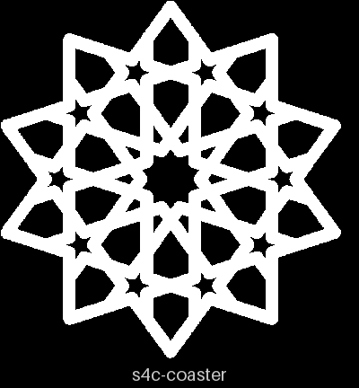
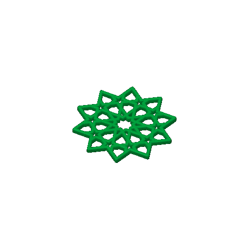

# sheets-04c — the gBV minimal coaster alone

**In short.** You asked for "a plate with just minimal construvtion from plate 4", then "the plate
before the last". That plate is [sheets-04](sheets-04.md), and its minimal construction is the gBV
minimal coaster: the straps only, 4 mm tall, no floor. This plate is that one coaster and nothing
else. The plate is [`sheets-04c.yaml`](sheets-04c.yaml). One bed, 42 minutes, about 10 g.

## What it is

The gBV minimal coaster (gBV_JTt3Kxk, CS-13) at the file's own settings: 90 mm across, 3 mm
straps, 4 mm tall. The file has not changed in bikar since sheets-04 printed it, so this is the
same coaster you have. Its holes are cut on the exact outline the loose pieces are made from, so
the [sheets-04b](sheets-04b.md) pieces fit it the way they fit the first one.

**What I assumed, for you to change:**

- One coaster. The bed takes several; say how many and I will add them.
- No pieces. sheets-04's pieces all fell through, and sheets-04b is the set that answers the
  gap, so none go on this plate.

## Why print it

It asks no new question: it repeats a piece already printed and kept. So it carries no bets and
unblocks no decision, and it scores lowest in the queue (a repeat is worth the least). Its use is
a second coaster: to keep, to give away, or to try the sheets-04b pieces in a second one.

## Pictures

The review sheet: it reads as the ten-point star, every hole open (openness 0.38, nothing solid,
no empty wedge). The same picture as on sheets-04.

The slice: one coaster in the middle of the bed.

## Cost and risk

One bed, 42 minutes, about 10 g (local slice, 2026-10-03, X2D preset and PLA Basic, sliced
for the Textured PEI plate Bambu Studio has saved, no slicer warnings, nothing sent).

**Risk: ok.** One 90 mm coaster with no small loose parts; it printed cleanly on sheets-04.

## Your call

- [ ] **Approve as it stands** — one coaster
- [ ] **Hold** — say why in the notes, or how many coasters you want

Notes:

## Approvals

Every yes or hold Omar gives this plate, one row each, oldest first (D-096). A tick under Your call, or a yes in chat, becomes a row here through the manage-approvals skill's `plate_approve.py`; a send spends the open approval, and a recipe change resets it.

| Date | Decision | By | Covers | Spent by |
|---|---|---|---|---|
| 2026-10-03 | approved | Omar, in chat: "print approved, send it" (one coaster) | iteration 1 @ b7641b3143 | sent 2026-10-03 |

## Timeline

| Date | What happened | Where it is written |
|---|---|---|
| 2026-10-03 | proposed — at Omar's ask: sheets-04's minimal construction, the gBV minimal coaster, alone | this page |
| 2026-10-03 | sliced — local slice fits one bed, 42 minutes, 10 g, no slicer warnings | this page |
| 2026-10-03 | sent — by `bambu print send`; spends the approval of 2026-10-03, iteration 1 @ b7641b3143 | this page |
