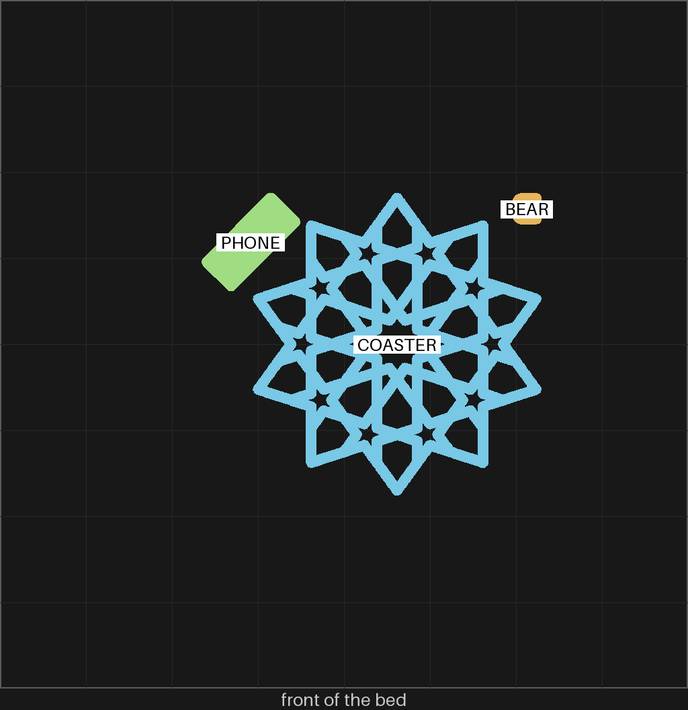

# sheets-04d — the bigger gBV coaster, with a mini iPhone and a gummy bear

**In short.** You asked to "make a bigger version of them, 1.25 current length and width and 1.1
size the height", and to add "a mini version of this ... Iphone 16 Pro.stl" and "a minim gummy
bear stl". This plate is the gBV minimal coaster at that size, plus the phone and the bear. Its
pieces are on two plates of their own, [sheets-04e](sheets-04e.md) in pink and
[sheets-04f](sheets-04f.md) in black. The plate is [`sheets-04d.yaml`](sheets-04d.yaml). One bed,
67 minutes, about 19 g, in green.

## What it is

- **The coaster.** The gBV minimal coaster (gBV_JTt3Kxk, CS-13), the one [sheets-04c](sheets-04c.md)
  printed, scaled the way you asked: 112.5 mm across (was 90), 3.75 mm straps (was 3), 4.4 mm tall
  (was 4), 1.25 mm rounding (was 1). Every setting is the file's own knob, so the holes are still
  cut on the exact outline the pieces are made from.
- **The phone.** The iPhone 16 Pro model is already small (16.6 x 40 x 4.6 mm), so it prints at
  its own size. The file holds two bodies, the phone and a case. Sliced alone, the case is flagged
  both ways up: open side down its back hangs over the hollow, open side up it stands on its camera
  ring. Only the phone as modeled (screen down, lenses up) slices with no warning. So
  [`sheets-04d-phone.scad`](sheets-04d-phone.scad) cuts the phone out and the case stays off.
- **The bear.** "Gummy Bear" by shoorya on Printables (1351519), released CC0. It is modeled 2 mm
  tall, so it prints at 5 times its size, about 11 x 12 x 20 mm, the size of a real gummy bear.

Neither the phone nor the bear is in git. This repo is public, the phone model's license likely
forbids sharing it, and the bear file is 34 MB. Both sit in the gitignored imports folder, and the
recipe holds each one to its hash, so a changed file is refused.

**What I assumed, for you to change:**

- One coaster, in green, the color loaded now.
- The phone and the bear ride on this plate because it has the most room.
- The phone without its case, for the reason above.
- The bear at gummy-bear size (scale 5).

## Why print it

It answers whether the minimal coaster still reads and holds together at the bigger size. The
straps grow with the coaster, so the holes keep their shape. Its pieces on sheets-04e and
sheets-04f are cut to fit exactly this coaster. The phone and the bear are your asks; they test
nothing about the coaster.

## Pictures

The review sheet: the ten-point star, every hole open (openness 0.38, nothing solid, no empty
wedge, ten-fold symmetry).

The slice: the coaster in the middle, the phone at its upper left (turned on the diagonal to fit
the space), the bear at its upper right. The places come from the sliced plate, read back from the
slicer.

## Cost and risk

One bed, 67 minutes, about 19 g (local slice, 2026-10-03, X2D preset and PLA Basic, sliced for
the Textured PEI plate Bambu Studio has saved, no slicer warnings, no brim, support or raft,
nothing sent).

**Risk: ok.** One coaster with no small loose parts, a phone lying flat, and a bear 20 mm tall
standing on its feet. Nothing on the plate draws a slicer warning.

## Your call

- [ ] **Approve as it stands** — the bigger coaster, the phone and the bear, in green
- [ ] **Hold** — say why in the notes

Notes:

## Approvals

Every yes or hold Omar gives this plate, one row each, oldest first (D-096). A tick under Your call, or a yes in chat, becomes a row here through the manage-approvals skill's `plate_approve.py`; a send spends the open approval, and a recipe change resets it.

| Date | Decision | By | Covers | Spent by |
|---|---|---|---|---|

## Timeline

| Date | What happened | Where it is written |
|---|---|---|
| 2026-10-03 | proposed — at Omar's ask: the gBV minimal coaster at 1.25 times across and 1.1 times up, with a mini iPhone and a gummy bear | this page |
| 2026-10-03 | sliced — local slice fits one bed, 67 minutes, 19 g, no slicer warnings | this page |
