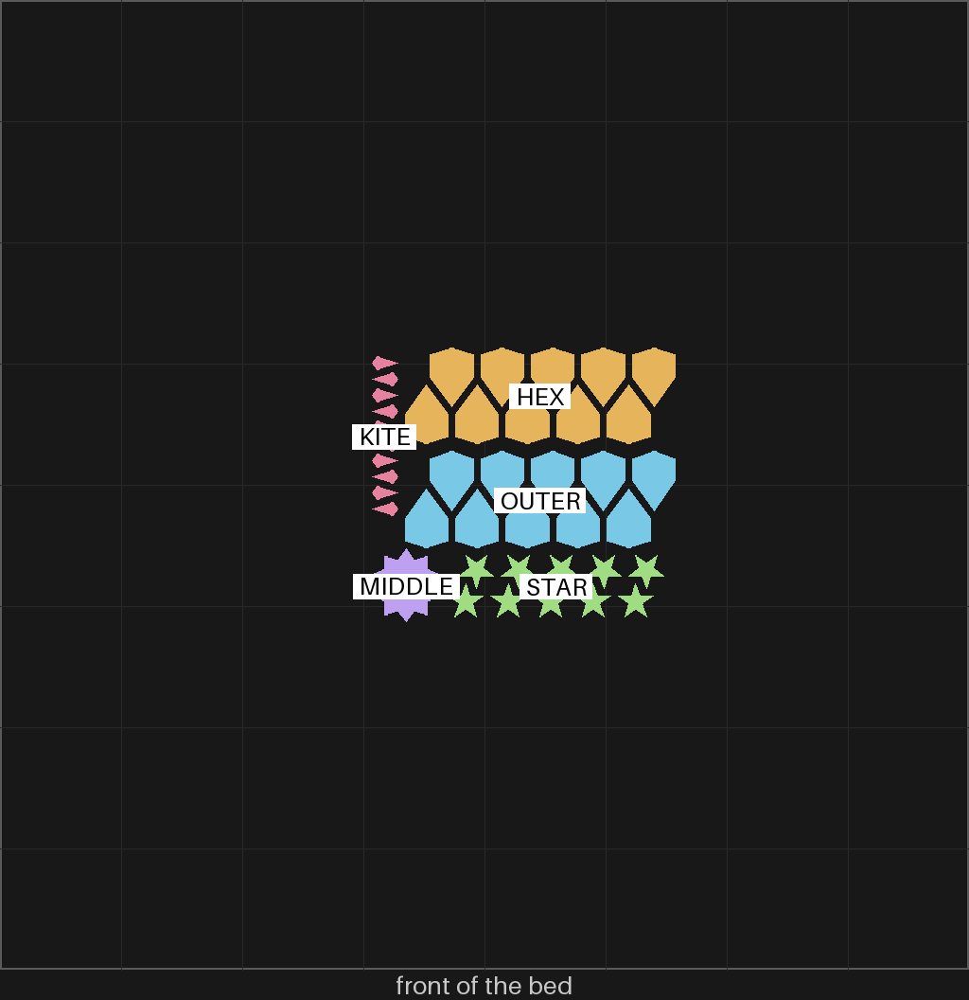

# sheets-04e — every piece of the bigger gBV coaster, in pink, packed in rows

**In short.** You asked for "fill pieces 2x of differrnt colors" for the bigger coaster on
[sheets-04d](sheets-04d.md). This plate is the first set, in pink; [sheets-04f](sheets-04f.md) is
the same set in black. You also asked for "two roes of kites facing eqch other olaces in a zipper
like fashhion" with the "tips interlacing", and for the "hex should be positioned like outer".
Every ring here is packed that way. The plate is [`sheets-04e.yaml`](sheets-04e.yaml). One bed,
35 minutes, about 11 g.

## What it is

All 41 pieces of the gBV minimal coaster at sheets-04d's size (112.5 mm across, 3.75 mm straps,
4.4 mm tall):

- MIDDLE: the twenty-sided piece in the middle (1)
- KITE: the small four-sided kites (10)
- HEX: the inner ring of six-sided pieces (10)
- STAR: the ten-pointed stars (10)
- OUTER: the outer ring of six-sided pieces (10)

Each ring prints packed, not in its circle. Every piece is turned the same way, half go in one
row, and the other row is turned round and slid half a step, so the tips interlace. The kites are
the column at the left of the bed picture, and the six-sided pieces of both rings sit the way the
outer ones did.

HEX and OUTER turn out to be the same shape: their edges measure the same, and so do their volumes.
So any of the 20 six-sided pieces fits either ring.

**What I assumed, for you to change:**

- **No gap** between a piece and its hole: each piece is its hole's own shape. From
  [sheets-04b](sheets-04b.md), where you said "in the experiment the bottom row fir bitter in
  minimal construction". I read the bottom row as HEX 00, the no-gap row. If you meant another
  row, the gap changes and so does the recipe.
- **2 mm between pieces** in a row, the packing's own setting, not measured.
- **One color per plate.** A slice with two filaments on one plate crashes Bambu Studio when run
  without its window, so the pink and black sets are two plates.

## Why print it

It answers whether the pieces fill the bigger coaster at no gap, and whether the packed rows print
as well as the circle did. The packed rows take far less of the bed than a ring of pieces laid in
its circle.

## Pictures

The review sheet: the five kinds of piece, each solid, as they come off the plate.

The slice: the kites in a column at the left, the two six-sided rings above, the stars and the
middle piece below. The places come from the sliced plate, read back from the slicer.

## Cost and risk

One bed, 35 minutes, about 11 g (local slice, 2026-10-03, X2D preset and PLA Basic in pink,
sliced for the Textured PEI plate Bambu Studio has saved, no slicer warnings, no brim, support or
raft, nothing sent).

**Risk: watch.** The kites and stars are small loose pieces (about 0.05 and 0.12 cm³ each), the
kind that can lift or get knocked by the nozzle. The slicer flags none of them.

## Your call

- [ ] **Approve as it stands** — all 41 pieces in pink, no gap
- [ ] **Hold** — say why in the notes, or which row you meant by "bottom row"

Notes:

## Approvals

Every yes or hold Omar gives this plate, one row each, oldest first (D-096). A tick under Your call, or a yes in chat, becomes a row here through the manage-approvals skill's `plate_approve.py`; a send spends the open approval, and a recipe change resets it.

| Date | Decision | By | Covers | Spent by |
|---|---|---|---|---|

## Timeline

| Date | What happened | Where it is written |
|---|---|---|
| 2026-10-03 | proposed — at Omar's ask: the bigger coaster's pieces, packed in interlaced rows, first set in pink | this page |
| 2026-10-03 | sliced — local slice fits one bed, 35 minutes, 11 g, no slicer warnings | this page |
