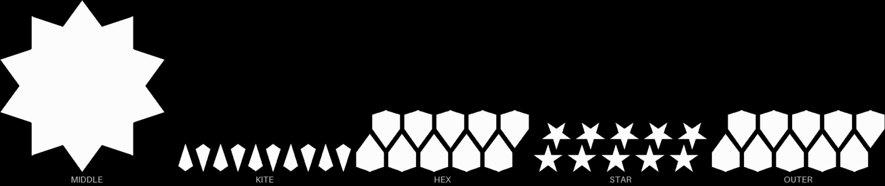

# sheets-04f — every piece of the bigger gBV coaster, in black, packed in rows

**In short.** The second of the two piece sets you asked for ("fill pieces 2x of differrnt
colors") for the bigger coaster on [sheets-04d](sheets-04d.md). It is
[sheets-04e](sheets-04e.md) in black: the same 41 pieces, packed the same way, in the same places.
The plate is [`sheets-04f.yaml`](sheets-04f.yaml). One bed, 35 minutes, about 11 g.

## What it is

The 41 pieces, packed in interlaced rows, as on sheets-04e: one middle piece, 10 kites, 10 inner
six-sided pieces, 10 stars, 10 outer six-sided pieces. Everything sheets-04e says about the
packing, the shared six-sided shape and the no-gap fit holds here.

**What I assumed, for you to change:**

- **Black** for the second color. The first set is pink.
- The same no-gap fit and 2 mm row spacing as sheets-04e. Change one and the other follows.

## Why print it

It asks no question sheets-04e does not ask. Its use is the second color, so you can fill the
coaster with two colors.

## Pictures

The same five kinds of piece as sheets-04e.

The slice: the same places as sheets-04e.

## Cost and risk

One bed, 35 minutes, about 11 g (local slice, 2026-10-03, X2D preset and PLA Basic in black,
sliced for the Textured PEI plate Bambu Studio has saved, no slicer warnings, no brim, support or
raft, nothing sent). Black has to be loaded in a tray before it can go out.

**Risk: watch.** The same small kites and stars as sheets-04e.

## Your call

- [ ] **Approve as it stands** — all 41 pieces in black, no gap
- [ ] **Hold** — say why in the notes, or another color

Notes:

## Approvals

Every yes or hold Omar gives this plate, one row each, oldest first (D-096). A tick under Your call, or a yes in chat, becomes a row here through the manage-approvals skill's `plate_approve.py`; a send spends the open approval, and a recipe change resets it.

| Date | Decision | By | Covers | Spent by |
|---|---|---|---|---|

## Timeline

| Date | What happened | Where it is written |
|---|---|---|
| 2026-10-03 | proposed — at Omar's ask: the bigger coaster's pieces, second set in black | this page |
| 2026-10-03 | sliced — local slice fits one bed, 35 minutes, 11 g, no slicer warnings | this page |
