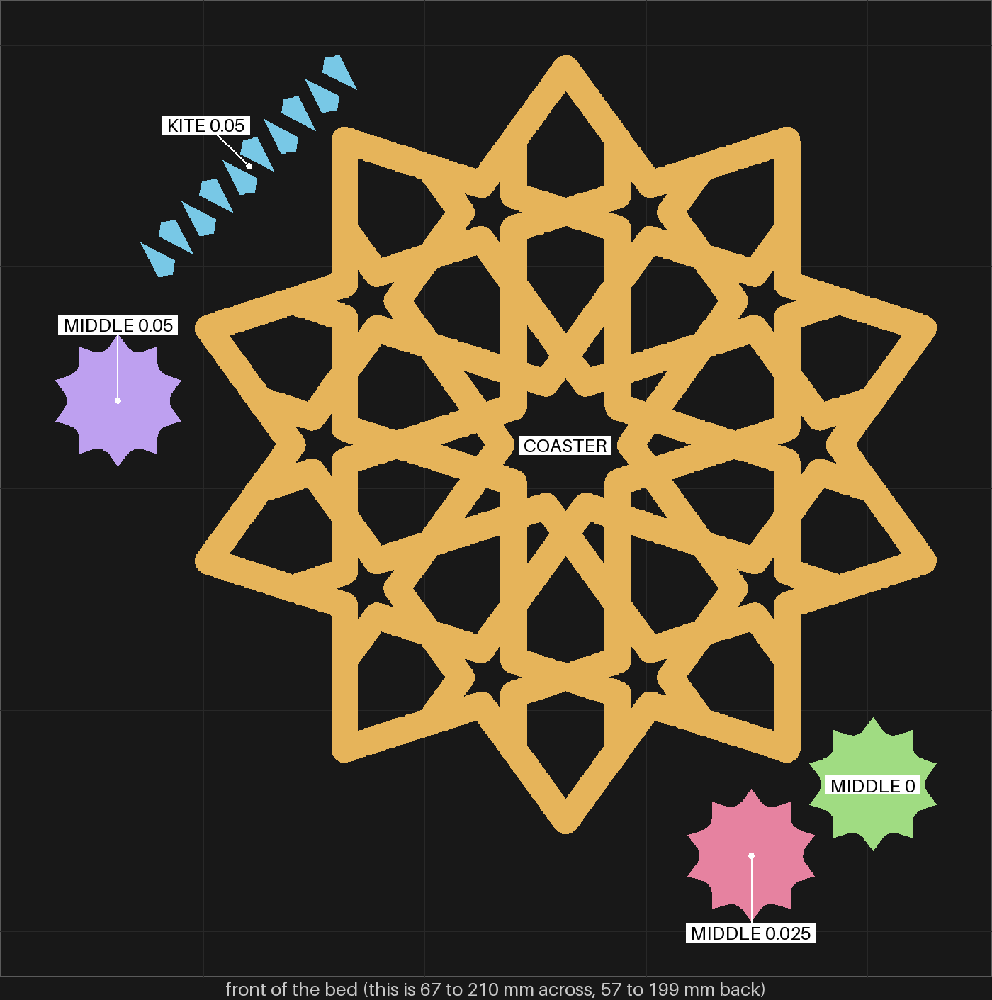
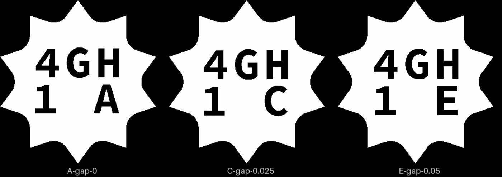

# sheets-04g-fit2 — the middle piece halfway between A and B

**In short.** On [sheets-04g-fit](sheets-04g-fit.md) you said "a fits but to tight. B is good but
comes off a bit to easy? is there a midway between a and b?". A was gap 0 per face and B 0.05.
This plate prints the midway, 0.025, with A and B again beside it, and a fresh coaster to try all
three in. In the older sheets-04g coaster everything sat about one 0.05 rung looser, so the hole
size moves from print to print. That is why the pieces are judged only in the coaster printed
with them.

## What it is

Recipe: [sheets-04g-fit2.yaml](sheets-04g-fit2.yaml). The same size as sheets-04g-fit (112.5 mm
across, 3.75 mm straps, 4.4 mm tall).

- **The coaster:** the gBV minimal coaster, as sheets-04g-fit printed it.
- **The middle piece, one at each of three gaps:** 0, 0.025 and 0.05 mm per face. 0 and 0.05 are
  the same as sheets-04g-fit's A and B. They are here as controls: if they don't feel the way A
  and B did, this coaster's holes came out different, and the 0.025 piece is read against them,
  not against the old plate.
- **Dots on each middle piece,** the most on the biggest: three at gap 0, two at 0.025, one at
  0.05. These are **not** the same counts as sheets-04g-fit, where A had four dots and B three. So
  a dot count does not tell a piece apart across the two plates; the carved code does (4GH here,
  4GF there).
- **Ten kites at 0.05,** the gap you said "fits well". This is an assumption, not a decision: one
  rung again, to check that gap holds in a new coaster too. They are cheap and print alongside.

## Why print it

- **The question:** does the 0.025 middle piece go in by hand and stay put, firmer than B and
  easier than A?
- **The bet it moves:** CAL-LSE-01, the loose-piece gap per face by shape in a straps-only frame
  ([bets.md](../../../.claude/skills/calibrate/bets.md)).
- **What it lets us decide:** the middle piece's gap on the next sheets-04g iteration, and the
  kites' gap, if 0.05 holds again.
- **What to read off it:** for each middle piece, does it go in, does it stay when the coaster is
  turned over, and does it come out too easily; for the kites, do they go in and stay.

## After the print

What gets asked when the plate comes off the bed, one row at a time (the review-print skill asks
them). Each row names the pieces by the id cut into their bottoms: `4GH 1A` is the middle piece
reading 4GH over 1 A. The fresh coaster carries a small `Z`. The kites have no id; there is only
one pile of them.

| Pieces | The question | What we expect, and why | What each answer changes |
|---|---|---|---|
| `4GH 1A` (gap 0, three dots on top), `4GH 1E` (0.05, one dot), the fresh coaster (`Z` on its bottom) | **Do:** Push `4GH 1A` by hand into the middle hole of the `Z` coaster, then take it out. Do the same with `4GH 1E`. **Look for:** Does `4GH 1A` go in tight, as 4GF's A did? Does `4GH 1E` come out a bit too easily, as 4GF's B did? Say each by its id. | The same as on sheets-04g-fit: A too tight, E (B's gap) a bit too easy. | Same: the coaster's holes match the last print, and the 0.025 piece is read as it is. Different: this coaster's holes moved, so the next row is read against these two, not against the old plate. |
| `4GH 1C` (0.025, two dots), the `Z` coaster | **Do:** Push `4GH 1C` by hand into the middle hole of the `Z` coaster. Hold the coaster upside down over the table, then pull the piece out with a fingertip. **Look for:** Does it go in without forcing? Does it stay in upside down? Does it take more effort to pull out than `4GH 1E`, and less to push in than `4GH 1A`? | Between the two: in by hand, stays upside down, firmer than E. | Yes: 0.025 is the middle piece's gap on the next sheets-04g iteration. As tight as A or as easy as E: the printer does not lay down a 0.025 step, and the gap stays at whichever control you like better. |
| The kites (no id, one pile of ten at 0.05), the `Z` coaster | **Do:** Push three kites by hand into three kite holes of the `Z` coaster. Then hold the coaster upside down over the table. **Look for:** Do they go in by hand? Do they stay in upside down? | They go in and stay, as on sheets-04g-fit. | Same: 0.05 is the kites' gap. Different: the kite gap moves with the coaster's holes too, and needs a ladder in every new coaster. |

## Pictures

The slice from above (2026-10-10), front of the bed at the bottom, drawn only over the part of the
bed the pieces take. Each piece has its own color and a label.

| Where | What | In the picture |
|---|---|---|
| the middle | COASTER | amber |
| back left, one diagonal row of kites | KITE 0.05 | blue |
| left | MIDDLE 0.05 (`4GH 1E`) | purple |
| front right, the back one of two | MIDDLE 0 (`4GH 1A`) | green |
| front right, the front one of two | MIDDLE 0.025 (`4GH 1C`) | pink |

The ids cut into the three middle pieces' bed faces, seen from below (D-109): A is the 0 gap, C
0.025 and E 0.05. B and D are skipped, because they look alike at this size (Omar, 2026-10-09:
"b and d are confusing").

The coaster carries a small `Z` on a strap left of the middle, in the same place as on
sheets-04g-fit ([its picture](sheets-04g-fit-media/ids-coaster.png)). The kites carry no id; there is
one rung of them.

## What the slice lays down

The question is whether a 0.025 mm step survives slicing, or whether the slicer rounds it onto 0 or
0.05. It survives. Read off the slice's own wall paths with
`python3 tools/fit_gap.py walls <plate.3mf> <frame.stl> <piece.stl>...`, against the coaster and
the three middle pieces rendered where their hole is, the gap per face (0.4 mm nozzle, 0.42 mm
outer and 0.45 mm inner wall lines, 0.20 mm layers):

| Height | gap 0 (`4GH 1A`) | gap 0.025 (`4GH 1C`) | gap 0.05 (`4GH 1E`) |
|---|---|---|---|
| 2.0 mm, the straight wall | +0.001 | +0.025 | +0.051 |
| 3.8 mm, under the top round | +0.207 | +0.232 | +0.255 |

At 2.0 mm every wall sits on the drawn line. At 3.8 mm the top round opens the hole for all three
alike, and the steps stay 0.025 apart. As drawn (`fit_gap.py` on the meshes, cut at 2.0 mm) the
gaps are 0.001, 0.026 and 0.051 per face on average, and each piece's widest span over its hole's is
1.000, 0.996 and 0.991.

The first layer could not be read this way: the carved ids on the pieces' bed faces and the
coaster's `Z` add loops the in-place renders do not have, so the tool cannot tell which loop is
which. On sheets-04g-fit the first layer opened about 0.3 mm per face for every piece alike
([the issue](../../issues/sheets-04g-fit.md)).

So whatever the three feel like in the hand comes from the printer, not from the slice.

## Cost and risk

One bed, 67 minutes, about 18.9 g (local slice, 2026-10-10, X2D preset and PLA Basic, the glacier
plate sliced as the High Temp Plate, no slicer warnings, no brim, support or raft, nothing sent).
One color, so no swaps.

**Risk: watch.** Ten kites of about 0.05 cm³ each are small loose pieces, the kind that can lift
or get knocked by the nozzle. sheets-04g and sheets-04g-fit printed the same kites at this size
without trouble.

## Your call

- [ ] **Approve as it stands**: the coaster, the three dotted middle pieces and one kite rung.
  Say the color with the yes.
- [ ] **Hold**: say why in the notes.

Notes:

## Approvals

Every yes or hold Omar gives this plate, one row each, oldest first (D-096). A tick under Your call, or a yes in chat, becomes a row here through the manage-approvals skill's `plate_approve.py`; a send spends the open approval, and a recipe change resets it.

| Date | Decision | By | Covers | Spent by |
|---|---|---|---|---|
| 2026-10-10 | approved | Omar, in chat: "send it when it's ready" | iteration 1 @ 4734dde389 in #F5547C | sent 2026-10-10 |

## Timeline

| Date | What happened | Where it is written |
|---|---|---|
| 2026-10-10 | proposed: the middle piece at 0.025 mm per face, halfway between sheets-04g-fit's A and B, with both again as controls, one kite rung at 0.05 and a fresh coaster, on Omar's "is there a midway between a and b?" | [sheets-04g-fit](sheets-04g-fit.md) |
| 2026-10-10 | sliced: local slice fits one bed, 67 minutes, 18.9 g, no slicer warnings; the walls as sliced keep the three gaps 0.025 apart | this page |
| 2026-10-10 | sent — by `bambu print send`; spends the approval of 2026-10-10, iteration 1 @ 4734dde389 in #F5547C | this page |
